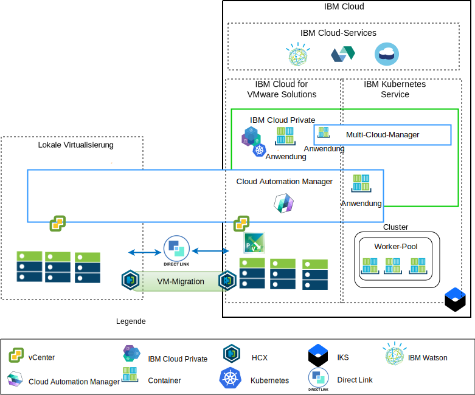

---

copyright:

  years:  2016, 2019

lastupdated: "2019-04-01"

subcollection: vmware-solutions

---

# Übersicht über die Anwendungsmodernisierung
{: #vcsnsxt-appmod}

Das folgende Diagramm zeigt die Referenzarchitektur der Anwendungsmodernisierung, die Acme Skateboards bereitstellt und die in dieser Reihe von Dokumenten eingehend beschrieben wird.

Abbildung 1. Architekturübersicht

Durch diese Hybridarchitektur erhält Acme Skateboards folgende Möglichkeiten:
- Migration von virtuellen VMware-Maschinen aus der lokalen Umgebung auf {{site.data.keyword.cloud}} mit geringer oder ganz ohne Ausfallzeit und ohne erneute Anwendungskonfiguration.
-	Möglichkeit zum Starten des Anwendungsmodernisierungsprozesses, indem der Fokus darauf gelegt wird, die einfacheren Webschnittstellen und Middleware zu containerisieren, während komplexere Datenbanken als VMs erhalten bleiben.
-	Nutzung von Cloud Automation Manager (CAM) zum Scripten von "Infrastructure as Code" (IaC), um Services zusammenzustellen und zu orchestrieren, die aus VMs und Containern bestehen, damit eine Integration mit den vorhandenen DevOps-Toolchains und der ITSM-Lösung ermöglicht wird.

Hinsichtlich der Netzarchitektur setzt sich die Referenzarchitektur aus den folgenden Schlüsselkomponenten zusammen:
- **Lokale Virtualisierung** - Dies ist ein VMware-Cluster, der momentan die VMs von Acme Skateboards hostet. Es sind diese VMs, die derzeit die zu modernisierenden Anwendungen hosten. Dieser Cluster ist erforderlich, um die im Dokument [VMware HCX on {{site.data.keyword.cloud_notm}} Solution Architecture](/docs/services/vmwaresolutions/services?topic=vmware-solutions-hcx-archi-intro#hcx-archi-intro) beschriebenen Voraussetzungen zu erfüllen, sodass Kunden die Möglichkeit erhalten, VMs in die VMware vCenter Server on {{site.data.keyword.cloud_notm}}-Instanz zu migrieren, die in {{site.data.keyword.cloud_notm}} ausgeführt wird, und bei Bedarf auch zurück.
- **VMware vCenter Server on IBM Cloud** – vCenter stellt die grundlegenden VMware-Bausteine bereit, wie z. B. vSphere, vCenter Server, NSX-V und Speicheroptionen, einschließlich vSAN oder {{site.data.keyword.cloud_notm}} Endurance-Speicher, die für die automatische Bereitstellung einer VMware Software Defined Data Center-Lösung (SDDC) erforderlich sind. Der VMware-Cluster ist das Ziel für die migrierten VMs und einige der modernisierten Anwendungen in Containern, die in {{site.data.keyword.icpfull_notm}} gehostet werden.

Die Schlüsselkomponenten der Architektur sind Folgende:
- **NSX-V** - NSX-V stellt die Schicht zur Netzvirtualisierung in vCenter Server bereit, die ein Netzoverlay für die VMs von Acme Skateboards bietet. NSX-V aktiviert BYOIP und isoliert die Workloadnetze von den {{site.data.keyword.cloud_notm}}-Netzen. NSX-V wird von HCX programmiert, um die Netze zu erstellen, die bei Acme Skateboards aus der lokalen Umgebung erweitert werden.
- **{{site.data.keyword.icpfull_notm}}** - {{site.data.keyword.icpfull_notm}} ist eine Anwendungsplattform zur Entwicklung und Verwaltung von containerisierten Anwendungen. Es handelt sich hierbei um eine integrierte Umgebung, die Kubernetes als Container-Orchestrator, ein privates Image-Repository, eine Managementkonsole, Überwachungsframeworks und eine grafische Benutzerschnittstelle enthält, von der aus Acme Skateboards Anwendungen zentral bereitstellen, verwalten, überwachen und skalieren kann. Die vCenter Server-Instanz hostet die {{site.data.keyword.icpfull_notm}} -Komponenten, die Masterknoten, die Workerknoten usw. und führt sie als VMs aus.
- **IBM Cloud Automation Manager** - CAM ist eine auf Unternehmen abgestimmte IaC-Plattform (IaC = Infrastructure as Code), die eine zentrale Bereitstellung von VM-Workloads neben Kubernetes-Workloads bietet und bei der Sie Vorlagen verwenden können. CAM ist eine für Docker vorbereitete Anwendung, die über einer {{site.data.keyword.icpfull_notm}}-Installation ausgeführt wird und nahtlos für die Autorisierung, rollenbasierte Zugriffssteuerung (RBAC) und andere Funktionen integriert ist.
- **{{site.data.keyword.containerlong_notm}}** – {{site.data.keyword.containerlong_notm}} gibt Acme Skateboards die Möglichkeit, die vorhandenen modernisierten Anwendungen in Docker-Containern bereitzustellen, die in Kubernetes-Clustern ausgeführt werden. Die Masterknoten werden von IBM vollständig verwaltet, während die Workerknoten im Worker-Pool in demselben {{site.data.keyword.cloud_notm}}-Konto wie die vCenter Server-Instanz bereitgestellt werden. Workerknoten sind Bare Metal Server, öffentliche oder dedizierte virtuelle Serverinstanzen. Calico wird automatisch in {{site.data.keyword.containerlong_notm}} installiert und konfiguriert. Calico bietet sichere Netzkonnektivität für Container und ist so in {{site.data.keyword.containerlong_notm}} konfiguriert, dass es die IP-in-IP-Kapselung zum Kapseln von Paketen verwendet, die die Teilnetze durchqueren. Calico verwendet NAT für abgehende Verbindungen aus den Containern.
- **Direct Link** - {{site.data.keyword.cloud_notm}} Direct Link verwendet den WAN-Provider von Acme Skateboard, um das Rechenzentren des Unternehmens mit {{site.data.keyword.cloud_notm}} zu verbinden, sodass eine zuverlässige und sichere Netzverbindung mit geringer Latenzzeit bereitgestellt wird. Diese Verbindung bietet folgende Möglichkeiten:
  - Zugriff Ihrer Unternehmensbenutzer auf die von der Cloud gehosteten Anwendungen
  - Datenverkehr zwischen lokalen VMs und Cloud-VMs
  - Datenverkehr zwischen traditionellen Systemen im lokalen Rechenzentrum und Cloud-VMs

## Wichtige Vorteile für Acme Skateboards
{: #vcsnsxt-appmod-benefits}

- Beschleunigte Lieferung von IT-Projekten für Entwickler und Geschäftsbereiche durch Verringerung des Zeitaufwands für Beschaffung, Architektur, Implementierung und Bereitstellung von Ressourcen von Wochen oder sogar Monaten auf Stunden. Die Anwendungszeit bis zum Wert sinkt, wenn Kunden warten müssen, bis Netz- oder Sicherheitsteams Services wie Lastverteilungsfunktionen, Firewalls, Switches und Router bestellen können.
- Verbesserte Sicherheit mit dedizierten Bare-Metal-Servern in einer gehosteten privaten Cloud, einschließlich Bereitstellung eines privaten Netzserviceendpunkts für {{site.data.keyword.cloud_notm}}-Services wie {{site.data.keyword.containerlong_notm}} und KMIP.
- Konsistente Management- und Governance-Funktionalität der bereitgestellten Hybrid-Cloud durch Bereitstellung eines vollständigen Verwaltungszugriffs auf das Virtualisierungsmanagement, sodass vorhandene VMware-Tools, Scripts und Investitionen in Schulungen ihren Wert behalten.
- Globale Nutzung von VMware-Know-how mit IBM Professional Services und IBM Managed Services, die weltweit mehr als 30 {{site.data.keyword.CloudDataCents_notm}} umfassen.

Kunden, die sich für cloudnative Anwendungsplattformen wie {{site.data.keyword.icpfull_notm}} und {{site.data.keyword.containerlong_notm}} interessieren, legen besonderen Wert auf Geschwindigkeit und Innovation und berücksichtigen weniger die Aspekte der Sicherheit und des Netzbetriebs.

Diese Referenzarchitektur zeigt, wie VCS, {{site.data.keyword.icpfull_notm}} und {{site.data.keyword.containerlong_notm}} das Unternehmen Acme Skateboards zuverlässig beim Prozess der Anwendungsmodernisierung unterstützen.

## Zugehörige Links
{: #vcsnsxt-appmod-related}

* [Übersicht über vCenter Server on {{site.data.keyword.cloud_notm}} with Hybridity Bundle](/docs/services/vmwaresolutions/services?topic=vmware-solutions-vcs-hybridity-intro#vcs-hybridity-intro)
