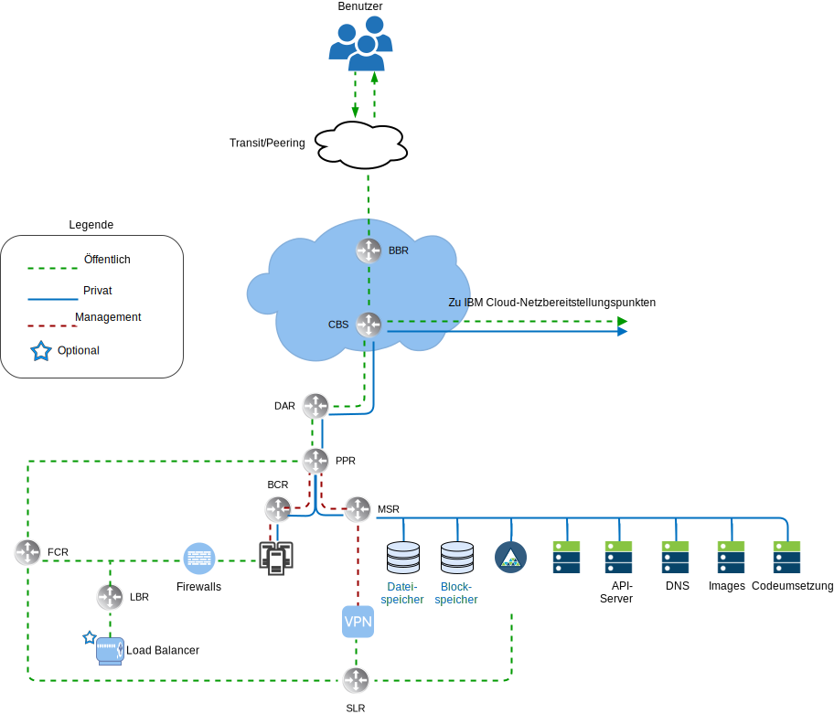
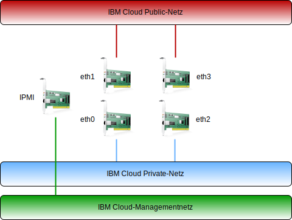

---

copyright:

  years:  2016, 2019

lastupdated: "2019-01-23"

---

# Übersicht über IBM Cloud-Netzbetrieb

{{site.data.keyword.cloud}} wickelt den physischen Netzbetrieb ab. Im Folgenden wird das physische Netz beschrieben, das von {{site.data.keyword.cloud_notm}} und den physischen Hostverbindungen (VLANs, MTU) zur Verfügung gestellt wird, die den zuvor beschriebenen physischen Hosts zugeordnet sind.

Das physische Netz von {{site.data.keyword.cloud_notm}} ist in drei verschiedenartige Netze unterteilt: öffentliches Netz, privates Netz und Managementnetz.

Abbildung 1. Allgemeine Netzübersicht für {{site.data.keyword.cloud_notm}}

## Öffentliches Netz

{{site.data.keyword.CloudDataCents_notm}} und Netzbereitstellungspunkte haben mehrere Verbindungen mit 1 oder 10 Gb/s zu den Transit- und Peernetzbetreibern der höchsten Ebene. Netzverkehr aus beliebigen Teilen der Welt wird mit dem jeweils nächsten Netzbereitstellungspunkt verbunden und fließt direkt durch das Netz zu dem zugehörigen Rechenzentrum, wodurch die Anzahl der Netzhops und Weitergaben zwischen Anbietern minimiert wird. Im Rechenzentrum steht für einzelne Server eine Netzbandbreite von 1 oder 10-Gbps Gb/s zur Verfügung, die durch ein Paar aus separaten, auf Peerebene zusammengefassten Front-End-Kundenswitches (FCS - Front-end Customer Switch) erreicht wird. Diese zusammengefassten Switches sind mit einem Paar separater Router (also Front-End-Kundenroutern, FCR) für den L3-Netzbetrieb verbunden. Dieses mehrschichtige Design bietet dem Netz die Möglichkeit, in einem {{site.data.keyword.CloudDataCent_notm}} rack-, reihen und podübergreifend zu skalieren.

## Privates Netz

Alle {{site.data.keyword.CloudDataCents_notm}} und Bereitstellungspunkte (PoPs) werden durch den privaten Netzbackbone verbunden. Dieses private Netz ist vom öffentlichen Netz getrennt und ermöglicht Konnektivität zu Services in {{site.data.keyword.CloudDataCents_notm}} auf der ganzen Welt. Die Datenübertragung zwischen Rechenzentren erfolgt über mehrere Verbindungen mit 10 oder 40 Gb/s, die zum privaten Netz bestehen. Ähnlich wie das öffentliche Netz ist das private Netz dadurch mehrschichtig gestaltet, dass Server und andere Infrastruktur mit zusammengefassten Back-end-Kundenswitches (BCS - Back-end Customer Switch) verbunden sind. Diese zusammengefassten Switches sind mit einem Paar separater Router (also Back-End-Kundenroutern, BCR) für den L3-Netzbetrieb verbunden. Das private Netz unterstützt zudem die Möglichkeit, für physische Hostverbindungen Jumbo-Frames (MTU 9000) zu verwenden.

## Managementnetz

Neben dem öffentlichen und dem privaten Netz ist jeder {{site.data.keyword.cloud_notm}}-Server mit einem Out-of-band-Managementnetz verbunden. Dieses Managementnetz, das über VPN zugänglich ist, ermöglicht zu Wartungs- und Verwaltungszwecken einen IPMI-Zugriff (IPMI - Intelligent Platform Management Interface) auf den Server, der von der zugehörigen CPU, der Firmware und dem Betriebssystem (BS) unabhängig ist.

## Primäre und portierbare IP-Blöcke

{{site.data.keyword.cloud_notm}} ordnet zwei Typen von IP-Adressen zur Verwendung in der {{site.data.keyword.cloud_notm}}-Infrastruktur zu:
* Primäre IP-Adressen werden Einheiten (Geräten), bare metal Servern und virtuellen Servern zugeordnet, die von {{site.data.keyword.cloud_notm}} bereitgestellt werden. Benutzer sollten keine IP-Adressen in diesen Blöcken zuweisen.
* Portierbare IP-Adressen werden zur Verfügung gestellt, die ein Benutzer nach Bedarf zuweisen und verwalten kann.

Primäre oder portierbare IP-Adressen können an ein beliebiges VLAN im Kundenkonto weiterleitbar gemacht werden, wenn das VLAN-Spanning Konto aktiviert ist oder wenn das Konto als VRF-Konto (VRF - Virtual Routing and Forwarding) konfiguriert ist.

## VLAN-Spanning

Das VLAN-Spanning ist eine globale {{site.data.keyword.cloud_notm}}-Kontoeinstellung, durch die jeder IP-Block eines primären und portierbaren Teilnetzes aller VLANs im Konto untereinander weitergeleitet werden kann. Wenn diese Einstellung nicht verfügbar ist, können IP-Blöcke immer noch an {{site.data.keyword.cloud_notm}}-Services weiterleiten, jedoch nicht untereinander. Diese Architektur setzt voraus, dass das VLAN-Spanning in dem Konto aktiviert ist, in dem VMware vCenter Server on {site.data.keyword.cloud_notm}} bereitgestellt ist, damit Verbindungen über die verschiedenen Teilnetze, in denen sich die Lösungskomponenten befinden, transparent hergestellt werden können.

## Virtual Routing and Forwarding (VRF)

{{site.data.keyword.cloud_notm}}-Konten können auch als VRF-Konto konfiguriert werden. Ein VRF-Konto bietet eine ähnliche Funktionalität wie das VLAN-Spanning, sodass ein automatisches Routing zwischen IP-Teilnetzblöcken möglich wird. Alle Konten mit direkten Verbindungen (Direct-Link) müssen in VRF-Konten konvertiert oder als solche erstellt werden.

## Physische Hostverbindungen

Jeder physische Host im Design verfügt über zwei redundante Paare von Ethernet-Verbindungen mit 10 Gb/s zu jedem (öffentlichen und privaten) {{site.data.keyword.cloud_notm}} Top of Rack-Switch (ToR-Switch). Die Adapter sind als einzelne Verbindungen (ohne Bonding) für Verbindungen mit insgesamt 4 × 10 Gb/s eingerichtet. Hierdurch kann jede NIC-Verbindung (NIC - Networking Interface Card, Netzschnittstellenkarte) unabhängig von den anderen Verbindungen arbeiten.

Abbildung 2. Physische Hostverbindungen

## VLANs

Die Angebote von VMware on {{site.data.keyword.cloud_notm}} beinhalten drei VLANs (ein öffentliches und zwei private), die bei der Bereitstellung zugewiesen werden. Das öffentliche VLAN ist "eth1" und "eth3" zugeordnet, während die privaten Verbindungen "eth0" und "eth2" zugeordnet sind. Es ist unbedingt zu beachten, dass das öffentliche und das erste private VLAN, die in diesem Design erstellt und zugeordnet werden, standardmäßig nicht mit Tags versehen sind. Später wird das weitere private VLAN durch einen Trunk mit den physischen Switch-Ports verbunden und mit Tags in den VMware-Portgruppen versehen, die diese Teilnetze nutzen.

Wie bereits erläutert besteht das private Netz in diesem Design aus zwei VLANs. Drei Teilnetze werden dem ersten dieser VLANs (hier als VLAN "Privat A" bezeichnet) zugeordnet. Das erste Teilnetz ist ein primärer privater IP-Teilnetzbereich, den {{site.data.keyword.cloud_notm}} den physischen Hosts zuweist. Das zweite Teilnetz wird für virtuelle Maschinen für das Management (z. B. vCenter Server Appliance und Platform Services Controller) verwendet. Das dritte Teilnetz wird für die VXLAN-Tunnelendpunkte (VTEPs) verwendet, die den einzelnen Hosts durch NSX Manager zugeordnet werden.

Neben dem VLAN "Privat A" ist ein zweites privates VLAN (hier als VLAN "Privat B" bezeichnet) vorhanden, um VMware-Features wie vSAN und vMotion zu unterstützen und die Konnektivität zum NAS-Speicher (NAS - Network Attached Storage) herzustellen. Das VLAN als solches ist in zwei oder drei portierbare Teilnetze unterteilt. Das erste Teilnetz wird einer Kernelportgruppe für vMotion-Datenverkehr zugeordnet. Das bzw. die verbleibenden Teilnetze werden für den Speicherdatenverkehr genutzt und bei Verwendung von vSAN wird ein Teilnetz den Kernelportgruppen zugeordnet, die für vSAN-Datenverkehr genutzt werden. Bei Verwendung von NAS wird ein Teilnetz einer Portgruppe zugeordnet, die für NFS-Datenverkehr dediziert ist. Alle Teilnetze, die als Bestandteil einer automatisierten vCenter Server-Bereitstellung konfiguriert werden, verwenden verwaltete {{site.data.keyword.cloud_notm}}-Bereiche. Dadurch wird sichergestellt, dass eine beliebige IP-Adresse an jedes Rechenzentrum innerhalb des {{site.data.keyword.cloud_notm}}-Kontos geleitet werden kann, falls dies jetzt oder in Zukunft erforderlich sein sollte.

Tabelle 1. VLAN- und Teilnetzzusammenfassung

VLAN 	|Teilnetztyp 	|Beschreibung
---|---|---
Öffentlich 	|Primär 	|Physischen Hosts für öffentlichen Netzzugriff zugeordnet. Bei der Erstbereitstellung nicht verwendet.
Öffentlich	|Portierbar 	|Für Uplink- und NAT-Verwendung in customer-nsx-esg zugeordnet.
Öffentlich	|Portierbar 	|Für Uplink-NAT-Verwendung in mgmt-nsx-esg zugeordnet.
Öffentlich	|Portierbar 	|Bei Auswahl von Hybridity Bundle für Uplink-NAT-Verwendung in hcx-mgmt-esg zugeordnet.
Privat A 	|Primär 	  |Zugeordnet zu physischen Hosts, die von {{site.data.keyword.cloud_notm}} zugeordnet wurden. Von der Managementschnittstelle für vSphere-Managementdatenverkehr verwendet.
Privat A 	|Portierbar 	|Zugeordnet zu virtuellen Maschinen, die als Managementkomponenten ausgeführt werden.
Privat A 	|Portierbar 	|Zugeordnet zu NSX VTEP.
Privat A 	|Portierbar 	|Zugeordnet zu HCX für die interne Verwendung, falls Hybridity Bundle ausgewählt ist.
Privat A 	|Portierbar 	|Für Uplink-Verwendung in customer-nsx-esg zugeordnet.
Privat A 	|Portierbar 	|Zugeordnet zu HCX, falls Hybridity Bundle ausgewählt ist.
Privat B	  |Primär	  |Bei der Erstbereitstellung nicht verwendet.
Privat B 	|Portierbar 	|Zugeordnet für vSAN, falls verwendet.
Privat B 	|Portierbar 	|Zugeordnet für NAS, falls verwendet.
Privat B 	|Portierbar 	|Zugeordnet für vMotion.

Dieses Design wird mit physischen Hosts und virtuellen Systeminstanzen (VSI) in VLANs bereitgestellt und so konfiguriert, dass als Standardroute auf den Back-End-Kundenrouter (Backend Customer Router, BCR) des privaten Netzes von {{site.data.keyword.cloud_notm}} verwiesen wird. Die Verwendung eines softwaredefinierten Netzbetriebs wird währenddessen durch vCenter Server-Instanzen ermöglicht. Alle von NSX erstellten Netzoverlays, die eine Weiterleitung an VLAN-Teilnetze einbeziehen, sind für die von {{site.data.keyword.cloud_notm}} verwalteten Router unbekannt und Sie müssen möglicherweise statische Routen, Firewallregeln und NAT-Regeln erstellen, damit die Netzflüsse ordnungsgemäß verwaltet werden können.

Die privaten Netzverbindungen werden so konfiguriert, dass sie Jumbo-Frames mit einer MTU-Größe von 9000 verwenden, was die Leistung für große Datenübertragungen wie für Speicher- und vMotion-Operationen zu verbessert. Dies ist der maximale MTU-Wert, der in VMware und von {{site.data.keyword.cloud_notm}} zulässig ist. Die öffentlichen Netzverbindungen verwenden den Standardwert für Ethernet-MTU von 1500. Dieser Wert muss beibehalten werden, da Änderungen zu einer Paketfragmentierung bei der Übertragung über das Internet führen können.

### Zugehörige Links

* [Übersicht über vCenter Server on {{site.data.keyword.cloud_notm}} with Hybridity Bundle](/docs/services/vmwaresolutions/archiref/vcs/vcs-hybridity-intro.html)
