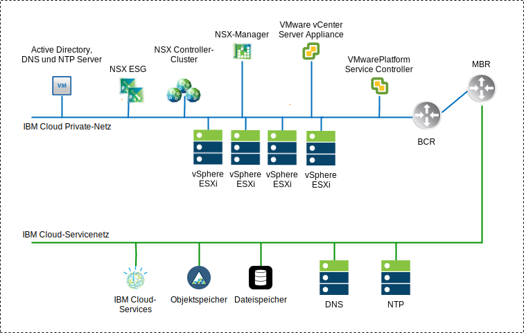
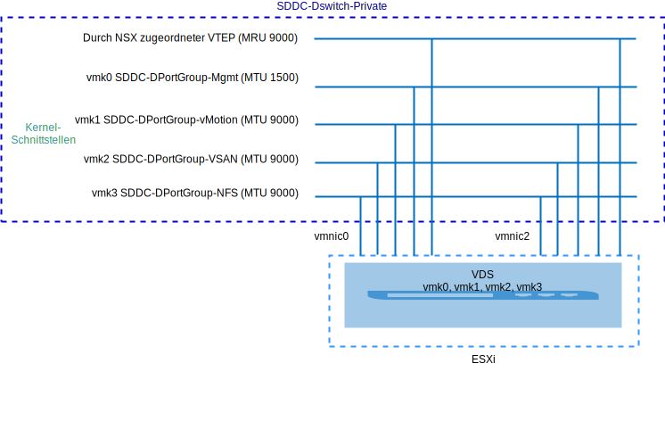
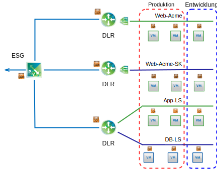

---

copyright:

  years:  2016, 2019

lastupdated: "2019-08-05"

subcollection: vmware-solutions

---

# Übersicht über NSX-V
{: #vcsnsxt-overview-ic4vnsxv}

Die Netzvirtualisierung stellt ein Netzoverlay zur Verfügung, das in der virtuellen Schicht vorhanden ist. NSX-V stattet die Architektur mit Funktionen wie schnelle Einrichtung, Bereitstellung, Rekonfiguration und Löschung von virtuellen On-Demand-Netzen aus. In diesem Design werden vSphere Distributed Switch (vDS) und VMware NSX for vSphere zur Implementierung eines virtuellen Netzes verwendet.

In diesem Design wird der NSX-Manager im ersten Cluster bereitgestellt. Dem NSX Manager wird eine VLAN-gestützte IP-Adresse aus dem privaten, portierbaren Adressblock zugeordnet, der für Managementkomponenten vorgesehen ist und der außerdem mit den bereits erläuterten DNS- und NTP-Servern konfiguriert wird.

Tabelle 1. Spezifikationen für virtuelle Appliance von NSX-V Manager

Attribut | Spezifikation
---|---
NSX-Manager | Virtuelle Appliance
Anzahl vCPUs | 4
Speicher | 16 GB
Platte | 60 GB in der gemeinsam genutzten Management-NFS-Ressource
Plattentyp | Thin Provisioning-Platte
Netz | **Privat A**, portierbar, für Managementkomponenten vorgesehen

Die folgende Netzübersicht für NSX-V Manager zeigt die Anordnung des NSX-Managers in Relation zu anderen Komponenten in dieser Architektur.

Nach der Erstbereitstellung stellt die {{site.data.keyword.cloud}}-Automatisierung drei NSX-Controller im ersten Cluster bereit. Den Controllern wird eine IP-Adresse aus dem portierbaren Teilnetz **Privat A** zugeordnet, das für Managementkomponenten vorgesehen ist. VM-VM-Anti-Affinitätsregeln werden erstellt, damit die Controller unter den Hosts im Cluster separiert werden. Der erste Cluster muss mit mindestens drei Knoten implementiert werden, um eine hohe Verfügbarkeit für die Controller zu gewährleisten.

Neben den Controllern bereitet die {{site.data.keyword.cloud_notm}}-Automatisierung die bereitgestellten vSphere-Hosts mit NSX-VIBs vor, die die Verwendung eines virtualisierten Netzes durch VXLAN-Tunnelendpunkte (VTEP) ermöglichen. Den VTEPs werden IP-Adressen aus dem portierbaren Teilnetz von **Private A** zugeordnet, das für VTEPs angegeben ist. Der VXLAN-Datenverkehr befindet sich im nicht mit Tags versehenen VLAN und wird dem privaten virtuellen verteilten Switch (vDS) zugewiesen. Später wird ein Segment-ID-Pool zugeordnet und die Hosts in dem Cluster werden der Transportzone hinzugefügt. In der Transportzone wird nur Unicast verwendet, da die IGMP-Netzüberwachung in der {{site.data.keyword.cloud_notm}} nicht konfiguriert ist.

NSX Edge Services Gateway-Paare werden anschließend bereitgestellt. Für alle Bereitstellungen wird ein Gateway-Paar für den abgehenden Datenverkehr aus Automatisierungskomponenten verwendet, die sich im privaten Netz befinden. Instanzen von VMware vCenter Server on {{site.data.keyword.cloud_notm}} beinhalten ein zweites Gateway, das als vom Kunden verwaltete Edge bezeichnet wird. Dieses Gateway wird bereitgestellt und mit einem Uplink zum öffentlichen Netz sowie einer Schnittstelle, die dem privaten Netz zugeordnet ist, konfiguriert. Alle erforderlichen NSX-Komponenten, wie z. B. Distributed Logical Router (DLR), logische Switches und Firewalls, können vom Administrator konfiguriert werden.

## Design verteilter Switches
{: #vcsnsxt-overview-ic4vnsxv-distributed-switch}

In dem Design wird eine minimale Anzahl von virtuellen verteilten Switches (vDS) verwendet. Die Hosts im Cluster werden mit öffentlichen und privaten Netzen verbunden. Sie werden mit zwei virtuellen verteilten Switches konfiguriert. Die Verwendung von zwei Switches entspricht der physischen Trennung der öffentlichen und privaten Netze, die in {{site.data.keyword.cloud_notm}} implementiert ist.

Es werden insgesamt zwei verteilte Switches konfiguriert. Die erste Switch ist für die öffentliche Netzkonnektivität (SDDC-Dswitch-Public) bestimmt, der zweite für die private Netzkonnektivität (SDDC-Dswitch-Privat).
Die Trennung verschiedener Typen von Datenverkehr ist erforderlich, um Konkurrenzsituationen und Latenzzeiten zu verringern. Separate Netze werden außerdem für den Zugriffsschutz benötigt. VLANs werden zur Segmentierung physischer Netzfunktionen verwendet. In diesem Design werden drei VLANs verwendet, zwei für privaten Netzverkehr und eines für öffentlichen Netzverkehr.

Tabelle 2. Zuordnung des VLAN-Datenverkehrs

VLAN |Ziel |Datenverkehrstyp
---|---|---
VLAN1 | Öffentlich | Für Internetzugriff verfügbar
VLAN2 | Privat A | ESXi-Management, Management, VXLAN (VTEP)
VLAN3 | Privat B | vSAN, NFS, vMotion

Datenverkehr von Workloads fließt über logische NSX-Switches. Der vSphere-Cluster verwendet zwei vSphere Distributed Switches (vDS) für den konvergierten Cluster.

Tabelle 3. Verteilte Switches konvergierter Cluster

Name des vSphere Distributed Switch |Funktion |E/A-Netzsteuerung |Lastausgleichsmodus |Physische NIC-Ports |MTU
---|---|---|---|---|---
SDDC-Dswitch-Private | ESXi-Management Virtuelles SAN vSphere vMotion VXLAN-Tunnelendpunkt (VTEP) NFS | Aktiviert | Route basierend auf explizitem Failover (vSAN, vMotion). Virtueller Ursprungsport (alle anderen) | 2 | 9.000 (Jumbo-Frames)
SDDC-Dswitch-Public | Externer Managementdatenverkehr (Nord-Süd) | Aktiviert |Route basierend auf virtuellem Ursprungsport | 2 | 1.500 (Standardwert)

Tabelle 4. Einstellung für Teambildung und Failover der Portgruppe für verteilten Switch

Parameter | Einstellung
---|---
Lastausgleich | Route auf Basis des virtuellen Ursprungsports \*
Failover-Erkennung | Nur Linkstatus
Switches benachrichtigen | Aktiviert
Failback | Aktiviert
Failover-Reihenfolge | Aktive Uplinks: uplink1, uplink2 \*

\* Die vSAN-Portgruppe verwendet explizites Failover mit Aktiv/Standby-Konfiguration, da sie keinen Lastausgleich für vSAN-Speicherdatenverkehr unterstützt.
{:note}

Tabelle 5. Portgruppen, VLANs und Teambildungsrichtlinie für virtuellen Switch des Clusters

vSphere Distributed Switch (vDS)	|Portgruppenname	|Teambildung	|Uplinks	|VLAN-ID
---|---|---|---|---
SDDC-Dswitch-Private	|SDDC-DPortGroup-Mgmt	|Virtueller Ursprungsport	|Aktiv: 0, 1	|VLAN1
SDDC-Dswitch-Private	|SDDC-DPortGroup-vMotion	|Virtueller Ursprungsport	|Aktiv: 0, 1	|VLAN2
SDDC-Dswitch-Private	|SDDC-DPortGroup-VSAN	|Explizites Failover	|Aktiv: 0 Standby: 1	|VLAN2
SDDC-Dswitch-Private	|SDDC-DPortGroup-NFS	|Virtueller Ursprungsport	|Aktiv: 0, 1	|VLAN2
SDDC-Dswitch-Private	|Von NSX automatisch generiert	|Virtueller Ursprungsport	|Aktiv: 0, 1	|VLAN1
SDDC-Dswitch-Public	  |SDDC-DPortGroup-External	|Virtueller Ursprungsport	|Aktiv: 0, 1	|VLAN3

## NSX-V
{: #vcsnsxt-overview-ic4vnsxv-nsx-v}

Dieses Design spezifiziert die Konfiguration von NSX-Komponenten, wendet jedoch keine Konfiguration von Netzoverlay-Komponenten an. Es ist Aufgabe des Kunden, das Design des Netzoverlays entsprechend seinen Anforderungen festzulegen.

Die folgenden Komponenten werden konfiguriert:
- Management-Server und -Controller werden installiert und in die vCenter-Webbenutzerschnittstelle integriert.
- ESXi-Agenten werden installiert und VTEP-IP-Adressen werden für jeden ESXi-Host konfiguriert.
- VTEP-Konfiguration, Controllerkonfiguration, VXLAN-Konfiguration (Transportzone).
- NSX Edge Services Gateway-Appliances zur Verwendung durch Managementkomponenten.
- Nur für vCenter Server: NSX Edge Services Gateway-Appliances zur Verwendung durch den Kunden.

Die folgenden Komponenten werden nicht konfiguriert:
- Virtuelle verteilte Router
- Mikrosegmentierung
- VXLANs
- Verknüpftes NSX-Management mit anderen VMware-Instanzen

### Sicherheit von NSX-V
{: #vcsnsxt-overview-ic4vnsxv-nsx-v-security}

Mit NSX for vSphere können Organisationen das Rechenzentrum in separate Sicherheitssgemente aufteilen. Dies kann hinunter bis auf die Ebene einer einzelnen Workload erfolgen und unabhängig davon, wo die Workload ausgeführt wird. IT-Teams können für jede Workload basierend auf Anwendungs- und Benutzerkontext Richtlinien definieren, was sofortige Antworten auf Sicherheitsbedrohungen innerhalb des Rechenzentrums und deren Durchsetzung bis zur Anwendung  sicherstellt.

Die NSX-Schlüsselkomponenten sind unter anderem Folgende:
- Die dezentrale statusabhängige Firewall von NSX ist in den Hypervisorkernel für bis zu 20 Gb/s Firewallkapazität pro Hypervisorhost integriert. Sie stellt Nord-Süd-Firewallfunktionalität über NSX Edge bereit.
- NSX ermöglicht die Erstellung von dynamischen Sicherheitsgruppen und zugehörigen Richtlinien für mehr als nur IP-Adressen und MAC. Diese Richtlinien beinhalten vCenter-Objekte und -Tags, den Betriebssystemtyp sowie Layer-7-Anwendungsinformationen, um eine auf dem Kontext der Anwendung basierende Mikrosegmentierung zu ermöglichen.
- Eine identitätsbasierte Richtlinie, die Anmeldeinformationen aus VMs, Active Directory und der Integration von Mobile Device Management nutzt, ermöglicht eine auf dem Benutzer basierende Sicherheit, was die Sicherheit auf  Sitzungsebene in fernen und virtuellen Desktopumgebungen einschließt.
- Der Anwendungsregelmanager und die Endpunktüberwachung ermöglichen die durchgängige Visualisierung des Datenflusses im Netzverkehr bis hin zu Layer 7. Hierdurch werden Anwendungsteams in die Lage versetzt, Endpunkte sowohl in als auch zwischen Rechenzentren zu identifizieren und mit der Erstellung geeigneter Sicherheitsregeln zu reagieren.
- Unterstützung für Management, Steuerebene und Datenebene mit anderen Anbietern wie beispielsweise Firewalls der nächsten Generation, IDS/IPS, agentenunabhängiger Virenschutz, Switching, erweiterte Sicherheit und mehr werden unterstützt.

Die folgende Abbildung zeigt in einem übergeordneten Diagramm, wie Sie einige der Mikrosegmentierungsfunktionen von NSX-V durch die Erstellung von Sicherheitsgruppen implementieren können. In diesem Beispiel heißen die Sicherheitsgruppen "Produktion" und "Entwicklung"; die Sicherheitsregeln werden basierend auf diesen Gruppen zugeordnet.

