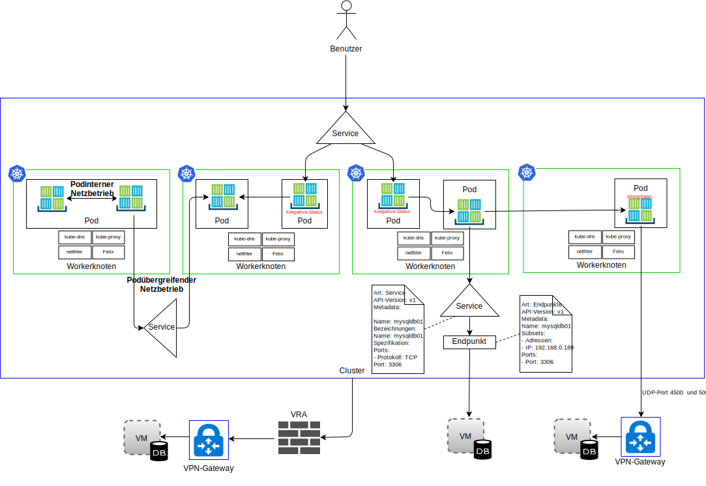
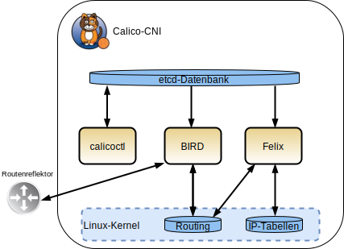

---

copyright:

  years:  2016, 2019

lastupdated: "2019-01-23"

---

# IBM Cloud Kubernetes-Service

## Übersicht über den IBM Cloud Kubernetes-Service

{{site.data.keyword.containerlong_notm}} bietet eine isolierte und sichere Plattform für das Management von Containern. Diese Plattform ist portierbar, erweiterbar und mit einer automatischen Fehlerbehebung ausgestattet.

Die Architektur besteht aus den folgenden Schlüsselkomponenten:
-	**{{site.data.keyword.cloud}}-Konto** - Workerknoten werden in einem {{site.data.keyword.cloud_notm}}-Konto bereitgestellt. Der Masterknoten wird in einem zentralen Cloudkonto bereitgestellt, das von IBM verwaltet wird.
-	**Cluster** - Ein Kubernetes-Cluster besteht aus einem oder mehreren Workerknoten.
-	**Workerknoten** - Ein Workerknoten ist eine Bare-Metal-Instanz oder virtuelle Serverinstanz, die in einem IBM Konto gehostet wird. Bei der Bereitstellung eines Workerknotens legen Sie die Ressourcen fest, die für die auf diesem Workerknoten gehosteten Container verfügbar sind. Die Workerknoten enthalten eine von IBM verwaltete Docker Engine, separate Rechenressourcen, Netzbetriebsressourcen und einen Speicherdatenträgerservice.
-	**Masterknoten** - Workerknoten werden durch einen Kubernetes-Masterknoten verwaltet, der alle Kubernetes-Ressourcen im Cluster zentral steuert und überwacht. Dieser Masterknoten wird von IBM verwaltet.

{{site.data.keyword.containerlong_notm}} beinhaltet die folgenden Konzepte:
-	**Service** - Ein Service ist eine Kubernetes-Ressource, die eine Reihe von Pods gruppiert und für diese Pods Netzkonnektivität bereitstellt, ohne die tatsächliche private IP-Adresse eines jeweiligen Pods anzuzeigen. Sie können einen Service verwenden, um Ihre Anwendung in Ihrem Cluster oder im öffentlichen Internet zur Verfügung zu stellen.
-	**Bereitstellung** - Eine Bereitstellung ist eine Kubernetes-Ressource, in der Sie Informationen zu anderen Ressourcen oder Leistungsmerkmalen angeben können, die zur Ausführung Ihrer Anwendung benötigt werden (z. B. Services, persistenter Speicher oder Annotationen). Sie dokumentieren eine Bereitstellung in einer YAML-Konfigurationsdatei und wenden Sie dann auf den Cluster an. Der Kubernetes-Master konfiguriert die Ressourcen und stellt Container in Pods auf den Workerknoten mit verfügbarer Kapazität bereit. Definieren Sie für Ihre Anwendung Aktualisierungsstrategien, einschließlich der Anzahl der Pods, die Sie während einer rollierenden Aktualisierung hinzufügen wollen, und die Anzahl der Pods, die zu einem bestimmten Zeitpunkt inaktiviert sein können. Wenn Sie eine rollierende Aktualisierung ausführen, prüft die Bereitstellung, ob die Aktualisierung funktioniert, und stoppt das Rollout, falls Fehler festgestellt werden.
-	**Pod** - Jede Anwendung in einem Cluster wird durch eine Kubernetes-Ressource bereitgestellt, ausgeführt und verwaltet, die als "Pod" bezeichnet wird. Pods repräsentieren kleine bereitstellbare Einheiten in einem Cluster und werden zur Gruppierung von Containern verwendet, die als gemeinsame Einheit behandelt werden müssen. In den meisten Fällen wird jeder Container in einem eigenen Pod bereitgestellt. Für eine Anwendung kann es erforderlich sein, dass ein Container und andere Helper-Container in einem einzigen Pod bereitgestellt werden, damit diese Container über dieselbe private IP-Adresse adressiert werden können.
-	**Anwendung** - Als "Anwendung" kann eine vollständige Anwendung oder eine Komponente einer Anwendung bezeichnet werden. Sie können Komponenten einer Anwendung in separaten Pods oder separaten Workerknoten bereitstellen.

Kubernetes gibt keine bestimmte Lösung für den Netzbetrieb vor.

Das Kubernetes-Netzmodell konstatiert drei grundlegende Voraussetzungen:
* Container können ohne NAT mit allen anderen Containern kommunizieren.
* Knoten können ohne NAT mit allen Containern kommunizieren (und umgekehrt).
* Die IP-Adresse, die ein Container für sich erkennt, ist dieselbe IP-Adresse, die auch von den anderen Containern erkannt wird.

### Namensbereiche

Namensbereiche sind ein grundlegender Aspekt des Containernetzbetriebs. Namensbereiche sind eine Funktion des Linux-Kernels, die Kernelressourcen so partitioniert, dass eine Gruppe von Ressourcen für eine Gruppe von Prozessen erkennbar ist, während eine andere Gruppe von Ressourcen für eine andere Gruppe von Prozessen erkennbar ist. Zu Ressourcen gehören Mountpunkte, Prozess-IDs, der Netzstack, IPC und Benutzer-IDs. Jeder Namensbereich besitzt eine private Gruppe von IP-Adressen, seine eigene Routing-Tabelle, Socketliste, Verbindungsüberwachungstabelle, Firewall und andere netzbezogene Ressourcen.

### Containernetzschnittstelle

Kubernetes verwendet die Containernetzschnittstelle (Container Network Interface, CNI) für seine plug-in-orientierte Lösung für den Netzbetrieb. Sie besteht aus einer Spezifikation und aus Bibliotheken für das Schreiben von Plug-ins zum Konfigurieren von Netzschnittstellen in Linux-Containern. Die CNI-Spezifikation ist einfach gehalten, da sie lediglich auf die Netzkonnektivität von Containern sowie auf die Garbage-Collection für Ressourcen abzielt, nachdem Container gelöscht wurden.

Im Zusammenhang mit CNI gibt es in Kubernetes zwei zentrale Definitionen:
- **Pod** - Ist synonym zu einem Linux-Netznamensbereich. Die Planungseinheit in Kubernetes ist der Pod, bei dem es sich um eine eng verbundene Gruppe mit einem oder mehreren Containern handelt, die immer benachbart (also auf einem Knoten als Einheit geplant) sind. Ein Pod kann sich nicht über mehrere Arbeitsknoten verteilen.
- **Netz** - Eine eindeutig adressierbare Gruppe von Entitäten, die miteinander kommunizieren können. Bei diesen Entitäten kann es sich um einen einzelnen Container, eine Maschine oder eine andere Netzeinheit wie einen Router handeln.

Damit die CNI einen Container zu einem Netz hinzufügen kann, muss die Containerlaufzeit zuerst einen neuen Namensbereich für den Container erstellen und anschließend eines oder mehrere der definierten Plug-ins starten. Die Netzkonfiguration wird im JSON-Format definiert und enthält Pflichtfelder wie beispielsweise Name und Typ sowie spezielle Felder für den Plug-in-Typ. Vorausgesetzt wird, dass ein CNI-Plug-in eine IP-Adresse zur Schnittstelle zuordnet und die relevanten Netzroutes festlegt. {{site.data.keyword.containerlong_notm}} verwendet Calico als Netzwerk-Plug-in für die CNI. Calico ordnet jeder Workload eine IP-Adresse zu. In {{site.data.keyword.containerlong_notm}} verwendet Calico die IP-in-IP-Tunnelung, damit die IP-Adressen des Containernetzes im {{site.data.keyword.cloud_notm}}-Netz verborgen sind.

Hinsichtlich des Datenaustausches im Netz wird in {{site.data.keyword.containerlong_notm}} zwischen vier Typen unterschieden, was im folgenden Diagramm dargestellt ist.

Abbildung 1. Datenverkehrstypen im Containernetz

- **Podinterner Netzbetrieb** - Dies wird auch als Kommunikation zwischen Containern bezeichnet. Alle Container in einem Pod nutzen einen Netznamensbereich sowie dieselbe IP-Adresse gemeinsam und sind füreinander auf dem lokalen Host (localhost) sichtbar. Der Datenverkehr für die einzelnen Anwendungen wird anhand verschiedener Portnummern unterschieden. Der Entwickler muss sicherstellen, dass die Container in einem Pod hinsichtlich der verwendeten Ports nicht miteinander in Konflikt stehen. Innerhalb eines Pods gibt es einen sogenannten Infrastrukturcontainer. Dies ist der erste vom Kubelet gestartete Container. Er übernimmt die IP-Adresse des Pods und richtet den Netznamensbereich ein. Anschließend treten alle anderen Container im Pod dem Netz und IPC-Namensbereich des Infrastrukturcontainers bei. Für den Container ist der Netzbrückenmodus aktiviert; alle anderen Container im Pod treten durch den Containermodus diesem Namensbereich bei. Falls der Infrastrukturcontainer beendet wird, stoppt das Kubelet alle Container im Pod und stellt sie anschließend erneut bereit, in der Regel mit einer neuen IP-Adresse. Weitere Details über diesen Datenfluss werden im vorliegenden Dokument nicht behandelt.

- **Podinterner Netzbetrieb** - Wird auch als Kommunikation zwischen Pods bezeichnet. Es gibt die folgenden drei Arten von Ost-West-Verkehr:
  - Pods können mit anderen Pods in demselben Teilnetz direkt kommunizieren. In {{site.data.keyword.containerlong_notm}} verfügt jeder Pod über eine IP-Adresse, die aus einem von {{site.data.keyword.containerlong_notm}} bereitgestellten Bereich zugeordnet wird. Jedem Workerknoten wird bei der Bereitstellung ein Teilnetz zugeordnet. Die Kommunikation zwischen Pods ohne Proxys, Tunnelung oder NAT findet bei Pods statt, die sich in demselben Teilnetz und Host befinden.
  - Pods können mit anderen Pods in anderen Teilnetzen direkt kommunizieren. Die IP-in-IP-Kapselung ist in {{site.data.keyword.containerlong_notm}} automatisch so konfiguriert, dass nur Pakete gekapselt werden, die zwischen Teilnetzen übertragen werden. Diese Kapselung verbirgt den Netzadressraum des Pods vor dem {{site.data.keyword.cloud_notm}}-Netz. Die Kapselung verwendet die IP-Adresse aus dem primären privaten Teilnetz von {{site.data.keyword.cloud_notm}}.
  - Pods können für die Kommunikation mit anderen Pods Services verwenden; dies wird als Kommunikation zwischen Pods und Services bezeichnet. Allerdings bestehen Pods, die wie in den beiden vorangehenden Punkten direkt mit anderen Pods kommunizieren, nicht unbegrenzt. Sie werden gestartet und sobald sie beendet werden, werden sie nicht erneut aktiviert. Replikatgruppen erstellen und löschen Pods dynamisch, beispielsweise beim Skalieren. Jeder Pod erhält zwar seine eigene IP-Adresse, aber selbst bei diesen IP-Adressen kann nicht von einer fortwährenden Unveränderlichkeit ausgegangen werden. Vorzugsweise sollten Anwendungsentwickler ein Servicekonstrukt für die Kommunikation verwenden, bei dem eine beständige virtuelle IP-Adresse genutzt wird, die über DNS erkannt werden kann.

- **Ingress** - Bezeichnet die Weiterleitung des Datenverkehrs von externen Benutzern oder Anwendungen an Pods. Ein Service stellt eine beständige virtuelle IP-Adresse (vIP) für eine Gruppe von Pods bereit. Während die Pods kurzlebig sind, ermöglichen Services mithilfe der vIP den Clients eine zuverlässige Erkennung und Verbindung zu den Containern, die in den Pods ausgeführt werden. Diese vIP ist keine echte IP-Adresse, die mit einer Netzschnittstelle verbunden ist. Sie dient ausschließlich als beständiger Endpunkt für die Weiterleitung von Datenverkehr an einen oder mehrere Pods. Der externe Zugriff auf einem Pod im Cluster ist etwas anspruchsvoller. Kubernetes zielt darauf ab, einen hoch verfügbaren und leistungsfähigen Lastausgleich für Services bereitzustellen.
Für den Nord-Süd-Datenverkehr gibt es in {{site.data.keyword.containerlong_notm}} drei Optionen:

  - **NodePort** - Der NodePort-Service gilt dann als geeignet, wenn Sie Tests durchführen wollen oder nur für einen kurzen Zeitraum einen öffentlichen oder privaten Zugriff benötigen. Ein NodePort-Service öffnet einen Port auf einem Workerknoten sowohl über die private als auch über die öffentliche IP-Adresse des Workerknotens. Sie müssen eine preDNAT-Netzrichtlinie von Calico verwenden, wenn Sie entweder die öffentliche oder die private IP-Adresse sperren wollen. Die öffentliche und die private IP-Adresse des Workerknotens sind nicht permanent.
  - **LoadBalancer** - Die portierbaren öffentlichen und privaten IP-Adressen, die der Lastausgleichsfunktion zugewiesen werden, sind permanent und ändern sich nicht, wenn ein Workerknoten im Cluster erneut erstellt wird. Sie können Ihre Lastausgleichsfunktion anpassen, indem Sie jeden von Ihrer Anwendung benötigten Port zugänglich machen. Für einen Lastausgleichsservice mit einer portierbaren privaten IP-Adresse ist weiterhin auf jedem Workerknoten ein öffentlicher Knotenport geöffnet. Sie müssen eine preDNAT-Netzrichtlinie von Calico verwenden, um öffentliche Knotenports darauf zu sperren.
  - **Ingress-Services** - Der ALB (Application Load Balancer, Lastausgleichsfunktion für Anwendungen) verwendet einen geschützten und eindeutigen öffentlichen oder privaten Eingangspunkt, um eingehende Anforderungen an Ihre Anwendungen weiterzuleiten. Der ALB ist für eingehende HTTP- bzw. HTTPS-, TCP- oder UDP-Serviceanforderungen empfangsbereit. Er leitet Anforderungen unter den Anwendungspods gemäß den Regeln weiter, die Sie in der Ingress-Ressource definiert haben. Wenn Sie einen Cluster erstellen, werden ein öffentlicher und ein privater ALB für die Ingress-Instanz automatisch erstellt. Da standardmäßig der öffentliche ALB aktiviert und der private ALB nicht verfügbar ist, müssen Sie den öffentlichen ALB inaktivieren und den privaten ALB aktivieren.

- **Egress** - Bezeichnet den Aufruf von podexternen Ressourcen wie APIs oder die Nutzung von Ressourcen aus VMs. Es gibt die folgenden Egress-Optionen:
    - Definieren Sie eine Serviceressource für ein System, das außerhalb des Clusters ausgeführt wird. Es wird eine Endpunktressource erstellt, die Details über das externe System, die IP-Adresse und die Portnummer enthält. Die Endpunktressource kann mehrere aufgelistete Adressen besitzen; Kubernetes führt einen Umlauf unter diesen Adressen wie zwischen den im Cluster ausgeführten Pods durch. Anschließend wird eine Serviceressource verwendet, um eine Cluster-IP und einen DNS-Namen in kube-dns für den Service zu erstellen.
    - Verwenden Sie das IPSec-VPN von strongSwan, um eine Verbindung zu Anwendungen herzustellen, die sich außerhalb des Clusters befinden. Ein IPSec-VPN von strongSwan wird innerhalb eines Kubernetes-Pods mithilfe eines Helm-Diagramms bereitgestellt und konfiguriert. Sobald die VPN-Konnektivität aufgebaut wurde, werden automatisch Routen auf allen Workerknoten im Cluster konfiguriert. Diese Routen ermöglichen eine bidirektionale Konnektivität durch den VPN-Tunnel zwischen Pods auf einem beliebigen Workerknoten und dem fernen System. Wenn der Pod fehlschlägt, wird er vom Cluster erneut gestartet; es kann jedoch zu einer kurzen Ausfallzeit kommen, während der neue Pod gestartet und die VPN-Verbindung erneut aufgebaut wird. Für den VPN-Service von strongSwan wird eine portierbare öffentliche oder private IP-Adresse verwendet. Die Einstellung "local.subnet" kann das Cluster-Podteilnetz, das Cluster-Serviceteilnetz oder das öffentliche oder private portierbare Teilnetz verwenden. Eine Neuzuordnung von Clusterteilnetzen kann mit der Einstellung "localSubnetNAT" erreicht werden. Alternativ können die Cluster-IP-Adressen hinter einer einzigen IP-Adresse verborgen werden, indem für die Einstellung "enableSingleSourceIP" der Wert "true" festgelegt wird. Um die Teilnetze des fernen Netzes erneut zuzuordnen, verwenden Sie die Einstellung "remoteSubnetNAT".
    - Eine Instanz von {{site.data.keyword.cloud_notm}} Virtual Router Appliance (VRA) kann als VPN-Gateway bereitgestellt werden, um eine sichere Verbindung zu einem externen Netz herzustellen. Der öffentliche oder private Datenaustausch im Netz kann über die VRA weitergeleitet werden. Die VRA erstellt einen verschlüsselten IPSec-Tunnel zum fernen VPN-Gateway.

## Komponenten des IBM Cloud Kubernetes-Service

Workerknoten werden durch einen Kubernetes-Masterknoten verwaltet, der alle Kubernetes-Ressourcen im Cluster zentral steuert und überwacht. Sobald ein Anwendungsentwickler Ressourcen für einen Container bereitstellt, entscheidet der Masterknoten, auf welchem Workerknoten diese Ressourcen bereitgestellt werden sollen, und berücksichtigt hierbei sowohl die Bereitstellungsanforderungen als auch die verfügbare Kapazität im Cluster. Der Masterknoten und die Workerknoten kommunizieren miteinander durch sichere TLS-Zertifikate und eine openVPN-Verbindung über das {{site.data.keyword.cloud_notm}} Public-Netz. Die Anwendungsentwickler greifen über das Internet auf die Komponente "kube-apiserver" zu, die auf dem Masterknoten gehostet wird.

Das Kubelet im Workerknoten überwacht die Komponente "kube-apiserver" im Masterknoten auf Aktualisierungen und meldet den Status. Das Kubelet ist ein Pod, der auf jedem Workerknoten ausgeführt wird, und dient der Überwachung des Allgemeinzustands von Pods, die auf dem Workerknoten ausgeführt werden, sowie der Ereignisse, die vom Kubernetes-API-Server gesendet werden. Auf Grundlage der Ereignisse werden vom Kubelet Pods erstellt oder entfernt, Aktivitäts- und Bereitschaftsprüfungen durchgeführt und der Status der Pods an den Kubernetes-API-Server zurückgemeldet.

Für das Netz werden die folgenden Komponenten auf dem Workerknoten bereitgestellt:

-	**openvpn-client** - Der OpenVPN-Client arbeitet mit dem OpenVPN-Server zusammen, um den Masterknoten sicher mit dem Workerknoten zu verbinden. Diese Komponente wird im Namensbereich "kube-system" ausgeführt.
-	**Calico-Knoten** - Der Calico-Knoten ist ein Container, in dem die verschiedenen Komponenten sind, die für Netzcontainer mit Calico benötigt werden. Diese Komponente wird im Namensbereich "kube-system" ausgeführt.
-	**Calico-Richtliniencontroller** - Der Calico-Richtliniencontroller überwacht, ob der eingehende und der abgehende Datenaustausch im Netz die festgelegten Netzrichtlinien einhält. Wenn der Datenverkehr im Cluster nicht zulässig ist, wird der Zugriff auf den Cluster gesperrt. Der Calico-Richtliniencontroller wird außerdem verwendet, um Netzrichtlinien für einen Cluster zu erstellen und festzulegen. Diese Komponente wird im Namensbereich "kube-system" ausgeführt.
-	**Calico-CNI** - Die Calico-Containernetzschnittstelle (CNI) verwaltet die Netzkonnektivität von Containern und entfernt zugeordnete Ressourcen, wenn ein Container gelöscht wird.
-	**Calico-IPAM** - Der Calico-IPAM verwaltet die Zuordnung von IP-Adressen für Container.
-	**kube-proxy** - Der Kubernetes-Netzproxy ist ein Dämonprozess, der auf jedem Workerknoten ausgeführt wird die Weiterleitung oder den Lastausgleich von TCP- sowie UDP-Netzverkehr für Services vornimmt, die im Cluster ausgeführt werden. Diese Komponente wird im Namensbereich "kube-system" ausgeführt.
-	**kube-dns**  - Das Kubernetes-DNS plant einen DNS-Pod und -Service für den Cluster. Container verwenden automatisch die IP des DNS-Service, um DNS-Namen bei der Suche nach anderen Pods und Services aufzulösen. Diese Komponente wird im Namensbereich "kube-system" ausgeführt.
-	**Ingress-ALB** - Ingress ist ein Kubernetes-Service, mit dem Sie Netzverkehrworkloads in Ihrem Cluster ausgleichen können, indem öffentliche oder private Anforderungen an mehrere Anwendungen in Ihrem Cluster weitergeleitet werden. Um Ihre Anwendungen über das öffentliche oder private Netz zugänglich zu machen, müssen Sie eine Ingress-Ressource für die Registrierung Ihrer Anwendungen beim Ingress-ALB erstellen. Der Zugriff auf mehrere Anwendungen kann dann über eine einzige URL oder IP-Adresse erfolgen. Diese Komponente wird im Namensbereich "ibm-system" ausgeführt.
-	**Lastausgleichsfunktion** - Eine Lastausgleichsfunktion (auch "Load Balancer" genannt) ist ein Kubernetes-Service, mit dem Sie die Netzverkehrworkloads in Ihrem Cluster ausgleichen können, indem öffentliche oder private Anforderungen an eine Anwendung weitergeleitet werden. Diese Komponente wird im Namensbereich "ibm-system" ausgeführt.

### Calico

{{site.data.keyword.containerlong_notm}} verwendet Calico als Netzprovider. Calico nutzt anstelle von Overlay-Netzen ein Layer-3-Konzept. Calico wird über die CNI-Plug-ins bei Kubernetes integriert und stellt durch die Kombination eines reinen IP-Netzes mit Border Gateway Protocol (BGP) zur Routenverteilung einen Netzbetrieb bereit.

Calico stellt eine L3-Fabriclösung zur Verfügung und verwendet anstelle eines vSwitch in jedem Rechenknoten eine vRouter-Funktion. Der vRouter werden die bestehenden L3-Weiterleitungsfunktionen des Linux-Kernels. Calico verbindet jede Workload über den vRouter direkt mit dem Infrastrukturnetz. Die vRouter-Funktion macht die Routen zu den in jedem Workerknoten gehosteten Pods mittels BGP zugänglich. Jeder vRouter teilt allen anderen vRoutern mithilfe von BGP alle Endpunkte mit, an die er angehängt ist.

In Calico werden IP-Pakete an einen oder von einem Pod durch die Linux-Infrastruktur mit Routing-Tabellen und IP-Tabellen auf dem Workerknoten weitergeleitet und mit einem Firewallschutz versehen.

-	Für eine Workload, die Pakete sendet, stellt Calico sicher, dass immer der Workerknoten als MAC-Adresse für den nächsten Hop zurückgegeben wird, und zwar unabhängig davon, welche Weiterleitung möglicherweise in der Workload selbst konfiguriert ist.
-	Für Pakete, die an eine Workload gerichtet sind, findet der letzte IP-Hop  zwischen dem Workerknoten der Zielworkload und der Workload selbst statt.

Abbildung 2. Calico-CNI

Das vorangehende Diagramm zeigt die folgenden Calico-Komponenten:
-	**calicoctl** - Befehlszeilenschnittstelle.
-	**CNI-Plug-in**
-	**Schlüsselwertspeicher** - Enthält die Richtlinie und den Netzkonfigurationsstatus von Calico. Calico verwendet etcd für die Kommunikation zwischen Komponenten und als konsistenten Datenspeicher, was sicherstellt, dass Calico immer ein korrektes Netz aufbauen kann. Die Komponente "etcd" wird in der gesamten Bereitstellung verteilt. Sie ist in zwei Gruppen von Maschinen unterteilt, nämlich den Kerncluster und die Proxys.
-	**calico/node** - Ein Helper-Container, in dem die verschiedenen Komponenten gebündelt sind, die für den Netzbetrieb erforderlich sind:
 -	**Felix** - Dies ist der primäre Calico-Agent, der auf jeder Maschine ausgeführt wird, von der Endpunkte gehostet werden. Er ist für die Programmierung von Routen und Zugriffssteuerungslisten (Access Control Lists, ACLs) sowie aller anderen Elemente zuständig, die auf dem Host benötigt werden, um die gewünschte Konnektivität für die Endpunkte auf diesem Host bereitzustellen.
 - **BIRD** - BIRD ist ein Open-Source-BGP-Client, mit dessen Hilfe Routing-Informationen zwischen Hosts ausgetauscht werden. Wenn Routen von Felix in den FIB des Linux-Kernels eingefügt werden, entnimmt sie der BGP-Client und verteilt sie an die anderen Knoten in der Bereitstellung. Dies gewährleistet, dass der Datenverkehr in der Bereitstellung effizient weitergeleitet wird.
 - **Confd** - Die Engine "confd" für die Erstellung anhand von Vorlagen überwacht den etcd-Datenspeicher auf Änderungen an der BGP-Konfiguration und an einem Teil der übergeordneten globalen Standardkonfiguration (z. B. AS-Nummer, Protokollierungsstufen und IPAM-Informationen). Basierend auf den Daten in etcd generiert sie anschließend dynamisch BIRD-Konfigurationsdateien, was automatisch durch Aktualisierungen der Daten ausgelöst wird. Wenn sich die Konfigurationsdateien ändern, löst confd das Laden der neuen Dateien durch BIRD aus.

Da das {{site.data.keyword.cloud_notm}} Private-Netz ausschließlich IP-Adressierungsschemas von {{site.data.keyword.cloud_notm}} weiterleitet, muss Calico die IP-in-IP-Kapselung des workloadinternen Datenverkehrs in {{site.data.keyword.containerlong_notm}} verwenden, um die IP-Adressen des Podnetzes zu verbergen. {{site.data.keyword.containerlong_notm}} verwendet den teilnetzübergreifenden Modus von IP-in-IP.

### Calico im IBM Cloud Kubernetes-Service

Calico wird automatisch in {{site.data.keyword.containerlong_notm}} installiert und konfiguriert. Zum Schutz des Kubernetes-Cluster werden Standardrichtlinien erstellt; Sie haben aber die Möglichkeit, eigene Richtlinien zu erstellen, um bestimmte Services zu schützen. Die IP-in-IP-Kapselung ist automatisch so konfiguriert, dass nur Pakete gekapselt werden, die zwischen Teilnetzen übertragen werden, und verwendet NAT für Verbindungen, die von Ihren Containern ausgehen. Der Datenverkehr von Workloads an das WAN ist ebenfalls automatisch im {{site.data.keyword.containerlong_notm}} aktiviert, sodass eine weitere Konfiguration von Calico nicht erforderlich ist.

#### Netzskalierbarkeit mit Calico

Calico baut auf einer verteilten Scale-out-Architektur auf und kann dadurch eine reibungslose Skalierung von einem einzigen Entwicklernotebook bis zu umfangreichen Unternehmensbereitstellungen vornehmen. Zur Bereitstellung von Bare-Metal-Leistung für virtuelle Workloads wird die Linux-Standarddatenebene verwendet.

#### Sicherheit mit Calico

Calico verwendet eine Reihe von Richtlinien, die alle Komponenten des Systems steuern. Diese Richtlinien können so konfiguriert werden, dass die Kommunikation zwischen Services und Containerinstanzen nur bei Bedarf zulässig ist. Calico verwendet IP-Adressen, um Containerinstanzen anzugeben und erstellt Richtlinien auf der Grundlage dieser Adressen. Die Kubernetes-Integration mit Calico ist infrastrukturorientiert und kann Sicherheitsrichtlinien aufgrund von Infrastrukturänderungen skalieren.

#### Integration mit Calico

Calico bietet eine hoch skalierbare Netzbetriebs- und Netzrichtlinienlösung für die Verbindung von Kubernetes-Pods, die auf denselben Prinzipien für den IP-Netzbetrieb wie das Internet basiert. Sie kann ohne Kapselung oder Overlays bereitgestellt werden, um einen leistungsstarken und hoch skalierbaren Netzbetrieb für Rechenzentren zu ermöglichen. Calico bietet über seine dezentrale Firewall differenzierte und zweckorientierte Netzsicherheitsrichtlinien für Kubernetes-Pods. Calico kann auch im Richtliniendurchsetzungsmodus zusammen mit anderen Netzbetrieblösungen wie Flannel (auch unter dem Namen "Canal" bekannt) oder dem nativen GCE-Netzbetrieb ausgeführt werden.

## Netzbetrieb des IBM Cloud Kubernetes-Service

{{site.data.keyword.containerlong_notm}} richtet mit den folgenden Elementen für den Cluster standardmäßig den Zugriff auf ein öffentliches VLAN und ein privates VLAN ein.
- Für jeden Workerknoten gibt es eine öffentliche IP-Adresse, wodurch Workerknoten eine Schnittstelle für das öffentliche Netz erhalten. Standardmäßig gilt Folgendes:
  -	Für alle Workerknoten ist der gesamte abgehende Datenaustausch im Netz zulässig.
  -	Der eingehende Datenaustausch im Netz wird bis auf wenige Ports gesperrt. Diese Ports sind geöffnet, damit IBM den Datenaustausch im Netz überwachen und Sicherheitsupdates für den Kubernetes-Masterknoten automatisch installieren kann.
-	Für jeden Workerknoten gibt es eine private IP-Adresse, wodurch Workerknoten eine Schnittstelle für das private Netz erhalten.
-	Zwischen allen Workerknoten und dem Masterknoten besteht automatisch eine sichere OpenVPN-Verbindung.

Wenn in einer Zone zum ersten Mal ein Cluster erstellt wird, werden ohne Ihr Zutun im {{site.data.keyword.cloud_notm}}-Infrastruktur automatisch ein öffentliches VLAN und ein privates VLAN in dieser Zone bereitgestellt. Für jeden Cluster, der anschließend in dieser Zone erstellt wird, können Sie dasselbe öffentliche und private VLAN verwenden, weil mehrere Cluster VLANs gemeinsam nutzen können.

Workerknoten können sowohl mit einem öffentlichen VLAN als auch mit dem privaten VLAN oder aber nur mit dem privaten VLAN verbunden werden. Wenn Sie Ihre Workerknoten ausschließlich mit einem privaten VLAN verbinden wollen, können Sie die ID eines bestehenden privaten VLAN verwenden oder ein privates VLAN erstellen und die ID bei der Erstellung des Clusters verwenden.

IP-Teilnetze für Workerknoten und Pods werden ebenfalls automatisch in VLANs bereitgestellt. Teilnetze stellen für die Clusterkomponenten Netzkonnektivität bereit, indem sie ihnen IP-Adressen zuordnen. Die folgenden Teilnetze werden automatisch für die standardmäßigen öffentlichen und privaten VLANs bereitgestellt:
-	**Öffentliche VLAN-Teilnetze:**
    - Das primäre öffentliche Teilnetz bestimmt die öffentlichen IP-Adressen, die den Workerknoten während der Clustererstellung zugeordnet werden. Mehrere Cluster in demselben VLAN können ein primäres öffentliches Teilnetz gemeinsam nutzen.
    - Das portierbare öffentliche Teilnetz ist nur an einen einzigen Cluster gebunden und stellt dem Cluster acht öffentliche IP-Adressen zur Verfügung. Drei IP-Adressen sind für Netzfunktionen reserviert. Eine IP-Adresse wird vom Standard-ALB für die öffentliche Ingress-Instanz genutzt und vier IP-Adressen können zum Erstellen von öffentlichen Netzservices für die Lastausgleichsfunktion verwendet werden. Portierbare öffentliche IP-Adressen sind permanente, festgelegte IP-Adressen, die für den Zugriff auf Lastausgleichsservices über das Internet verwendet werden können.
-	**Private VLAN-Teilnetze:**
    - Das primäre private Teilnetz bestimmt die privaten IP-Adressen, die den Workerknoten während der Clustererstellung zugeordnet werden. Mehrere Cluster in demselben VLAN können ein primäres privates Teilnetz gemeinsam nutzen.
    - Das portierbare private Teilnetz ist nur an einen einzigen Cluster gebunden und stellt dem Cluster acht private IP-Adressen zur Verfügung. Drei IP-Adressen sind für Netzfunktionen reserviert. Eine IP-Adresse wird vom Standard-ALB für die private Ingress-Instanz genutzt und vier IP-Adressen können zum Erstellen von privaten Netzservices für die Lastausgleichsfunktion verwendet werden. Portierbare private IP-Adressen sind permanente, festgelegte IP-Adressen, die für den Zugriff auf Lastausgleichsservices über das Internet verwendet werden können.

### Zugehörige Links

* [Übersicht über vCenter Server on {{site.data.keyword.cloud_notm}} with Hybridity Bundle](/docs/services/vmwaresolutions/archiref/vcs/vcs-hybridity-intro.html)
