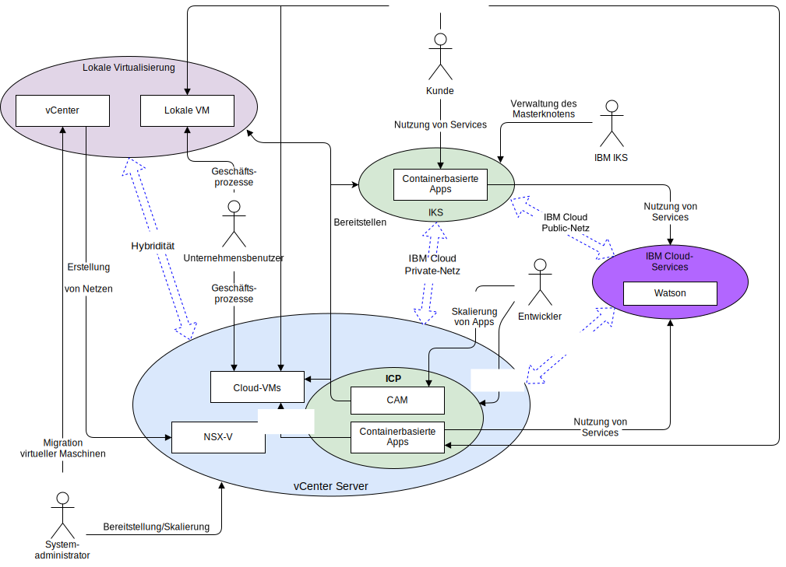

---

copyright:

  years:  2016, 2019

lastupdated: "2019-03-13"

subcollection: vmware-solutions

---

# Systemkontext
{: #vcsnsxt-systemcontext}

Das Systemkontextdiagramm definiert die Schlüsselelemente eines Systems, die Grenzen des Systems sowie die Entitäten, die mit ihm interagieren, zusammen mit den Interaktionen. Dieses übergeordnete Diagramm vermittelt dem Leser eine erste Sicht auf ein System.

Abbildung 1. Systemkontext

Unter netzrelevanten Gesichtspunkten betrachtet, gibt es die folgenden vier Kernkomponenten:
- **Lokale Virtualisierung** - Eine VMware-Umgebung, die am Standort des Kunden oder eines anderen Anbieters gehostet wird und die derzeit die VMs hostet, die die zu modernisierenden Anwendungen ausführen. Sie ist die Quellenumgebung für VM-Migrationen und über VMware HCX flexibel mit einer {{site.data.keyword.cloud}}-Instanz verbunden.
- **vCenter Server** - Eine {{site.data.keyword.vmwaresolutions_short}}-Instanz, die das Ziel für migrierte VMs aus der lokalen Umgebung ist. Zusammen mit der lokalen Virtualisierung bildet sie eine Hybridumgebung, die es VMs ermöglicht, ohne Reibungsverluste von einem Standort an einen anderen zu wechseln.
- **{{site.data.keyword.containerlong_notm}}** - verwendet Kubernetes als Lösung zur Containerorchestrierung. IBM ist für den Betrieb und das Management des Kubernetes-Masterknotens verantwortlich, während die Workerknoten in einer vom Kunden verwalteten Infrastruktur bereitgestellt werden. IBM stellt Management-Tools für die Bereitstellung der Betriebssystempatches, Docker-Engine-Upgrades und neuer Kubernetes-Versionen zur Verfügung. {{site.data.keyword.containerlong_notm}} bietet eine isolierte und sichere Plattform für das Management von Containern, die portierbar und erweiterbar sind und die über eine automatische Fehlerbehebungsfunktion für Failover-Situationen verfügen.
- **IBM Cloud Private** - Eine Anwendungsplattform für die Entwicklung und Verwaltung von containerisierten Anwendungen. Es handelt sich um eine integrierte Umgebung, die Kubernetes als Container-Orchestrator, ein privates Image-Repository, eine Managementkonsole, Überwachungsframeworks und eine grafische Benutzerschnittstelle enthält, von der aus Sie Anwendungen zentral bereitstellen, verwalten, überwachen und skalieren können.
- **IBM Cloud-Services** - Eine breite Palette von Services, die über {{site.data.keyword.cloud_notm}} verfügbar und verwendbar sind. Zu den Serviceoptionen gehören beispielsweise Analyse, AI und IoT.

## Akteure
{: #vcsnsxt-systemcontext-actors}

Im Systemkontextdiagramm sind die folgenden Akteure angegeben.

Tabelle 1. Akteure

Akteur  |  Beschreibung
---|---
Systemadministrator |Die Systemadministratoren sind die Unternehmensressourcen für VMware, die vCenter und das HCX-Plug-in nutzen. Sie ermitteln Kandidaten für die Migration, vergrößern Netze, migrieren virtuelle Maschinen (VMs) und verwalten NSX-V. Mithilfe der {{site.data.keyword.cloud_notm}}-Konsole stellen sie VMware vCenter Server-Instanzen bereit und skalieren die Kapazität.
Entwickler	| Die Entwickler sind die qualifizierten Unternehmensressourcen für Container, die unter Verwendung der Konsolen und APIs von {{site.data.keyword.containerlong_notm}}, {{site.data.keyword.icpfull_notm}} und CAM Container erstellen und verwalten. Sie richten die neuen Services im Rahmen der Anwendungsmodernisierung ein.
Unternehmensbenutzer | Diese Unternehmensressource benötigt Netzzugriff auf die Anwendungen, um Geschäftsprozesse wie die Aktualisierung von Inhalten auszuführen.
Kunde | Der Kunde ist ein externer Akteur, der Services aus dem Unternehmen nutzen möchte. Bei Acme Skateboards ist der Kunde ein Skater, der Skateboarding-Produkte erwerben möchte. Der Kunde benötigt einen sicheren Internetzugriff auf den Katalog.
{{site.data.keyword.containerlong_notm}} | Dies ist eine IBM Ressource, die den {{site.data.keyword.containerlong_notm}}-Masterknoten des Service verwaltet.

## Systeme
{: #vcsnsxt-systemcontext-systems}

Im Systemkontextdiagramm sind die folgenden Systeme angegeben.

Tabelle 2. Systeme

Akteur | Beschreibung
---|---
vCenter | vCenter ist die primäre Schnittstelle für den Systemadministrator zur Verwaltung der lokalen VMs und zum Zugriff auf das HCX-Plug-in für die Erweiterung von Netzen und die VM-Migration. Mit vCenter Server with Hybridity Bundle kann der Systemadministrator lokale vCenter-Netze nahtlos in die vCenter Server-Instanz integrieren, die in {{site.data.keyword.cloud_notm}} ausgeführt wird. Der Hybridnetzbetrieb erweitert die lokalen Netze in die {{site.data.keyword.cloud_notm}}. Das ermöglicht es den Kunden, ihre Anwendungen in eine {{site.data.keyword.containerlong_notm}}-Instanz zu migrieren, die in {{site.data.keyword.cloud_notm}} ausgeführt wird; eine Migration zurück ist bei Bedarf ebenfalls möglich. Weitere Informationen zu vCenter Server with Hybridity Bundle finden Sie unter [VMware HCX on {{site.data.keyword.cloud_notm}} Solution Architecture](/docs/services/vmwaresolutions/services?topic=vmware-solutions-hcx-archi-intro#hcx-archi-intro).
Lokale VMs | Die lokalen VMs hosten die Anwendungen, die in die Cloud migriert werden. Sie werden zunächst als VMs migriert und anschließend im Anwendungsmodernisierungprozess aus VMs in Container migriert.
Cloud-VMs | Cloud-VMs hosten Anwendungen, die aus lokalen VMs migriert wurden. Sie kommunizieren mit lokalen Anwendungen über das erweiterte L2-Netz. Bei dieser Referenzarchitektur und diesem Beispiel für Acme Skateboards ist eine der Cloud-VMs ein Datenbankserver, der Teil der Workload der Onlinepräsenz ist.
NSX-V | NSX-V auf vCenter Server stellt das vom System definierte Overlay-Netz bereit, das vom Systemadministrator verwaltet wird. Das Overlay-Netz ist das Ziel für erweiterte HCX-Netze, da es von den VMs ausgehenden Datenverkehr für {{site.data.keyword.icpfull_notm}} abwickelt. NSX-V stellt die Referenzarchitektur mit Funktionen wie Bereitstellung, Rekonfiguration und Löschung von bedarfsgesteuerten virtuellen Netzen und Mikrosegmentierungsservices in VMware unter Verwendung von vSphere-Switches (vSphere) zur Verfügung. Weitere Informationen enthält der Abschnitt [Übersicht über NSX-V](/docs/services/vmwaresolutions/archiref/vcsnsxt?topic=vmware-solutions-vcsnsxt-overview-ic4vnsxv).
CAM | {{site.data.keyword.cloud_notm}} Automation Manager (CAM) wird in {{site.data.keyword.icpfull_notm}} ausgeführt und bietet eine zentrale Bereitstellungsposition für VM-basierte Workloads sowie Kubernetes-Workloads, die durch die Verwendung von Vorlagen ermöglicht wird. Durch CAM erhält ein Entwickler die folgenden Möglichkeiten:   - Workloads in vCenter, {{site.data.keyword.icpfull_notm}} oder {{site.data.keyword.containerlong_notm}} bereitstellen.  - Services erstellen und orchestrieren, die sowohl aus VMs als auch aus Containern bestehen.   - DevOps-Toolchains und Day-2-ITSM-Lösung integrieren.
Containerisierte Anwendungen | Die Anwendungen, die den Anwendungsmodernisierungsprozess durchlaufen haben und jetzt als Container ausgeführt werden. Bei dieser Referenzarchitektur und in diesem Beispiel für Acme Skateboards ist eine der containerisierten Anwendungen ein Web-Server, der Teil der Workload für die Onlinepräsenz ist.
Watson | Für diese Referenzarchitektur und in diesem Beispiel für Acme Skateboards stellt Watson den AI-Service dar, der in der Concept-Car-Architektur verwendet wird.

## Zugehörige Links
{: #vcsnsxt-systemcontext-related}

* [Übersicht über vCenter Server on {{site.data.keyword.cloud_notm}} with Hybridity Bundle](/docs/services/vmwaresolutions/archiref/vcs?topic=vmware-solutions-vcs-hybridity-intro)
