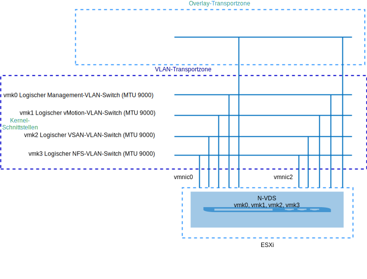
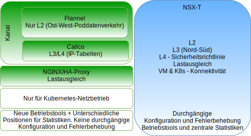
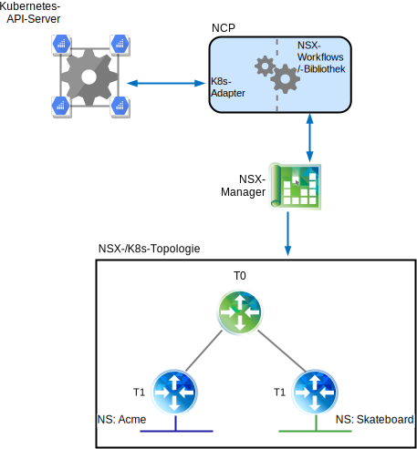
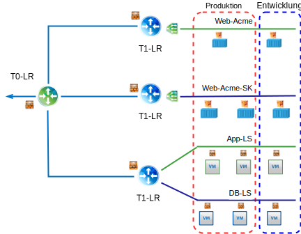
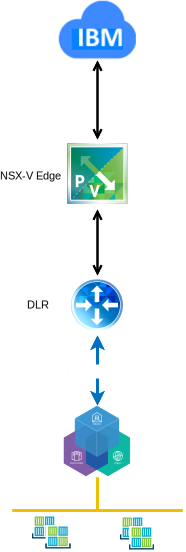

---

copyright:

  years:  2016, 2018

lastupdated: "2018-11-06"

---

# Technische Neuentwicklung bei VMware NSX-T unter VCS

## Übersicht über NSX-T

VMware NSX-T wurde für Anwendungsframeworks und Architekturen mit heterogenen Endpunkten und Technologiestacks entworfen. Neben vSphere können diese Umgebungen weitere Hypervisoren, KVM, Container und Bare-Metal-Instanzen enthalten. NSX-T ermöglicht IT- und Entwicklungsteams die Auswahl der für ihre Anwendungen am besten geeigneten Technologien. NSX-T kann nicht nur für die IT, sondern auch von Entwicklungsorganisationen bei Verwaltung, Betrieb und Verarbeitung eingesetzt werden.

In diesem Design wird die Managementinfrastruktur für NSX-T auf dem ersten VCS-Cluster oder in einem vorhandenen Cluster bereitgestellt.

Dem NSX-T Manager wird eine IP-Adresse aus dem privaten, portierbaren Adressblock zugeordnet, der für Managementkomponenten vorgesehen ist und für die Verwendung der allgemeinen DNS- und NTP-Servern konfiguriert ist.

Ein weiterer Cluster wird bereitgestellt und für die Hypervisortransportknoten verwendet, zusammen mit entweder vSAN- oder NFS-Speicher für die Workloaddaten. In Tabelle 1 sind die Anforderungen für eine Umgebung mit mittlerer Größe zusammengefasst.

Tabelle 1. Spezifikationen für NSX-T-Komponenten

Ressourcen	|NSX-T Manager	|Controller x 3	|Edge x 2	|Bare Metal Edge*
---|---|---|---|---
Mittlere Größe	|Virtuelle Appliance |Virtuelle Appliance |Virtuelle Appliance |Physischer Server*
Anzahl vCPUs	|4	|4	|4	|8
Speicher	|16 GB	|16 GB	|8 GB	|32 GB
Platte	|vSAN-Speicher mit 140 GB oder gemeinsam genutzte NFS-Ressource für Management |vSAN-Speicher mit 120 GB oder gemeinsam genutzte NFS-Ressource für Management |vSAN-Speicher mit 120 GB oder gemeinsam genutzte NFS-Ressource für Management |200 GB
Plattentyp	|Thin Provisioning-Platte	|Thin Provisioning-Platte	|Thin Provisioning-Platte	|Physisch
Netz	|Privat A, portierbar, für Managementkomponenten vorgesehen |Privat A, portierbar, für Managementkomponenten vorgesehen |Privat A, portierbar, für Managementkomponenten vorgesehen |Privat A, portierbar, für Managementkomponenten vorgesehen 

\* **Hinweis**: Spezifische Voraussetzungen können Sie anhand der Hardwarekompatibilitätsliste überprüfen.

Abbildung 1. Layout der Managementkomponenten für NSX-V und NSX-T

### Erstkonfiguration

Stellen Sie den NSX-T Manager, einen Controller-Cluster, der aus drei Controllern und einem Edge-Cluster besteht, im ersten VCS-Cluster bereit. Ordnen Sie allen Komponenten IP-Adressen aus dem portierbaren Teilnetz **Privat A** zu.

Erstellen Sie VM-VM-Anti-Affinitätsregeln, damit die Controller unter den Hosts im Cluster separiert werden. Zu beachten ist, dass der erste Cluster mit mindestens drei Knoten bereitgestellt wird, um eine hohe Verfügbarkeit für die Controller sicherzustellen.

Stellen Sie zwei weitere vSphere-Hosts für den NSX-T Manager bereit und installieren Sie darauf die Software für NSX-T (VIBs). Erstellen Sie die Uplinkprofile für Host und Edge sowie das NIOC-Profil und definieren Sie den IP-Pool, der für die Kommunikation über Tunnelendpunkte (TEP) verwendet wird. Weitere Informationen können Sie der Definitionstabelle für das Uplinkprofil und der Definitionstabelle für das NIOC-Profil entnehmen.

Die in den Pools definierten IP-Adressen stammen aus dem portierbaren IP-Adressbereich von **Privat A**. Es werden VLAN- und Overlay-Transportzonen erstellt und die beiden zusätzlichen ESXi-Hosts werden für beide Zonen als Transportknoten konfiguriert. Gegenwärtig werden die funktional entsprechenden Uplinkprofile zugeordnet. Erstellen Sie einen N-VDS-Switch auf den ESXi-Hosts und ordnen Sie "uplink1" und "uplink2" zu.

An dieser Stelle sind zwei zusätzliche VLANs erforderlich, um die Teaming-, Failover- und Uplinkrichtlinien für die Migration der VM-Kernel-Ports aus der vDS-Portgruppe in logische VLAN-Switches von NSX T aufzunehmen. Die logischen VLAN-Switches werden mit den entsprechenden VLAN-IDs erstellt und die VM-Kernel-Ports werden migriert.

NSX-T erstellt "vmk10", der für die Kapselungsschnittstelle verwendet wird, und "vmk50", der für den internen Transit in Tier 0 sowie den Transit zwischen dem Tier-0- und dem Tier-1-Teilnetz auf den ESXi-Hosts genutzt wird. Standardmäßig wird das Teilnetz 169.254.0.0/28 für den internen Transit in Tier 0 und das Teilnetz 100.64.0.0/16 für den Transit zwischen Tier 0 und Tier 1 verwendet.

Tabelle 2. Definition des Uplinkprofils

Uplinkprofil	|Spezifikation
---|---
LAGs	|Gegenwärtig nicht definiert.
Teaming	|Failover: Aktiv = Uplink1 = vmnic0, Standby = Uplink2 = vmnic2
Transport-VLAN	|0
MTU	|9000

Tabelle 3. Definition des NIOC-Profils

Datenverkehrstyp/Datenverkehrsname |Grenzwert (%)	|Freigaben	|Reservierung (%)
---|---|---|---
Managementdatenverkehr	|Unbegrenzt	|20	|0
Datenverkehr der virtuellen Maschine	|Unbegrenzt	|30	|0
Fehlertoleranter Datenverkehr	|Unbegrenzt	|50	|0
vSphere-Replikationsdatenverkehr	|Unbegrenzt	|50	|0
iSCSI-Datenverkehr	|Unbegrenzt	|50	|0
Datenverkehr für vSphere Data Protection-Sicherung |Unbegrenzt	|50	|0
vMotion-Datenverkehr	|Unbegrenzt	|50	|0
NFS-Datenverkehr	|Unbegrenzt	|100	|0
vSAN-Datenverkehr	|Unbegrenzt	|100	|0

Abbildung 2. Logischer VLAN-Switch zu VM-Kernel-Schnittstelle

## NSX-T

Dieses Design gibt die Konfiguration von NSX-T-Komponenten, dem VLAN und den Overlay-Transportzonen an, wendet jedoch keine Konfiguration von Overlay-Netzkomponenten an. Es ist Aufgabe des Kunden, das Design des Netzoverlays entsprechend seinen Anforderungen festzulegen.

Die folgenden Komponenten werden konfiguriert:
-	Management-Server und -Controller werden installiert.
-	ESXi-Agenten werden installiert und ein TEP-IP-Adresspool wird für Transportknoten konfiguriert.
-	Transportknoten werden sowohl für VLAN- als auch für Overlay-Transportzonen konfiguriert.
-	N-VDS wird auf den ESXi-Transportknoten erstellt.
-	VM-Kernel-Ports werden von VSS/VDS auf N-VDS migriert.
-	Tier-0-Router für die Verwendung durch Managementkomponenten.

Die folgenden Komponenten werden NICHT konfiguriert:
-	Logische Overlay-Switches.
-	Mikrosegmentierung.
-	Verknüpftes NSX-Management mit anderen VMware-Instanzen.

### VCS mit NSX-V und NSX-T

Der ursprüngliche VCS-Cluster enthält alle Managementkomponenten für NSX-V und NSX-T zusammen mit den vCenter Server-Appliances. Die Hosts in diesem Cluster werden für NSX-V wie im Abschnitt [Übersicht über NSX-V](vcsnsxt-overview-ic4vnsxv.html) beschrieben vorbereitet. Die Hosts im zweiten Cluster werden für NSX-T vorbereitet und als Transportknoten konfiguriert. Durch diese Konfiguration erhalten Kunden die Möglichkeit, auf Wunsch eine Migration von NSX-V auf NSX-T vorzunehmen.

### NSX-T und NSX-V im Vergleich

In diesem Abschnitt wird der Hauptunterschied zwischen den VMware-SDN-Produkten "NSX-V" und "NSX-T" erläutert. Beide Lösungen bieten eine Mikrosegmentierung in einer VMware-Umgebung, wobei NSX-T wie nachfolgend gezeigt hierbei ein wenig weiter geht.

Ausführliche Informationen zu den Architekturunterschieden enthält das Dokument [VMware NSX-T Reference Design Guide](https://communities.vmware.com/servlet/JiveServlet/download/37591-3-195840/VMware%20NSX-T%20Reference%20Design%20Guide.pdf) (PDF-Download).

#### NSX-V

NSX-V (kurz für "NSX for vSphere") ist ausschließlich für vSphere-Bereitstellungen konzipiert und so aufgebaut, dass ein einziger NSX-V Manager an eine einzige VMware vCenter-Instanz gebunden wird. Falls Sie in Ihrer VMware-Umgebung eine Netzvirtualisierung benötigen, ist NSX-V generell die geeignete Lösung.

Schwerpunkte von NSX-V:
-	VMware-orientiert.
-	Für SDN in vSphere konzipiert (zentrale Stelle für Netzvirtualisierung in der vSphere-Benutzerschnittstelle).
-	Verwendet ein VXLAN-Kapselungsprotokoll (wird von den meisten anderen Anbietern unterstützt).
-	Eigner der physischen NICs ist nicht NSX-V; sie werden den virtuellen verteilten Switches (vDS) "SDDC-Dswitch-Private" und "SDDC-Dswitch-Public" zugeordnet.
-	Terminologische Unterscheidung: Distributed Logical Router (DLR) für Ost-West-Datenverkehr und Edge Service Gateway (ESG) für Nord-Süd-Datenverkehr.

#### NSX-T

NSX-T (kurz für "NSX Transformers") ist eine eigenständige Lösung für vCenter- und vSphere-Umgebungen, unterstützt jedoch ebenfalls KVM, öffentliche Clouds sowie Container und kann in Frameworks wie IKS und ICP, Redhat OpenShift, Pivotal und andere integriert werden. Dies gibt Ihnen die Möglichkeit, Ihren softwaredefinierten Netzbetrieb (SDN) über mehrere Hypervisoren, Container und Clouds hinweg zu verwalten.

Schwerpunkte von NSX-T:
-	Eigenständiges Produkt. vCenter ist nicht erforderlich.
-	Unterstützung für mehrere Hypervisoren:
    - Controller können in KVM oder ESXi bereitgestellt werden.
    - Edges können als virtuelle oder Bare-Metal-Instanzen bereitgestellt werden.
-	Containerintegration (CNI-Plug-in von NSX-T).
-	Unterstützung von OpenSwitch (OvS).
- Mehrschichtiges optimiertes Routing:
    - Routenmitteilung beim Tier-1-Router.
    - Routenneuverteilung beim Tier-1-Router.
-	Verwendung des Geneve-Kapselungsprotokolls.
-	Eigner der physischen NICs ist der NSX-T-Transportknoten; sie werden dem N-VDS zugeordnet.
-	Terminologische Unterscheidung: Logischer Tier-1-Router für Ost-West-Datenverkehr und logischer Tier-0-Router für Nord-Süd-Datenverkehr.

## Calico

Calico baut auf einer verteilten Scale-out-Architektur auf und kann dadurch eine reibungslose Skalierung von einem einzigen Entwicklernotebook bis zu umfangreichen Unternehmensbereitstellungen vornehmen. Zur Bereitstellung von Bare-Metal-Leistung für virtuelle Workloads wird die Linux-Standarddatenebene verwendet. Calico besteht aus mehreren voneinander abhängigen Komponenten:
-	Der Dämonprozess "Felix" wird auf jedem Knoten ausgeführt, der einen Endpunkt, einen Container oder eine VM hostet. Er ist für das Schnittstellenmanagement, die Programmierung von Routen und Zugriffssteuerungslisten, die Weiterleitung an den Endpunkt, die Validierung des Datenverkehrs zwischen Endpunkten und die Statusmeldung (im Wesentlichen über den Allgemeinzustand des Netzes für den verwalteten Host) zuständig.
- Die Komponente "Orchestrator Plugin", die das Orchestrator-Plug-in an Calico bindet (in diesem Fall das Kubernetes-Plug-in), stellt die API-Umsetzung von Kubernetes in Calico und das Feedback von Calico an Kubernetes über fehlgeschlagene Netzkonfigurationen von Endpunkten bereit.
-	Die Komponente "etcd" ermöglicht die Kommunikation zwischen Komponenten und die Speicherung in einem konsistenten Datenspeicher, wodurch gewährleistet ist, dass Calico immer ein korrektes Netz aufbauen kann.
-	BIRD stellt BGP-Client-Funktionen auf jedem Knoten bereit, der auch Felix hostet. Wenn Routen von Felix in den Linux-Kernel eingefügt werden, entnimmt sie der BGP-Client und verteilt sie an die anderen Knoten in der Bereitstellung. In umfangreichen Umgebungen wird außerdem ein BGP-Routenreflektor bereitgestellt, der für BGP als zentrale Stelle zum Herstellen einer Verbindung dient. Hierdurch ist jeder Client nicht gezwungen, mit jedem anderen Client zu kommunizieren und die Routen an die anderen Knoten in der Bereitstellung zu verteilen.

Abbildung 3. Übersicht über Calico

### NSX-T und Calico

#### Details zu NSX-T-Komponenten

Die NSX-T-Architektur verfügt über eine integrierte Trennung von Datenebene, Steuerebene und Managementebene. Diese Trennung bietet mehrere Vorteile, unter anderem Skalierbarkeit, Leistung, Ausfallsicherheit und Heterogenität. Die Hauptschwerpunkte der Architektur sind Folgende:
-	Managementebene: Die NSX-T-Managementebene ist von Grund auf mit erweiterter Clustering-Technologie konzipiert, was der Plattform die Verarbeitung umfangreicher gleichzeitiger API-Anforderungen ermöglicht.
-	Steuerebene: Die NSX-T-Steuerebene überwacht den virtuellen Netzbetrieb in Echtzeit und den Sicherheitsstatus des Systems. Bei NSX-T ist die Steuerebene in eine zentrale Clustersteuerebene (Clustered Control Plane, CCP) und eine lokale Steuerebene (Local Control Plane, LCP) unterteilt. Dies vereinfacht die Arbeit der CCP erheblich und ermöglicht eine Erweiterung und Skalierung der Plattform für heterogene Endpunkte.
-	Datenebene: Die NSX-T-Datenebene stützt sich nicht auf den vSwitch, sondern führt einen Host-Switch ein, was sie vom Datenverarbeitungsmanager entkoppelt und die Konnektivität für den Netzbetrieb normalisiert. Alle Operationen für Erstellen, Lesen, Aktualisieren und Löschen (Create, Read, Update, Delete - CRUD) werden über den NSX-T Manager ausgeführt.

#### Unterschiede zwischen Calico und NSX

Calico ist ein Open-Source-Projekt von Tigera und wird primär durch das Tigera-Team betreut. Es wird als Containernetzschnittstelle (Container Network Interface, CNI) bereitgestellt, die Netzbetrieb und Sicherheit für Orchestrierungssysteme wie Kubernetes bietet, das sowohl von ICP als auch von IKS genutzt wird.

Calico erstellt und verwaltet ein pauschales Layer-3-Netz und ordnet jeder Workload eine vollständig weiterleitbare IP-Adresse zu. Workloads können ohne IP-Kapselung oder Netzadressumsetzung kommunizieren, was die Bare-Metal-Leistung fördert, die Fehlerbehebung vereinfacht und die Interoperabilität verbessert. In Umgebungen, in denen ein Overlay erforderlich ist, verwendet Calico die IP-in-IP-Tunnelung oder kann mit anderen Overlay-Netzwerken wie z. B. Flannel arbeiten. Ein Open-Source-Projekt namens "Canal" arbeitet daran, eine gleichzeitige Calico- und Flannel-Installation sowie einen VXLAN-Netzbetrieb ohne Vorbereitungs- oder Anpassungsaufwand bereitzustellen, wobei gleichzeitig die Vorteile der Richtlinienisolation durch Calico-Richtlinien genutzt werden können.

Calico besteht aus mehreren voneinander abhängigen Komponenten, von denen die Endpunktkommunikation, die Sicherheit, das Routing und die Plug-in-Integration bei Kubernetes bereitgestellt werden. All dies erfolgt mithilfe der Befehlszeile und einer Konfigurationsdatei, was die Bereitstellung von konsistenten Netzbetriebs- und Sicherheitsrichtlinien in einer Hybridumgebung erschwert. Weitere Details zu den Calico-Komponenten enthält die Dokumentation zum [Calico-Projekt](https://www.projectcalico.org/).

NSX-T ist eine eigenständige Lösung für vCenter- und vSphere-Umgebungen, unterstützt ebenfalls KVM, öffentliche Clouds sowie Container und kann in Frameworks wie IKS und ICP, Redhat OpenShift, Pivotal und andere integriert werden. Dies gibt Ihnen die Möglichkeit, Ihren softwaredefinierten Netzbetrieb (SDN) über mehrere Hypervisoren, Container und Clouds hinweg zu verwalten. NSX-T wird in den Schichten 2, 3 und 4 ausgeführt und bietet Funktionalität für jede Schicht.

In einer leicht verständlichen Webschnittstelle ermöglicht NSX-T das Management von Netz- und Sicherheitsrichtlinien für eine vollständige Umgebung mit virtuellen Maschinen und Containern.

Abbildung 4. Allgemeiner Vergleich der Komponenten von NSX-T und Calico

## NSX-T und Kubernetes

Kernkomponente für die Integration zwischen Kubernetes und dem NSX-Manager ist das NSX-Container-Plug-in (NCP). Das NCP wird als Container in einem Kubernetes-Pod ausgeführt und überwacht Änderungen von relevanten Objekten auf dem Kubernetes-API-Server (z. B. Namensbereiche und Pods). Wenn Entwickler auf der Kubernetes-Seite Tasks ausführen, erkennt das NCP diese Änderungen und reagiert durch eine Reihe von API-Aufrufen an den NSX-Manager mit der Erstellung der zugehören NSX-Objekte wie logischen Switches, logischen Routern und Firewallobjekten.

Die folgende Abbildung zeigt zwei Kubernetes-Namensbereiche (Acme und Skateboards), die jeweils einen dedizierten logischen Switch, einen Tier-1-Router sowie ein IP-Segment besitzen, das die Verbindung zu einem logischen T0-Router herstellt.

Abbildung 5. Kubernetes-NCP

### NSX-Sicherheitsrichtlinienmanager

Neben der Netzvirtualisierung dient NSX-T auch als erweiterte Sicherheitsplattform mit einer Vielzahl von Funktionen für die optimierte Bereitstellung von Sicherheitslösungen. In diesem Abschnitt werden die Mikrosegmentierungsfunktionen beschrieben, die auf mehrere Plattformen angewendet werden können.

Zu den zentralen Konzepten für die Überprüfung gehören unter anderem:
-	Die mit NSX-T verteilte Firewall bietet einen statusabhängigen Schutz der Workload auf vNIC-Ebene. Die Durchsetzung von DASD-Fast-Write-Operationen (DFW) findet im Hypervisorkernel statt, was die Bereitstellung der Mikrosegmentierung fördert.
-	Für die lokale und die Cloudbereitstellung wird ein einheitliches Sicherheitsrichtlinienmodell verwendet, das mehrere Hypervisoren (d. h. ESXi und KVM) sowie unterschiedliche Workloads mit einem Granularitätsgrad unterstützt, der sich bis hinunter auf die VM- und Containerattribute erstreckt.
-	Ein agnostisches Datenverarbeitungsmanagement unterstützt Hypervisoren, die durch unterschiedliche Datenverarbeitungsmanager verwaltet werden, während gleichzeitig alle definierten Richtlinien für die Mikrosegmentierung auf Hypervisoren angewendet werden können, die sich über mehrere vCenter-Umgebungen erstrecken.
-	Die Edge-Firewall von NSX-T dient als zentraler statusabhängiger Firewall-Service für den N-S-Datenverkehr. Die Edge-Firewall wird für jeden logischen Router implementiert und in Schicht 0 (tier-0) sowie Schicht 1 (tier-1) unterstützt. Im Hinblick auf Richtlinienkonfiguration und -durchsetzung ist sie von NSX-T DFW unabhängig.
-	Objekte werden dynamisch in logischen Konstrukten namens "NSGroups" gruppiert; Grundlage bilden hierbei verschiedene Kriterien wie Tag, Name der virtuellen Maschine, Teilnetz und logischer Switch.
-	Der Geltungsbereich für die Richtliniendurchsetzung ist mit einer Granularität auf Anwendungs- oder Workloadebene wählbar.
-	Distributed Network Encryption (DNE) gewährleistet Vertraulichkeit und Integrität der Daten, die im Netz übertragen werden.
-	Der IP-Erkennungsmechanismus gibt die Workloadadressierung dynamisch an.
-	SpoofGuard blockiert das IP-Spoofing auf vNIC-Ebene.
-	Die Switch-Sicherheit bietet eine Steuerung von erhöhtem Datenverkehrsaufkommen und Sicherheit vor nicht autorisiertem Datenverkehr.

Abbildung 6. Mikrosegmentierung von NSX-T

### Unterschiede zwischen NSX-T und NSX-V

NSX-V ist ausschließlich für vSphere-Bereitstellungen konzipiert und so aufgebaut, dass ein einziger NSX-V-Manager an eine einzige VMware vCenter-Instanz gebunden wird. Falls Sie in Ihrer VMware-Umgebung eine Netzvirtualisierung benötigen, ist NSX-V generell wahrscheinlich die geeignete Lösung.

NSX-T ist eine eigenständige Lösung, die mehrere vCenter- und vSphere-Umgebungen unterstützen kann. Sie unterstützt ebenfalls KVM, öffentliche Clouds sowie Container und kann in Frameworks wie IBM IKS und ICP, Redhat OpenShift, Pivotal und andere integriert werden. Dies gibt Ihnen die Möglichkeit, Ihren softwaredefinierten Netzbetrieb (SDN) mit einer einheitlichen Gruppe von Tools über mehrere Hypervisoren, Container und Clouds hinweg zu verwalten.

#### Netzskalierbarkeit mit NSX-V

VMware NSX-V ist für Anwendungsframeworks und Architekturen mit Tausenden von Endpunkten und Technologiestacks konzipiert und kann daher für einen einzelnen vSphere-Cluster mit drei Hosts ebenso genutzt werden wie für eine vCenter-übergreifende Bereitstellung mit Tausenden von Hosts und virtuellen Maschinen.

#### Netzskalierbarkeit mit NSX-T

VMware NSX-T wurde für Anwendungsframeworks und Architekturen mit heterogenen Endpunkten und Technologiestacks konzipiert und kann daher für jede beliebige Site, Cloud oder Enpunkteinheit genutzt werden. Dies ermöglicht seine Skalierung von einem kleinen Rechenzentrum bis hin zu einer Umgebung mit mehreren Clouds.

#### Sicherheit mit NSX-V

Mit VMware NSX-V können Sie konsistente Sicherheitsrichtlinien für die gesamte Umgebung definieren, die vom Typ der Anwendung oder von der Position unabhängig sind, an der NSX-V in Ihrer VMware-Infrastruktur bereitgestellt ist. Sobald neue Workloads bereitgestellt werden, übernehmen sie automatisch die Sicherheitsrichtlinien, die für den gesamten Lebenszyklus einer Workload unabhängig davon verwendet werden, wo sie bereitgestellt oder wohin sie versetzt wurde. NSX entkoppelt Sicherheitsrichtlinien von statischen Netzattributen wie IP-Adresse, Port und Protokoll und ermöglicht die Definition von Richtlinien basierend auf einem kontextbezogenen Verständnis der Anwendung und der Infrastruktur. NSX ermöglicht darüber hinaus die Einbeziehung von Sicherheitsservices anderer Anbieter in ein bestehendes Mikrosegment, statt den gesamten Netzverkehr über eine physische Einheit oder virtuelle Appliance zu leiten. Hierdurch können erweiterte Sicherheitsservices positions- und zeitgerecht eingefügt werden, was die Effizienz des Netzverkehrs und somit auch der eigentlichen Sicherheitsservices erhöht.

#### Sicherheit mit NSX-T

VMware NSX-T bietet dieselbe Funktionalität wie NSX-V in einer VMware vSphere-Umgebung. Darüber hinaus bietet NSX-T eine konsistente und skalierbare Mikrosegmentierungssicherheit für Anwendungen, die in privaten und öffentlichen Cloudumgebungen wie {{site.data.keyword.cloud}} Private und IBM Kubernetes Services zusammen mit anderen Cloudangeboten ausgeführt werden.

#### Integration mit NSX-V

Zur Integration von NSX-V bei Kubernetes installiert die {{site.data.keyword.cloud_notm}}-Automation ICP zusätzlich zu einer VCS-Instanz. Ein dedizierter Switch/dediziertes VXLAN, DLR und ESG werden speziell für das Kubernetes-Netz erstellt. Das Day-1-Overlay-Netz für ICP ist ein Teilnetz mit dem Bereich 192.168.20.0/24 und konfiguriertem Routing durch das ESG für den Zugriff auf das Underlay-Netz.

Abbildung 7. NSX-V und Kubernetes

#### Integration mit NSX-T

Die Integration von NSX-T bei Kubernetes erfolgt durch das Container-Plug-in von NSX-T (NCP). Das NCP wird auf jedem Kubernetes-Knoten ausgeführt und kommuniziert mit dem NSX-Manager und der Kubernetes-Steuerebene. Das NSX T-Plug-in erstellt automatisch eine logische Topologie für den Kubernetes-Cluster, erstellt separate logische Netze für jeden Namensbereich, verbindet Kubernetes-Pods mit logischen Netzen und ordnet IP-und MAC-Adressen zu.

Die verteilte Firewall von NSX-T ermöglicht die Erstellung von Netzrichtlinien, die für den Kubernetes-Cluster implementiert werden. Darüberhinaus unterstützt sie Ingress- und Egress-Richtlinien sowie Richtlinien für Bezeichnungen und den Ausdrucksabgleich und besitzt Funktionen für den Lastausgleich; all dies kann auf die Kubernetes-Infrastruktur angewendet werden.

Abbildung 8. NSX-T und Kubernetes

### Weitere Ressourcen
* [VMware NSX-T Reference Design Guide](https://communities.vmware.com/servlet/JiveServlet/download/37591-3-195840/VMware%20NSX-T%20Reference%20Design%20Guide.pdf) (PDF-Download)
* [Route to Cloud NSX-T](https://www.routetocloud.com/category/nsx-t/)
* [VMware containers and container networking for network engineers](https://www.vmware.com/content/dam/digitalmarketing/vmware/en/pdf/products/nsx/vmware-containers-and-container-networking-whitepaper.pdf)
