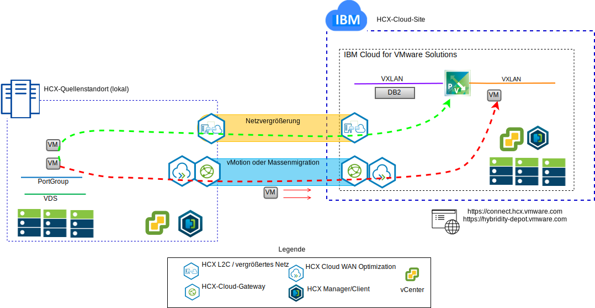
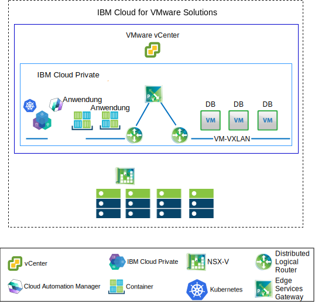

---

copyright:

  years:  2016, 2019

lastupdated: "2019-01-23"

---

# Anwendungsfälle

## Migration von VMware-Workloads auf IBM Cloud

Acme Skateboards möchte die lokale VMware SDDC-Instanz nahtlos zu einer VMware vCenter Server on {{site.data.keyword.cloud}}-Instanz erweitern. Gleichzeitig sollen die Geschäftsabläufe aber nach Möglichkeit nicht unterbrochen und die Ausfallzeiten auf ein Minimum beschränkt werden. Das Rekonfigurieren der Anwendungen für die Ausführung in der Cloud ist keine optimal Lösung.

VMware vCenter Server on {{site.data.keyword.cloud_notm}} with Hybridity Bundle ermöglicht die Erstellung einer nahtlosen Verbindung zwischen vCenter Server-Instanzen und einem lokalen virtuellen VMware-Rechenzentrum.

Die VMware HCX-Komponenten, die als virtuelle Maschinen am vCenter Server-Zielstandort bereitgestellt werden, ermöglichen den Aufbau einer Verbindung mit den VMware HCX-Komponenten, die am lokalen Peerquellenstandort installiert sind.

Abbildung 1. VMware-Erweiterungsservice für Hybrid-Cloud

Die flexible Interkonnektivität zwischen lokalen Standorten und {{site.data.keyword.cloud_notm}} ermöglicht z. B. folgende Funktionalitäten:
- **Einfache Interkonnektivität** – Logische Netzverbindungen können ohne großen Aufwand über eine beliebige physische Verbindung hergestellt werden, z. B. über das öffentliche Internet, ein privates VPN oder eine Direktverbindung.
- **Layer-2-Erweiterung** - Lokale Netze werden in die Cloud erweitert, einschließlich lokaler Teilnetze und IP-Adressierung.
- **Verschlüsselung** - Der Datenaustausch im Netz wird zwischen den beiden Standorten sicher verschlüsselt.
- **Netzoptimierung** - Wählt die beste Verbindung aus und nutzt die Verbindung effizient aus, sodass der Datenaustausch im Netz mit maximaler Geschwindigkeit erfolgt.
- **Datendeduplizierung** - Eine Reduzierung von bis zu 50% des Netzverkehrs ist möglich.
- **Intelligentes Routing** - Wenn eine Workload verlagert wird, kann das "Proximity Routing" den Netzpfad (d. h. Gateway) ändern, sodass der Datenaustausch im Netz das Gateway des Zielstandorts verwendet (anstelle eines "Hairpinnings" zum ursprünglichen Standort).
- **Migration ohne Ausfallzeit** - Ein aktives System kann mit vMotion in die Cloud verlagert werden (oder umgekehrt).
- **Geplante Migration**: Eine beliebige Anzahl von VMs kann an den Zielstandort repliziert und dann zu einem bestimmten Zeitpunkt an diesem Standort aktiviert werden, um die Systeme, die am ursprünglichen Standort ausgeführt werden, zu ersetzen.
- **Migration von Sicherheitsrichtlinien** - Wenn NSX lokal verwendet wird, werden alle Sicherheitsrichtlinien, Firewalls usw. zusammen mit der Workload verlagert.

## Bereitstellung einer Hybridarchitektur

Acme Skateboards für den Prozess der Anwendungsmodernisierung (Journey) eine Hybridarchitektur auf {{site.data.keyword.cloud_notm}} bereitstellen, die sich aus vCenter Server zusammen mit Hybridity Bundle und {{site.data.keyword.icpfull_notm}} zusammensetzt. Dabei sollen die Datenbanken auf VMs ausgeführt werden, die Anwendungen und Webschnittstellen in Containern, und es soll eine gemeinsame Gruppe von Tools für das Netz- und Sicherheitsmanagement verwendet werden.

{{site.data.keyword.vmwaresolutions_short}} stellt eine Automatisierung zur weltweiten Bereitstellung von VMware-Technologiekomponenten in {{site.data.keyword.CloudDataCents_notm}} bereit. Die Architektur besteht aus einer einzelnen Cloudregion und unterstützt die Erweiterung in weitere Cloudregionen, die sich in einem anderen geografischen Gebiet oder in einem anderen {{site.data.keyword.cloud_notm}}-Pod innerhalb desselben Rechenzentrums befinden.

Die Produkte "{{site.data.keyword.icpfull_notm}}" und "Cloud Automation Manager" (CAM) können manuell auf Ihrer lokalen Virtualisierungsplattform bereitgestellt werden und ermöglichen so das Cloud-Management am lokalen Standort. Alternativ werden {{site.data.keyword.icpfull_notm}} und CAM als Serviceerweiterung für eine vorhandene oder neue vCenter Server-Bereitstellung angeboten, wodurch das Cloud-Management über {{site.data.keyword.cloud_notm}} ermöglicht wird.

Das Diagramm unten stellt {{site.data.keyword.icpfull_notm}} bei der Ausführung auf einer vCenter Server-Instanz dar. NSX-V ist mit einem dedizierten Switch/VXLAN, einem DLR (Distributed Logical Switch) und einem ESG (Edge Services Gateway) speziell für das {{site.data.keyword.icpfull_notm}}-Overlay-Netz konfiguriert. Das Routing wird über das ESG für den Zugriff auf das Underlay-Netz eingerichtet.

Mithilfe der {{site.data.keyword.cloud_notm}}-Automatisierung kann Acme Skateboards eine Hybridlösung zur Verfügung stellen, die vCenter Server zur Ausführung der Datenbank-VMs und {{site.data.keyword.icpfull_notm}} auf vCenter Server zur Ausführung der Anwendungen und Front-End-Web-Services in Containern umfasst. NSX bietet ihnen eine gemeinsame Gruppe von Management-Tools für den Netzbetrieb und die Sicherheit im Overlay-Netz.

Weitere Informationen zu NSX-V enthält der Abschnitt [Übersicht über NSX-V](/docs/services/vmwaresolutions/archiref/vcsnsxt/vcsnsxt-overview-ic4vnsxv.html). Zusätzliche Angaben zu vCenter Server- und dem {{site.data.keyword.icpfull_notm}}-Angebot finden Sie unter [vCenter Server und {{site.data.keyword.cloud_notm}} Private](/docs/services/vmwaresolutions/archiref/vcsicp/vcsicp-intro.html).

Abbildung 2. vCenter Server mit {{site.data.keyword.icpfull_notm}}

Dadurch wird eine flexible Verbindung zwischen Standorten und {{site.data.keyword.cloud_notm}} eingerichtet und z. B. folgende Funktionalität zur Verfügung gestellt:
-	**Einfache Interkonnektivität** - Logische Netzverbindungen können ohne großen Aufwand über eine beliebige physische Verbindung hergestellt werden, z. B. über das öffentliche Internet, ein privates VPN oder Direct Link.
-	**Layer-2-Erweiterung** - Lokale Netze werden in die Cloud erweitert, einschließlich lokaler Teilnetze und IP-Adressierung.
-	**Verschlüsselung** - Der Datenaustausch im Netz wird zwischen den beiden Standorten sicher verschlüsselt.
-	**Netzoptimierung** - Wählt die beste Verbindung aus und nutzt die Verbindung effizient aus, sodass der Datenaustausch im Netz mit maximaler Geschwindigkeit erfolgt.
-	**Datendeduplizierung** - Eine Reduzierung von bis zu 50% des Netzverkehrs ist möglich.
-	**Intelligentes Routing** - Wenn eine Workload verlagert wird, kann das "Proximity Routing" den Netzpfad (d. h. Gateway) ändern, sodass der Datenaustausch im Netz das Gateway des Zielstandorts verwendet (anstelle eines "Hairpinnings" zum ursprünglichen Standort).
-	**Migration ohne Ausfallzeit** - Ein aktives System kann mit vMotion in die Cloud verlagert werden (oder umgekehrt).
-	**Geplante Migration**: Eine beliebige Anzahl von VMs kann an den Zielstandort repliziert und dann zu einem bestimmten Zeitpunkt an diesem Standort aktiviert werden, um die Systeme, die am ursprünglichen Standort ausgeführt werden, zu ersetzen.
-	**Migration von Sicherheitsrichtlinien** - Wenn NSX lokal verwendet wird, werden alle Sicherheitsrichtlinien, Firewalls usw. zusammen mit der Workload verlagert.

Mithilfe dieser Lösung konnte Acme Skateboards die VMware-Workloads erfolgreich auf die {{site.data.keyword.cloud_notm}} migrieren - bei minimaler (oder ganz ohne) Ausfallzeit und ohne erneute Anwendungskonfiguration. Weitere Informationen zu vCenter Server with Hybridity Bundle finden Sie auf der Seite [VMware HCX on {{site.data.keyword.cloud_notm}} Solution Architecture](https://www.ibm.com/cloud/garage/files/HCX_Architecture_Design.pdf).

### Zugehörige Links

* [Übersicht über vCenter Server on {{site.data.keyword.cloud_notm}} with Hybridity Bundle](/docs/services/vmwaresolutions/archiref/vcs/vcs-hybridity-intro.html)
