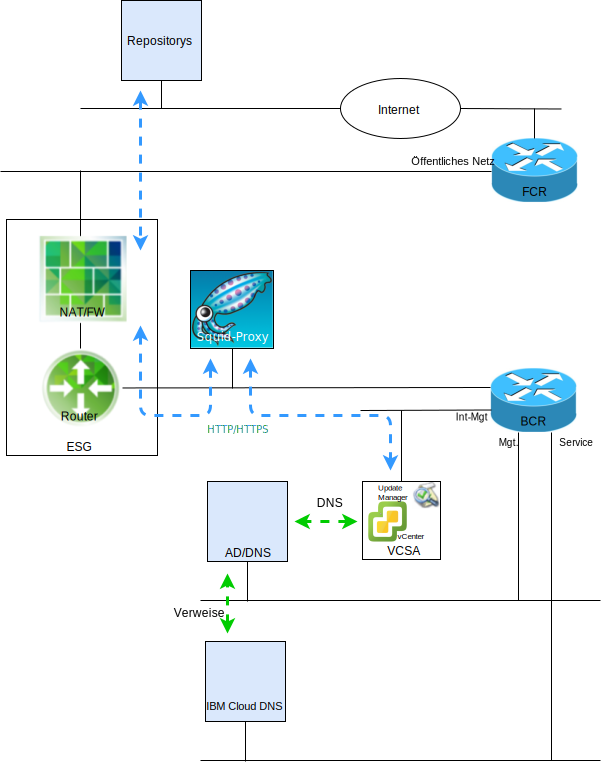

---

copyright:

  years:  2016, 2019

lastupdated: "2019-03-19"

subcollection: vmwaresolutions

---

# Einführung in VMware Update Manager
{: #vum-intro}

Zweck dieses Dokuments ist es, dem Systemadministrator der {{site.data.keyword.vmwaresolutions_full}} vCenter Server-Instanz die entsprechenden Hinweise zur Konfiguration von VMware Update Manager (VUM) zu geben, sodass die vCenter Server-Umgebung immer auf dem aktuellen Stand gehalten werden kann.

VUM ermöglicht ein zentrales, automatisiertes Patch- und Versionsmanagement für VMware vSphere sowie die Ausführung der folgenden Tasks in Ihrer VMware vCenter Server on {{site.data.keyword.cloud_notm}}-Umgebung:
* Anwenden von Upgrades und Patches auf vSphere ESXi-Hosts.
* Installieren und Aktualisieren von Software anderer Anbieter auf den Hosts.
* Durchführen von Upgrades für VM-Hardware, VMware Tools und virtuelle Appliances.

In diesem Dokument werden auch die Prozesse beschrieben, mit deren Hilfe die folgenden Komponenten Ihrer vCenter Serverinstanz verwaltet werden:
* vCenter Server Appliance
* NSX
* vSAN

Dieses Dokument beschreibt die Verwendung einer Proxy-Server-Implementierung auf der Basis von CentOS und Squid, sodass VUM auf die VMware-Repositorys zugreifen kann. Wenn VUM eine Ressource vom Update-Server bei VMware anfordert, wird die Anforderung zuerst an den Proxy-Server gesendet und der Proxy-Server sendet die Anforderung dann über das External Services Gateway (ESG) an den Update-Server. Sobald die Ressource vom Proxy-Server empfangen wurde, sendet er die Ressource an VUM.

Abbildung 1. Übersichtsdiagramm
 

vCenter Server stellt derzeit vSphere 6.5 bereit. Das bedeutet, dass VUM nun in die vCenter Server Appliance (VCSA) integriert ist, und da die VUM-Clientkomponente ein Plug-in ist, das auf dem vSphere Web Client ausgeführt wird, wird sie nach der Bereitstellung von VCSA automatisch aktiviert. VUM erhält jedoch keinen Zugriff auf das Internet, um auf die VMware-Repositorys zuzugreifen.

In dieser dokumentierten Konfiguration wird das umfassende, mit dem Internet verbundene VUM-Bereitstellungsmodell verwendet, das das öffentliche Netz von {{site.data.keyword.cloud_notm}} nutzt, um den Internetzugriff zum Herunterladen von Upgrades und Patches bereitzustellen.

Kunden, die andere Internetverbindungen benötigen, sollten sich über den VMware vSphere Update Manager-Download-Service (UMDS) informieren, der nicht in dieser Veröffentlichung behandelt wird.

VUM kann zwar auch so konfiguriert werden, dass Updates aus einem gemeinsam genutzten Repository importiert oder Patches und Erweiterungen manuell aus einer ZIP-Datei importiert werden können. Diese Themen werden aber in diesem Dokument nicht behandelt.

In vSphere 6.5 ist nicht mehr möglich, VUM während der Installation des VUM-Servers auf einer separaten Windows-Maschine bei einer VCSA zu registrieren; Sie können VUM nicht in einer VM in der vCenter Server-Umgebung bereitstellen.

Dieses Dokument setzt sich aus folgenden Abschnitten zusammen:
* [Übersicht über VMware Update Manager](/docs/services/vmwaresolutions/archiref/vum?topic=vmware-solutions-vum-overview) - Beschreibt den VUM-Prozess und führt Schlüsselbegriffe ein, die erforderlich sind, um die Operationen und die Benutzeroberfläche des Tools zu verstehen.
* **Installation, Konfiguration und Verwendung** - Beschreibt die Schritte, die erforderlich sind, um VUM in einer vCenter Server-Instanz in Betrieb zu nehmen:
  - [Erstkonfiguration](/docs/services/vmwaresolutions/archiref/vum?topic=vmware-solutions-vum-init-config) - eine einmalige Aufgabe, die Folgendes umfasst:
      - Konfiguration der NSX-Vernetzung, um den Zugriff des Proxy-Servers auf das Internet zu ermöglichen.
      - Installation und Konfiguration eines Proxy-Servers, um den Internetzugriff für VUM bereitzustellen.
      - Ersteinrichtung von VUM für die Verwendung des Proxy-Servers.
  - [Sammeln von Metadaten](/docs/services/vmwaresolutions/archiref/vum?topic=vmware-solutions-vum-metadata) - VUM lädt Metadaten zu den Upgrades, Patches oder Erweiterungen über einen vordefinierten automatischen Prozess herunter, den Sie ändern können. In regelmäßigen konfigurierbaren Intervallen nimmt VUM Kontakt zu VMware oder Drittanbieterquellen auf, um die aktuellen Metadaten zu verfügbaren Upgrades, Patches oder Erweiterungen zu erfassen.
  - [Erstellen von Baselines](/docs/services/vmwaresolutions/archiref/vum?topic=vmware-solutions-vum-baselines) - Sie können die vordefinierten Baselines und Baselinegruppe verwenden oder neue angepasste erstellen. Baselines und Baselinegruppen werden dann an Bestandsobjekte angehängt.
  - [Prüfen und Auswerten](/docs/services/vmwaresolutions/archiref/vum?topic=vmware-solutions-vum-scanning) - Die Bestandsobjekte werden geprüft und die Ergebnisse ausgewertet, um zu ermitteln, wie sie den Baselines und Baselinegruppen entsprechen. Die Prüfergebnisse können anhand von Textsuche, Gruppenauswahl, Baselineauswahl und Konformitätsstatusauswahl gefiltert werden.
  - [Staging und Korrektur](/docs/services/vmwaresolutions/archiref/vum?topic=vmware-solutions-vum-staging) - Patches und Erweiterungen können optional vor der Korrektur zwischengespeichert ("staged") werden, um sicherzustellen, dass sie auf den Host heruntergeladen werden. Bei der Korrektur ("remediation") wendet VUM die Patches, Erweiterungen und Upgrades auf die Bestandsobjekte an.

In diesem Dokument wird davon ausgegangen, dass Sie eine primäre vCenter Server-Instanz oder eine Reihe von separaten primären vCenter Server-Instanzen bereitgestellt haben. Wenn Sie primäre und sekundäre vCenter Server-Instanzen bereitgestellt haben, die Single Sign-on (SSO) verwenden, finden Sie weitere Informationen hierzu unter [Über SSO angebundene vCenter](/docs/services/vmwaresolutions/archiref/vum?topic=vmware-solutions-vum-updating-vcsa).

Wenn Sie eine vCenter Server-Instanz mithilfe von vSAN bereitgestellt haben, lesen Sie zunächst die Informationen im Abschnitt [vSAN-Cluster aktualisieren](/docs/services/vmwaresolutions/archiref/vum?topic=vmware-solutions-vum-updating-vsan).

Wenn Sie die Automatisierung des {{site.data.keyword.cloud_notm}}-Infrastrukturmanagements aktualisieren möchten, verwenden Sie die {{site.data.keyword.vmwaresolutions_short}}-Konsole.

Über die [{{site.data.keyword.vmwaresolutions_short}}-Konsole](https://console.cloud.ibm.com/infrastructure/vmware-solutions/console) können Sie die folgenden Aktionen ausführen:
*	Durchführen von Upgrades für Lizenzen, z. B. Upgrade von NSX Base auf eine andere Version
*	Initiieren von Updates für die vCenter Server-Plattform, z. B. Umstellen auf Version 2.5
*	Anzeigen des Status von Updates
*	Anzeigen der installierten Updates

Diese Funktion ermöglicht die automatisierte Aktualisierung nur für die Managementkomponenten der vCenter Server-Instanzen. VMware-Produktupdates müssen mithilfe der Prozeduren angewendet werden, die in diesem Dokument beschrieben sind.

## Zugehörige Links
{: #vum-intro-related}

* [VMware HCX on {{site.data.keyword.cloud_notm}} Solution Architecture](/docs/services/vmwaresolutions/services?topic=vmware-solutions-hcx-archi-intro#hcx-archi-intro)
* [VMware Solutions on	{{site.data.keyword.cloud_notm}} Digital Technical Engagement](https://ibm-dte.mybluemix.net/ibm-vmware) (Demonstrationen)
