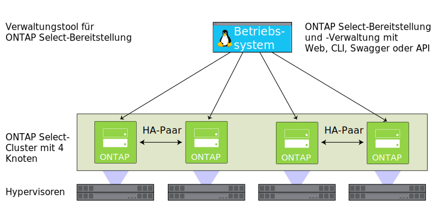

---

copyright:

  years:  2016, 2019

lastupdated: "2019-01-24"

---

{:tip: .tip}
{:note: .note}
{:important: .important}

# Übersicht über NetApp ONTAP Select

Hier erhalten Sie Informationen zur Architektur und zu den Komponenten der Bereitstellung von NetApp ONTAP Select on {{site.data.keyword.cloud}}.

## Architektur von NetApp ONTAP Select

Das Produktangebot von NetApp ONTAP Select on {{site.data.keyword.cloud_notm}} ergänzt die Bereitstellung von vCenter Server durch Services für die Speichervirtualisierung.

In der folgenden Abbildung ist die Gesamtarchitektur von NetApp ONTAP Select für die vCenter Server-Bereitstellung dargestellt.

Abbildung 1. Allgemeine Architektur von NetApp ONTAP Select on {{site.data.keyword.cloud_notm}}

### Physische Infrastruktur

Auf dieser Schicht wird die physische Infrastruktur (Rechen-, Netz- und Speicherressourcen) bereitgestellt, die von der virtuellen Infrastruktur genutzt wird.

### Virtualisierungsinfrastruktur (Rechenressourcen, Netz und NetApp ONTAP Select)

Diese Schicht virtualisiert die physische Infrastruktur durch die folgenden VMware-Produkte und das Produkt "NetApp ONTAP Select":
* VMware vSphere virtualisiert die physischen Rechenressourcen.
* VMware NSX ist die Netzvirtualisierungsplattform, die logische Netzkomponenten und virtuelle Netze bereitstellt.
* NetApp ONTAP Select on {{site.data.keyword.cloud_notm}} stellt einen ONTAP Select-Cluster bereit, der aus vier virtuellen Maschinen (VMs) für die vier Hosts besteht.

In der folgenden Abbildung sind die Komponenten der NetApp ONTAP Select-Bereitstellung dargestellt.

Abbildung 2. NetApp ONTAP Select-Komponenten

### Virtualisierungsmanagement

Die Virtualisierungsmanagementschicht setzt sich aus den folgenden Komponenten zusammen:

* vCenter Server Appliance (vCSA) mit integriertem Platform Services Controller (PSC)
* NSX-
Manager
* Zwei NSX Edge Services Gateways (ESGs)
* Drei NSX-Controller
* Virtuelle Serverinstanz (VS) für IBM CloudDriver

NetApp ONTAP Select wird in einem VMware-Cluster ausgeführt und virtualisiert den lokalen Speicher auf den Hosts. NetApp ONTAP Select wird im dedizierten Modell bereitgestellt; hierbei wird davon ausgegangen, dass keine anderen Workloads den Cluster in diesem Modell gemeinsam nutzen. Der Umfang der Hardwarekonfiguration des Produktangebots "NetApp ONTAP Select on {{site.data.keyword.cloud_notm}}" richtet sich daher nur nach den Voraussetzungen für NetApp ONTAP Select.

## Technische Spezifikationen für NetApp ONTAP Select-Instanzen

Ihre NetApp ONTAP Select-Instanz enthält die folgenden Komponenten.

Verfügbarkeit und Preisgestaltung standardisierter Konfigurationen können abhängig vom {{site.data.keyword.CloudDataCent_notm}}, das für die Bereitstellung ausgewählt wird, variieren.
{:note}

### Speicher

* Wählen Sie zwischen **Hohe Leistung (M = Mittel)**, **Hohe Leistung (L = Groß)** und **Hohe Kapazität**
* RAID 5 mit Hot-Spare-Einheit
* Zwei 1-TB-SATA-Laufwerke ESXi OS - RAID 1
* Managementdatenspeicher - 500 GB für Management-VMs

### Voreingestellte Konfigurationen

Vier {{site.data.keyword.cloud_notm}} {{site.data.keyword.baremetal_short}}-Instanzen mit den folgenden Konfigurationsoptionen werden zur Verfügung gestellt:
* **Hohe Leistung (M = Mittel)** - Premium-Lizenz / Dual Intel Xeon E5-2650 V4 (24 Kerne insgesamt, 2,2 GHz) / 128 GB RAM / Kapazität von 22 1,9-TB-SSD-Laufwerken pro Knoten / Effektive Kapazität eines Clusters mit 4 Knoten - 59 TB
* **Hohe Leistung (L = Groß)** - Premium-Lizenz / Dual Intel Xeon E5-2650 V4 (24 Kerne insgesamt, 2,2 GHz) / 128 GB RAM / Kapazität von 22 3,8-TB-SSD-Laufwerken pro Knoten / Effektive Kapazität eines Clusters mit 4 Knoten - 118 TB
* **Hohe Kapazität** - Standard-Lizenz / Dual Intel Xeon E5-2650 V4 (24 Kerne insgesamt, 2,2 GHz) / 64 GB RAM / Kapazität von 34 4-TB-SATA-Laufwerken pro Knoten / Effektive Kapazität eines Clusters mit 4 Knoten - 190 TB

3,8-TB-Solid-State-Platten (SSD) werden unterstützt, wenn sie in einem Rechenzentrum allgemein verfügbar gemacht werden.
{:note}

### Hardware

* Drei RAM- und Plattenoptionen: **Hohe Leistung (mittel)**, **Hohe Leistung (groß)** und **Hohe Kapazität**
* Zwei 1-TB-SATA-Laufwerke ESXi OS
* 1 RAID-Plattencontroller
* VMware Server Virtualization 6.5

### Vernetzung

* 10-Gbps-Uplinks für öffentliche und private Netze
* 3 VLANs (virtuelle LANs): 1 öffentliches VLAN und 2 private VLANs
* 1 sicheres VMware NSX Edge Services Gateway

### Virtual Server-Instanzen

Zwei VSIs (Virtual Server-Instanzen):
* 1 VSI für Microsoft Active Directory (AD) und DNS-Services
* 1 VSI für IBM CloudBuilder (wird nach vollständiger Bereitstellung der Instanz beendet)

### Lizenzen und Gebühren

*  Vier Lizenzen für Premium oder Standard Edition von NetApp ONTAP Select (vom Benutzer bereitgestellt)
*  VMware vSphere 6.5 Enterprise Plus Edition
*  VMware vCenter Server 6.5
*  VMware NSX Service Providers Edition (Base, Advanced oder Enterprise) 6.4
*  Support- und Servicegebühren (1 Lizenz pro Knoten)

Sie dürfen die {{site.data.keyword.vmwaresolutions_short}}-Komponenten, die in Ihrem {{site.data.keyword.cloud_notm}}-Konto erstellt werden, nur über die {{site.data.keyword.vmwaresolutions_short}}-Konsole und nicht im {{site.data.keyword.slportal}} oder über ein anderes Verfahren außerhalb der Konsole verwalten. Wenn Sie diese Komponenten außerhalb der {{site.data.keyword.vmwaresolutions_short}}-Konsole ändern, werden die Änderungen nicht mit der Konsole synchronisiert.
{:important}

**VORSICHT:** Wenn Sie {{site.data.keyword.vmwaresolutions_short}}-Komponenten (die in Ihrem {{site.data.keyword.cloud_notm}}-Konto installiert wurden, als Sie die Instanz bestellt haben) außerhalb der {{site.data.keyword.vmwaresolutions_short}}-Konsole verwalten, kann dies zur Instabilität Ihrer Umgebung führen. Zu diesen Managementaktivitäten gehören:
*  Komponenten hinzufügen, ändern, zurückgeben, entfernen oder ausschalten
*  Instanzkapazität durch das Hinzufügen oder Entfernen von ESXi-Servern erweitern oder verringern
*  Services erneut starten

   Ausgenommen von diesen Aktivitäten ist unter anderem das Management der gemeinsam genutzten Dateiressourcen für gemeinsam genutzten Speicher im {{site.data.keyword.slportal}}. Hierzu gehört das Bestellen, Löschen (mit möglicher Auswirkung auf angehängte Datenspeicher), Berechtigen und Anhängen von gemeinsam genutzten Dateiressourcen für gemeinsam genutzten Speicher.

## Hinweise zur Firewall

Wenn Sie Firewalls verwenden, müssen Sie Regeln für die gesamte Kommunikation aus der {{site.data.keyword.IBM}} CloudDriver-VSI (VSI - virtuelle Serverinstanz) und den SDDC Manager-VMs konfigurieren. Diese Regeln müssen es zulassen, dass alle Protokolle an den IP-Adressen `10.0.0.0/8` und `161.26.0.0/16` kommunizieren können. Beispiele für solche Firewalls sind NSX Distributed Firewalls (DFW) oder Vyatta-Firewalls.

### Zugehörige Links

* [NetApp ONTAP Select-Instanzen planen](/docs/services/vmwaresolutions/netapp/np_planning.html#requirements-and-planning-for-netapp-ontap-select-instances)
* [NetApp ONTAP Select-Instanzen bestellen](/docs/services/vmwaresolutions/netapp/np_orderinginstances.html)
* [Übersicht über vCenter Server](/docs/services/vmwaresolutions/vcenter/vc_vcenterserveroverview.html)
* [NetApp ONTAP Documentation Center](http://docs.netapp.com/ontap-9/index.jsp?topic=%2Fcom.netapp.doc.exp-clus-peer%2Fhome.html){:new_window}
