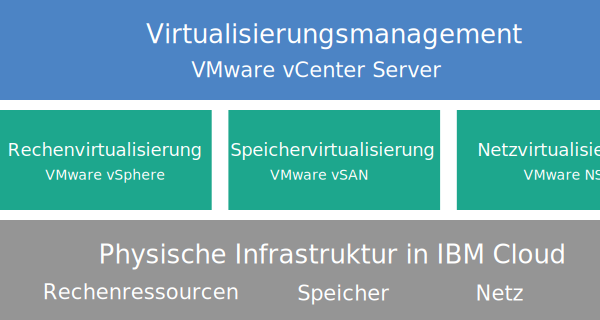

---

copyright:

  years:  2016, 2019

lastupdated: "2019-02-14"

---

{:tip: .tip}
{:note: .note}
{:important: .important}

# Übersicht über Cloud Foundation
{: #sd_cloudfoundationoverview}

Wenn Sie VMware Cloud Foundation on {{site.data.keyword.cloud}} bestellen, wird automatisch eine vollständige VMware-Umgebung bereitgestellt. Die Basisbereitstellung besteht aus vier {{site.data.keyword.cloud_notm}} {{site.data.keyword.baremetal_short}}-Instanzen mit vorinstalliertem VMware Cloud Foundation-Stack, deren Konfiguration eine einheitliche Plattform für SDDC (Software-Defined Data Center, softwaredefiniertes Rechenzentrum) bereitstellt. Cloud Foundation integriert nativ VMware vSphere, VMware NSX sowie VMware Virtual SAN und seine Architektur basiert auf VMware-geprüften Designs.

## Cloud Foundation-Architektur
{: #sd_cloudfoundationoverview-archi}

In der folgenden Abbildung sind die Gesamtarchitektur und die Komponenten der Cloud Foundation-Bereitstellung dargestellt.

Abbildung 1. Cloud Foundation-Architektur

### Physische Infrastruktur
{: #sd_cloudfoundationoverview-physical-infras}

Auf dieser Schicht wird die physische Infrastruktur (Rechen-, Speicher- und Netzressourcen) bereitgestellt, die von der virtuellen Infrastruktur genutzt wird.

### Virtualisierungsinfrastruktur (Rechenressourcen, Speicher und Netz)
{: #sd_cloudfoundationoverview-virtualization-infras}

Diese Schicht virtualisiert die physische Infrastruktur durch verschiedene VMware-Produkte:
* VMware vSphere virtualisiert die physischen Rechenressourcen.
* VMware Virtual SAN (vSAN) stellt auf der Basis des Speichers in den physischen Servern einen softwaredefinierten gemeinsam genutzten Speicher zur Verfügung.
* VMware NSX ist die Netzvirtualisierungsplattform, die logische Netzkomponenten und virtuelle Netze bereitstellt.

### Virtualisierungsmanagement
{: #sd_cloudfoundationoverview-virtualization-mgmt}

Diese Schicht besteht aus vCenter Server und stellt die Managementschicht für die virtualisierte Umgebung dar. Zum Verwalten der von IBM gehosteten VMware-Umgebung können Sie die geläufigen und mit der vSphere-API kompatiblen Tools und Scripts verwenden.

In der {{site.data.keyword.vmwaresolutions_short}}-Konsole können Sie die Kapazität Ihrer Instanzen mithilfe der Funktion zum Hinzufügen und Entfernen von ESXi-Servern erweitern und verringern. Darüber hinaus sind Funktionen für das Lebenszyklusmanagement wie das Anwenden von Updates und das Durchführen von Upgrades für die VMware-Komponenten in der gehosteten Umgebung verfügbar.

Weitere Informationen zur Architektur enthält der Abschnitt [Lösungsübersicht](/docs/services/vmwaresolutions/archiref/solution?topic=vmware-solutions-solution_overview).

## Technische Spezifikationen für Cloud Foundation-Instanzen
{: #technical-specifications-for-cloud-foundation-instances}

Ihre Cloud Foundation-Instanz enthält die folgenden Komponenten.

Die für Hardware, Netzbetrieb, virtuelle Maschinen und Speicher anfallenden Gebühren können abhängig vom {{site.data.keyword.CloudDataCent_notm}}, das für die Bereitstellung ausgewählt ist, variieren.
{:note}

### Bare Metal Server
{: #sd_cloudfoundationoverview-bare-metal}

Sie können {{site.data.keyword.cloud_notm}} {{site.data.keyword.baremetal_short}}-Instanzen mit einer der folgenden Konfigurationen bestellen:
*  **Skylake**: 2-CPU Intel Skylake Generation-Server (Intel Xeon 4100/5100/6100 Series) mit dem ausgewählten CPU-Modell und der RAM-Größe.   
*  **Broadwell**: 2-CPU Intel Broadwell Generation-Server (Intel Xeon E5-2600/E7-4800 Series) mit dem ausgewählten CPU-Modell und der RAM-Größe.

Wenn Sie vSAN-Speicher verwenden möchten, sind für die Konfiguration vier {{site.data.keyword.baremetal_short}}-Instanzen erforderlich.
{:note}

### Vernetzung
{: #sd_cloudfoundationoverview-networking}

Die folgenden Netzkomponenten werden bestellt:
* 10-Gbps-Uplinks für öffentliche und private Netze
* 3 VLANs (virtuelle LANs): 1 öffentliches VLAN und 2 private VLANs
* Sicheres VMware NSX Edge Services Gateway (ESG) für die Management-Services für abgehenden HTTPS-Managementdatenverkehr, das von IBM im Rahmen der Managementnetztypologie bereitgestellt wird. Über dieses ESG kommunizieren virtuelle IBM Management-Maschinen mit bestimmten externen IBM Managementkomponenten, die mit der Automatisierung zusammenhängen. Weitere Information finden Sie im Abschnitt [Stellt das NSX Edge für Management-Services ein Sicherheitsrisiko dar?](/docs/services/vmwaresolutions/vmonic?topic=vmware-solutions-faq#does-the-management-services-nsx-edge-pose-a-security-risk-)

  Dieses ESG ist für Sie weder zugänglich, noch können Sie es verwenden. Falls Sie es ändern, sind Sie möglicherweise nicht in der Lage, die Cloud Foundation-Instanz über die {{site.data.keyword.vmwaresolutions_short}}-Konsole zu verwalten. Außerdem führt die Verwendung einer Firewall oder die Inaktivierung der ESG-Kommunikation mit den externen IBM Managementkomponenten dazu, dass {{site.data.keyword.vmwaresolutions_short}} unbrauchbar wird.
  {:important}

* Die Funktion für EVC (Enhanced vMotion Compatibility) wird automatisch aktiviert, wenn Sie über einen vorhandenen Cluster mit ESXi-Servern verfügen, die von der aktuellen VMware vSphere-Version unterstützt werden. EVC bietet vMotion-Kompatibilität für alle ESXi-Server in einem Cluster, indem sichergestellt wird, dass alle ESXi-Server in einem Cluster die gleiche Gruppe von CPU-Funktionen für virtuelle Maschinen bereitstellen. Mithilfe von EVC können die virtuellen Maschinen zwischen allen ESXi-Servern im Cluster migriert werden. Dies gilt auch dann, wenn die eigentlichen CPUs auf den ESXi-Servern unterschiedlich sind.

### Virtual Server-Instanzen
{: #sd_cloudfoundationoverview-vsi}

Die folgenden VSIs (Virtual Server-Instanzen) werden bestellt:
* 1 VSI für Microsoft Active Directory (AD) und DNS-Services Die virtuelle Serverinstanz (VSI) ist für die Unterstützung von Konfigurationen mit mehreren Standorten erforderlich. Spezifikation dieser VSI: Windows 2012 R2 (8 GB RAM / 2 CPU-Kerne / 100 GB Plattenspeicher / Duale 1-Gbps-Uplinks für private Netze).
* 1 VSI für IBM CloudBuilder (wird nach vollständiger Bereitstellung der Instanz beendet).
* (Bei Bestellung von Veeam on {{site.data.keyword.cloud_notm}}) 1 VSI für den Veeam-Sicherungsservice wird bestellt.

### Speicher
{: #sd_cloudfoundationoverview-storage}

Abhängig von der von Ihnen ausgewählten {{site.data.keyword.baremetal_short}}-Konfiguration wird der folgende Speicher bestellt:
* 2 1-TB-SATA-Bootlaufwerke
* 2 Solid-State-Cacheplatten mit 960 GB
* 1 RAID-Plattencontroller
* Nur bei Konfigurationen des Typs **Skylake** and **Broadwell**: Sie können die Anzahl der Plattenlaufwerke sowie Plattentyp und Kapazität gemäß Ihren Anforderungen festlegen. Darüber hinaus verfügen Sie über die Option für "Hohe Leistung mit Intel Optane", die zwei zusätzliche Kapazitätsplattenpositionen für eine Gesamtzahl von 10 Kapazitätsplatten bereitstellt. Die Option für "Hohe Leistung mit Intel Optane" hängt vom CPU-Modell ab.

### Lizenzen (von IBM bereitgestellt oder eigene) und Gebühren
{: #sd_cloudfoundationoverview-license-and-fee}

* 4 Lizenzen für VMware vSphere Enterprise Plus 6.5u1
* 4 Lizenzen für VMware vCenter Server 6.5
* 4 Lizenzen für VMware NSX Enterprise 6.3
* 4 Lizenzen für VMware vSAN Advanced oder Enterprise 6.6
* 4 Lizenzen für SDDC Manager (nur von IBM bereitgestellt)
* 4 Support- und Servicegebühren

## Technische Spezifikationen für Cloud Foundation-Erweiterungsknoten
{: #sd_cloudfoundationoverview-expansion-node-specs}

Jeder Cloud Foundation-Erweiterungsknoten stellt folgende Komponenten in Ihrem {{site.data.keyword.cloud_notm}}-Konto mit den entsprechenden anfallenden Gebühren bereit.

### Hardware für Erweiterungsknoten
{: #sd_cloudfoundationoverview-expansion-node-hardware}

1 {{site.data.keyword.cloud_notm}} Bare Metal Server mit der unter [Technische Spezifikationen für Cloud Foundation-Instanzen](/docs/services/vmwaresolutions/sddc?topic=vmware-solutions-sd_cloudfoundationoverview#technical-specifications-for-cloud-foundation-instances) aufgeführten Konfiguration.

### Lizenzen und Gebühren für Erweiterungsknoten
{: #sd_cloudfoundationoverview-expansion-node-license-and-fee}

* 1 Lizenz für VMware vSphere Enterprise Plus 6.5u1
* 1 Lizenz für VMware vCenter Server 6.5
* 1 Lizenz für VMware NSX Enterprise 6.3
* 1 Lizenz für VMware vSAN Advanced oder Enterprise 6.6
* 1 Lizenz für SDDC Manager
* 1 Support- und Servicegebühr

Sie dürfen die {{site.data.keyword.vmwaresolutions_short}}-Komponenten, die in Ihrem {{site.data.keyword.cloud_notm}}-Konto erstellt werden, nur über die {{site.data.keyword.vmwaresolutions_short}}-Konsole und nicht im {{site.data.keyword.slportal}} oder über ein anderes Verfahren außerhalb der Konsole verwalten. Wenn Sie diese Komponenten außerhalb der {{site.data.keyword.vmwaresolutions_short}}-Konsole ändern, werden die Änderungen nicht mit der Konsole synchronisiert.
{:important}

**VORSICHT:** Wenn Sie {{site.data.keyword.vmwaresolutions_short}}-Komponenten, die in Ihrem {{site.data.keyword.cloud_notm}}-Konto installiert wurden, als Sie die Instanz bestellt haben, außerhalb der {{site.data.keyword.vmwaresolutions_short}}-Konsole verwalten, kann dies zur Instabilität Ihrer Umgebung führen. Zu diesen Managementaktivitäten gehören:
*  Komponenten hinzufügen, ändern, zurückgeben oder entfernen
*  Instanzkapazität durch das Hinzufügen oder Entfernen von ESXi-Servern erweitern oder verringern
*  Komponenten ausschalten
*  Services erneut starten

   Ausgenommen von diesen Aktivitäten ist unter anderem das Management der gemeinsam genutzten Dateiressourcen für gemeinsam genutzten Speicher im {{site.data.keyword.slportal}}. Hierzu gehört das Bestellen, Löschen (mit möglicher Auswirkung auf angehängte Datenspeicher), Berechtigen und Anhängen von gemeinsam genutzten Dateiressourcen für gemeinsam genutzten Speicher.

## Zugehörige Links
{: #sd_cloudfoundationoverview-related}

* [Softwareteileliste für Cloud Foundation](/docs/services/vmwaresolutions/sddc?topic=vmware-solutions-sd_bom)
* [Cloud Foundation-Instanzen planen](/docs/services/vmwaresolutions/sddc?topic=vmware-solutions-sd_planning)
* [Cloud Foundation-Instanzen bestellen](/docs/services/vmwaresolutions/sddc?topic=vmware-solutions-sd_orderinginstance)
* [VMware vSphere Documentation Center](https://pubs.vmware.com/vsphere-60/index.jsp){:new_window}
* [VMware NSX 6 Documentation Center](https://pubs.vmware.com/NSX-6/index.jsp){:new_window}
* [Häufig gestellte Fragen zur Kompatibilität von EVC und CPU](https://kb.vmware.com/s/article/1005764)
