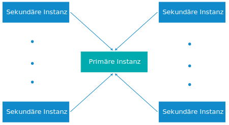

---

copyright:

  years:  2016, 2019

lastupdated: "2019-03-13"

subcollection: vmwaresolutions

---

{:tip: .tip}
{:note: .note}
{:important: .important}

# Konfiguration mit mehreren Standorten für Cloud Foundation-Instanzen
{: #sd_multisite}

Mit {{site.data.keyword.vmwaresolutions_full}} können Sie Instanzen an unterschiedlichen Standorten bereitstellen und zügig betriebsbereit machen.

## Hinweise
{: #sd_multisite-notes}

* VMware Cloud Foundation- und VMware vCenter Server-Instanzen können nicht in einer Konfiguration mit mehreren Standorten verbunden werden.
* Instanzen, die in V2.0 bereitgestellt wurden, können nicht mit Instanzen aus früheren Releases verbunden werden, selbst wenn für diese ein Upgrade auf V2.0 durchgeführt wurde.

## Komponenten von Bereitstellungen mit mehreren Standorten
{: #sd_multisite-deployment-components}

Eine Bereitstellung mit mehreren Standorten besteht aus den folgenden Komponenten.

* **Primäre Instanz**: Die primäre VMware Cloud Foundation-Instanz weist die folgende Konfiguration auf:
  *  Microsoft Active Directory (AD) und DNS-Rootdomäne
  *  Cloud Foundation-Unterdomäne
  *  SSO-Domäne
  *  SSO-Standortname
* **Sekundäre Instanz(en)**: Eine oder mehrere sekundäre Cloud Foundation-Instanzen sind mit der primären Instanz verbunden und weisen die folgende Konfiguration auf:
   *  SSO-Standortname
   *  Mit der Rootdomäne der primären Instanz verknüpfte DNS-Unterdomäne
   *  Konfigurierte DNS- und AD-Replikation zwischen den virtuellen AD-Maschinen in der primären und der sekundären Instanz
   *  Bereitstellung und Konfiguration von PSC (Platform Services Controller) zur Replikation mit PSC in der primären Instanz
   *  Konfiguration von VMware vCenter in den sekundären Instanzen mit erweitertem Verbindungsmodus zu vCenter in der primären Instanz

## Cloud Foundation-Bereitstellung mit mehreren Standorten
{: #sd_multisite-deployment}

Die Funktion für die Konfiguration mit mehreren Standorten verwendet eine Hub- und Peripherietopologie mit einem primären Standort und maximal sieben sekundären Standorten. Es wird nur eine einzige Schicht von Standorten unterstützt; Sie können also keine nachfolgenden Standorte konfigurieren, die mit anderen sekundären Standorten verknüpft sind. In einer Konfiguration mit mehreren Standorten können insgesamt 128 ESXi-Server in allen Instanzen verwendet werden.

Falls Ihre Konfiguration eine Bereitstellung mit mehreren Standorten mit mehr als 128 ESXi-Servern erforderlich macht, bitten Sie den IBM Support um Unterstützung. Weitere Informationen finden Sie unter [Kontaktaufnahme mit dem IBM Support](/docs/services/vmwaresolutions/vmonic?topic=vmware-solutions-trbl_support).
{:note}

Die folgende Abbildung zeigt eine vollständige Cloud Foundation-Bereitstellung mit mehreren Standorten.

Abbildung 1. Cloud Foundation-Bereitstellung mit mehreren Standorten

Das Modell enthält die folgenden Schichten:

* **Primäre Instanz**: In einer Konfiguration mit mehreren Standorten wurde die erste Instanz während des Bestellprozesses für die Instanz als primäre Instanz definiert.
* **Sekundäre Instanzen**: In einer Konfiguration mit mehreren Standorten wurden die Instanzen, die der primären Instanz zugeordnet sind, während des Bestellprozesses als sekundäre Instanzen definiert.

Sie können maximal 8 Instanzen (1 primäre und 7 sekundäre) in einer Konfiguration mit mehreren Standorten bereitstellen.

Das Löschen von Cloud Foundation-Instanzen, die Teil einer Konfiguration mit mehreren Standorten sind, erfordert eine besondere Planung. Weitere Informationen hierzu finden Sie im Abschnitt [Cloud Foundation-Instanzen in Konfiguration mit mehreren Standorten löschen](/docs/services/vmwaresolutions/sddc?topic=vmware-solutions-sd_deletinginstance_multi).
{:note}

## Zugehörige Links
{: #sd_multisite-related}

* [Assign Primary Role to NSX Manager](https://pubs.vmware.com/NSX-62/topic/com.vmware.nsx-cross-vcenter-install.doc/GUID-44E8AE16-BA3F-4DD9-B582-FC1E137E6CFC.html){:new_window}
* [Configuring Secondary NSX Managers](https://pubs.vmware.com/NSX-62/topic/com.vmware.nsx-cross-vcenter-install.doc/GUID-9E48BC57-15E3-49C7-8BC5-F94ED8918BBE.html){:new_window}
* [Active Directory Trusts supported with VMware vCenter Single Sign-On](https://kb.vmware.com/kb/2064250){:new_window}
* [Sichere Verbindung für private VMware-Workloads in {{site.data.keyword.cloud_notm}} herstellen](https://www.ibm.com/developerworks/library/se-securely-connect-private-vmware-workloads-ibm-cloud/index.html){:new_window}
