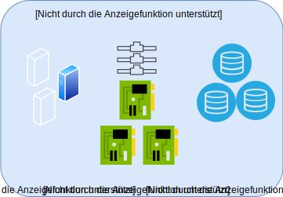

---

copyright:

  years:  2019

lastupdated: "2019-08-06"

keywords: vmware solutions shared, get started shared, tech specs shared

subcollection: vmware-solutions

---

{:external: target="_blank" .external}
{:tip: .tip}
{:note: .note}
{:important: .important}

# IBM Cloud for VMware Solutions Shared - Übersicht
{: #shared_overview}

{{site.data.keyword.vmwaresolutions_full}} Shared wird als experimentelles Angebot bereitgestellt.
{:note}

Mit VMware Virtual Data Centers können Sie VMware-Workloads schnell und nahtlos in die Cloud über Ihrer professionell verwalteten VMware-Infrastruktur migrieren oder bereitstellen. IBM stellt eine bedarfsgesteuerte VMware Cloud-Computing-Plattform für Self-Service mit vCloud Director bereit, die unter {{site.data.keyword.cloud_notm}} ausgeführt wird. Dieses nutzungsabhängige Infrastructure as a Service (IaaS)-Angebot ermöglicht es Benutzern, nach Bedarf bestimmte vCPU, Speicher, vRAM, Netzwerke und IPs zu nutzen.

{{site.data.keyword.vmwaresolutions_short}} verfügt über drei Typen von Infrastructure as a Service (IaaS)-Abonnementservices:
- Reserviertes virtuelles Multi-Tenant-Rechenzentrum
- Nutzungsabhängiges virtuelles Multi-Tenant-Rechenzentrum
- Dediziertes virtuelles Single-Tenant-Rechenzentrum

Kunden verwalten den Lebenszyklus virtueller Rechenzentren mit dem {{site.data.keyword.vmwaresolutions_short}}-Angebot. Die folgenden Funktionen werden unterstützt, entweder über die Webbenutzerschnittstelle oder die öffentliche API:
- Erstellung eines virtuellen Rechenzentrums
- Elastizität eines virtuellen Rechenzentrums
- Löschen eines virtuellen Rechenzentrums
- Hinzufügen und Entfernen von VMware-Services
- Bedarfsgesteuerte Windows-Lizenzierung
- Bedarfsgesteuerte Red Hat-Lizenzierung

Alle drei Angebote für virtuelle {{site.data.keyword.cloud_notm}}-Rechenzentren umfassen standardmäßig fünf öffentliche IP-Adressen in einer NSX Edge Service Gateway-Instanz mit unbegrenztem Ingress über das öffentliche Netz.

Bei virtuellen Rechenzentren fallen Gebühren für die folgenen Komponenten an:
- Speicherzuordnungen mit gestaffelter Preisstruktur auf Grundlage der Speicherleistung
- Nutzung der virtuellen CPU
- Nutzung des virtuellen Speichers
- Egress für öffentlichen Netzbetrieb
- Genutzte Lizenzen für kommerzielle Betriebssysteme
- Optionale VMware-Services

## IBM Cloud for VMware Solutions Shared - Architektur
{: #shared_overview-archi}

In der folgenden Abbildung sind die allgemeine Architektur und die Komponenten einer {{site.data.keyword.vmwaresolutions_short}} Shared-Bereitstellung dargestellt.

### VMware vCloud Director
{: #shared_overview-vcloud-dir}

Diese Schicht stellt die Managementschnittstelle dar. VMware® vCloud Director bietet rollenbasierten Zugriff auf ein webbasiertes Tenant-Portal, über das die Mitglieder einer Organisation mit den Ressourcen der Organisation interagieren und somit vApps und virtuelle Maschinen (VMs) erstellen und mit diesen arbeiten können.

### Organisation
{: #shared_overview-org}

Eine Organisation ist eine Verwaltungseinheit für eine Sammlung von Benutzern, Gruppen und Rechenressourcen. Benutzer authentifizieren sich auf Organisationsebene und geben Berechtigungsnachweise an, die von einem Organisationsadministrator zu dem Zeitpunkt eingerichtet wurden, als der Benutzer erstellt oder importiert wurde. Organisationsadministratoren verwalten Benutzer, Gruppen und Kataloge von Organisationen.

### Benutzer und Richtlinien
{: #shared_overview-users-policies}

Eine Organisation kann eine beliebige Anzahl von Benutzern und Gruppen enthalten. Benutzer können lokal vom Organisationsadministrator erstellt oder aus einem Verzeichnisservice wie LDAP importiert werden. Berechtigungen innerhalb einer Organisation werden durch die Zuordnung von Rechten und Rollen zu Benutzern und Gruppen gesteuert.

### Kataloge
{: #shared_overview-cat}

Organisationen verwenden Kataloge zum Speichern von vApp-Vorlagen und Mediendateien. Die Mitglieder einer Organisation, die Zugriff auf einen Katalog haben, können die vApp-Vorlagen und Mediendateien des Katalogs verwenden, um ihre eigenen vApps zu erstellen. Organisationsadministratoren können Elemente aus öffentlichen Katalogen in ihren Organisationskatalog kopieren.

### Virtuelle Rechenzentren
{: #shared_overview-vc}

Ein virtuelles Datenzentrum einer Organisation stellt Ressourcen für die Organisation bereit. Virtuelle Datenzentren bieten eine Umgebung, in der virtuelle Systeme gespeichert, bereitgestellt und betrieben werden können. Zudem bieten sie Speicher für virtuelle CD- und DVD-Medien. Eine Organisation kann mehrere virtuelle Datenzentren haben.

## Technische Spezifikationen für IBM Cloud for VMware Solutions Shared
{: #shared_overview-specs}

Die folgenden Komponenten sind in {{site.data.keyword.cloud_notm}} enthalten:

### Rechenressourcen
{: #shared_overview-specs-comp}

Die Rechenverarbeitung wird virtuellen Rechenzentren in Inkrementen der virtuellen CPU (vCPU) zugeordnet. Jedes vCPU-Inkrement stellt einen einzelnen 2,0-GHz-Kern dar. Der Rechenspeicher wird in GB-Inkrementen zugeordnet.

### Vernetzung
{: #shared_overview-specs-net}

Standardmäßig ist jedes virtuelle Rechenzentrum mit einem Edge-Gateway mit fünf öffentlichen IP-Adressen und einer IP-Adresse für den privaten Service konfiguriert. Das Edge-Gateway ist vom Kunden konfigurierbar und kann angepasst werden.

Die öffentlichen Adressen können für öffentlich zugängliche vApps für den eingehenden oder ausgehenden öffentlichen Internetverkehr verwendet werden.

Die Serviceadresse kann für den Zugriff auf IBM Cloud-Infrastrukturservices im internen privaten IBM Cloud-Netz verwendet werden. Dies gilt u. a. für die folgenden Services:
- NTP
- Lizenzierung und Updates von Windows-Betriebssystemen
- Lizenzierung und Updates von Red Hat-Betriebssystemen
- Cloud Object Storage

### Speicher
{: #shared_overview-specs-storage}

Beim Erstellen oder Bereitstellen von vApps oder VMs wird eine Speicherrichtlinie ausgewählt. Abhängig von der erforderten Speicherleistung sind vier verschiedene Speicherstufen verfügbar:

- NFS Platin: Speicherstufe mit einem maximalen Durchsatz von 10 IOPS/GB, der höchsten Leistung
- NFS Gold: Speicherstufe mit einem maximalen Durchsatz von 4 IOPS/GB
- NFS Silber: Speicherstufe mit einem maximalen Durchsatz von 2 IOPS/GB
- NFS Bronze: Speicherstufe mit einem maximalen Durchsatz von 0.25 IOPS/GB

## Zugehörige Links
{: #shared_overview-related}

* [Shared On-demand - Bestellverfahren](/docs/services/vmwaresolutions/services?topic=vmware-solutions-shared_ordering_ondemand)
* [Shared Reserved - Bestellverfahren](/docs/services/vmwaresolutions/services?topic=vmware-solutions-shared_ordering_reserved)
* [{{site.data.keyword.cloud_notm}} for VMware Solutions Shared - Verwaltung](/docs/services/vmwaresolutions/services?topic=vmware-solutions-shared_managing)
* [VMware vCloud Director](https://docs.vmware.com/en/vCloud-Director/9.7/com.vmware.vcloud.tenantportal.doc/GUID-74C9E10D-9197-43B0-B469-126FFBCB5121.html){:external}
