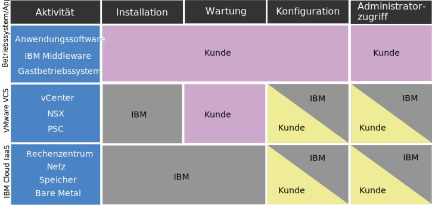

---

copyright:

  years:  2016, 2019

lastupdated: "2019-02-14"

---

# Konformitätsinformationen für vCenter Server- und vCenter Server with Hybridity Bundle-Instanzen
{: #vc_compl_info}

Lesen Sie die folgenden Informationen, um Details zur Konformität für VMware vCenter Server- und vCenter Server with Hybridity Bundle-Instanzen zu erhalten.

## Verantwortlichkeiten des Kunden im Vergleich zu Verantwortlichkeiten der IBM für vCenter Server on IBM Cloud
{: #vc_compl_info-responsibility}

Das folgende Diagramm enthält Details zu den Verantwortlichkeiten des Kunden (Sie) und den Verantwortlichkeiten der IBM für Konformitätsaktivitäten.

Abbildung 1. Verantwortlichkeitsmatrix für Kunden und IBM für vCenter Server on IBM Cloud im Vergleich

## Einschränkungen für Statusdaten
{: #vc_compl_info-health-data-restrictions}

Die Bedingungen in diesem Abschnitt gelten für das gesamte Portfolio von {{site.data.keyword.vmwaresolutions_full}}.

### HIPAA
{: #vc_compl_info-hipaa}

Ungeachtet der Informationen im Datenblatt für diesen Cloud-Service bezüglich dem Health Information Portability and Accountability Act von 1996 ("HIPAA") und der zulässigen Verwendung von Statusinformationen und Statusdaten als Typen persönlicher Daten und/oder Spezialkategorien persönlicher Daten (nachstehend zusammenfassend als "Statusdaten" bezeichnet) für diesen Cloud-Service unterliegt die Verwendung von Statusdaten im Zusammenhang mit diesem Cloud-Service den folgenden Einschränkungen und Bedingungen:

{{site.data.keyword.vmwaresolutions_short}}

Nur die Angebote, die oben aufgeführt sind, können bereitgestellt werden, um die HIPAA-Steuerelemente für Vertraulichkeit und Sicherheit für die Verwendung mit Statusdaten zu implementieren, wenn der Kunde IBM im Voraus darüber benachrichtigt, dass der Kunde Statusdaten mit dem Cloud-Service verwendet und IBM schriftlich bestätigt, dass der Cloud-Service für die Nutzung von Statusdaten bereitgestellt wird. Daher darf der Cloud-Service nicht für die Übertragung, Speicherung oder sonstige Nutzung von Statusdaten eingesetzt werden, die dem HIPAA unterliegen, es sei denn, (i) der Kunde stellt IBM eine solche Benachrichtigung bereit; (ii) IBM und der Kunde sind eine entsprechende Geschäftspartnervereinbarung (BAA, Business Associate Agreement) eingegangen; und (iii) IBM stellt dem Kunden eine ausdrückliche schriftliche Bestätigung bereit, dass der Cloud-Service mit Statusdaten verwendet werden darf. In keinem Fall darf der Cloud-Service für die Verarbeitung von persönlichen Statusinformationen als Clearinghouse im Rahmen der Bedeutung des HIPAA verwendet werden.

Im Falle eines Systemausfalls kann ein Service-Provider eines anderen Anbieters das Debugging von Artefakten vom Kunden anfordern (Protokolle, Kernspeicherauszüge usw.). Es liegt in der alleinigen Verantwortung des Kunden, diese Artefakte zu erfassen und an den Drittanbieter zu übertragen. Das IBM Support Team kann Sie durch die Bereitstellung von Links zu Dokumentationen oder richtungsweisenden Anweisungen über Sitzungen mit gemeinsamer Anzeigennutzung unterstützen. Der Kunde ist jedoch für die Bereinigung von PHI-Daten und für die ordnungsgemäße Verschlüsselung dieser Daten vor der Übertragung verantwortlich. Es liegt auch in der Verantwortung des Kunden, zu bewerten, ob vor dem Senden von Daten eine Geschäftspartnervereinbarung mit dem Drittanbieter getroffen werden muss.

## Persönliche Daten und regulierte Daten
{: #vc_compl_info-personal-info-and-regulated-data}

Dieser Cloud-Service ist nicht auf spezielle Sicherheitsanforderungen für regulierte Inhalte ausgelegt, wie z. B. persönliche Informationen oder sensible persönliche Daten. Der Kunde ist dafür verantwortlich festzustellen, ob dieser Cloud-Service den Kundenanforderungen bezüglich der Art des Inhalts entspricht, die der Kunde in Verbindung mit dem Cloud-Service verwendet.

## Richtlinien für den Zugriff auf Kundeninstanzen
{: #vc_compl_info-policy-for-access-client-inst}

Die VMware Cloud Foundation- und vCenter Server-Umgebungen, die als {{site.data.keyword.vmwaresolutions_short}} bereitgestellt werden, bieten eine Plattformebene für das VMware-Management für unsere Kunden, um die Virtualisierungsfunktionen zu verwalten. Während des gesamten Lebenszyklus von IBM Cloud for VMware-Produkten und -Services kann es sein, dass Sie auf die Unterstützung von IBM Support zurückgreifen müssen, um die erfolgreiche Implementierung dieser Produkte zu gewährleisten. In den meisten Fällen ist die Intervention von IBM Support das Ergebnis einer Kundenanforderung (d. h. eines Support-Tickets). In seltenen Fällen kann IBM Support jedoch auch proaktiv Unterstützung ohne ein Support-Ticket vom Kunden anbieten, um zukünftige Probleme zu vermeiden. Dieser Zugriff erfolgt über das interne IBM Cloud-Unterstützungsnetz und wird durch ein Support-Ticket dokumentiert, das von IBM Support geöffnet und von IBM Cloud SOC fortlaufend überwacht wird. IBM Support ändert Instanzkonfigurationen nur mit der vorherigen Zustimmung des Kunden. Der Zugriff erfolgt auf VMware-Managementkomponenten und/oder IBM Cloud-Managementkomponenten und nie auf die virtuellen Maschinen oder Anwendungen der Kunden.

## Proaktive Unterstützung
{: #vc_compl_info-proactive-support}

### Proaktive Unterstützung für die Erstbereitstellung
{: #vc_compl_info-proactive-support-for-initial-provision}

* Während der ursprünglichen Bestellung und Bereitstellung einer Instanz oder eines Service kann IBM Support auf Kundeninstanzen und -informationen ohne vorherige Benachrichtigung des Kunden zugreifen, um sicherzustellen, dass die Bestellungen ordnungsgemäß ausgeführt werden.
* Neben den Bestell-, Bereitstellungs- und Installationsprozessen überwacht IBM Support aktiv Lebenszyklusoperationen der Instanzen, wie das Hinzufügen neuer Hosts.
* Um bereits aufgetretene oder zukünftige Probleme zu beheben, kann IBM Support eine Reihe von Maßnahmen ergreifen, darunter unter anderem das Überprüfen von Kundenauftragsdetails, das erneute Starten von Automationsjobs, das Durchführen von Operationen für das erneute Laden des Betriebssystems oder das Öffnen von IBM Cloud-Tickets mithilfe des bereitgestellten Benutzernamens und API-Schlüssels für IBM Cloud.

### Proaktive Unterstützung für Operationen im stabilen Zustand
{: #vc_compl_info-proactive-support-for-steady-state-operations}

* In seltenen Fällen kann IBM Support den Zugriff auf Kundeninstanzen während Operationen im stabilen Zustand anfordern, um proaktiv eine Fehlerbehebung für eine Instanz durchzuführen oder die Funktion von bereitgestellten Services oder Komponenten zu überprüfen.
* Dieser Zugriff erfolgt über das interne IBM Cloud-Unterstützungsnetz. IBM Support ändert Instanzkonfigurationen nur mit der vorherigen Zustimmung des Kunden.
* Der Zugriff erfolgt auf VMware-Managementkomponenten und/oder IBM Cloud-Managementkomponenten und nie auf die virtuellen Maschinen oder Anwendungen der Kunden.

### Support-Tickets
{: #vc_compl_info-support-tickets}

* Cloud Foundation- und vCenter Server-Umgebungen werden nicht aktiv von IBM überwacht und IBM Support greift im Normalbetrieb nicht ohne ein vom Kunden geöffnetes Support-Ticket auf die VMware-Managementschicht zu.
* Wenn ein Kunde ein Support-Ticket für ein Instanz-, Service- oder Bereitstellungsproblem öffnet, wird das Ticket schnell dem zuständigen IBM Support Team zugewiesen, das primär für die Lösung des Problems verantwortlich ist.
* Aufgrund des Grades an Spezialisierung, der erforderlich ist, um das technische Know-how auf Teamebene aufrecht zu erhalten, ist es in manchen Fällen nötig, dass mehr als ein Support-Team an der Lösung eines bestimmten Softwareproblems beteiligt ist. Dies ist ohne großen Aufwand durchsetzbar, da unsere Support-Teams gut miteinander vernetzt sind und Hand in Hand an aufgetretenen Probleme arbeiten.
* Um das Problem zu untersuchen, muss IBM möglicherweise auf Informationen zu Ihrem System in Bezug auf den Fehler zugreifen oder den Fehler erneut generieren, um zusätzliche Informationen zu erhalten.
* Ein vom Kunden geöffnetes Support-Ticket dient als Bestätigung seitens des Kunden, dass IBM Support für das Durchführen von Untersuchungen, Debugging und Triage auf die VMware-Managementschicht zugreifen kann. Wenn Wartungsunterbrechungen oder Änderungen an der Umgebung erforderlich sind, fordert IBM Support zusätzliche dokumentierte Bestätigungen vom Kunden über Tickets als Teil unseres Änderungsmanagementprozesses an.
* Weitere Informationen zu Support-Tickets finden Sie im [Software Support Handbook](https://www-304.ibm.com/support/customercare/sas/f/handbook/getsupport.html) und unter [Kontaktaufnahmen mit IBM Support](/docs/services/vmwaresolutions/vmonic?topic=vmware-solutions-trbl_support).

## Verantwortlichkeiten des Kunden
{: #vc_compl_info-client-responsibilities}

* Während wir den Kunden empfehlen, Schritte zu unternehmen, um ihre Umgebungen sicherer zu machen, sollte beachtet werden, dass einige Verfahren negative Auswirkungen auf die Effektivität von IBM Cloud for VMware haben können.
* Kunden sind für die von ihnen erstellten Firewalls und die daraus resultierenden Einschränkungen, die für die Kommunikation zwischen IBM Cloud for VMware-Komponenten gelten, verantwortlich. Diese Firewalls können auch die Möglichkeiten von IBM Support beeinträchtigen, auf Kundeninstanzen zuzugreifen und Probleme zu beheben.
* Kunden sind vollständig für die Verschlüsselung der Daten in ihrem System verantwortlich.
* Bei der ersten Bereitstellung laufen die Automatisierung des Angebots und das Konto des Kunden getrennt voneinander. Kunden sind berechtigt und werden dazu ermutigt, alle von IBM bereitgestellten Kennwörter im Portal zu ändern.
* Der vCenter-Zugriff und die Berechtigungsnachweise werden während den ersten Implementierungen erstellt und dem Kunden bereitgestellt. Im Rahmen der Anforderung unseres Angebots muss IBM Support uneingeschränkten Zugriff auf die Managementschicht erhalten, um Lebenszyklusmanagement sowie Unterstützung für unsere Kunden bereitzustellen.
* Wenn Berechtigungsnachweise, wie Kennwörter, zu einem beliebigen Zeitpunkt geändert werden, kann IBM Support möglicherweise Kunden nicht mehr bei der Wiederherstellung verloren gegangener oder vergessener Berechtigungsnachweise oder sogar bei der Fehlerbehebung von Kundenumgebungen helfen.
* Weitere Informationen zur Bedeutung dieses Problems und zu den zugehörigen Bedenken finden Sie im Abschnitt [Hinweise zum Ändern von Kennwörtern für NSX-Komponenten](/docs/services/vmwaresolutions/vcenter?topic=vmware-solutions-vc_networkingonvcenterserver#considerations-when-changing-passwords-for-nsx-components) und [Hinweise zum Ändern der vCenter Server-Artefakte](/docs/services/vmwaresolutions/vcenter?topic=vmware-solutions-vcenter_chg_impact).

### Kommunikation und Fehlerbehebung
{: #vc_compl_info-communication-troubleshooting}

* IBM gibt keinerlei Gewährleistungen, dass unsere Produkte fehlerfrei sind, aber wir bemühen uns, sie so zu korrigieren, dass sie wie geplant funktionieren. Kunden spielen bei diesem Bemühen eine große Rolle.
* Während IBM Support während des gesamten Lebenszyklus des Produkts Unterstützung bereitstellen kann, kann diese Unterstützung durch die Informationen und den Zugriff, die vom Kunden bereitgestellt werden, eingeschränkt werden.
* Der Kunde ist dafür verantwortlich, beim Auftreten eines Problems dieses ausführlich zu dokumentieren und IBM Support bereitzustellen und bei zusätzlichem Klärungsbedarf zeitgerecht zu reagieren.
* Die Kunden sind zudem dafür verantwortlich, die in diesem Dokument festgelegten Richtlinien zu befolgen, um der proaktiven Unterstützung zuzustimmen.
* Bei fehlender Zustimmung oder Nichteinhaltung der angegebenen Richtlinien übernimmt der Kunde die Verantwortung für die mögliche Verzögerung bei der Problemlösung, die durch Kommunikationsverzögerungen zwischen dem Kunden und dem Support-Team verursacht wird.
* Der Kunde sollte bereit sein, zusätzliche technische Fehlerbehebungsarbeiten durchzuführen, die sonst von IBM Support ausgeführt werden. IBM stellt bei Bedarf die entsprechende Dokumentation und Unterstützung bereit.

### Sicherheitsmaßnahmen
{: #vc_compl_info-security-measures}

* Management des Cloud-Service: Der Kunde ist für das Management der Administration, Operation, Wartung und Sicherheit der Anwendungen, einschließlich der zugrunde liegenden Middleware, verantwortlich.
* Integrität und Verfügbarkeit des Service: IBM leitet dem Kunden alle Benachrichtigungen zu Netzangriffen weiter, die für diesen Cloud-Service erkannt werden. Es liegt in der Verantwortung des Kunden, die Auswirkungen jeder gemeldeten Benachrichtigung zu ermitteln. Der Kunde wird über Hardwarefehler benachrichtigt. Die Überwachung und Reaktion auf Betriebssystemfehler oder Softwarefehler liegt in der Verantwortung des Kunden; bei Bedarf kann IBM Support einbezogen werden.
* Aktivitätsprotokollierung: Der Kunde ist je nach Bedarf für die Aktivitätsprotokollierung für Betriebssystem/System und Datenbank/Anwendungen verantwortlich.
* Verschlüsselung: Der Kunde ist je nach Bedarf für die Konfiguration und Verwaltung der gesamten Verschlüsselung verantwortlich (sowohl für ruhende Daten als auch für Daten während der Übertragung).
* Business-Continuity und Disaster-Recovery: Der Kunde ist je nach Bedarf für die Konfiguration und Verwaltung aller Business-Continuity und Disaster-Recovery-Prozesse verantwortlich.

### Services anderer Anbieter
{: #vc_compl_info-third-party-services}

* Software oder Code von anderen Anbietern ist in einigen unserer IBM Angebote enthalten oder gebündelt. Dieser Code ist für Ihren Komfort eingeschlossen, wird aber nicht als Teil des IBM Programms betrachtet.
* Diese Programme, die keine IBM Programme sind, werden direkt von den jeweiligen Anbietern lizenziert. Der Kunde verpflichtet sich, die Programme, die keine IBM Programme sind, gemäß den Bedingungen des Anbieters zu verwenden. Diese sind in der IBM Lizenzvereinbarung enthalten, die Bestandteil des IBM Angebots zum Zeitpunkt des Erwerbs ist.
* IBM testet, ob die Produkte anderer Anbieter mit IBM Programmen verwendet werden können und ordnungsgemäß funktionieren.
* IBM Software Support diagnostiziert Kundenprobleme anhand der Kenntnisse zur Funktionsweise Ihrer IBM Angebote mit Software anderer Anbieter. Sobald festgestellt wurde, dass das IBM Programm ordnungsgemäß funktioniert, das Problem jedoch weiterhin existiert, muss IBM den Kunden zur weiteren Diagnose an den Drittanbieter verweisen.
* Weitere Informationen zur Verantwortlichkeiten des Kunden bezüglich der Software oder des Codes anderer Anbieter finden Sie im [Software Support Handbook](https://www-304.ibm.com/support/customercare/sas/f/handbook/policies.html).

## Zustimmung für den Zugriff auf Kundenumgebungen
{: #vc_compl_info-consent-to-access-client-environment}

* IBM Support benötigt Zugriff auf Kundeninstanzen, um sicherzustellen, dass diese ordnungsgemäß bereitgestellt und gepflegt werden. Die Kunden sind für die Steuerung und Bereitstellung des erforderlichen Zugriffs verantwortlich.
* Ein vom Kunden geöffnetes Support-Ticket dient als Bestätigung und Zustimmung für den Zugriff von IBM Support auf eine Kundeninstanz, um Problemstellungen anzugehen, die im besagten Support-Ticket beschrieben sind.
* Die Kunden sind dafür verantwortlich, die in diesem Dokument festgelegten Richtlinien zu befolgen, um der proaktiven Unterstützung zuzustimmen. Bei fehlender Zustimmung oder Nichteinhaltung der angegebenen Richtlinien übernimmt der Kunde die Verantwortung für Verzögerungen bei der Problemermittlung und -lösung, die durch Kommunikationsverzögerungen zwischen dem Kunden und dem Support-Team verursacht werden, sowie für eine mögliche zusätzliche Fehlerbehebung.

## Ersteinrichtung
{: #vc_compl_info-initial-provision}

* Zum Zeitpunkt der Ersteinrichtung und Bestellung wird dem Kunden dieses Dokument vorgelegt.
* Mit der Absendung der Bestellung erklärt sich der Kunde mit diesen Bedingungen einverstanden und erteilt IBM Support die Zustimmung, jederzeit ohne vorherige Ankündigung auf seine Instanzen zugreifen zu dürfen, um Probleme im Zusammenhang mit der Umgebung schnell beheben oder künftige Ausfälle verhindern zu können.
* Diese Zustimmung gilt für alle aktuell bestellten Instanzen für ihren gesamten Lebenszyklus. Für Instanzen und Komponenten von Instanzen, die zukünftig bereitgestellt werden, ist möglicherweise eine zusätzliche Zustimmung erforderlich.

## Operationen im stabilen Zustand
{: #vc_compl_info-steady-state-operations}

Wenn der Kunde keine Zustimmung zur proaktiven Unterstützung für eine Instanz bei der Ersteinrichtung und ursprünglichen Bestellung erteilt hat, muss er bei Bedarf in alle zukünftigen Service-Tickets eine explizite Zustimmung geben. Zustimmungserklärungen müssen den festgelegten Richtlinien entsprechen; andernfalls werden sie als nichtig betrachtet.

## Zugehörige Links
{: #vc_compl_info-related}

* [Übersicht über vCenter Server](/docs/services/vmwaresolutions/vcenter?topic=vmware-solutions-vc_vcenterserveroverview)
* [Übersicht über vCenter Server with Hybridity Bundle](/docs/services/vmwaresolutions/vcenter?topic=vmware-solutions-vc_hybrid_overview)
* [Kontaktaufnahme mit dem IBM Support](/docs/services/vmwaresolutions/vmonic?topic=vmware-solutions-trbl_support)
