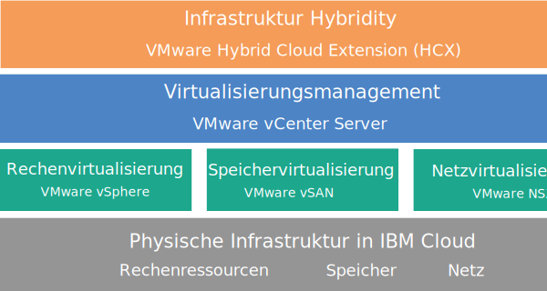

---

copyright:

  years:  2016, 2019

lastupdated: "2019-05-27"

keywords: vCenter Server Hybridity, hybridity, tech specs vCenter Server Hybridity

subcollection: vmware-solutions

---

{:tip: .tip}
{:note: .note}
{:important: .important}

# Übersicht über vCenter Server with Hybridity Bundle
{: #vc_hybrid_overview}

VMware vCenter Server on {{site.data.keyword.cloud}} with Hybridity Bundle ist eine Instanz, die in V2.3 und höheren Releases verfügbar ist. Ab V2.6 ist die vCenter Server with Hybridity Bundle-Instanz für Business Partner verfügbar.

vCenter Server with Hybridity Bundle ist eine gehostete private Cloud, die den VMware vSphere-Stack als Service bereitstellt. Die VMware-Umgebung basiert auf mindestens vier {{site.data.keyword.cloud_notm}}-{{site.data.keyword.baremetal_short}}-Instanzen, umfasst VMware vSAN als dedizierten Speicher, bietet die automatische Bereitstellung und Konfiguration einer (über VMware NSX betriebenen) verwaltungsfreundlichen logischen Edge-Firewall und enthält den Service "VMware HCX on {{site.data.keyword.cloud_notm}}".

In zahlreichen Fällen kann die gesamte Umgebung in weniger als einem Tag bereitgestellt werden und die Bare-Metal-Infrastruktur kann die Rechenkapazität nach Bedarf schnell und flexibel skalieren.

Wenn Sie die vSAN-basierte Speicherkapazität eines vSAN-Clusters erhöhen möchten, können Sie nach der Bereitstellung weitere ESXi-Server hinzufügen.

Sie können für die VMware NSX Advanced Edition ein Upgrade auf die Enterprise Edition durchführen und weitere VMware-Komponenten wie beispielsweise VMware vRealize Operations erwerben.

Sie können von IBM verwaltete Services hinzufügen, wenn Sie die Routineabläufe und die Wartung der Virtualisierung, des Gastbetriebssystems oder der Anwendungsschichten auslagern möchten. Das Team von {{site.data.keyword.cloud_notm}} Professional Services kann Ihnen durch Migrations-, Implementierungs-, Planungs- und Onboarding-Services ebenfalls dabei helfen, Ihren Einstieg in die Cloud zu beschleunigen.

## Architektur von vCenter Server with Hybridity Bundle
{: #vc_hybrid_overview-archi}

Die folgende Abbildung zeigt die allgemeine Architektur und die Komponenten einer vCenter Server with Hybridity Bundle-Bereitstellung mit drei Knoten.

### Physische Infrastruktur
{: #vc_hybrid_overview-physical-infras}

Auf dieser Schicht wird die physische Infrastruktur (Rechen-, Speicher- und Netzressourcen) bereitgestellt, die von der virtuellen Infrastruktur genutzt wird.

### Virtualisierungsinfrastruktur (Rechenressourcen, Speicher und Netz)
{: #vc_hybrid_overview-virtualization-infras}

Diese Schicht virtualisiert die physische Infrastruktur durch verschiedene VMware-Produkte:
* VMware vSphere virtualisiert die physischen Rechenressourcen.
* VMware Virtual SAN (vSAN) stellt auf der Basis des Speichers in den physischen Servern einen softwaredefinierten gemeinsam genutzten Speicher zur Verfügung.
* VMware NSX ist die Netzvirtualisierungsplattform, die logische Netzkomponenten und virtuelle Netze bereitstellt.

### Virtualisierungsmanagement
{: #vc_hybrid_overview-virtualization-mgmt}

Diese Schicht besteht aus vCenter Server Appliance (vCSA) mit integriertem Platform Services Controller (PSC), NSX Manager, zwei Edge Services Gateways (ESGs), drei NSX-Controllersn und der virtuellen Serverinstanz (VSI) für IBM CloudDriver. Die CloudDriver-VSI wird bei Bedarf auf Anforderung für bestimmte Operationen, wie zum Beispiel für das Hinzufügen von Hosts zur Umgebung, bereitgestellt.

Das Basisangebot wird mit einer vCenter Server-Appliance bereitgestellt, deren Größe für die Unterstützung einer Umgebung mit bis zu 400 Hosts und bis zu 4000 VMs ausgelegt ist. Zum Verwalten der von IBM gehosteten VMware-Umgebung können Sie dieselben mit der vSphere-API kompatiblen Tools und Scripts verwenden.

Insgesamt benötigt das Basisangebot 38 virtuelle CPUs und 67 GB virtuellen RAM, die für die Virtualisierungsmanagementschicht reserviert sind. Die verbleibende Hostkapazität für Ihre VMs hängt von mehreren Faktoren ab, beispielsweise der Übersubskriptionsrate, der VM-Dimensionierung und den Anforderungen an die Workloadleistung.

Informationen zu zusätzlichem Ressourcenbedarf für das Management beim Bereitstellen des Service "HCX on {{site.data.keyword.cloud_notm}}" finden Sie in [VMware HCX on {{site.data.keyword.cloud_notm}} - Übersicht](/docs/services/vmwaresolutions?topic=vmware-solutions-hcx_considerations#hcx_considerations).

### Hybridinfrastruktur
{: #vc_hybrid_overview-infras-hybrid}

Diese Schicht bietet eine Abstraktion von Ressourcen zwischen den lokalen Sites und {{site.data.keyword.cloud_notm}}-Sites, sodass Sie Workloads sicher und einfach hin- und herbewegen können, ohne die Merkmale der VMs, wie beispielsweise ihre IP-Adressen, ändern zu müssen.

Sie können auf der Basis von VMware Hybrid Cloud Extension (HCX) lose gekoppelte Verbindungen zwischen lokalen Sites und {{site.data.keyword.cloud_notm}}-Sites erstellen, um Massenmigrationen von VMs oder Live-vMotion von VMs ohne Ausfallzeit zu ermöglichen.

## Technische Spezifikationen für vCenter Server with Hybridity Bundle-Instanzen
{: #vc_hybrid_overview-specs}

Ihre vCenter Server with Hybridity Bundle-Instanz enthält die folgenden Komponenten:

Verfügbarkeit und Preisgestaltung standardisierter Hardwarekonfigurationen können abhängig vom {{site.data.keyword.CloudDataCent_notm}}, das für die Bereitstellung ausgewählt wird, variieren.
{:note}

### Bare Metal Server
{: #vc_hybrid_overview-bare-metal}

Sie können vier oder mehr {{site.data.keyword.baremetal_short}}-Instanzen mit einer der folgenden Konfigurationen bestellen:
  * **Skylake**: 2-CPU Intel Skylake Generation-Server (Intel Xeon 4100/5100/6100 Series) mit dem ausgewählten CPU-Modell und der RAM-Größe.
  * **Broadwell**: 4-CPU Intel Broadwell Generation-Server (Intel Xeon E7-4800 Series) mit dem ausgewählten CPU-Modell und der RAM-Größe.

### Vernetzung
{: #vc_hybrid_overview-networking}

Die folgenden Netzkomponenten werden bestellt:
*  10-Gbps-Uplinks für öffentliche und private Netze
*  3 VLANs (virtuelle LANs): 1 öffentliches VLAN und 2 private VLANs
*  1 VXLAN (Virtual eXtensible LAN) mit einem verteilten logischen Router (Distributed Logical Router, DLR) für die potenzielle Ost-West-Kommunikation zwischen lokalen Workloads, die mit Netzen der Schicht 2 (L2) verbunden sind. Das VXLAN wird als Muster für die Routingtopologie bereitgestellt, das Sie ändern, als Ausgangspunkt für Erstellungen verwenden oder entfernen können. Sie können außerdem Sicherheitszonen hinzufügen, indem Sie zusätzliche VXLANs an neue logische Schnittstellen im DLR anhängen.
*  2 VMware NSX Edge Services Gateways:
  * 1 sicheres VMware NSX Edge Services Gateway (ESG) für Management-Services für abgehenden HTTPS-Managementdatenverkehr, das von IBM im Rahmen der Managementnetztypologie bereitgestellt wird. Dieses ESG wird von den IBM Management-VMs für die Kommunikation mit bestimmten externen IBM Managementkomponenten verwendet, die mit der Automatisierung zusammenhängen. Weitere Informationen finden Sie unter [Netz zur Verwendung des vom Kunden verwalteten ESG konfigurieren](/docs/services/vmwaresolutions/vcenter?topic=vmware-solutions-vc_esg_config#configuring-your-network-to-use-the-customer-managed-nsx-esg-with-your-vms).

    Dieses ESG ist für Sie weder zugänglich, noch können Sie es verwenden. Wenn Sie es ändern, sind Sie möglicherweise nicht mehr in der Lage, die vCenter Server with Hybridity Bundle-Instanz über die {{site.data.keyword.vmwaresolutions_short}}-Konsole zu verwalten. Beachten Sie außerdem, dass die Verwendung einer Firewall oder die Inaktivierung der ESG-Kommunikation mit den externen IBM Managementkomponenten dazu führt, dass {{site.data.keyword.vmwaresolutions_short}} unbrauchbar wird.
    {:important}
  * 1 sicheres vom Kunden verwaltetes VMware NSX Edge Services Gateway für eingehenden und abgehenden HTTPS-Workloaddatenverkehr, das von IBM als Vorlage bereitgestellt wird und von Ihnen geändert werden kann, um den VPN-Zugriff oder den öffentlichen Zugriff zu ermöglichen. Weitere Informationen finden Sie im Abschnitt [Stellt das vom Kunden verwaltete NSX Edge ein Sicherheitsrisiko dar?](/docs/services/vmwaresolutions/vmonic?topic=vmware-solutions-faq#faq-customer-nsx)

Weitere Informationen zu Netzkomponenten, die bei der Bereitstellung des Service "HCX on {{site.data.keyword.cloud_notm}}" finden Sie in [HCX on {{site.data.keyword.cloud_notm}} - Übersicht](/docs/services/vmwaresolutions?topic=vmware-solutions-hcx_considerations#hcx_considerations).

### Virtual Server-Instanzen
{: #vc_hybrid_overview-vsi}

Die folgenden VSIs (Virtual Server-Instanzen) werden bestellt:
* Eine VSI für IBM CloudBuilder, die nach vollständiger Bereitstellung der Instanz abgebrochen wird.
* Sie haben die Möglichkeit, die Bereitstellung einer einzigen Virtual Server-Instanz (VSI) von Microsoft Windows für Microsoft Active Directory (AD) oder aber von zwei virtuellen Microsoft Windows-Maschinen für die Hochverfügbarkeit im Management-Cluster auszuwählen, um die Sicherheit und Leistungsfähigkeit zu erhöhen.

### vSAN-Speicher
{: #vc_hybrid_overview-vsan-storage}

Der vSAN-Speicher bietet angepasste Konfigurationen mit unterschiedlichen Optionen für Plattentyp und -menge:
* Plattenmenge: 2, 4, 6 oder 8.
* Speicherplatte: 960 GB SSD SED, 1,9 TB SSD SED oder 3,8 TB SSD SED.

  Zusätzlich werden zwei Cacheplatten mit 960 GB pro Host bestellt.
* Option für "Hohe Leistung mit Intel Optane", die zwei zusätzliche Kapazitätsplattenpositionen für eine Gesamtzahl von 12 Kapazitätsplatten bereitstellt. Diese Option hängt vom CPU-Modell ab.

### Von IBM bereitgestellte Lizenzen und Gebühren
{: #vc_hybrid_overview-license-and-fee}

Die Bestellung der vCenter Server with Hybridity Bundle-Instanz enthält die folgenden Lizenzen.

* VMware vSphere Enterprise Plus 6.5u2 oder 6.7u1
* VMware vCenter Server 6.5
* VMware NSX Service Providers Edition (Advanced oder Enterprise) 6.4
* VMware vSAN (Advanced oder Enterprise) 6.6

Es können zusätzliche Support- und Servicegebühren anfallen.

## Technische Spezifikationen für vCenter Server with Hybridity Bundle-Erweiterungsknoten
{: #vc_hybrid_overview-expansion-node-specs}

Jeder vCenter Server with Hybridity Bundle-Erweiterungsknoten stellt die folgenden Komponenten in Ihrem {{site.data.keyword.cloud_notm}}-Konto mit den entsprechenden anfallenden Gebühren bereit.

### Hardware für Erweiterungsknoten
{: #vc_hybrid_overview-expansion-node-hardware}

1 Bare Metal Server mit der unter [Technische Spezifikationen für vCenter Server with Hybridity Bundle-Instanzen](/docs/services/vmwaresolutions/vcenter?topic=vmware-solutions-vc_hybrid_overview#vc_hybrid_overview-specs) aufgeführten Konfiguration.

### Lizenzen und Gebühren für Erweiterungsknoten
{: #vc_hybrid_overview-expansion-node-license-and-fee}

* 1 Lizenz für VMware vSphere Enterprise Plus 6.5u2 oder 6.7u1
* 1 Lizenz für VMware NSX Service Providers Edition (Advanced oder Enterprise) 6.4
* 1 Support- und Servicegebühr
* VMware vSAN (Advanced oder Enterprise) 6.6

Sie dürfen die {{site.data.keyword.vmwaresolutions_short}}-Komponenten, die in Ihrem {{site.data.keyword.cloud_notm}}-Konto erstellt werden, nur über die {{site.data.keyword.vmwaresolutions_short}}-Konsole und nicht im {{site.data.keyword.slportal}} oder über ein anderes Verfahren außerhalb der Konsole verwalten. Wenn Sie diese Komponenten außerhalb der {{site.data.keyword.vmwaresolutions_short}}-Konsole ändern, werden die Änderungen nicht mit der Konsole synchronisiert.
{:important}

**VORSICHT:** Wenn Sie {{site.data.keyword.vmwaresolutions_short}}-Komponenten, die in Ihrem {{site.data.keyword.cloud_notm}}-Konto installiert wurden, als Sie die Instanz bestellt haben, außerhalb der {{site.data.keyword.vmwaresolutions_short}}-Konsole verwalten, kann dies zur Instabilität Ihrer Umgebung führen. Zu diesen Managementaktivitäten gehören:
*  Komponenten hinzufügen, ändern, zurückgeben oder entfernen
*  Instanzkapazität durch das Hinzufügen oder Entfernen von ESXi-Servern erweitern oder verringern
*  Komponenten ausschalten
*  Services erneut starten

   Ausgenommen von diesen Aktivitäten ist unter anderem das Management der gemeinsam genutzten Dateiressourcen für gemeinsam genutzten Speicher im {{site.data.keyword.slportal}}. Hierzu gehört das Bestellen, Löschen (mit möglicher Auswirkung auf angehängte Datenspeicher), Berechtigen und Anhängen von gemeinsam genutzten Dateiressourcen für gemeinsam genutzten Speicher.

## Zugehörige Links
{: #vc_hybrid_overview-related}

* [vCenter Server-Softwareteileliste](/docs/services/vmwaresolutions/vcenter?topic=vmware-solutions-vc_bom)
* [Voraussetzungen und Planung für vCenter Server with Hybridity Bundle-Instanzen](/docs/services/vmwaresolutions/vcenter?topic=vmware-solutions-vc_hybrid_planning)
* [vCenter Server with Hybridity Bundle-Instanzen bestellen](/docs/services/vmwaresolutions/vcenter?topic=vmware-solutions-vc_hybrid_orderinginstance)
* [HCX on {{site.data.keyword.cloud_notm}} - Übersicht](/docs/services/vmwaresolutions?topic=vmware-solutions-hcx_considerations#hcx_considerations)
* [Kontaktaufnahme mit dem IBM Support](/docs/services/vmwaresolutions/vmonic?topic=vmware-solutions-trbl_support)
