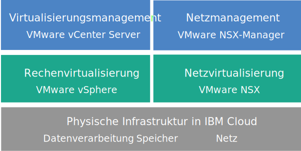

---

copyright:

  years:  2016, 2019

lastupdated: "2019-05-02"

subcollection: vmware-solutions

---

{:tip: .tip}
{:note: .note}
{:important: .important}

# Übersicht über vCenter Server with NSX-T
{: #vc_nsx-t_overview}

VMware vCenter Server with NSX-T on {{site.data.keyword.cloud}} ist eine gehostete private Cloud, die den VMware vSphere-Stack als Service bereitstellt. Die VMware-Umgebung basiert auf mindestens drei {{site.data.keyword.cloud_notm}} {{site.data.keyword.baremetal_short}}-Instanzen, bietet gemeinsam genutzten NAS-Speicher sowie Optionen für dedizierten softwaredefinierten Speicher und beinhaltet die automatische Bereitstellung und Konfiguration einer auf VMware NSX-T basierenden, leicht zu verwaltenden logischen Edge-Firewall.

In zahlreichen Fällen kann die gesamte Umgebung in weniger als einem Tag bereitgestellt werden und die Bare-Metal-Infrastruktur kann die Rechenkapazität nach Bedarf schnell und flexibel skalieren.

Nach der Bereitstellung können Sie den gemeinsam genutzten Speicher erweitern, indem Sie weitere gemeinsam genutzte NFS-Dateiressourcen (NFS - Network File System) im {{site.data.keyword.slportal}} bestellen und die gemeinsam genutzten Dateiressourcen manuell an alle ESXi-Server in einem Cluster anhängen.

VMware vSAN steht ebenfalls als Option für dedizierten Speicher zur Verfügung. Wenn Sie die vSAN-basierte Speicherkapazität eines vSAN-Clusters erhöhen möchten, können Sie nach der Bereitstellung weitere ESXi-Server hinzufügen.

vCenter Server with NSX-T-Instanzen sind nur für den Konzeptnachweis oder Sandboxtests vorgesehen. Die Umgebung ist nicht für Workloads im Produktionsbetrieb geeignet. Managementfunktionen wie das Bestellen von Add-on-Services und das Anwenden von Updates werden nicht unterstützt.
{:important}

## Architektur von vCenter Server with NSX-T
{: #vc_nsx-t_overview-archi}

Die folgende Abbildung zeigt die allgemeine Architektur und die Komponenten einer vCenter Server with NSX-T-Bereitstellung mit drei Knoten.

### Physische Infrastruktur
{: #vc_nsx-t_overview-physical-infras}

Auf dieser Schicht wird die physische Infrastruktur (Rechen-, Speicher- und Netzressourcen) bereitgestellt, die von der virtuellen Infrastruktur genutzt wird.

### Virtualisierungsinfrastruktur (Rechenressourcen und Netz)
{: #vc_nsx-t_overview-virtualization-infras}

Diese Schicht virtualisiert die physische Infrastruktur durch verschiedene VMware-Produkte:
* VMware vSphere virtualisiert die physischen Rechenressourcen.
* VMware NSX-T ist die Netzvirtualisierungsplattform, die logische Netzkomponenten und virtuelle Netze bereitstellt.

### Virtualisierungsmanagement
{: #vc_nsx-t_overview-virtualization-mgmt}

Diese Schicht besteht aus vCenter Server Appliance (vCSA) mit integriertem Platform Services Controller (PSC), drei NSX-Knoten, drei NSX Edge Services Gateways (ESGs) und der virtuellen Serverinstanz (VSI) für IBM CloudDriver. Die CloudDriver-VSI wird bei Bedarf auf Anforderung für bestimmte Operationen, wie zum Beispiel für das Hinzufügen von Hosts zur Umgebung, bereitgestellt.

Das Basisangebot wird mit einer vCenter Server-Appliance bereitgestellt, deren Größe für die Unterstützung einer Umgebung mit bis zu 400 Hosts und bis zu 4000 VMs ausgelegt ist. Zum Verwalten der von IBM gehosteten VMware-Umgebung können Sie dieselben mit der vSphere-API kompatiblen Tools und Scripts verwenden.

Insgesamt benötigt das Basisangebot 38 virtuelle CPUs und 128 GB virtuellen RAM, die für die Virtualisierungsmanagementschicht reserviert sind. Die verbleibende Hostkapazität für Ihre VMs hängt von mehreren Faktoren ab, beispielsweise der Übersubskriptionsrate, der Dimensionierung der virtuellen Maschinen (VMs) und den Anforderungen an die Workloadleistung.

Weitere Informationen zur Architektur enthält die [Referenzdokumentation zur Architektur von {{site.data.keyword.vmwaresolutions_short}}](/docs/services/vmwaresolutions/archiref/solution?topic=vmware-solutions-solution_overview).

## Technische Spezifikationen für vCenter Server with NSX-T-Instanzen
{: #vc_nsx-t_overview-specs}

Ihre vCenter Server with NSX-T-Instanz enthält die folgenden Komponenten.

Verfügbarkeit und Preisgestaltung standardisierter Hardwarekonfigurationen können abhängig vom {{site.data.keyword.CloudDataCent_notm}}, das für die Bereitstellung ausgewählt wird, variieren.
{:note}

### Bare Metal Server
{: #vc_nsx-t_overview-bare-metal}

Sie können drei oder mehr {{site.data.keyword.baremetal_short}}-Instanzen mit einer der folgenden Konfigurationen bestellen:
* **Skylake**: 2-CPU Intel Skylake Generation-Server (Intel Xeon 4100/5100/6100 Series) mit dem ausgewählten CPU-Modell und der RAM-Größe.  
* **Broadwell**: 4-CPU Intel Broadwell Generation-Server (Intel Xeon E7-4800 Series) mit dem ausgewählten CPU-Modell und der RAM-Größe.

Wenn Sie vSAN-Speicher verwenden möchten, sind für die Konfiguration mindestens vier {{site.data.keyword.baremetal_short}}-Instanzen erforderlich.
{:note}

### Vernetzung
{: #vc_nsx-t_overview-networking}

Die folgenden Netzkomponenten werden bestellt:
*  10-Gbps-Uplinks für öffentliche und private Netze
*  3 VLANs (virtuelle LANs): 1 öffentliches VLAN und 2 private VLANs
* 1 Overlay-Netz mit einem T1- und T0-Router für die potenzielle Ost-West-Kommunikation zwischen lokalen Workloads, die mit L2-Netzen (Layer 2) verbunden sind. Dieses Netz wird als Muster für die Routingtopologie bereitgestellt, das Sie ändern, als Ausgangspunkt für Erstellungen verwenden oder entfernen können.
*  3 VMware NSX-T Edge Services Gateways:
  * 1 sichere VMware NSX ESGs für Management-Services für abgehenden HTTPS-Managementdatenverkehr, die von IBM im Rahmen der Managementnetztypologie bereitgestellt werden. Dieses ESG wird von den IBM Management-VMs für die Kommunikation mit bestimmten externen IBM Managementkomponenten verwendet, die mit der Automatisierung zusammenhängen. Weitere Informationen finden Sie unter [Netz zur Verwendung des vom Kunden verwalteten NSX ESG mit eigenen virtuellen Maschinen konfigurieren](/docs/services/vmwaresolutions/vcenter?topic=vmware-solutions-vc_esg_config).
  * 2 sichere vom Kunden verwaltete VMware NSX ESGs für eingehenden und abgehenden HTTPS-Workloaddatenverkehr. Dieses Gateway wird von IBM als Vorlage bereitgestellt, die von Ihnen geändert werden kann, um den VPN-Zugriff oder den öffentlichen Zugriff zu ermöglichen. Weitere Informationen finden Sie im Abschnitt [Stellt das vom Kunden verwaltete NSX Edge ein Sicherheitsrisiko dar?](/docs/services/vmwaresolutions?topic=vmware-solutions-faq#faq-customer-nsx)

  Dieses ESG hat den Namen **mgmt-nsx-edge0**. Dieses ESG ist für Sie weder zugänglich, noch können Sie es verwenden. Falls Sie es ändern, sind Sie möglicherweise nicht in der Lage, die vCenter Server-Instanz über die {{site.data.keyword.vmwaresolutions_short}}-Konsole zu verwalten. Außerdem führt die Verwendung einer Firewall oder die Inaktivierung der ESG-Kommunikation mit den externen IBM Managementkomponenten dazu, dass {{site.data.keyword.vmwaresolutions_short}} möglicherweise unbrauchbar wird.
  {:important}

### Virtual Server-Instanzen
{: #vc_nsx-t_overview-vsi}

Die folgenden VSIs (Virtual Server-Instanzen) werden bestellt:
* 1 VSI für IBM CloudBuilder (wird nach vollständiger Bereitstellung der Instanz beendet).
* Sie haben die Möglichkeit, die Bereitstellung einer einzigen Virtual Server-Instanz (VSI) von Microsoft Windows für Microsoft Active Directory (AD) oder aber von zwei virtuellen Microsoft Windows-Maschinen für die Hochverfügbarkeit im Management-Cluster auszuwählen, um die Sicherheit und Leistungsfähigkeit zu erhöhen.

### Speicher
{: #vc_nsx-t_overview-storage}

Während der Erstbereitstellung können Sie zwischen den Speicheroptionen "vSAN" und "NFS" wählen.

Nach der Bereitstellung können Sie einem vorhandenen NFS- oder vSAN-Cluster gemeinsam genutzten NFS-Speicher hinzufügen. Weitere Informationen finden Sie im Abschnitt *NFS-Speicher zu vCenter Server-Instanzen hinzufügen* in [Kapazität für vCenter Server-Instanzen erweitern und verringern](/docs/services/vmwaresolutions/vcenter?topic=vmware-solutions-vc_addingremovingservers).
{:note}

#### vSAN-Speicher
{: #vc_nsx-t_overview-vsan-storage}

Die Option "vSAN" bietet angepasste Konfigurationen mit unterschiedlichen Optionen für Typ, Größe und Menge der Platten:
* Plattenmenge: 2, 4, 6 oder 8
* Speicherplatte: 960 GB SSD SED, 1,9 TB SSD SED oder 3,8 TB SSD SED.

  Zusätzlich werden auch zwei Cacheplatten mit 960 GB pro Host bestellt.

  3,8-TB-Solid-State-Platten (SSD) werden unterstützt, wenn sie in einem Rechenzentrum allgemein verfügbar gemacht werden.
  {:note}
* Option für "Hohe Leistung mit Intel Optane", die zwei zusätzliche Kapazitätsplattenpositionen für eine Gesamtzahl von 12 Kapazitätsplatten bereitstellt. Diese Option hängt vom CPU-Modell ab.

#### NFS-Speicher
{: #vc_nsx-t_overview-nfs-storage}

Die Option "NFS" bietet angepassten gemeinsam genutzten Speicher auf Dateiebene für Workloads mit verschiedenen Optionen für Größe und Leistung:
* Größe: 20 GB bis 24 TB
* Leistung: 0,25, 2, 4 oder 10 IOPS/GB
* Die gemeinsam genutzten Dateiressourcen werden einzeln konfiguriert

  Die Leistungsstufe 10 IOPS/GB ist auf eine maximale Kapazität von 4 TB pro gemeinsam genutzte Dateiressource begrenzt.
  {:note}

Wenn Sie die Option "NFS" auswählen, wird 1 gemeinsam genutzte Dateiressource mit 2 TB und 4 IOPS/GB für Managementkomponenten bestellt.

### Lizenzen (von IBM bereitgestellt oder eigene) und Gebühren
{: #vc_nsx-t_overview-license-and-fee}

* VMware vSphere Enterprise Plus 6.7u1
* VMware vCenter Server 6.5
* VMware NSX Service Providers Edition (Base, Advanced oder Enterprise) 6.4 (nur von IBM bereitgestellt)
* (Für vSAN-Cluster) VMware vSAN Advanced oder Enterprise 6.6
* Support- und Servicegebühren (1 Lizenz pro Knoten)

## Technische Spezifikationen für vCenter Server with NSX-T-Erweiterungsknoten
{: #vc_nsx-t_overview-expansion-node-specs}

Jeder vCenter Server with NSX-T-Erweiterungsknoten stellt folgende Komponenten in Ihrem {{site.data.keyword.cloud_notm}}-Konto mit den entsprechenden anfallenden Gebühren bereit.

### Hardware für Erweiterungsknoten
{: #vc_nsx-t_overview-expansion-node-hardware}

1 Bare-Metal-Server mit der unter [Technische Spezifikationen für vCenter Server with NSX-T-Instanzen](/docs/services/vmwaresolutions?topic=vmware-solutions-vc_nsx-t_overview#vc_nsx-t_overview-specs) aufgeführten Konfiguration.

### Lizenzen und Gebühren für Erweiterungsknoten
{: #vc_nsx-t_overview-expansion-node-license-and-fee}

* 1 Lizenz für VMware vSphere Enterprise Plus 6.7u1
* 1 Lizenz für VMware NSX Service Providers Edition (Base, Advanced oder Enterprise) 6.4
* 1 Support- und Servicegebühr
* (Für vSAN-Cluster) VMware vSAN Advanced oder Enterprise 6.6

Sie dürfen die {{site.data.keyword.vmwaresolutions_short}}-Komponenten, die in Ihrem {{site.data.keyword.cloud_notm}}-Konto erstellt werden, nur über die {{site.data.keyword.vmwaresolutions_short}}-Konsole und nicht im {{site.data.keyword.slportal}} oder über ein anderes Verfahren außerhalb der Konsole verwalten. Wenn Sie diese Komponenten außerhalb der {{site.data.keyword.vmwaresolutions_short}}-Konsole ändern, werden die Änderungen nicht mit der Konsole synchronisiert.
Wenn Sie {{site.data.keyword.vmwaresolutions_short}}-Komponenten, die in Ihrem {{site.data.keyword.cloud_notm}}-Konto installiert wurden, als Sie die Instanz bestellt haben, außerhalb der {{site.data.keyword.vmwaresolutions_short}}-Konsole verwalten, kann dies zur Instabilität Ihrer Umgebung führen. Zu diesen Managementaktivitäten gehören:
*  Komponenten hinzufügen, ändern, zurückgeben oder entfernen
*  Instanzkapazität durch das Hinzufügen oder Entfernen von ESXi-Servern erweitern oder verringern
*  Komponenten ausschalten
*  Services erneut starten
Ausgenommen von diesen Aktivitäten ist unter anderem das Management der gemeinsam genutzten Dateiressourcen für gemeinsam genutzten Speicher im {{site.data.keyword.slportal}}. Hierzu gehört das Bestellen, Löschen (mit möglicher Auswirkung auf angehängte Datenspeicher), Berechtigen und Anhängen von gemeinsam genutzten Dateiressourcen für gemeinsam genutzten Speicher.
   {:important}

## Zugehörige Links
{: #vc_nsx-t_overview-related}

* [vCenter Server-Softwareteileliste](/docs/services/vmwaresolutions/vcenter?topic=vmware-solutions-vc_bom)
* [vCenter Server-Instanzen planen](/docs/services/vmwaresolutions/vcenter?topic=vmware-solutions-vc_planning)
* [vCenter Server with NSX-T-Instanzen bestellen](/docs/services/vmwaresolutions/vcenter?topic=vmware-solutions-vc_nsx-t_orderinginstance)
* [Angehängter Speicher für vCenter Server](/docs/services/vmwaresolutions/services?topic=vmware-solutions-storage-benefits#storage-benefits)
* [Kapazität von gemeinsam genutzten Dateiressourcen erweitern](/docs/infrastructure/FileStorage?topic=FileStorage-expandCapacity#expandCapacity)
