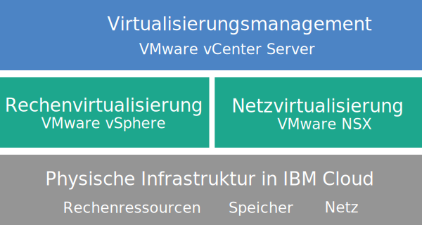

---

copyright:

  years:  2016, 2019

lastupdated: "2019-05-02"

subcollection: vmware-solutions

---

{:tip: .tip}
{:note: .note}
{:important: .important}

# Übersicht über vCenter Server
{: #vc_vcenterserveroverview}

VMware vCenter Server on {{site.data.keyword.cloud}} ist eine gehostete private Cloud, die den VMware vSphere-Stack als Service bereitstellt. Die VMware-Umgebung basiert auf {{site.data.keyword.cloud_notm}} {{site.data.keyword.baremetal_short}}, bietet gemeinsam genutzten NAS-Speicher sowie Optionen für dedizierten softwaredefinierten Speicher und beinhaltet die automatische Bereitstellung und Konfiguration einer auf VMware NSX basierenden, leicht zu verwaltenden logischen Edge-Firewall.

In zahlreichen Fällen kann die gesamte Umgebung in weniger als einem Tag bereitgestellt werden und die Bare-Metal-Infrastruktur kann die Rechenkapazität nach Bedarf schnell und flexibel skalieren.

Nach der Bereitstellung können Sie den gemeinsam genutzten Speicher erweitern, indem Sie weitere gemeinsam genutzte NFS-Dateiressourcen (NFS - Network File System) im {{site.data.keyword.slportal}} bestellen und die gemeinsam genutzten Dateiressourcen manuell an alle ESXi-Server in einem Cluster anhängen. Wenn Sie dedizierten Speicher benötigen, können Sie [NetApp ONTAP Select on {{site.data.keyword.cloud_notm}}](/docs/services/vmwaresolutions/netapp?topic=vmware-solutions-np_netappoverview) nutzen, das sowohl in Konfigurationen mit hoher Leistung (alle mit SSD) als auch mit hoher Speicherkapazität (alle mit SATA) angeboten wird.

VMware vSAN steht ebenfalls als Option für dedizierten Speicher zur Verfügung. Wenn Sie die vSAN-basierte Speicherkapazität eines vSAN-Clusters erhöhen möchten, können Sie nach der Bereitstellung weitere ESXi-Server hinzufügen.

Falls Sie eine von IBM bereitgestellte VMware-Lizenzierung erworben haben, können Sie für VMware NSX Base Edition ein Upgrade auf Advanced oder Enterprise Edition durchführen und weitere VMware-Komponenten wie VMware vRealize Operations erwerben.

Sie können von IBM verwaltete Services hinzufügen, wenn Sie die Routineabläufe und die Wartung der Virtualisierung, des Gastbetriebssystems oder der Anwendungsschichten auslagern möchten. Das Team von {{site.data.keyword.cloud_notm}} Professional Services kann Ihnen durch Migrations-, Implementierungs-, Planungs- und Onboarding-Services ebenfalls dabei helfen, Ihren Einstieg in die Cloud zu beschleunigen.

## vCenter Server-Architektur
{: #vc_vcenterserveroverview-archi}

In der folgenden Abbildung sind die allgemeine Architektur und die Komponenten einer vCenter Server-Bereitstellung mit drei Knoten dargestellt.

### Physische Infrastruktur
{: #vc_vcenterserveroverview-physical-infras}

Auf dieser Schicht wird die physische Infrastruktur (Rechen-, Speicher- und Netzressourcen) bereitgestellt, die von der virtuellen Infrastruktur genutzt wird.

### Virtualisierungsinfrastruktur (Rechenressourcen und Netz)
{: #vc_vcenterserveroverview-virtualization-infras}

Diese Schicht virtualisiert die physische Infrastruktur durch verschiedene VMware-Produkte:
* VMware vSphere virtualisiert die physischen Rechenressourcen.
* VMware NSX ist die Netzvirtualisierungsplattform, die logische Netzkomponenten und virtuelle Netze bereitstellt.

### Virtualisierungsmanagement
{: #vc_vcenterserveroverview-virtualization-mgmt}

Diese Schicht besteht aus vCenter Server Appliance (vCSA) mit integriertem Platform Services Controller (PSC), NSX Manager, zwei Edge Services Gateways (ESGs), drei NSX-Controllersn und der virtuellen Serverinstanz (VSI) für IBM CloudDriver. Die CloudDriver-VSI wird bei Bedarf auf Anforderung für bestimmte Operationen, wie zum Beispiel für das Hinzufügen von Hosts zur Umgebung, bereitgestellt.

Das Basisangebot wird mit einer vCenter Server-Appliance bereitgestellt, deren Größe für die Unterstützung einer Umgebung mit bis zu 400 Hosts und bis zu 4000 VMs ausgelegt ist. Zum Verwalten der von IBM gehosteten VMware-Umgebung können Sie dieselben mit der vSphere-API kompatiblen Tools und Scripts verwenden.

Insgesamt benötigt das Basisangebot 38 virtuelle CPUs und 67 GB virtuellen RAM, die für die Virtualisierungsmanagementschicht reserviert sind. Die verbleibende Hostkapazität für Ihre VMs hängt von mehreren Faktoren ab, beispielsweise der Übersubskriptionsrate, der VM-Dimensionierung und den Anforderungen an die Workloadleistung.

Weitere Informationen zur Architektur enthält die [Referenzdokumentation zur Architektur von {{site.data.keyword.vmwaresolutions_short}}](/docs/services/vmwaresolutions/archiref/solution?topic=vmware-solutions-solution_overview).

## Technische Spezifikationen für vCenter Server-Instanzen
{: #vc_vcenterserveroverview-specs}

Ihre vCenter Server-Instanz enthält die folgenden Komponenten.

Verfügbarkeit und Preisgestaltung standardisierter Hardwarekonfigurationen können abhängig vom {{site.data.keyword.CloudDataCent_notm}}, das für die Bereitstellung ausgewählt wird, variieren.
{:note}

### Bare Metal Server
{: #vc_vcenterserveroverview-bare-metal}

Sie können drei oder mehr {{site.data.keyword.baremetal_short}}-Instanzen mit einer der folgenden Konfigurationen bestellen:
* **Skylake**: 2-CPU Intel Skylake Generation-Server (Intel Xeon 4100/5100/6100 Series) mit dem ausgewählten CPU-Modell und der RAM-Größe.
* **SAP-zertifiziert**: Intel Skylake oder Intel Broadwell Generation-Server (Intel Xeon 6140/E5-2690/E7-8890 Series) mit dem ausgewählten CPU-Modell.
* **Broadwell**: 4-CPU Intel Broadwell Generation-Server (Intel Xeon E7-4800 Series) mit dem ausgewählten CPU-Modell und der RAM-Größe.

Wenn Sie vSAN-Speicher verwenden möchten, sind für die Konfiguration mindestens vier {{site.data.keyword.baremetal_short}}-Instanzen erforderlich.
{:note}

### Vernetzung
{: #vc_vcenterserveroverview-networking}

Die folgenden Netzkomponenten werden bestellt:
*  10-Gbps-Uplinks für öffentliche und private Netze
*  3 VLANs (virtuelle LANs): 1 öffentliches VLAN und 2 private VLANs
*  1 VXLAN (Virtual eXtensible LAN) mit einem verteilten logischen Router (Distributed Logical Router, DLR) für die potenzielle Ost-West-Kommunikation zwischen lokalen Workloads, die mit Netzen der Schicht 2 (L2) verbunden sind. Das VXLAN wird als Muster für die Routingtopologie bereitgestellt, das Sie ändern, als Ausgangspunkt für Erstellungen verwenden oder entfernen können. Sie können außerdem Sicherheitszonen hinzufügen, indem Sie zusätzliche VXLANs an neue logische Schnittstellen im DLR anhängen.
*  2 VMware NSX Edge Services Gateways:
  * 1 sicheres VMware NSX Edge Services Gateway (ESG) für Management-Services für abgehenden HTTPS-Managementdatenverkehr, das von IBM im Rahmen der Managementnetztypologie bereitgestellt wird. Über dieses ESG kommunizieren virtuelle IBM Management-Maschinen mit bestimmten externen IBM Managementkomponenten, die mit der Automatisierung zusammenhängen. Weitere Informationen finden Sie unter [Netz zur Verwendung des vom Kunden verwalteten ESG konfigurieren](/docs/services/vmwaresolutions/vcenter?topic=vmware-solutions-vc_esg_config#configuring-your-network-to-use-the-customer-managed-nsx-esg-with-your-vms).

    Dieses ESG trägt den Namen **mgmt-nsx-edge**. Es ist für Sie weder zugänglich, noch können Sie es verwenden. Falls Sie es ändern, sind Sie möglicherweise nicht in der Lage, die vCenter Server-Instanz über die {{site.data.keyword.vmwaresolutions_short}}-Konsole zu verwalten. Außerdem führt die Verwendung einer Firewall oder die Inaktivierung der ESG-Kommunikation mit den externen IBM Managementkomponenten dazu, dass {{site.data.keyword.vmwaresolutions_short}} möglicherweise unbrauchbar wird.
    {:important}
  * Ein sicheres vom Kunden verwaltetes VMware NSX Edge Services Gateway für eingehenden und abgehenden HTTPS-Workloaddatenverkehr. Dieses Gateway wird von IBM als Vorlage bereitgestellt, die von Ihnen geändert werden kann, um den VPN-Zugriff oder den öffentlichen Zugriff zu ermöglichen. Weitere Informationen finden Sie im Abschnitt [Stellt das vom Kunden verwaltete NSX Edge ein Sicherheitsrisiko dar?](/docs/services/vmwaresolutions/vmonic?topic=vmware-solutions-faq#faq-customer-nsx)

### Virtual Server-Instanzen
{: #vc_vcenterserveroverview-vsi}

Die folgenden VSIs (Virtual Server-Instanzen) werden bestellt:
* 1 VSI für IBM CloudBuilder, der nach vollständiger Bereitstellung der Instanz beendet wird.
* (Für Instanzen mit V2.2 und höher) Sie haben die Möglichkeit, die Bereitstellung einer einzigen Virtual Server-Instanz (VSI) von Microsoft Windows Server für Microsoft Active Directory (AD) oder aber von zwei virtuellen Microsoft Windows-Maschinen für die Hochverfügbarkeit im Management-Cluster auszuwählen, um die Sicherheit und Leistungsfähigkeit zu erhöhen.
* (Für Instanzen mit V1.9 bis V2.1) Eine Microsoft Windows Server VSI für Microsoft Active Directory (AD) wird bereitgestellt und kann zur Suche verwendet werden. Die Virtual Server-Instanz (VSI) dient als DNS für die Instanz, auf der die Hosts und virtuellen Maschinen registriert sind.
* (Für Instanzen mit V1.8 und älteren Versionen) 1 VSI für die Snapshot-basierte Sicherung der Managementkomponenten, die nach Abschluss der Instanzbereitstellung weiter ausgeführt wird.

### Speicher
{: #vc_vcenterserveroverview-storage}

Während der Erstbereitstellung können Sie zwischen den Speicheroptionen "vSAN" und "NFS" wählen.

Für Instanzen der Version 2.8 und höher können gemeinsam genutzte NFS-Speicherressourcen zu einem vorhandenen NFS- oder vSAN-Cluster hinzugefügt werden. Weitere Informationen finden Sie im Abschnitt *NFS-Speicher zu vCenter Server-Instanzen hinzufügen* in [Kapazität für vCenter Server-Instanzen erweitern und verringern](/docs/services/vmwaresolutions/vcenter?topic=vmware-solutions-vc_addingremovingservers#adding-nfs-storage-to-vcenter-server-instances).
{:note}

#### vSAN-Speicher
{: #vc_vcenterserveroverview-vsan-storage}

Die Option "vSAN" bietet angepasste Konfigurationen mit unterschiedlichen Optionen für Typ, Größe und Menge der Platten:
* Plattenmenge: 2, 4, 6 oder 8
* Speicherplatte: 960 GB SSD SED, 1,9 TB SSD SED oder 3,8 TB SSD SED.

  Zusätzlich werden auch zwei Cacheplatten mit 960 GB pro Host bestellt.

  3,8-TB-Solid-State-Platten (SSD) werden unterstützt, wenn sie in einem Rechenzentrum allgemein verfügbar gemacht werden.
  {:note}
* Option für "Hohe Leistung mit Intel Optane", die zwei zusätzliche Kapazitätsplattenpositionen für eine Gesamtzahl von 12 Kapazitätsplatten bereitstellt. Diese Option hängt vom CPU-Modell ab.

#### NFS-Speicher
{: #vc_vcenterserveroverview-nfs-storage}

Die Option "NFS" bietet angepassten gemeinsam genutzten Speicher auf Dateiebene für Workloads mit verschiedenen Optionen für Größe und Leistung:
* Größe: 20 GB bis 24 TB
* Leistung: 0,25, 2, 4 oder 10 IOPS/GB.
* Die gemeinsam genutzten Dateiressourcen werden einzeln konfiguriert.

  Die Leistungsstufe 10 IOPS/GB ist auf eine maximale Kapazität von 4 TB pro gemeinsam genutzte Dateiressource begrenzt.
  {:note}

Wenn Sie die Option "NFS" auswählen, wird 1 gemeinsam genutzte Dateiressource mit 2 TB und 4 IOPS/GB für Managementkomponenten bestellt.

#### Lokaler Plattenspeicher
{: #vc_vcenterserveroverview-local-disk-storage}

Die Option für lokale Festplatten, die nur für die Bare-Metal-Konfiguration des **SAP-zertifizierten** Quad Intel Xeon E7-8890 v4-Prozessors verfügbar ist, bietet kundenspezifische Konfigurationen mit verschiedenen Optionen für Plattenanzahl und Plattentyp.

### Lizenzen (von IBM bereitgestellt oder eigene) und Gebühren
{: #vc_vcenterserveroverview-license-and-fee}

* VMware vSphere Enterprise Plus 6.5u2 oder 6.7u1
* VMware vCenter Server 6.5
* VMware NSX Service Providers Edition (Base, Advanced oder Enterprise) 6.4
* (Für vSAN-Cluster) VMware vSAN Advanced oder Enterprise 6.6
* Support- und Servicegebühren (1 Lizenz pro Knoten)

## Technische Spezifikationen für vCenter Server-Erweiterungsknoten
{: #vc_vcenterserveroverview-expansion-node-specs}

Jeder vCenter Server-Erweiterungsknoten stellt folgende Komponenten in Ihrem {{site.data.keyword.cloud_notm}}-Konto mit den entsprechenden anfallenden Gebühren bereit.

### Hardware für Erweiterungsknoten
{: #vc_vcenterserveroverview-expansion-node-hardware}

1 Bare Metal Server mit der unter [Technische Spezifikationen für vCenter Server-Instanzen](/docs/services/vmwaresolutions/vcenter?topic=vmware-solutions-vc_vcenterserveroverview#vc_vcenterserveroverview-specs) aufgeführten Konfiguration.

### Lizenzen und Gebühren für Erweiterungsknoten
{: #vc_vcenterserveroverview-expansion-node-license-and-fee}

* 1 Lizenz für VMware vSphere Enterprise Plus 6.5u2 oder 6.7u1
* 1 Lizenz für VMware NSX Service Providers Edition (Base, Advanced oder Enterprise) 6.4
* 1 Support- und Servicegebühr
* (Für vSAN-Cluster) VMware vSAN Advanced oder Enterprise 6.6

Sie dürfen die {{site.data.keyword.vmwaresolutions_short}}-Komponenten, die in Ihrem {{site.data.keyword.cloud_notm}}-Konto erstellt werden, nur über die {{site.data.keyword.vmwaresolutions_short}}-Konsole und nicht im {{site.data.keyword.slportal}} oder über ein anderes Verfahren außerhalb der Konsole verwalten. Wenn Sie diese Komponenten außerhalb der {{site.data.keyword.vmwaresolutions_short}}-Konsole ändern, werden die Änderungen nicht mit der Konsole synchronisiert.
Wenn Sie {{site.data.keyword.vmwaresolutions_short}}-Komponenten, die in Ihrem {{site.data.keyword.cloud_notm}}-Konto installiert wurden, als Sie die Instanz bestellt haben, außerhalb der {{site.data.keyword.vmwaresolutions_short}}-Konsole verwalten, kann dies zur Instabilität Ihrer Umgebung führen. Zu diesen Managementaktivitäten gehören:
*  Komponenten hinzufügen, ändern, zurückgeben oder entfernen
*  Instanzkapazität durch das Hinzufügen oder Entfernen von ESXi-Servern erweitern oder verringern
*  Komponenten ausschalten
*  Services erneut starten
Ausgenommen von diesen Aktivitäten ist unter anderem das Management der gemeinsam genutzten Dateiressourcen für gemeinsam genutzten Speicher im {{site.data.keyword.slportal}}. Hierzu gehört das Bestellen, Löschen (mit möglicher Auswirkung auf angehängte Datenspeicher), Berechtigen und Anhängen von gemeinsam genutzten Dateiressourcen für gemeinsam genutzten Speicher.
   {:important}

## Zugehörige Links
{: #vc_vcenterserveroverview-related}

* [vCenter Server-Softwareteileliste](/docs/services/vmwaresolutions/vcenter?topic=vmware-solutions-vc_bom)
* [vCenter Server-Instanzen planen](/docs/services/vmwaresolutions/vcenter?topic=vmware-solutions-vc_planning)
* [vCenter Server-Instanzen bestellen](/docs/services/vmwaresolutions/vcenter?topic=vmware-solutions-vc_orderinginstance)
* [Angehängter Speicher für vCenter Server](/docs/services/vmwaresolutions/services?topic=vmware-solutions-storage-benefits#storage-benefits)
* [Kapazität von gemeinsam genutzten Dateiressourcen erweitern](/docs/infrastructure/FileStorage?topic=FileStorage-expandCapacity#expandCapacity)
