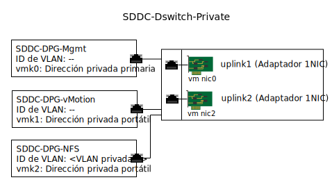

---

copyright:

  years:  2016, 2019

lastupdated: "2019-05-06"

subcollection: vmware-solutions

---

{:tip: .tip}
{:note: .note}
{:important: .important}

# Gestión de la infraestructura de almacenamiento adjunto
{: #storage-infra-mgmt}

La gestión de infraestructura hace referencia a los componentes de VMware que gestionan la infraestructura de vSphere ESXi.

Para obtener más información acerca de los componentes, consulte la Figura 2. Visión general de la red de NSX Manager en [Diseño de la infraestructura virtual](/docs/services/vmwaresolutions/archiref/solution?topic=vmware-solutions-design_virtualinfrastructure).

## Diseño de la red virtual
{: #storage-infra-mgmt-visual-net-design}

La virtualización de red que se utiliza en este diseño usa el conmutador distribuido de vSphere (vDS) existente asociado a la red privada y especificado en la [arquitectura de {{site.data.keyword.vmwaresolutions_full}}](/docs/services/vmwaresolutions/archiref/solution?topic=vmware-solutions-solution_overview).

## Conmutador distribuido de vSphere
{: #storage-infra-mgmt-vsphere-ds}

Se crea otra VLAN dentro de la solución vCenter Server y se utiliza para conectar el punto de montaje NFS a los hosts ESXi del clúster existente. Puesto que la solución de vCenter Server tiene un conmutador distribuido de vSphere asociado con la red privada, se crea otro grupo de puertos y se etiqueta con el número de VLAN adicional, ya que esta VLAN adicional no es nativa.

En la tabla siguiente se describen los valores predeterminados del nuevo grupo de puertos.

No cambie estos valores predeterminados.
{:important}

Tabla 1. Resumen de grupos de puertos NFS

| Nombre de grupo de puertos | SDDC-DPG-NFS |
|:--------------- |:------------ |
| Enlace de puertos | Estático |
| Tipo de VLAN | VLAN B privada |
| Equilibrio de carga | Ruta basada en el puerto virtual de origen |
| Enlaces ascendentes activos | Uplink1 y uplink2 |

Además de la creación del grupo de puertos vDS para el tráfico de almacenamiento NFS, se crea un puerto VMkernel en cada host ESXi de vSphere durante el despliegue y se asigna al grupo de puertos SDDC-DPG-NFS. Al puerto VMkernel también se le asigna una dirección IP de la subred portátil privada asociada a la VLAN de almacenamiento adjunto, es decir, VLAN B privada, y su MTU se establece en 9000 para dar soporte a las tramas jumbo.

### Direccionamiento estático de host vSphere
{: #storage-infra-mgmt-vsphere-routing}

Aunque vDS se configura con un grupo de puertos nuevo y se asigna un puerto VMkernel al grupo de puertos, la solución crea una ruta estática en cada host vSphere ESXi del despliegue para que todo el tráfico NFS atraviese la VLAN y la subred para NFS. La ruta estática se crea en `/etc/rc.local.d/local.sh` para que permanezca entre reinicios.

## Enlaces relacionados
{: #storage-infra-mgmt-related}

* [Visión general de la solución](/docs/services/vmwaresolutions/archiref/solution?topic=vmware-solutions-solution_overview)
