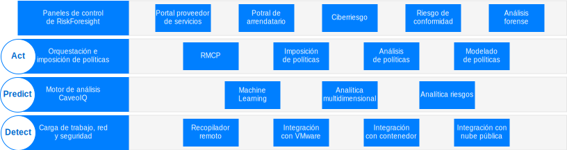
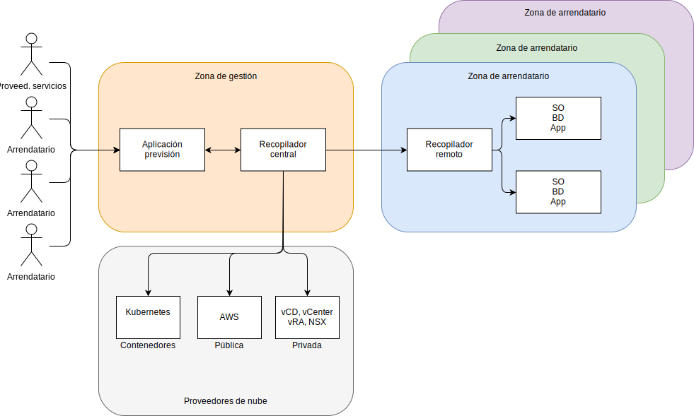

---

copyright:

  years:  2016, 2019

lastupdated: "2019-02-14"

---

# Visión general de la arquitectura para Caveonix RiskForesight
{: #caveonix-arch}

La arquitectura de Caveonix RiskForesight se muestra en el siguiente diagrama.

Figura 1. Arquitectura para Caveonix RiskForesight

La arquitectura de Caveonix RiskForesight consta de cuatro capas:
-	Detect - El módulo Detect está completamente integrado en la pila VMware y en muchas nubes públicas. Al utilizar plugins, RiskForesight utiliza vCenter y NSX Manager como Repositorios de activos, recopilando detalles sobre máquinas virtuales (VM), redes y flujos de red. Los recopiladores remotos exploran cargas de trabajo, sistemas operativos y aplicaciones para permitir una vista de "pila completa" de conformidad y vulnerabilidades.
-	Predict - El módulo Predict utiliza la analítica para identificar los activos de riesgo y los pasos de mitigación con modelos de reducción de riesgos para mejorar el grado de exposición al riesgo.
-	Act - El módulo Act implementa los pasos de mitigación basándose en la priorización y las acciones de protección automatizadas para proporcionar una protección de carga de trabajo proactiva ante los riesgos provocados por ciberamenazas.
    - RMCP - El Plano de control de gestión de riesgos (RMCP) proporciona una protección continua y proactiva de las cargas de trabajo, supervisando la pila completa dentro de los centros de datos de nube privados, públicos y gestionados.
    - Policy Manager - Actualmente da soporte a tres tipos de trabajos de machine learning por organización; Caveo Logs, Caveo Networks, Caveo Scan. En función de las anomalías detectadas en los datos, el usuario puede configurar las políticas para actuar con base en las condiciones definidas por el usuario; seleccionar el tipo de trabajo y configurar las condiciones booleanas para la puntuación de anomalías y definir la acción cuando la condición es verdadera. Por ejemplo:
        - Trabajo: La puntuación de la anomalía "Caveo Logs" es > 90, entonces Marcar el activo para cuarentena y enviar una notificación al canal de Slack.
        - Trabajo: La puntuación de la anomalía "Caveo Network" es > 95, entonces Poner en cuarentena el activo y enviar notificación por correo electrónico y también enviar notificación por interfaz de usuario.
- Paneles de control - Los paneles de control, a través del acceso basado en roles, proporcionan la capacidad para un proveedor de servicios, como un departamento de TI, de asignar activos de TI a los arrendatarios o las unidades de negocio. A continuación, las unidades de negocio asignan estos activos de TI a las aplicaciones. Estas aplicaciones coinciden con los servicios de negocio y de TI, y están sujetos a una evaluación del impacto empresarial, y están sujetos a un régimen de conformidad como: NIST, NESA, PCI, ISO e HIPAA. Además, estas aplicaciones están sujetas a un número de exploraciones, como vulnerabilidad, flujos NSX, software y datos de registro, para generar visibilidad sobre lo que se está ejecutando y el riesgo de conformidad y ciberseguridad asociado a la aplicación. Acceder a los detalles a través de estos paneles de control permite a los usuarios de seguridad y conformidad pueden ver una lista priorizada de acciones para mitigar y habilitar acciones de imposición automatizada en los módulos Predict y Act. RiskForesight proporciona un panel de control unificado para identificar activos en la nube híbrida y un análisis de mapa de calor para ciberriesgos, riesgos de configuración de conformidad, tendencias principales y métricas de la operación de seguridad. Permite a los usuarios determinar rápidamente la naturaleza y la ubicación de los riesgos, así como las acciones que se deben tomar que utilizan una herramienta de visualización intuitiva y potente. Estos paneles de control proporcionan:
  - Una vista priorizada de los ciberriesgos y los riesgos de conformidad en la nube híbrida con las vistas de panel de control de Detect, Predict, Act.
  - La capacidad para que un usuario interactúe visualmente con los datos para identificar rápidamente los activos en riesgo, en función de las prioridades de riesgo.
  - Gráficos, métricas y filtros fáciles de utilizar para desarrollar conocimientos sobre los riesgos identificados.
  - Información interactiva detallada para tener más conocimientos sobre los flujos de datos de las aplicaciones, las vulnerabilidades o problemas de configuración entre ubicaciones, organizaciones, aplicaciones y activos.
  - Permite al usuario desarrollar un conocimiento completo de la pila operativa, que incluye infraestructura, plataforma, aplicación y datos.
  - La capacidad de visualizar y aplicar políticas para la segmentación de redes, máquinas virtuales o aplicaciones a través de la nube híbrida.

## Zonas
{: #caveonix-arch-zones}

Caveonix RiskForesight tiene el concepto de zonas:

Figura 2. Zonas de Caveonix RiskForesight

-	Zona de gestión o proveedor de servicios - La zona de gestión o de proveedor de servicios incluye los siguientes componentes:
    - Aplicación RiskForesight - Esta contiene múltiples componentes y se describe en detalle en la sección Componentes de la aplicación.
    - Recopilador central - Recopila información de los proveedores de nube y de las zonas de arrendatario.
- Proveedores de nube - Esta zona proporciona la infraestructura sobre la cual están alojadas las aplicaciones:
    - Privada – VMware on {{site.data.keyword.cloud}}, y en local, plataformas de infraestructura VMware. Estas plataformas están integradas en RiskForesight a través de: vCenter, NSX Manager, VMware Cloud Director (vCD) o vRealize Automation (vRA).
    - Pública – Actualmente, el único proveedor de nube pública admitido es AWS. {{site.data.keyword.cloud_notm}} estará disponible pronto.
    - Contenedores - Actualmente solo se admite AWS Elastic Kubernetes Service (EKS). {{site.data.keyword.cloud_notm}} Private e {{site.data.keyword.cloud_notm}} Kubernetes Services (IKS) estarán disponibles pronto.
-	Zona de entorno de cliente o arrendatario – Estas zonas se utilizan para segregar arrendatarios, clientes o unidades de negocio. Existen cargas de trabajo en estas zonas y, por tanto, se necesita un recopilador remoto. Para un despliegue mínimo, necesita un recopilador remoto, pero para un despliegue general, necesita un Recopilador remoto por cada arrendatario/cliente/unidad de negocio.

## Enlaces relacionados
{: #caveonix-arch-related}

*   [VMware vCenter Server on {{site.data.keyword.cloud_notm}} con el paquete híbrido (Hybridity)](/docs/services/vmwaresolutions/archiref/vcs?topic=vmware-solutions-vcs-hybridity-intro)
*   [Diseño detallado de Caveonix](/docs/services/vmwaresolutions/archiref/caveonix?topic=vmware-solutions-caveonix-detailed)
