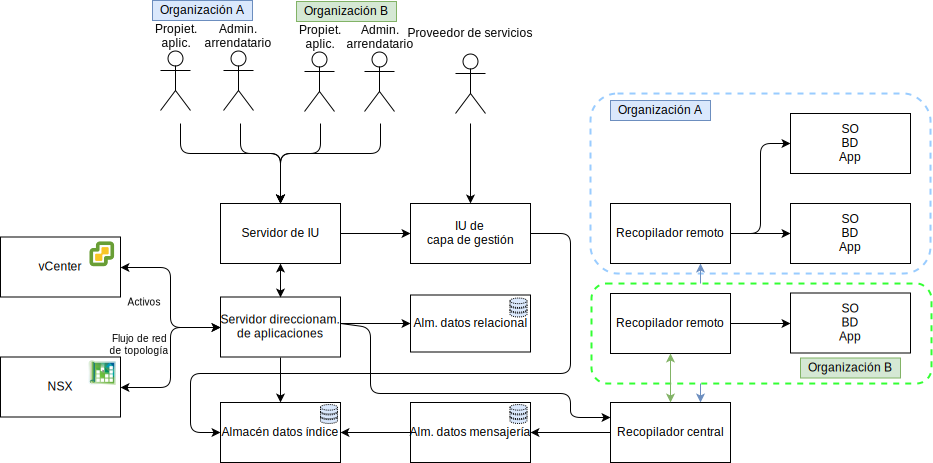

---

copyright:

  years:  2016, 2019

lastupdated: "2019-08-05"

subcollection: vmware-solutions

---

# Diseño detallado
{: #caveonix-detailed}

En el diagrama y las descripciones siguientes se proporciona información sobre los componentes de la aplicación RiskForesight.

-	Interfaz gráfica de usuario - Interfaz web que puede utilizar para acceder a la aplicación RiskForesight.
-	Recopilador central - Recopila distintos tipos de carga útil de datos que proceden de los plugins y la hacen disponible en el almacén de mensajería. RiskForesight admite los siguientes tipos de carga útil:
    - Exploración
    - Registros
    - Flujos de red
    - Software
    - Metadatos de carga de trabajo
- Direccionador central - Gestiona todos los puntos de contacto de integración con la capa de orquestación de VMware. Todos los plugins de RiskForesight deben comunicarse con el direccionador central para recibir autorización para comunicarse con el ecosistema de RiskForesight.
-	Servidor API - Es el middleware de punto final REST que conecta la interfaz gráfica de usuario y los almacenes de datos de fondo. Además, valida las solicitudes de acceso de usuario y gestiona el RBAC.
-	Recopilador de datos de vCenter - El plugin extrae los detalles de la máquina virtual (VM) de vCenter. El plugin genérico utiliza las API de VMware para conectar con vCenter y extrae información relevante de la carga de trabajo. Cuando la información está disponible, el plugin empaqueta la carga útil y la envía al recopilador central.
-	Recopilador de datos de vCD - El plugin extrae los detalles de la máquina virtual de VMware vCloud Director. El plugin genérico utiliza las API de VMware para conectar con VMware vCloud Director y extrae la información relacionada con la carga de trabajo. Cuando la información está disponible, el plugin empaqueta la carga útil y la envía al recopilador central.
-	Recopilador de datos de red de vCD - El plugin extrae los detalles de flujo de red de VMware vCD. El plugin genérico utiliza las API de VMware para conectar con VMware NSX y extrae Red, FW, Reglas de seguridad y Grupos de seguridad. Cuando la información está disponible, el plugin empaqueta la carga útil y la envía al recopilador central.
-	Recopilador de datos de red - Un plugin que extrae detalles de flujo de red de VMware vCenter. El plugin genérico utiliza las API de VMware para conectar con VMware NSX y extrae información de red, cortafuegos, reglas de seguridad y grupos de seguridad. Cuando la información está disponible, el plugin empaqueta la carga útil y la envía al recopilador central.
-	Recopilador remoto - Reside en el entorno de arrendatario o en otra ubicación en la que tenga acceso de red a las máquinas virtuales del arrendatario. Maneja toda la conformidad y la exploración de ciberriesgos.
-	Almacén de datos relacional - Mantiene los siguientes tipos de metadatos:
    - Proveedor de servicios de nube
    - Arrendatario
    - Activos
    - Resultados de exploración
    - Software
    - Conjunto de datos agregado a diario o semanalmente
- Almacén de datos de mensajería - RiskForesight utiliza la cola de mensajería persistente para proporcionar cero pérdida de datos y descargar la presión de fondo a los componentes.
- Almacén de datos de índice - Indexa y almacena los datos en bruto de entrada para cada arrendatario para que el análisis adicional admita la capacidad multiarrendatario.
- Plugins – Residen en el servidor de direccionamiento de aplicaciones e incluyen la configuración y la integración con los componentes de VMware para sincronizar todas las máquinas virtuales junto con su información de arrendatario.

En la tabla siguiente se muestran los puertos y los protocolos necesarios para cada componente.

Tabla 1. Puertos y protocolos

|Componente	|Protocolo / Puertos|
|---|---|
|Interfaz de usuario|443|
|API|443, 1337|
|RiskForesight|8082, 8083, 8084|
|Recopilador central (clúster)|8080|
|Recopilador remoto|8081|
|Almacén de datos relacional primario o secundario|5432|
|Clúster de almacén de datos de mensajería|9092|
|Nodos maestros de almacén de datos de índice|9200, 9300, 5601, 443|

En el diagrama siguiente se muestra la topología de red con la subred privada portátil de Caveonix que está asociada a la VLAN privada A. Usted es responsable de gestionar el espacio de direcciones IP de esta subred para que pueda escalar manualmente desde el modelo "todo en uno" al modelo de despliegue completamente distribuido, a través del modelo distribuido parcialmente, según sea necesario.

Las asignaciones de VLAN, subred de IP se describen en la siguiente tabla.

Tabla 2. VLAN y subredes

|VLAN 	|Tipo de subred 	|Descripción|
|---|---|---|
|Pública 	|Primaria 	|Asignada a hosts físicos para el acceso de red pública. No se utiliza en el despliegue inicial.|
|Pública	|Portátil 	|Asignado para enlace ascendente y uso de NAT en customer-nsx-esg.|
|Pública	|Portátil 	|Asignada para uso de NAT de enlace ascendente en mgmt-nsx-esg.|
|Pública	|Portátil 	|Asignada para uso de NAT de enlace ascendente en hcx-mgmt-esg, si se ha seleccionado el paquete híbrido.|
|Privada A 	|Primaria 	|Asignada a hosts físicos asignados por {{site.data.keyword.cloud}}. La utiliza la interfaz de gestión para el tráfico de gestión de vSphere.|
|Privada A 	|Portátil 	|Asignada a máquinas virtuales que funcionan como componentes de gestión.|
|Privada A 	|Portátil 	|Asignada a NSX VTEP.|
|Privada A 	|Portátil 	|Asignada a HCX para uso interno, si se ha seleccionado el paquete híbrido.|
|Privada A 	|Portátil 	|Asignado para uso de enlace ascendente en el customer-nsx-esg.|
|Privada A 	|Portátil 	|Asignada a HCX, si se ha seleccionado el paquete híbrido.|
|Privada A 	|Portátil 	|Asignada a los VRA de Zerto, si se ha seleccionado la opción Zerto.|
|Privada A 	|Portátil 	|Asignada para Caveonix RiskForesight, si se ha seleccionado la opción Caveonix.|
|Privada B	|Primaria	|No se utiliza en el despliegue inicial.|
|Privada B 	|Portátil 	|Asignada para vSAN, si se utiliza.|
|Privada B 	|Portátil 	|Asignada para NAS, si se utiliza.|
|Privada B 	|Portátil 	|Asignada para vMotion.|
