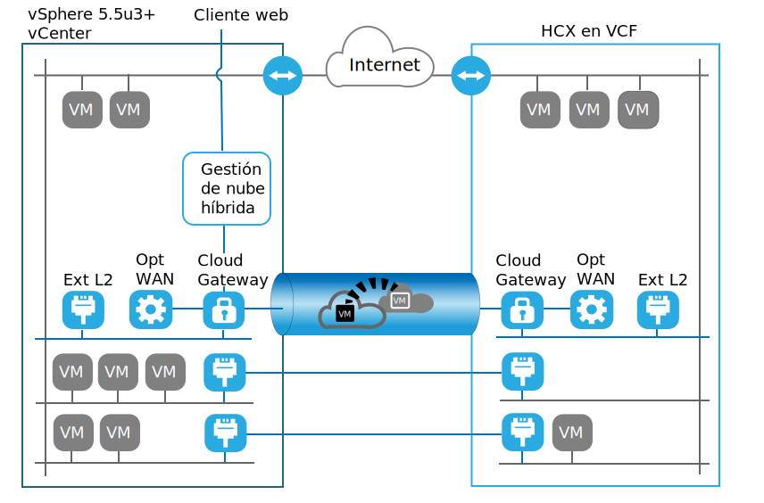

---

copyright:

  years:  2016, 2019

lastupdated: "2019-02-15"

subcollection: vmwaresolutions

---
# Introducción a VMware HCX on IBM Cloud
{: #hcx-archi-intro}

El servicio VMware HCX on IBM Cloud permite crear una conexión directa entre instancias de IBM Cloud for VMware Solutions y un centro de datos virtualizado local de VMware.

IBM Cloud for VMware Solutions incluye despliegues rápidos y completamente automáticos de configuraciones de VMware vCenter Server on IBM Cloud (VCS) o de VMware Cloud Foundation on IBM Cloud (VCF) en IBM Cloud. Estas ofertas complementan la infraestructura local y permiten ejecutar cargas de trabajo existentes y futuras en IBM Cloud sin tener que realizar conversiones, utilizando las mismas herramientas, conocimientos y procesos que utilizan de forma local. Para obtener más información, consulte [IBM Architecture Center](https://www.ibm.com/devops/method/content/architecture/virtualizationArchitecture).

El servicio VMware HCX on IBM Cloud adopta esta hibridación en el siguiente paso, combinando instancias de VCS o VCF con centros de datos virtualizados locales existentes, mediante la creación de extensiones de red y mediante la migración bidireccional de cargas de trabajo.

Los componentes de VMware HCX on IBM Cloud que se despliegan como máquinas virtuales en el sitio de destino de IBM Cloud VMware permiten establecer una conexión con los componentes de VMware HCX on IBM Cloud instalados en el sitio de origen local homólogo.

Figura 1. VMware Cloud Foundation – Hybrid Cloud Services

Esta conexión crea una interconectividad ligeramente acoplada entre el entorno local e IBM Cloud y permite funciones tales como:
* Interconectividad sencilla: las conexiones de red lógicas se establecen fácilmente sobre cualquier conexión física, como internet pública, VPN privada o enlace directo.
* Extensión de capa 2: las redes locales se amplían a la nube. Estas redes incluyen subredes locales y direccionamiento de IP.
* Cifrado: el tráfico de red se cifra de forma segura entre los dos lados.
* Red optimizada: selecciona la mejor conexión y gestiona la conexión de forma eficiente de modo que el tráfico se transmite de la forma más rápida posible.
* Desduplicación de datos: se puede conseguir una reducción del tráfico de red de hasta un 50 % 
Direccionamiento inteligente: cuando se mueve una carga de trabajo, el direccionamiento de proximidad puede cambiar la vía de acceso de red (es decir, la pasarela) para que el tráfico de la red utilice la pasarela del sitio de destino y no lo "devuelva" (hairpin) al sitio de origen.
* Migración con tiempo de inactividad cero: un sistema en ejecución se puede mover a la nube o recuperar de la misma mediante vMotion.
* Migración planificada: se puede replicar el número deseado de máquinas virtuales en el sitio de destino y luego se pueden activar en dicho sitio en el momento planificado, lo que sustituye los sistemas que se ejecutan en el sitio de origen.
* Migración de políticas de seguridad: si NSX se utiliza en local, las políticas de seguridad o los cortafuegos se trasladan junto con la carga de trabajo.

## Enlaces relacionados
{: #hcx-archi-intro-related}

* [IBM Architecture Center](https://www.ibm.com/devops/method/content/architecture/virtualizationArchitecture)
