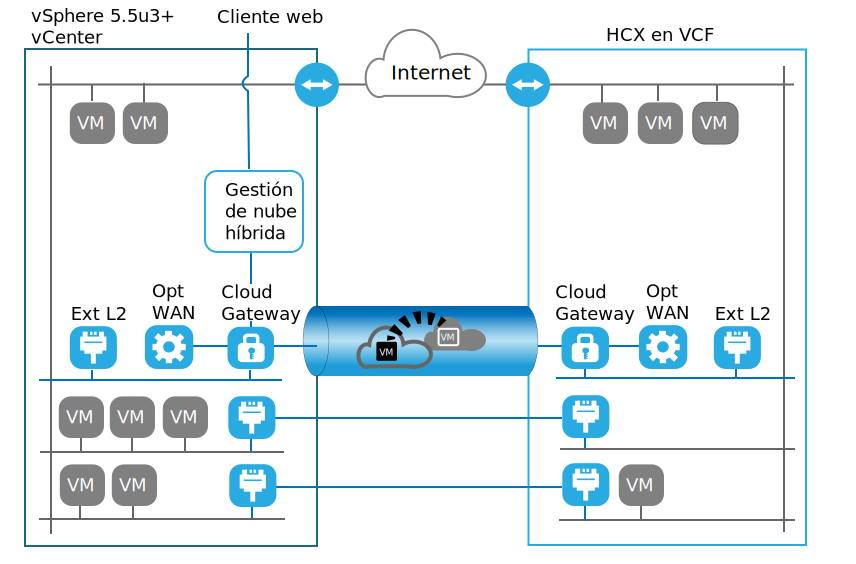
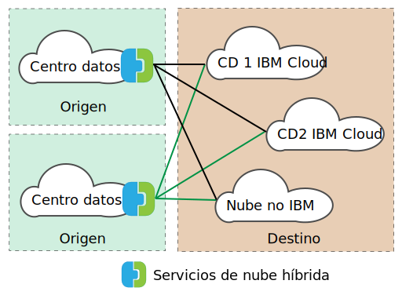

---

copyright:

  years:  2016, 2019

lastupdated: "2019-05-06"

subcollection: vmware-solutions

---
# Visión general de VMware HCX on IBM Cloud
{: #hcx-archi-overview}

VMware HCX on IBM Cloud integra redes vSphere® vCenter™ locales en despliegues de soluciones IBM Cloud for VMware. La red híbrida amplía las redes de vSphere locales en IBM Cloud, lo que da soporte a la movilidad bidireccional de máquinas virtuales (VM).

HCX es propietario de los procesos de cifrado y de descifrado de origen y de destino, lo que garantiza la seguridad y proporciona métodos de admisión para flujos de trabajo híbridos, como migración de máquinas virtuales y extensión de red.

Esta oferta crea una WAN optimizada definida por software para aumentar el rendimiento de la red extendida, ofreciendo un rendimiento que se acerca a la velocidad de la LAN. HCX también permite la carga de trabajo bidireccional y la migración de políticas de seguridad de VMware NSX® a IBM Cloud. HCX se integra con vSphere vCenter y se gestiona desde el cliente web de vSphere.

## Extensión de red de capa 2
{: #hcx-archi-overview-layer-2-net}

HCX habilita una propiedad de vSphere local existente para extender de forma segura una red desde su vCenter local a un centro de datos de IBM Cloud que ejecute VMware vCenter Server. Los siguientes factores habilitan esta característica:
* HCX proporciona un dispositivo denominado concentrador de capa 2 (L2C).
* Enlace de redes ampliadas con dispositivos de NSX Edge de IBM Cloud desplegados en VMware vCenter Server.
* Se pueden desplegar varios concentradores de capa 2 estándar para lograr la escalabilidad y aumentar el rendimiento desde el vCenter local.
* Las máquinas virtuales que se migran a través de la pasarela de nube y sobre la capa 2 extendida pueden conservar sus direcciones IP y MAC.

## Migración de máquinas virtuales
{: #hcx-archi-overview-vm-mig}

HCX proporciona tres métodos de migración de máquinas virtuales: migración con bajo tiempo de inactividad, migración de vSphere vMotion y migración en frío.

### Migración con bajo tiempo de inactividad
{: #hcx-archi-overview-low-downtime-mig}

La migración con bajo tiempo de inactividad se basa en la réplica de vSphere, que es una tecnología distribuida que se implementa en el hipervisor VMware ESX®/ESXi®. El despliegue de HCX local crea una réplica de una máquina virtual activa en IBM Cloud y realiza una conmutación para apagar la máquina virtual de origen y encender la máquina virtual migrada.

El método de migración es siempre a través de la pasarela de nube. El medio de transporte puede ser Internet, una red extendida de capa 2 o una línea Direct Connect.

Una máquina virtual se puede migrar varias veces en cualquier dirección.

### Migración de vMotion
{: #hcx-archi-overview-vmotion-mig}

Las máquinas virtuales activas se pueden transferir mediante vMotion Migration a través de una red que se ha extendido a IBM Cloud. La migración de vMotion también se denomina migración con tiempo de inactividad cero o vMotion entre nubes.

### Migración en frío
{: #hcx-archi-overview-cold-mig}

Con la migración en frío, puede transferir una máquina virtual apagada a IBM Cloud a través de una red extendida que se crea utilizando el concentrador de capa 2.

### Características comunes de la migración
{: #hcx-archi-overview-cold-mig-features}

Otras características disponibles en los tres tipos de migración incluyen la optimización de WAN definida por software, que aumenta el rendimiento y la velocidad de la migración. Además, la migración se puede planificar para que se produzca a una hora especificada y mantener su nombre de host, nombre de máquina virtual o ambos.

## Características de red
{: #hcx-archi-overview-net-features}

Las siguientes características de red están integradas en la pasarela de nube y en los concentradores de capa 2.

### Direccionamiento inteligente de flujos
{: #hcx-archi-overview-intel-flow-routing}

Esta característica selecciona automáticamente la mejor conexión en función de la vía de acceso a Internet, aprovechando de forma eficiente toda la conexión de modo que las cargas de trabajo se muevan lo más rápido posible. Cuando flujos de gran tamaño, como copias de seguridad o réplicas, provocan una contención de la CPU, los flujos más pequeños se direccionan a las CPU menos ocupadas, lo que mejora el rendimiento del tráfico interactivo.

### Direccionamiento de proximidad
{: #hcx-archi-overview-prox-routing}

El direccionamiento de proximidad garantiza que el reenvío entre máquinas virtuales que están conectadas a redes extendidas y direccionadas, tanto en el entorno local como en la nube, es simétrico. Esta característica requiere servicios avanzados de red con direccionamiento dinámico, que se configura entre el entorno local del cliente y la nube.

Cuando los usuarios extienden sus redes a la nube, la conectividad de capa 2 se extiende a las redes de IBM Cloud. Sin embargo, sin la optimización de direccionamiento, las solicitudes de comunicación de capa 3 deben volver al origen de red local que se direccionen. Este viaje de retorno se denomina _tromboning_ o _hairpinning_.

El método tromboning no resulta eficiente porque los paquetes deben realizar un viaje de ida y vuelta entre el origen de red y la nube, aunque tanto la máquina virtual de origen como la de destino residan en la nube.

Además de la falta de eficiencia, si la vía de acceso reenvío incluye cortafuegos con estado u otro equipo en línea que deba ver los dos lados de la conexión, es posible que la comunicación falle. Se produce un error de comunicación de máquina virtual (sin optimización de rutas) cuando la vía de acceso de salida de la nube puede ser la red extendida de capa 2 o la red direccionada de la organización. La red local no conoce el "acceso directo" de la red extendida. Este problema se denomina direccionamiento asimétrico. La solución consiste en habilitar el direccionamiento de proximidad para que la red local pueda conocer las rutas desde IBM Cloud.

La pasarela de nube mantiene un inventario de máquinas virtuales en la nube. También conoce el estado de la VM, que puede ser uno de los siguientes:
* Transferida a IBM Cloud con vMotion (migración con tiempo de inactividad cero).
* Migrada a la nube mediante una réplica basada en host (migración con bajo tiempo de inactividad).
* Creada en la nube (en una red extendida).

### Seguridad
{: #hcx-archi-overview-sec}

La pasarela de nube ofrece AES-GCM compatible con Suite B con IKEv2, descarga AES-NI y control de admisiones basado en flujo. HCX también es propietario del proceso de cifrado y de descifrado de origen y de destino, lo que garantiza la seguridad y la administración de los flujos de trabajo híbridos, como migración de máquinas virtuales y extensión de red. Las políticas de seguridad definidas y asignadas a una máquina virtual local se pueden migrar con la máquina virtual a IBM Cloud.

La migración de políticas solo está disponible bajo las siguientes condiciones:
* El centro de datos local debe ejecutar NSX 6.2.2 o superior.
* En vSphere, la política de seguridad es una sola sección de NSX que puede contener muchas reglas.
* Se puede nombrar un conjunto de direcciones IP o direcciones MAC para que participen en la política. El nombre del conjunto de MAC o del conjunto de IP no puede superar los 218 caracteres.
* Las reglas soportadas especifican direcciones IP de capa 3 o conjuntos de IP, o bien direcciones MAC de capa 2 o conjuntos de MAC como el origen o el destino.

## Componentes de HCX
{: #hcx-archi-overview-comp-hcx}

El servicio VMware HCX on IBM Cloud despliega cuatro dispositivos virtuales que se instalan y configuran tanto en el centro de datos local como en el destino de IBM Cloud. En esta sección se describe cada uno de los cuatro dispositivos virtuales necesarios. Opcionalmente, es posible que se necesiten dispositivos de borde, en función del diseño de implementación.

### HCX Manager
{: #hcx-archi-overview-hcx-man}

El dispositivo virtual HCX Manager es una extensión de vCenter local. Se despliega como una máquina virtual y su estructura de archivos contiene los otros dispositivos virtuales de servicio híbrido. HCX Manager supervisa el despliegue y la configuración de la pasarela de nube, los concentradores de capa 2 y el dispositivo virtual de optimización de WAN, tanto en el entorno local como en IBM Cloud.

### Hybrid Cloud Gateway
{: #hcx-archi-overview-hcg}

Hybrid Cloud Gateway (CGW) mantiene un canal seguro entre el estado de vSphere local e IBM Cloud. HCX utiliza cifrado potente para arrancar la conexión de sitio a sitio con IBM Cloud.

El canal seguro entre vSphere e IBM Cloud evita problemas de seguridad de red de tipo "middle mile". La pasarela de nube también incorpora la tecnología de réplica de vSphere para realizar la migración bidireccional.

### Optimización de WAN
{: #hcx-archi-overview-wan-opt}

El dispositivo de optimización de WAN es el componente que realiza el acondicionamiento de la WAN para reducir los efectos de la latencia. También incorpora correcciones de errores de reenvío para evitar escenarios de pérdida de paquetes y desduplicación de los patrones de tráfico redundantes. En conjunto, estos recursos reducen el uso de ancho de banda y garantizan un uso eficiente de la capacidad de red disponible para acelerar la transferencia de datos a y desde IBM Cloud.

Es importante tener en cuenta que la migración de máquina virtual se basa en la combinación de pasarela de nube y del dispositivo de optimización de WAN para lograr una movilidad sin igual entre vSphere local e IBM Cloud. Además, la extensión de capa 2 se beneficia de la optimización de WAN cuando la vía de acceso de datos se direcciona a través de la pasarela de nube.

### Concentradores de capa 2
{: #hcx-archi-overview-layer-2-conc}

Los dispositivos concentradores de capa 2 (L2C) permiten la extensión de una red de capa 2 del centro de datos de vSphere local a IBM Cloud. Los concentradores de capa 2 tienen dos interfaces:
* Interfaz troncal interna: maneja el tráfico de la máquina virtual local para las redes ampliadas utilizando una correlación de puente de traslado con una red extendida correspondiente en IBM Cloud.
* Interfaz de enlace ascendente: HCX utiliza esta interfaz para enviar el tráfico de superposición encapsulado a y desde IBM Cloud. Los datos de la aplicación viajan a través de esta interfaz.

## Arquitectura de despliegue: conexión con IBM Cloud a través de internet público
{: #hcx-archi-overview-connect-pub-internet}

En esta sección se describe el diseño de los componentes de HCX en IBM Cloud y en el cliente local. En este diseño, la arquitectura especifica un modelo de estrella ("hub-and-spoke") entre el entorno de origen e IBM Cloud. Por lo tanto, la propiedad de origen sirve como concentrador con conexiones a distintos entornos de IBM Cloud, tal como se muestra en la figura siguiente.

El origen se puede colocar también en el entorno de IBM Cloud; los radios siempre son despliegues de nube en este diseño, tal como se muestra en la figura siguiente.

### Visión general del uso
{: #hcx-archi-overview-usage-ovw}

En el cliente web de vSphere se realizan las siguientes tareas:
* Desplegar los dispositivos virtuales HCX y configurar los componentes de WAN definidos por software.
* Extender las redes VLAN y VXLAN locales desde el vCenter local a la nube (IBM Cloud).
* Migrar las cargas de trabajo a la nube y viceversa.

### Dependencias del diseño básico
{: #hcx-archi-overview-base-design}

Antes de describir detalladamente los componentes, es importante comprender el despliegue básico que se necesita como parte de este diseño.
* El entorno de origen debe contener una implementación de vSphere que esté gestionada por un vCenter Server. Se necesita un vCenter soportado de 5.5U3 o vCenter 6.0U2 y superior, con ESXi 5.5 o superior, para Hybrid Cloud Services.
* Si se utiliza NSX, versión 6.2.2 o superior. NSX se necesita para la migración de políticas.
* Si se desea vMotion entre nubes, se aplican las mismas restricciones de afinidad entre nubes que las que se aplican en entornos locales.
* El entorno de origen debe tener un método para conectarse a entornos de nube. Esto incluye acceso a Internet público o conexiones privadas mediante el enlace IBM Cloud Direct. No se describirán las conexiones, excepto internet público, con otros proveedores de nube.
* Las VM y las redes del entorno de origen que se van a migrar o extender deben estar en grupos de puertos dentro de un conmutador distribuido virtual o un conmutador distribuido virtual Cisco Nexus 1000v.
* IBM Cloud debe contener al menos una instancia de VMware vCenter Server.
* Suficientes recursos para los dispositivos virtuales.
* Las redes deben permitir que los dispositivos se comuniquen con dispositivos virtuales locales y remotos y con otras máquinas virtuales.
* En los requisitos de acceso a puertos (Apéndice A) encontrará los puertos que deben estar abiertos para que los dispositivos virtuales de Hybrid Cloud Services se puedan instalar correctamente.
* Una cuenta de servicio de vSphere con el rol de administrador del sistema vCenter Server asignado.
* Suficiente espacio de disco para instalar Hybrid Cloud Services y los dispositivos de servicio asociados.
* Suficientes direcciones IP para las VM locales suministradas durante la instalación.
* Si el servidor de SSO es remoto, se debe identificar el URL del vCenter, del servidor de SSO externo o del controlador de servicios de plataforma (PSC) que ejecuta el servicio de búsqueda externo. Cuando se registra el servicio HCX con el vCenter, se debe suministrar este URL.

## Enlaces relacionados
{: #hcx-archi-overview-related}

* [Introducción a VMware HCX on IBM Cloud](/docs/services/vmwaresolutions/archiref/hcx-archi?topic=vmware-solutions-hcx-archi-intro)
