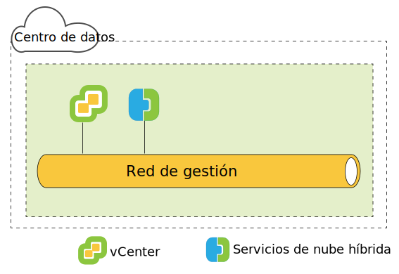
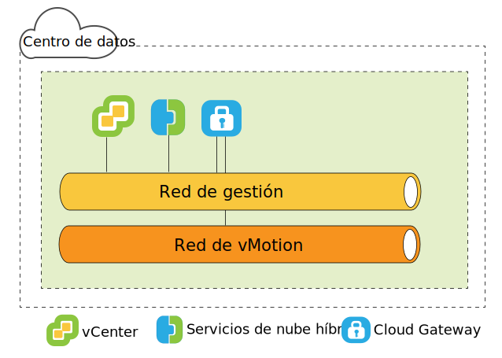
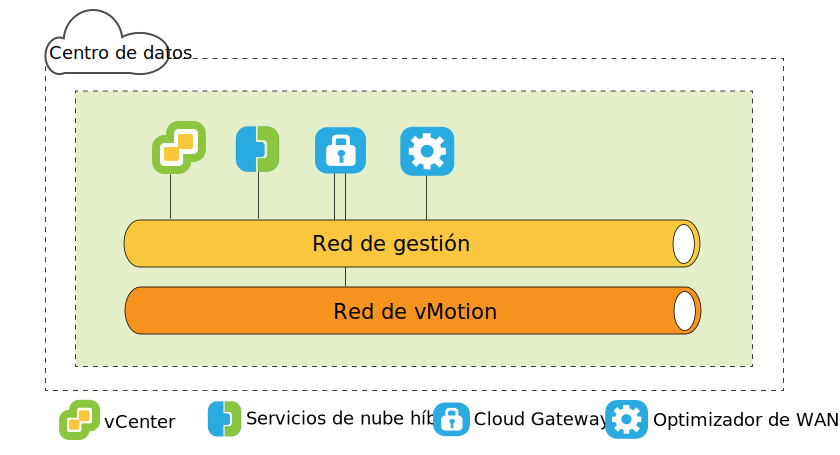
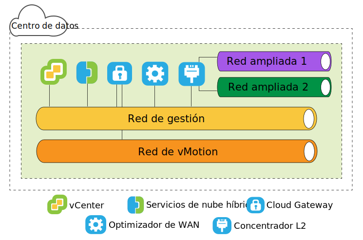

---

copyright:

  years:  2016, 2019

lastupdated: "2019-06-12"

subcollection: vmware-solutions

---

{:tip: .tip}
{:note: .note}
{:important: .important}

# Arquitectura de origen de VMware HCX on IBM Cloud
{: #hcx-archi-source}

Revise la arquitectura de cada componente de HCX que se despliega en el entorno de origen. 

## Introducción a HCX
{: #hcx-archi-source-intro-hcx}

La tecnología HCX integra fácilmente redes vSphere vCenter en la plataforma VCS de IBM Cloud. La red híbrida amplía las redes de vSphere locales en IBM Cloud, lo que da soporte a la movilidad bidireccional de máquinas virtuales (VM).

En esta introducción encontrará un resumen de las tareas que se pueden llevar a cabo y las características que dan soporte y mejoran la migración y la extensión de red.

* HCX es propietario de los procesos de cifrado y de descifrado de origen y de destino, lo que garantiza la seguridad y proporciona métodos de admisión para flujos de trabajo híbridos, como migración de máquinas virtuales y extensión de red.
* HCX crea una WAN optimizada definida por software para aumentar el rendimiento de la red extendida, ofreciendo un rendimiento que se acerca a la velocidad de la LAN. 
* HCX también permite la carga de trabajo bidireccional y la migración de políticas de seguridad de VMware NSX a los servicios de red de IBM Cloud.
* HCX se integra con vSphere vCenter y se gestiona desde el cliente web de vSphere.

## Extensión de red de capa 2
{: #hcx-archi-source-layer-2-ext}

* Extienda una red de forma segura desde un vCenter a IBM Cloud.
* HCX proporciona el concentrador de capa 2 de alto rendimiento (HT L2C).
* Enlace de redes ampliadas con dispositivos de NSX Edge de IBM Cloud
* Se pueden desplegar varios concentradores de capa 2 estándar para conseguir escalabilidad y aumentar el rendimiento.
* Las máquinas virtuales que se migran a través de la pasarela de nube y sobre la capa 2 extendida pueden conservar sus direcciones IP y MAC.

## Métodos de migración de máquina virtual
{: #hcx-archi-source-vm-mig-methods}

### Migración con bajo tiempo de inactividad
{: #hcx-archi-source-low-downtime-mig}

La migración con bajo tiempo de inactividad se basa en la réplica de vSphere, que es una tecnología distribuida que se implementa en el hipervisor VMware ESX/ESXi. HCX crea una réplica de una máquina virtual activa, la traslada a IBM Cloud y realiza una conmutación para apagar la máquina virtual de origen y encender la máquina virtual migrada.
* El método de migración es siempre a través de la pasarela de nube. El medio de transporte puede ser Internet, una red extendida de capa 2 o una línea Direct Connect.
* Una máquina virtual se puede migrar varias veces en cualquier dirección.

### Migración de vMotion
{: #hcx-archi-source-vmotion-mig}

La migración de vMotion utiliza vMotion para transferir una máquina virtual activa a través de una red que se extiende a IBM Cloud. La migración de vMotion también se denomina migración con tiempo de inactividad cero o vMotion entre nubes.

### Migración en frío
{: #hcx-archi-source-cold-mig}

Transfiera una máquina virtual apagada a IBM Cloud a través de una red extendida.

### Características comunes
{: #hcx-archi-source-common-feat}

* La optimización de WAN definida por software opcional, si está instalada, aumenta la migración, el rendimiento y la velocidad.
* La migración se puede planificar para que se produzca a una hora especificada.
* Una máquina virtual migrada puede mantener su nombre de host, nombre de máquina virtual o ambos.

## Características de red
{: #hcx-archi-source-net-feat}

Las siguientes características de red están integradas en la pasarela de nube y en los concentradores de capa 2.

* Direccionamiento inteligente de flujos: Selecciona automáticamente la mejor conexión en función de la vía de acceso a Internet, aprovechando de forma eficiente toda la conexión de modo que las cargas de trabajo se muevan lo más rápido posible. Cuando flujos de gran tamaño, como copias de seguridad o réplicas, provocan una contención de la CPU, los flujos más pequeños se direccionan a las CPU menos ocupadas, lo que mejora el rendimiento del tráfico interactivo.
* Direccionamiento de proximidad: Garantiza que el reenvío entre máquinas virtuales que están conectadas a redes extendidas y direccionadas, tanto en el entorno local como en la nube, es simétrico.
* Seguridad: La pasarela de nube ofrece AES-GCM compatible con Suite B con IKEv2, descarga AES-NI y control de admisiones basado en flujo. HCX es propietario de los procesos de cifrado y de descifrado de origen y de destino, lo que garantiza la seguridad y proporciona métodos de admisión para flujos de trabajo híbridos, como migración de máquinas virtuales y extensión de red.
  Una política de seguridad definida en el vCenter local y asignada a una máquina virtual local se puede migrar con la máquina virtual.

## Visión general de HCX
{: #hcx-archi-source-understand-hcx}

HCX da soporte a una relación de muchos a muchos entre vCenters locales e IBM Cloud. Se da soporte a vCenter Server en modalidad enlazada.

Durante la instalación, el dispositivo virtual HCX Manager se importa y se configura como plugin para el vCenter local. A continuación, este plugin se utiliza para configurar el despliegue del servicio WAN definido por software. La configuración automática suministra cada dispositivo de servicio híbrido como una máquina virtual en el vCenter local y despliega una máquina virtual correspondiente en IBM Cloud. 

Un despliegue satisfactorio necesita:
* Suficientes recursos para los dispositivos virtuales
* La rede debe permitir que los dispositivos se comuniquen con dispositivos virtuales locales y remotos y con otras máquinas virtuales.

## Visión general del despliegue
{: #hcx-archi-source-deployment-ovw}

La máquina virtual de HCX Manager se instala en primer lugar, y gestiona la instalación de cualquier otro dispositivo de máquina virtual de servicio local las instalaciones y en la nube.

Los pasos siguientes son tareas de instalación básicas: 
1. Obtenga el archivo OVA del dispositivo virtual Hybrid Cloud Enterprise.
2. Desde el cliente web de vSphere, instale el dispositivo virtual de servicio de HCX Manager en el vCenter local que se conecta a IBM Cloud.
3. Desde el cliente web de vSphere, registre un punto final de IBM Cloud con el plugin HCX. El registro establece la relación de uno a uno entre el HCX local y la instancia de HCX en IBM Cloud.
4. Instale y configure los dispositivos virtuales de servicio.
5. Para cada dispositivo instalado en el entorno local, el instalador suministra un dispositivo virtual de servicio correspondiente en IBM Cloud de destino.
6. Después de la instalación, HCX Manager controla los dispositivos virtuales de servicio tanto locales como remotos. En IBM Cloud, HCX gestiona los componentes de WAN definidos por software suministrados como un servicio.

### Consideraciones sobre el rendimiento del componente de despliegue
{: #hcx-archi-source-perf-consid}

La planificación de la arquitectura incluye las VM que se van a migrar, las redes utilizadas para el tráfico de máquina virtual y las redes que se van a extender.  

Los valores máximo y mínimo para los componentes de despliegue son: 
* vSphere vCenter. El dispositivo HCX Manager se debe instalar en el vCenter que necesita los servicios híbridos. Solo puede haber un despliegue de HCX por vCenter. Esta restricción se aplica a la modalidad enlazada. El
dispositivo de gestión de HCX solo se instala en el vCenter primario. HCX da soporte a un máximo de cinco vCenters registrados en modalidad enlazada.
* Registros de nube. El número máximo de puntos finales de nube es diez. Para encontrar el número de puntos finales, Hybrid Cloud Services realiza un seguimiento de las conexiones de vCenter con la nube.

### Número máximo de migraciones y extensiones de red
{: #hcx-archi-source-max-mig-net-extension}

* Número máximo de tareas simultáneas de migración con bajo tiempo de inactividad - 15
* Número máximo de tareas simultáneas de extensión de L2C - 1
* Número máximo de tareas simultáneas de migración de vMotion - 1

### HCX Management Enterprise
{: #hcx-archi-source-hcxme}

HCX Management Enterprise OVA se despliega en el entorno de origen y se registra como plugin para el vCenter Server que gestiona la infraestructura de vSphere de origen. Luego este plugin se utiliza para configurar los servicios de migración y de red necesarios para habilitar la migración entre nubes y la extensión de red L2. 

Solo puede haber un despliegue de HCX por vCenter. Esta restricción se aplica a la modalidad enlazada; el dispositivo HCX Manager solo se instala en el vCenter primario. HCX Manager da soporte a un máximo de cinco vCenters registrados en modalidad enlazada.
{:note}

### Dispositivos virtuales de HCX
{: #hcx-archi-source-hcxva}

El paquete de instalación es un archivo OVA que contiene el plugin Hybrid Cloud Services. Este dispositivo de gestión de Hybrid Cloud Services se instala y se configura, y luego se utiliza para configurar las máquinas virtuales del dispositivo de servicio.
* HCX Manager
* Hybrid Cloud Gateway
* Concentradores de capa 2
* Optimizadores de WAN

### HCX Manager
{: #hcx-archi-source-hcxm}

El plugin de HCX Manager se despliega solo de forma local. Gestiona los dispositivos virtuales de servicio para SD-WAN. El dispositivo virtual HCX Manager es una extensión del vCenter local y se despliega como una máquina virtual. La estructura de archivos de este dispositivo contiene todos los dispositivos virtuales de servicio híbrido. HCX Manager supervisa el despliegue y la configuración de la pasarela de nube, los concentradores de capa 2 y el dispositivo virtual de optimización de WAN, tanto en el entorno local como en la nube.

El dispositivo virtual se puede instalar con suministro ligero o grueso para el disco duro. De forma predeterminada, las unidades de disco duro para los dispositivos virtuales de servicio se suministran de forma ligera.

Después de que se haya realizado la configuración y el despliegue del dispositivo virtual de servicio, inicie una sesión en esta máquina virtual para utilizar el portal de gestión de Hybrid Cloud Services.

### HCX Cloud Gateway
{: #hcx-archi-source-hcg}

HCX Cloud Gateway establece y mantiene un canal seguro entre vSphere e IBM Cloud.

HCX utiliza cifrado potente para arrancar la conexión de sitio a sitio con IBM Cloud. El canal seguro entre vSphere e IBM Cloud consigue protocolos multiarrendatario para vSphere que no conocen el propietario y evita problemas de seguridad de red de tipo "middle mile".

La pasarela de nube también incorpora la tecnología de réplica de vSphere para realizar la migración bidireccional.

### Optimizador de WAN
{: #hcx-archi-source-wan-opt}

HCX también proporciona optimización de WAN definida por software. El dispositivo de optimización de WAN es un componente muy recomendable que realiza el acondicionamiento de la WAN para reducir los efectos de la latencia. También incorpora correcciones de errores de reenvío para evitar escenarios de pérdida de paquetes y desduplicación de los patrones de tráfico redundantes. En conjunto, estos recursos reducen el uso de ancho de banda y garantizan un uso eficiente de la capacidad de red disponible para acelerar la transferencia de datos a y desde IBM Cloud.

La migración de máquina virtual se basa en la combinación de pasarela de nube y del dispositivo de optimización de WAN para lograr una movilidad sin igual entre vSphere local e IBM Cloud.

### Concentrador de capa 2
{: #hcx-archi-source-layer-2-conc}

El concentrador de capa 2 (L2C) proporciona el servicio de extensión de red. Extiende la red de capa 2 desde el centro de datos de vSphere local a IBM Cloud y permite una integración sin problemas entre el centro de datos y la nube. El concentrador de capa 2 se necesita para extender la red local a IBM.

El dispositivo Concentrador de capa 2 tiene dos interfaces:
* Interfaz troncal interna: maneja el tráfico de la máquina virtual local para las redes ampliadas utilizando una correlación de puente de traslado con una red extendida correspondiente en IBM Cloud. 
* Interfaz de enlace ascendente: HCX utiliza esta interfaz para enviar el tráfico de superposición encapsulado a y desde IBM Cloud. Los datos de la aplicación viajan a través de esta interfaz.

### Solo migración
{: #hcx-archi-source-mig-only}

La configuración mínima para realizar la migración solo requiere el gestor de HCX y los dispositivos de pasarela de nube. Se puede migrar a máquinas virtuales sin extensión de red. En este caso, la máquina virtual obtiene una nueva dirección IP utilizando el servicio de personalización de huésped después de que se haya migrado.

Para extender una red y mantener la dirección IP original, se debe configurar un conmutador virtual distribuido en el vSphere vCenter local.

WAN Optimization puede mejorar la velocidad en las situaciones descritas. La configuración de la Pasarela de Cloud para utilizar una línea de alta velocidad (por ejemplo, una conexión directa) mejora la velocidad proporcionando un enlace de ancho de banda más alto para el tráfico optimizado de WAN. 

La migración de máquinas virtuales en redes extendidas a IBM Cloud resulta ventajosa ya que reduce el tiempo de inactividad y la configuración no cambia en la máquina virtual. La máquina virtual puede conservar las direcciones IP, las direcciones MAC, los nombres de sistema y los nombres de máquina virtual. La conservación de estas propiedades simplifica enormemente la migración a IBM Cloud y permite realizar viajes de fácil retorno al centro de datos local. La característica de extensión de red requiere un conmutador distribuido de vSphere, que está disponible con vSphere Enterprise Plus Edition.

### Requisitos de las direcciones IP
{: #hcx-archi-source-ip-req}

Para desplegar HCX, se debe disponer del número adecuado de direcciones IP tanto en el entorno local como en IBM Cloud de destino.

* Dirección de vMotion
  Resulta habitual mantener una red separada para vMotion en el centro de datos local. La pasarela de nube debe tener acceso a la red de vMotion. Si no es así, se necesita una dirección IP adicional para comunicarse con la red de vMotion.

* Local
  * Una dirección IP para el dispositivo HCX Manager.
  * Una para cada pasarela de nube, más una si hay una red de vMotion separada.
  * Una para cada concentrador de capa 2 estándar

* IBM Cloud
  * Dos direcciones IP por dispositivo de HCX Manager conectadas a IBM Cloud. Las direcciones se pueden utilizar para conectarse a Internet o a una o más líneas de Direct Connect. 
  * Una más una si hay una conexión de red de vMotion separada.

### Característica de direccionamiento de proximidad
{: #hcx-archi-source-prox-routing-feat}

El direccionamiento de proximidad es una característica de red, que se puede habilitar cuando se configura la pasarela de nube. 

El direccionamiento de proximidad garantiza que el reenvío entre máquinas virtuales, que están conectadas a redes extendidas y direccionadas, tanto en el entorno local como en la nube, es simétrico. Esta característica requiere que el direccionamiento dinámico esté configurado entre el entorno local del cliente y la nube. 

Cuando los usuarios extienden sus redes a la nube, la conectividad de capa 2 se extiende a IBM Cloud. Sin embargo, sin la optimización de direccionamiento, las solicitudes de comunicación de capa 3 deben volver al origen de red local que se direccionen. Este viaje de retorno se denomina "tromboning" o "hairpinning".

El método tromboning no resulta eficiente porque los paquetes deben realizar un viaje de ida y vuelta entre el origen de red y la nube, aunque tanto la máquina virtual de origen como la de destino residan en la nube. Además de la falta de eficiencia, si la vía de acceso reenvío incluye cortafuegos con estado u otro equipo en línea que deba ver los dos lados de la conexión, es posible que la comunicación falle. Se produce un error de comunicación de máquina virtual (sin optimización de rutas) cuando la vía de acceso de salida de la nube puede ser la red extendida de capa 2 o la pasarela de borde VCS NSX. La red local no conoce el "acceso directo" de la red extendida. Este problema se denomina direccionamiento asimétrico. La solución consiste en habilitar el direccionamiento de proximidad para que la red local pueda conocer las rutas desde IBM Cloud.

Para evitar el tromboning, HCX utiliza la gestión de rutas inteligentes para elegir rutas adecuadas para el estado de la máquina virtual. La pasarela de nube mantiene un inventario de máquinas virtuales en la nube. También conoce el estado de la máquina virtual, que puede ser uno de los siguientes:
* Transferida a la nube con vMotion (migración con tiempo de inactividad cero).
* Migrada a la nube mediante una réplica basada en host (migración con bajo tiempo de inactividad).
* Creada en la nube (en una red extendida).

### Solución de direccionamiento asimétrico con direccionamiento de proximidad
{: #hcx-archi-source-asymm-routing}

En el diagrama, los componentes `N*a` de la izquierda residen en el centro de datos local y el componente `N*b` de la derecha reside en la nube.

R1 es la pasarela predeterminada para N1-b. Por lo tanto, N1-b debe volver a R1 para direccionar el tráfico a través de R2. Para evitar el direccionamiento asimétrico, HCX inyecta las rutas de host dentro de la superposición de NSX del despliegue de IBM Cloud VCS. Si la máquina virtual se ha creado recientemente en la nube, o se ha transferido con una migración con bajo tiempo de inactividad, la ruta de host se inyecta inmediatamente.

Si la máquina virtual se ha transferido mediante vMotion, la ruta no se inyecta hasta que se rearranca la máquina virtual. El hecho de esperar a que se realice el rearranque garantiza que los dispositivos locales con estado siguen prestando servicio en la sesión existente hasta que se rearranca la máquina virtual. Después del rearranque, la información de direccionamiento es coherente tanto en el entorno local como en la nube. 

Es decir, R1 puede utilizar el direccionamiento para acceder a una determinada máquina virtual a través de R2, en lugar de utilizar la red extendida conectada localmente. R2 es el único propietario de la vía de acceso para que otras redes accedan a máquinas virtuales con direccionamiento de proximidad habilitado.

### Conservación de direcciones MAC
{: #hcx-archi-source-mac-addr-ret}

* La opción de conservar la dirección MAC es un recuadro de selección en el asistente de migración. Solo resulta visible para la migración basada en réplica.
* De forma predeterminada, la opción **Conservar MAC** está habilitada si la máquina virtual de origen está en una red extendida e inhabilitada si la red no está extendida. Si no se conserva la dirección MAC, la máquina virtual obtiene una nueva dirección cuando se realiza la migración. La decisión de conservar una dirección MAC o adquirir una nueva puede influir en el proceso de migración y en el flujo de tráfico de red posterior a la migración.
* Es necesario conservar la dirección MAC en los siguientes casos:
  * Licencias basadas en dirección MAC: algunos programas de software asocian la licencia a la dirección MAC de la VM. Si se cambia la dirección MAC de una máquina virtual, se invalida la licencia.
  * Orden de NIC de Linux: en Linux, si la dirección MAC se modifica en una máquina virtual, es posible que el número de dispositivo Ethernet de NIC se modifique tras el rearranque. El cambio de un número de dispositivo puede modificar el orden de presentación de NIC dentro del sistema operativo, interrumpiendo las aplicaciones o los scripts que dependen del orden de NIC.
  * Menos tiempo de inactividad si la red está extendida: si la máquina virtual se migra sobre una red extendida, el hecho de habilitar la opción **Conservar MAC** minimiza el tiempo de inactividad porque la red no tiene que aprender una nueva dirección MAC.
  * El recuadro de selección se encuentra en la página **Seleccionar red de destino**
durante la operación de migración. 

### Migración de políticas de seguridad
{: #hcx-archi-source-sec-policy-mig}

La característica de migración de políticas permite transferir reglas de cortafuegos distribuido de NSX del vCenter local a una nube habilitada para VCS HCX. La migración de políticas es posible cuando se utiliza una migración con baja tiempo de inactividad o vMotion para transferir una máquina virtual a través de una red extendida con el Concentrador de capa 2 de alto rendimiento.
* El centro de datos local debe ejecutar NSX 6.2.2 o superior.
* En vSphere, la política de seguridad es una sola sección de NSX que puede contener muchas reglas. Solo puede haber una sección (política) por vDC de la organización.
* Se puede identificar un conjunto de direcciones IP o direcciones MAC para que participen en la política. El nombre del conjunto de MAC o del conjunto de IP no puede superar los 218 caracteres.
* Todas las reglas de una sección deben tener un nombre exclusivo. No deje un nombre de regla en blanco.
Las reglas soportadas especifican direcciones IP de capa 3 o conjuntos de IP, o bien direcciones MAC de capa 2 o conjuntos de MAC como el origen o el destino.

Las reglas que especifican grupos de seguridad o grupos de aplicaciones para el origen o el destino no se migran.
{:note}

Cualquier cambio en la política migrada se propaga a todas las VM que utilizan la política.

## Enlaces relacionados
{: #hcx-archi-source-related}

* [Instalación y configuración en el origen](/docs/services/vmwaresolutions/archiref/hcx-archi?topic=vmware-solutions-hcx-archi-install-cfg-src)
