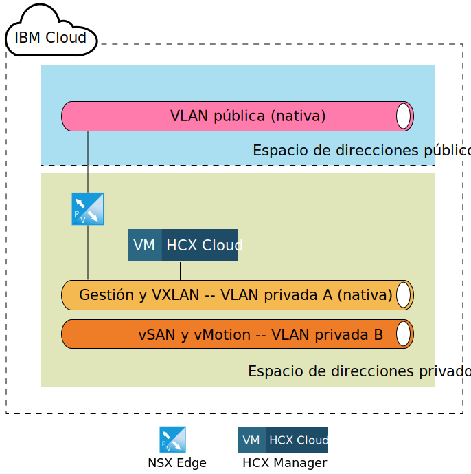
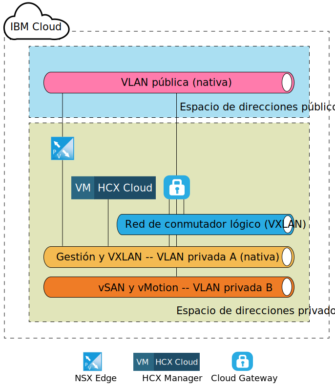
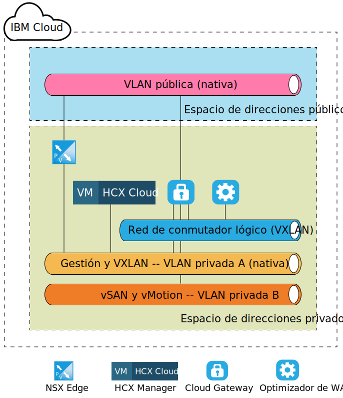
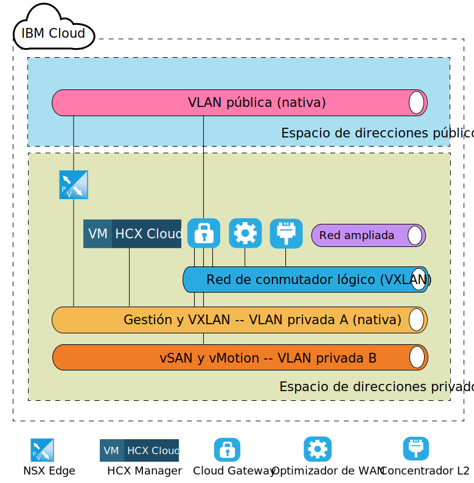

---

copyright:

  years:  2016, 2019

lastupdated: "2019-02-15"

---
# Arquitectura de destino a nivel de componente de VMware HCX on IBM Cloud
{: #hcx-archi-target}

En esta sección se describe la arquitectura de cada componente de HCX que se despliega en el entorno de IBM Cloud. Se describe el modelo de despliegue de estrella (destino) en IBM Cloud.

## NSX Edge
{: #hcx-archi-target-nsx-edge}

El primer componente que se configura en IBM Cloud es un par de máquinas virtuales NSX Edge. Es importante tener en cuenta que todos los despliegues de soluciones IBM Cloud for VMware instalan y configuran un dispositivo de extremo (Edge) para la comunicación de salida de IBM CloudDriver. Sin embargo, si bien este ESG se puede reutilizar para las comunicaciones de Hybrid Cloud Services, se recomienda que se despliegue un par nuevo.

Las máquinas virtuales NSX Edge se configuran como un par Activo/Pasivo de dispositivos X-Large NSX Edge. Estos dispositivos se utilizan para conectar con el entorno de IBM Cloud VMware utilizando una conexión pública a internet. El dispositivo X-Large NSX Edge se ha elegido para el entorno interno ya que se adapta a entornos que tienen equilibrador de carga con millones de sesiones simultáneas que no necesariamente requieren un alto rendimiento. Como parte del proceso de configuración, el dispositivo NSX Edge se conecta a la VLAN pública de IBM Cloud y a la VLAN privada de IBM Cloud diseñada para la infraestructura de gestión.

Tabla 1. Despliegue de NSX Edge

| Componente | Configuración |
|-----------|---------------|
| CPU       | 6 vCPU        |
| RAM       | 8 GB          |
| Disco      | VMDK de 4,5 GB que reside en almacenamiento compartido con 4 GB de intercambio |

Puesto que los dispositivos NSX Edge se configuran como activos/pasivos en el despliegue tanto interno como dedicado, el usuario debe crear reglas antiafinidad de vSphere Distributed Resource Scheduler (DRS) para garantizar que los NSX Edges no se ejecuten en el mismo host que se dispositivo homólogo respectivo.

Tabla 2. Reglas antiafinidad de NSX Edge

| Campo     | Valor         |
|-----------|---------------|
| Nombre      | NSX Edge External Gateway |
| Tipo      | Máquinas virtuales separadas |
| Miembros   | NSX Edge 1 |
|           | NSX Edge 2 |

Además de los dispositivos NSX Edge desplegados en IBM Cloud, se despliega el dispositivo virtual HCX Manager si se solicita el servicio VMware HCX on IBM Cloud. Después del despliegue de este dispositivo, el NSX Edge está habilitado para utilizar el equilibrio de carga y se configura con perfiles de aplicación que utilizan un certificado para la conexión de entrada desde el origen. El NSX Edge también se configura con agrupaciones de equilibrio de carga que apuntan a los dispositivos HCX Manager, vCenter y PSC. Además, se crea un servidor virtual con una dirección IP virtual (VIP) en la interfaz pública con reglas que conectan las agrupaciones con VIP. En las tablas siguientes se muestra un ejemplo de configuración de servidor virtual y de configuración de agrupación en el NSX Edge.

Tabla 3. Configuración de VIP para NSX Edge - Servidores virtuales

| Campo     | Valor         |
|-----------|---------------|
| ID de servidor virtual | virtualServer-1 |
| Nombre | HCX-VIP |
| Descripción | LB-VIP |
| Agrupación predeterminada | pool-1 |
| Dirección IP | 254 |
| Protocolo | https |
| Puerto | 443 |

Tabla 4. Configuración de VIP para NSX Edge - Detalles del servidor virtual

| Campo     | Valor         |
|-----------|---------------|
| Descripción | LB-VIP |
| Límite de conexiones | 0 |
| Estado de inserción del servicio | Inhabilitado |
| Perfil de aplicación | applicationProfile-1 |
| Límite de velocidad de conexión | 0 |
| Estado de aceleración | Inhabilitado |
| Estado del perfil de servicio |  |

Tabla 5. Configuración de VIP para NSX Edge - Regla

| Campo     | Valor         |
|-----------|---------------|
| ID de regla | applicationRule-1 |
| Nombre | appRule1 |
| Script | acl isHibridity url_beg /hibridity     acl isWebSso url_beg /websso     acl isVCenter url_beg /vsphere-client     use_backend nspPool001 if isHybridity     use_backend vcPool001 if isVCenter     use_backend ssoPool001 if isWebSso |

Tabla 6. Configuración de agrupación para NSX Edge - Resumen de la agrupación

| ID de agrupación | Nombre       | Algoritmo   | ID de supervisor |
|---------|------------|-------------|------------|
| pool-1  | nspPool001 | ROUND-ROBIN |            |
| pool-3  | ssoPool001 | ROUND-ROBIN |            |
| pool-2  | vcPool001  | ROUND-ROBIN |            |

Tabla 7. Configuración de Pool para NSX Edge - Detalles de la agrupación

| Campo           | Valor     |
|-----------------|-----------|
| Descripción     |           |
| Transparente     | Inhabilitado  |
| Nombre            | HCX-CLOUD |
| Peso          | 1         |
| Puerto del supervisor    | 8443      |
| Número máximo de conexiones | 0         |
| Número mínimo de conexiones | 0         |

## HCX Manager
{: #hcx-archi-target-hcxm}

El componente HCX Manager es el primer dispositivo que se despliega después de que se hayan configurado los dispositivos NSX Edge en el destino. Este dispositivo se utiliza como interfaz principal en el entorno de nube para los componentes de origen y proporciona una interfaz de usuario de red abstraída que se puede utilizar para añadir, editar y suprimir redes, así como para diseñar y configurar el direccionamiento sin uso directo de NSX. Como resultado de la integración de vCenter y NSX, se asigna al dispositivo HCX Manager una dirección IP portátil privada en la VLAN de gestión.

Además, se configura para acceder a vCenter y NSX con un usuario específico. Es importante resaltar que la dirección IP de HCX Manager es la misma dirección IP que se utiliza en el NSX Edge para el equilibrio de carga.

Después de desplegar y configurar el componente de nube de HCX Manager, los componentes de origen crean una conexión con HCX Manager a través de las direcciones VIP configuradas en el ESG de NSX. Una vez que se ha realizado esta conexión, los dispositivos de pasarela de nube y de optimizador de WAN se despliegan en IBM Cloud.

Figura 1. Destino - Dispositivo Hybrid Cloud Services

## Pasarela de nube
{: #hcx-archi-target-cloud-gateway}

Se despliega un dispositivo virtual después de que se haya establecido una conexión entre el origen a la nube de destino. Este dispositivo es la pasarela de nube (CGW) y se utiliza para mantener un canal seguro entre el entorno de vSphere que se ha designado como origen y el entorno de IBM Cloud. La especificación del tamaño del dispositivo CGW que se despliega en IBM Cloud se muestra en la Tabla 3. Despliegue de pasarela de nube.

Tabla 8. Despliegue de pasarela de nube

| Componente | Configuración |
|-----------|---------------|
| CPU       | 8 vCPU        |
| RAM       | 3 GB          |
| Disco      | VMDK de 2,0 GB que reside en almacenamiento compartido |

Esta pasarela de nube se despliega y se configura para que resida en la VLAN de gestión (subred portátil privada), así como en la VLAN de vMotion (subred portátil privada) del despliegue de IBM Cloud for VMware Solutions. Además, se configura otra interfaz en la VLAN pública (portátil pública) para las conexiones que se realizan a través de internet público. No se requiere acceso público si hay una conexión directa (conexión privada en vigor). La última conexión que se asocia a la pasarela de nube es un conmutador lógico que se crea y configura en el sitio.

Este conmutador lógico es una red privada, no direccionable, que se utiliza como canal de comunicación entre la pasarela de nube y el optimizador de WAN que se describe en el apartado 4.1.4 WAN (TBD).

En la figura siguiente se muestra un diagrama general de componentes del dispositivo de pasarela de nube y las conexiones asignadas.

Figura 2. Despliegue de la pasarela de nube

## Optimizador de WAN
{: #hcx-archi-target-wan-opt}

El segundo componente que se despliega es el dispositivo de optimización de WAN. Aunque el dispositivo de optimización de WAN es opcional, realiza el acondicionamiento de la WAN para reducir los efectos de la latencia. También incorpora correcciones de errores de reenvío para evitar escenarios de pérdida de paquetes y desduplicación de los patrones de tráfico redundantes.

En conjunto, estos recursos reducen el uso de ancho de banda y garantizan un uso eficiente de la capacidad de red disponible para acelerar la transferencia de datos a y desde IBM Cloud. El optimizador de WAN utiliza mucho disco y necesita la cantidad suficiente de IOPS para funcionar correctamente. Como resultado, el optimizador de WAN reside en el almacenamiento vSAN en el entorno VCF y en el almacenamiento de resistencia y da soporte a más de 2.000 IOPS en un despliegue de vCenter Server. La especificación de tamaño del dispositivo de optimización de WAN se muestra en la tabla siguiente.

Tabla 9. tamaño del dispositivo optimizador de WAN

| Componente | Configuración |
|-----------|---------------|
| CPU       | 8 vCPU        |
| RAM       | 14 GB          |
| Disco      | VMDK de 30 GB + VMDK de 70 GB residente en almacenamiento compartido |

A diferencia de la pasarela de nube, el dispositivo de optimización de WAN solo se conecta a un conmutador lógico para habilitar la comunicación entre sí mismo y la pasarela de nube. Este dispositivo es necesario si se utiliza la optimización de WAN en el entorno de origen. Consulte la figura siguiente para ver una vista del diseño de red.

Figura 3. Despliegue del optimizador de WAN

## Concentrador de capa 2
{: #hcx-archi-target-layer-2-conc}

El tercer componente se conoce como concentrador de capa 2 (L2C) y forma parte de los servicios de extensión de red. El L2C es la máquina virtual que permite la extensión de las redes del centro de datos local a IBM Cloud. El L2C extiende las VLAN locales y/o VXLAN locales. Cada L2C puede extender hasta 4096 VLAN. Cada L2C, cuando se emparejan con su homólogo local, puede proporcionar un máximo de 1 Gbps por "flujo" y hasta un agregado de 4 Gbps por VLAN (o VXLAN). Se pueden desplegar más dispositivos L2C si se necesita más rendimiento de red.

Como parte de este diseño, el dispositivo L2C se despliega de modo que un cliente puede extender varias VLAN y VLXAN a IBM Cloud a través de internet público o a través de la red privada mediante Direct Link. La especificación del tamaño del dispositivo L2C en IBM Cloud se muestra en la tabla siguiente.

Tabla 10. Tamaño del dispositivo HT L2C

| Componente | Configuración |
|-----------|---------------|
| CPU       | 8 vCPU        |
| RAM       | 38 GB          |
| Disco      | VMDK de 2 GB en almacenamiento compartido |

El dispositivo L2C se despliega en la VLAN de gestión, así como en la VLAN pública. La interfaz pública se utiliza para el tráfico de aplicaciones que se enlazan para el origen de la red ampliada. Se crean más conexiones, como las redes ampliadas, y se conectan al dispositivo L2C después de que el administrador del origen inicie la extensión de red en IBM Cloud. En la figura siguiente se muestran ejemplos de estas redes y conexiones.

Figura 4. Despliegue del concentrador L2

## Enlaces relacionados
{: #hcx-archi-target-related}

* [Instalación y configuración en el origen](/docs/services/vmwaresolutions/archiref/hcx-archi?topic=vmware-solutions-hcx-archi-source)
