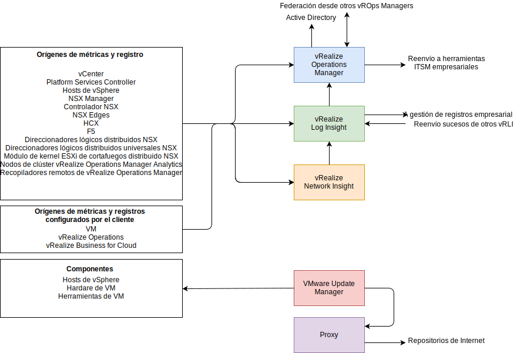
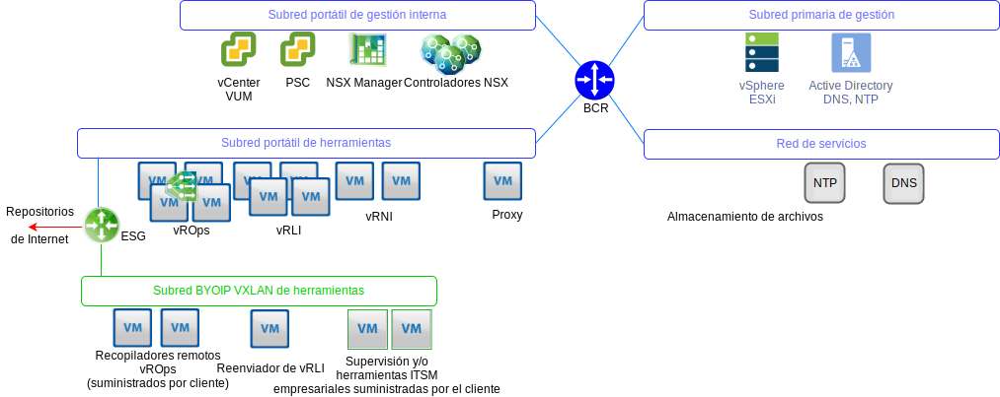

---

copyright:

  years:  2016, 2019

lastupdated: "2019-05-17"

---

# Visión general de la arquitectura de gestión de operaciones
{: #opsmgmt-arch}
La arquitectura de los productos de la capa de gestión de operaciones proporciona una supervisión centralizada con datos de registro cronológico de {{site.data.keyword.vmwaresolutions_full}}. La capa de gestión de operaciones supervisa en tiempo real la infraestructura física, la infraestructura virtual y, opcionalmente, las cargas de trabajo de cálculo del cliente.

A nivel superior, se recopila la información siguiente:
* Datos de topología como, por ejemplo, los objetos de cálculo, de red y de almacenamiento físico y virtual.
* Supervisión de datos, como por ejemplo:
  * Métricas - datos estructurados tales como rendimiento y capacidad
  * Registros - datos no estructurados como por ejemplo sucesos del sistema

## Flujos de gestión de operaciones
{: #opsmgmt-arch-flows}

El diagrama siguiente muestra la interacción y la integración claves de las herramientas de gestión de operaciones.

La gestión de operaciones de {{site.data.keyword.vmwaresolutions_short}} consiste en los pasos siguientes:
* Supervisión - vRealize Operations Manager (vROps) realiza un seguimiento y análisis del funcionamiento de varios objetos en la arquitectura de {{site.data.keyword.vmwaresolutions_short}} mediante algoritmos analíticos. Estos algoritmos ayudan a vROps a aprender y a predecir el comportamiento de estos objetos. Los administradores del sistema acceden a esta información utilizando vistas, informes y paneles de control.

  Cuando hay un problema en el entorno, vROps genera alertas de tres tipos de impacto:
    * Alertas de estado: indican problemas que afectan al estado del entorno y requieren atención inmediata.
    * Alertas de riesgo: indican problemas que no son amenazas inmediatas pero que se deberían abordar próximamente.
    * Alertas de eficiencia: información para mejorar el rendimiento o para reclamar recursos.

  Las alertas de vROps son sucesos que se producen en los objetos supervisados cuando el análisis de datos indica desviaciones de los valores de métricas normales, o cuando se produce un problema con uno de los componentes supervisados. A las alertas de vROps se les asigna una de estas categorías:
    * Crítica: se debe actuar sobre ella inmediatamente.
    * Inmediata: se debe actuar sobre ella lo antes posible.
    * Aviso; se debería controlar cuando el tiempo lo permita.

* Registro - vRealize Log Insight (vRLI) proporciona en tiempo real gestión de registros y análisis de registros con agrupación inteligente basada en aprendizaje automático, búsqueda de alto rendimiento y resolución de problemas en los objetos físicos y virtuales de la arquitectura de {{site.data.keyword.vmwaresolutions_short}}. vRLI recopila datos de los hosts de vSphere utilizando el protocolo syslog y otros productos de VMware, como vCenter Server, para recopilar sucesos, tareas y datos de alarma. Se integra con vRops para enviar sucesos de notificación y habilitar el inicio contextual. Otros objetos de la arquitectura de {{site.data.keyword.vmwaresolutions_short}} capaces de enviar datos de syslog apuntan a vRLI. Opcionalmente, el cliente puede configurar cualquier sistema que sea capaz de enviar datos de syslog para reenviarlos a vRLI.

* Estado de la red - vRealize Network Insight es una herramienta de análisis centrada en la habilitación proactiva de:
  * Supervisión del estado y el rendimiento de la red.
  * Resolución de problemas de extremo a extremo.
  * Visibilidad y análisis de 360°.
  * Gestión de conformidad basada en la microsegmentación.

* Aplicación de parches y actualización - vSphere Update Manager (VUM) proporciona una gestión centralizada y automatizada de parches y versiones para hosts de VMware vSphere y máquinas virtuales (VM) (ni SO ni apps).

## Redes de gestión de operaciones
{: #opsmgmt-arch-network}

A continuación se muestra el diagrama de visión general de red:

* Se suministra una subred portátil privada de herramientas para proporcionar un espacio de direcciones IP de {{site.data.keyword.cloud_notm}}, que se utiliza para el suministro inicial de las máquinas virtuales de herramientas, pero luego pasa a ser responsabilidad del cliente gestionar el espacio de direcciones IP para escalar hacia arriba las herramientas. Las máquinas virtuales de esta subred necesitan acceso a los componentes alojados en las subredes de gestión y de gestión interna.
* La subred VXLAN de herramientas se utiliza para proporcionar un espacio de direcciones IP de BYOIP que se utiliza para el suministro inicial de las máquinas virtuales de herramientas, pero luego pasa a ser responsabilidad del cliente gestionar el espacio de direcciones IP para escalar hacia arriba las herramientas. Las máquinas virtuales de esta subred necesitan acceso a los componentes alojados en las subredes superpuestas. ESG proporciona NAT entre los espacios de direcciones de {{site.data.keyword.cloud_notm}} y de BYOIP.
* Los recopiladores remotos de vROps los despliega el cliente si desea aprovechar las vROps para supervisar sus máquinas virtuales de cálculo.
* Los reenviadores de vRLI retransmiten los mensajes de los componentes de superposición al clúster vRLI. El cliente también puede configurar sus máquinas virtuales de cálculo para que utilicen estos reenviadores, si es necesario.
* VMware Update Manager (VUM) permite actualizar los hosts de vSphere y el hardware y las herramientas de VM. VUM utiliza el proxy para obtener acceso a los repositorios de Internet.

vROps recopila datos de los objetos del entorno. Cada fragmento de datos recopilado se denomina observación o valor de métrica. vROps utiliza el adaptador de vCenter para recopilar métricas en bruto de vCenter. Además de las métricas que recopila, vROps calcula métricas de capacidad, métricas de identificador y métricas para supervisar el estado del sistema.  Las definiciones de alertas son una combinación de síntomas y recomendaciones que identifican áreas problemáticas y generan alertas sobre las que puede actuar para dichas áreas.

## Componentes supervisados
{: #opsmgmt-arch-components}

### Supervisión de vCenter
{: #opsmgmt-arch-components-vcenter}

La supervisión de vCenter se realiza con vROps y el paquete de gestión de estado de VMware SDDC. vRLI recopila los datos de registro de vCenter, y el paquete de contenido de vSphere añade un conocimiento específico a los registros y, a su vez, envía alertas a los vROP.

El Paquete de gestión de estado de VMware SDDC supervisa la pila de gestión de SDDC y proporciona identificadores del estado y alertas relacionadas con la configuración y la conformidad de los componentes de producto de SDDC, incluyendo vCenter.

### Supervisión de hosts de vSphere
{: #opsmgmt-arch-components-hosts}

La supervisión de los hosts de vSphere se lleva a cabo con vROps a través de vCenter y la colección de registros a través de vRLI.

### Supervisión de vSAN
{: #opsmgmt-arch-components-vsan}

Para supervisar vSAN, se utiliza vROps y vRLI. En vCenter hay un conjunto adicional de Comprobaciones de estado de vSAN que se pueden utilizar. La instalación del paquete de gestión para vSAN proporciona paneles de control adicionales para ayudar en la supervisión de vSAN.

vROps genera una alerta si se produce un problema en los componentes de producto SDDC en la red de área de almacenamiento que supervisa el adaptador de VMware vSAN. Se pasa una alerta relacionada con la conformidad y el estado de la configuración a través del paquete de gestión VMware SDDC Health Solution desde el paquete de gestión de vSAN de VMware. Para supervisar vSAN con el paquete de gestión de vSAN de vROps, se hace a través del dispositivo vCenter utilizando un adaptador de vSAN. El intervalo de recopilación predeterminado es de cinco minutos y el adaptador de vSAN también recopila las métricas del Servicio de comprobación de estado y del Servicio de rendimiento de los objetos de vSphere. El intervalo del servicio de comprobación de estado se configura en la interfaz de vSphere y, de forma predeterminada, es de 60 minutos.

Para asegurarse de que el adaptador de vSAN puede recopilar todos los datos de rendimiento, el servicio de rendimiento de vSAN debe estar habilitado en vSphere.

### Supervisión de NSX para vSphere
{: #opsmgmt-arch-components-nsxv}

Para supervisar NSX, se implementan las herramientas siguientes:
* vRealize Operations Manager (vROps)
* vRealize Log Insight (vRLI)
* vRealize Network Insight (vRNI)

Esto permite a los administradores del sistema supervisar, gestionar y resolver problemas de VMware NSX. El Paquete de gestión de vROps para VMware NSX proporciona visibilidad en la topología de red. Los paneles de control NSX proporcionan una visión general rápida del entorno NSX y del estado de sus componentes. La correlación entre los objetos NSX y los objetos vSphere permite identificar y resolver problemas más fácilmente.

vROps utiliza el paquete de gestión para sondear VMware NSX y obtener datos de configuración, rendimiento y soporte. En nombre de vROps, el paquete de gestión convierte las solicitudes de sondeo en llamadas de API REST para recuperar los datos necesarios de NSX Manager.

Se deben configurar los componentes de NSX para enviar syslog a vRLI.

* NSX Manager - [Especificar el servidor de Syslog](https://pubs.vmware.com/NSX-6/topic/com.vmware.nsx.admin.doc/GUID-EA70974C-07F8-469D-8A9D-0ED54F0C8F34.html#GUID-EA70974C-07F8-469D-8A9D-0ED54F0C8F34){:new_window}.
* Controladores NSX - [Configurar los Controladores NSX](https://kb.vmware.com/s/article/2092228){:new_window}.
* NSX Edge - [Configurar servidores syslog remotos](https://pubs.vmware.com/NSX-6/topic/com.vmware.nsx.admin.doc/GUID-9C25E097-E2CC-461A-9DA6-E8118D16EE62.html#GUID-9C25E097-E2CC-461A-9DA6-E8118D16EE62){:new_window}.
* Cortafuegos - Debe configurar el servidor syslog remoto para cada clúster que tenga el cortafuegos habilitado. El servidor syslog remoto se especifica en el atributo `Syslog.global.logHost`.

Se puede utilizar NSX Flow Monitoring en el gestor de NSX para determinar qué flujos se aprueban y cuáles se bloquean. Si es necesario, se puede configurar la duplicación de puertos para un conmutador distribuido de vSphere.

### Supervisión de NSX-T
{: #opsmgmt-arch-components-nsxt}

Para supervisar NSX-T, se implementan las herramientas siguientes:

* vRealize Operations Manager (vROps)
* vRealize Log Insight (vRLI)

El Paquete de gestión de estado de VMware SDDC supervisa lo siguiente:
* Conmutadores lógicos - Supervisa el estado de administración de los conmutadores lógicos.
* Clúster de controlador - Supervisa el número de nodos del clúster desplegado para HA y mantiene el quórum.
* Nodos de controlador - Supervisa la conectividad de los nodos con el nodo de clúster y de gestión del controlador.
* Nodos Edge - Supervisa el estado de ejecución de los nodos de extremo y su conectividad con los nodos de clúster y de gestión del controlador.
* Servicios de gestión de NSX-T.
* Servicio de direccionador T0 - Supervisa los servicios de ruta estáticos, NAT, BGP, BFD, y los servicios de redistribución de ruta.
* Servicio de direccionador T1 - Supervisa los servicios de ruta estáticos, NAT, y los servicios de anuncio de rutas.

### Supervisión de vRealize Operations Manager
{: #opsmgmt-arch-components-vrops}

El Paquete de gestión de estado de VMware SDDC tiene definición de alertas para los siguientes sucesos:
* El dimensionamiento actual de los nodos de vRealize Operations Manager no es suficiente para una carga determinada.
* La configuración de nodos de clúster no sigue la directriz de dimensionamiento de vRealize Operations Manager.
* El dimensionamiento actual del recopilador remoto no es suficiente para una carga determinada.
* La configuración del recopilador remoto no sigue la directriz de dimensionamiento de vRealize Operations Manager.
* El clúster de operaciones de vRealize ha sobrepasado el número recomendado de nodos de análisis.

### Supervisión de vRealize Log Insight
{: #opsmgmt-arch-components-vrli}

vRLI admite alertas que desencadenan notificaciones sobre su estado y genera notificaciones cuando se produce un suceso de sistema importante, por ejemplo, cuando el espacio de disco está casi agotado y vRealize Log Insight debe empezar a suprimir o archivar archivos de registro antiguos.

## Requisitos del sistema
{: #opsmgmt-arch-requirements}

El diseño utiliza la siguiente cantidad y tamaño de dispositivos:

Tabla 1. Resumen de requisitos de sistema de las herramientas de operaciones

||vROps|vRLI|vRNI|Proxy|
|---|---|---|---|---|---|
|Cantidad de VM|4|4|1+1|1|
|vCPU|8|8|4 + 8|4|
|GB de RAM|32|16|12 + 32|0,5|
|GB de Disco|254|1042|158 + 1000|80|

## Versiones de software
{: #opsmgmt-arch-versions}

Tabla 2. Versiones de software de las herramientas operativas

|Nombre de producto|Versión|
|---|---|
|VMware vRealize Operations Manager Advanced o superior|7.0|
|vRealize Operations Management Pack for NSX for vSphere|3.5.2|
|vRealize Operations Management Pack for Storage Devices|7.0.0|
|vRealize Operations Management Pack for Site Recovery Manager|8.1.1|
|VMware vRealize Log Insight|4.7|
|vRealize Log Insight Content Pack for NSX for vSphere|3.8|

## Enlaces relacionados
{: #opsmgmt-arch-components-related}

* [Visión general de vCenter Server on {{site.data.keyword.cloud_notm}} con el paquete híbrido (Hybridity)](/docs/services/vmwaresolutions/archiref/vcs?topic=vmware-solutions-vcs-hybridity-intro)
