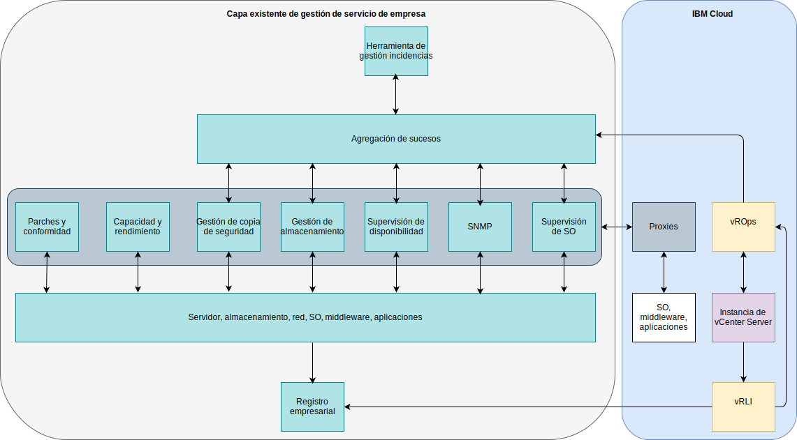

---

copyright:

  years:  2016, 2019

lastupdated: "2019-08-05"

---

# Integración
{: #opsmgmt-integration}

Este tema se centra en la capa de gestión operativa del diseño. Sin embargo, es posible que algunas empresas deseen integrar esta capa con su capa de gestión de servicios. En esta sección se proporcionan directrices para esta integración. En este diseño, vROps es el punto central donde afloran todas las alertas.

Hay las siguientes categorías de integración posibles:
* Dirección norte (northbound, ascendente): integración desde vROps hacia otras herramientas:
  * Notificación de alertas a un servidor SMTP o a herramientas como Slack o PagerDuty.
  * Integración de incidencias en una herramienta de servicio de atención al usuario como ServiceNow.
  * Iniciación de flujos de trabajo de vRealize Orchestrator para solucionar un problema descubierto por vROps.
* Dirección sur (southbound, descendente): Integración desde las herramientas de gestión de servicios o de gestión de nube:
  * vRealize Automation configura la supervisión cuando se añade nueva carga de trabajo.
  * Actualizar los objetos de vROps con enriquecimiento de sucesos de orígenes externos.

vROps proporciona los siguientes plug-ins de alertas de salida:
* Acción automatizada: habilitado de forma predeterminada.
* Correo electrónico estándar: utiliza el protocolo simple de transferencia de correo (SMTP) para enviar por correo electrónico las notificaciones de alertas de vRealize Operations Manager a los individuos interesados.
* Condición de excepción SNMP: alertas de registros en el registrar de condición de excepción SNMP.
* Notificación REST: envía alertas de vROps a otra aplicación habilitada para REST donde debe haber creado un servicio web REST para aceptar estos mensajes.
* Archivo de registro: permite a vROps registrar alertas en un archivo en cada uno de los nodos de vRealize Operations Manager. Si ha instalado vRealize Operations Manager como un clúster de varios nodos, cada nodo procesa y registra las alertas para los objetos que supervisa. Cada nodo registra las alertas para los objetos que procesa.
* Notificación de Smarts SAM: envía notificaciones de alerta a EMC Smarts Server Assurance Manager.
* Recurso compartido de red: envía informes a una ubicación compartida, admite SMB versión 2.0.

Las notificaciones son notificaciones de alerta que cumplen los criterios de filtro de las reglas de notificación y se envían en dirección norte (northbound), a sistemas externos. Se configuran reglas de notificación para las alertas de salida necesarias de forma que se pueden filtrar antes de enviarlas al sistema externo seleccionado. Para gestionar estas reglas se utiliza la lista de notificaciones.

## Caso de uso de integración
{: #opsmgmt-integration-usecase}

Este caso de uso de ejemplo se basa en una capa de gestión de servicios genérica existente que utiliza una empresa. El cliente ha suministrado una instancia de vCenter Server con la opción Operations Management, y quiere integrar esta plataforma en su plataforma de gestión de servicios. Utilizan un sistema de agregación de sucesos para integrar las alertas generadas a partir de las herramientas de supervisión específicas del dominio:

* Un conjunto de herramientas para supervisar el sistema operativo, el middleware y las aplicaciones a través de sus cargas de trabajo de UNIX, Linux y Windows, pero esta herramienta no supervisa los componentes de infraestructura como VMware, los dispositivos de red ni el almacenamiento.
* Un gestor SNMP para recibir condiciones de excepción SNMP procedentes de su infraestructura de red. Esta herramienta también recopila las métricas SNMP para habilitar las alertas de rendimiento y capacidad.
* Una herramienta de gestión de copias de seguridad para gestionar sus copias de seguridad.
* Herramientas de gestión de almacenamiento para gestionar sus matrices de almacenamiento.
* Una herramienta de disponibilidad que utiliza ping para comprobar la accesibilidad de los dispositivos.

Su capa de gestión de servicios también consiste en:

* Una herramienta de capacidad y rendimiento de servidor para recopilar métricas para informes.
* Un servidor de aplicación de parches y de conformidad para actualizar el sistema operativo, el middleware y las aplicaciones y para medir la conformidad en estas plataformas.
* Una herramienta de incidencias que se utiliza para gestionar incidencias de problemas y cambios. Esta herramienta es también la base de datos de gestión de configuración (CMDB - Configuration Management Database) de la empresa. La herramienta puede enviar correos electrónicos a los equipos de operaciones, y también mensajes SMS.
* Un sistema de registro empresarial, que captura registros de todos los sistemas, gestionado por el equipo de seguridad.

Ahora que tienen vROps, integrarán esta herramienta utilizando la notificación en dirección norte (northbound) utilizando el plug-in de condición de excepción SNMP. Para integrar vROps, las condiciones de excepción que envía vROps tienen que analizarse de forma que el entorno de gestión de sucesos del cliente pueda crear alertas y enriquecerlo. El equipo de la herramienta de gestión ha descargado las VMware MIB desde VMware y las ha instalado en el entorno de gestión de sucesos.

vRLI está configurado para reenviar todos los sucesos al sistema de registro empresarial de acuerdo con las políticas del cliente.

El cliente quiere utilizar su sistema operativo, su middleware y sus herramientas de supervisión de aplicaciones existentes, por lo que ha utilizado proxies en {{site.data.keyword.cloud}} para recopilar y reenviar métricas y alertas.

## Enlaces relacionados
{: #opsmgmt-integration-related}

* [API RESTful de operaciones de vRealize](https://docs.vmware.com/en/vRealize-Operations-Manager/7.0/vrealize-operations-manager-70-api-guide.pdf){:new_window}
* [Explorador de API de código VMware](https://code.vmware.com/apis?socv=1&numPerPage=164&sorter=pv){:new_window}
* [Herramienta de recopilación de cliente de Postman para operaciones vRealize](https://code.vmware.com/samples/4663/postman-client-collection-for-vrealize-operations-rest-apis){:new_window}
* [Blog de VMware PowerCLI](https://blogs.vmware.com/PowerCLI/2016/05/getting-started-with-powercli-for-vrealize-operations-vr-ops.html){:new_window}
* [Correctores de compatibilidad para webhooks](https://blogs.vmware.com/management/2017/01/vrealize-webhooks-infinite-integrations.html){:new_window}
