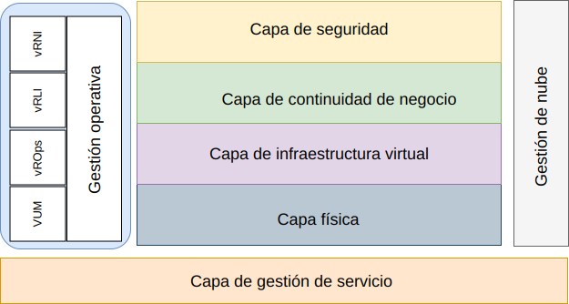

---

copyright:

  years:  2016, 2019

lastupdated: "2019-05-17"

---

# Introducción
{: #opsmgmt-intro}

Esta arquitectura de referencia es para guiar y restringir las instanciaciones de las arquitecturas de {{site.data.keyword.vmwaresolutions_full}}.

También:
* Proporciona un lenguaje común para los distintos interesados.
* Proporciona coherencia en la implementación de la tecnología para resolver problemas.
* Da soporte a la validación de soluciones contra la arquitectura de referencia probada.
* Incentiva la adhesión a estándares, especificaciones y patrones comunes.

El objetivo principal de esta arquitectura de referencia es documentar la capacidad de Gestión de operaciones para proporcionar supervisión y alertas del entorno de {{site.data.keyword.vmwaresolutions_short}} desplegado para el cliente. El conjunto de herramientas se ha configurado con los parámetros y umbrales de mejores prácticas que puede utilizar el equipo de operaciones del cliente.

El diseño permite al cliente completar las tareas siguientes:
* Escalar hacia arriba o hacia abajo según las necesidades.
* Instalar sus propias herramientas de supervisión de empresa según lo dispuesto en sus políticas operativas.
* Integrar las herramientas en la plataforma de gestión de servicios de TI (ITSM) de su propia empresa.

## Gestión de operaciones
{: #opsmgmt-intro-opsmgmt}

{{site.data.keyword.vmwaresolutions_short}} se basa en las capas arquitectónicas siguientes:

* Capa física - La capa inferior de la arquitectura es la capa física que consta de los componentes de cálculo, de red y de almacenamiento, que se aprovechan de {{site.data.keyword.cloud_notm}}:
  * {{site.data.keyword.baremetal_short}} que ejecuta las cargas de trabajo de gestión, edge y de cálculo.
  * Red de {{site.data.keyword.cloud_notm}} que consiste en VLAN, subredes, Direccionadores de cliente frontales y de fondo (FCR/BCR - Frontend and Backend Customer Routers).
  * Almacenamiento de vSAN, que es un almacén de datos consolidado de los SSD en el almacenamiento {{site.data.keyword.baremetal_short}} o en el almacenamiento resistente.

* Capa de infraestructura virtual - La capa de infraestructura virtual se ejecuta en la parte superior de los componentes de la capa física. La capa de infraestructura virtual controla el acceso a la infraestructura física subyacente, y controla y asigna recursos a las cargas de trabajo de gestión y de cálculo. Las cargas de trabajo de gestión consisten en elementos de la propia capa de infraestructura virtual, junto con elementos de las capas de gestión de nube, gestión de servicios, continuidad de negocio y seguridad.

* Capa de continuidad de negocio – Esta capa contiene elementos para dar soporte a la continuidad de negocio proporcionando copia de seguridad de datos, restauración y recuperación tras desastre. Para obtener más información, consulte la arquitectura de copia de seguridad y restauración de {{site.data.keyword.vmwaresolutions_short}} y las arquitecturas de referencia de recuperación tras desastre de Veeam, Spectrum Protect Plus y Zerto.

* Capa de seguridad – Esta capa contiene los elementos para reducir el riesgo y aumentar la conformidad. Para obtener más información, consulte las arquitecturas de referencia Fortinet, F5, NSX, HyTrust y Caveonix.

Este documento añade la siguiente capa a la arquitectura {{site.data.keyword.vmwaresolutions_short}}:

* Capa de Gestión de operaciones: la arquitectura de la capa de gestión de operaciones incluye los componentes de gestión que proporcionan soporte para las capas físicas y virtuales y, opcionalmente, las cargas de trabajo de cálculo en tiempo real. La capa de gestión de operaciones entiende la topología de {{site.data.keyword.vmwaresolutions_short}}: recursos físicos, virtuales, de cálculo, de red y de almacenamiento. La capa de gestión de operaciones consiste principalmente en la funcionalidad de supervisión y registro.

  La información se recopila de las formas siguientes:
    * Métricas - datos estructurados tales como rendimiento y capacidad
    * Registros - datos no estructurados como por ejemplo sucesos del sistema

La capa de Gestión de operaciones está formada por las herramientas siguientes:

* vRealize Operations Manager (vROps) - vROps utiliza los datos recopilados de los recursos del sistema (objetos) para identificar problemas en los componentes del sistema supervisado y, para muchos problemas, sugiere acciones correctivas que hay que realizar para solucionar el problema. Para los problemas más difíciles, vROps ofrece herramientas analíticas potentes para: revelar problemas ocultos, investigar problemas técnicos complejos, identificar tendencias o detallar más para medir la salud de un objeto.
* vRealize Log Insight (vRLI) - vRLI proporciona gestión inteligente de registros para la infraestructura y las aplicaciones en cualquier entorno. Esta solución de gestión de registros altamente escalable proporciona paneles de control intuitivos y prácticos, analíticas sofisticadas y extensibilidad a terceros a través de entornos físicos, virtuales y de nube.
* vRealize Network Insight (vRNI) - vRNI ofrece operaciones inteligentes para redes definidas por software y para la seguridad. Permite la visibilidad entre redes virtuales y redes físicas, proporciona vistas operativas para gestionar y escalar despliegues de NSX y acelera la planificación y el despliegue de la microsegmentación.
* VMware Update Manager (VUM) - VUM permite la gestión centralizada y automatizada de parches y versiones para VMware vSphere y ofrece actualización y aplicación de parches de hosts de vSphere, instalación y actualización de software de terceros en hosts, y actualización de hardware de VM, Herramientas de VMware y aplicaciones virtuales.

Para una arquitectura de empresa completa, es posible que se necesiten las capas siguientes, pero están fuera de la arquitectura {{site.data.keyword.vmwaresolutions_short}}:

* Capa de gestión de nube - La capa de gestión de nube es la capa superior de la arquitectura de nube. Esta capa solicita recursos y orquesta las capas inferiores a partir de una interfaz de usuario o interfaz de programación de aplicaciones (API). vRealize Automation habilita la automatización de la nube en {{site.data.keyword.cloud_notm}}. Para obtener más información, consulte [Arquitectura de referencia vRealize Automation (vRA)](https://www.ibm.com/cloud/garage/files/IBM_Cloud_for_VMware_Solutions_VRA_Architecture_v1.pdf){:new_window}.

Para obtener más información sobre cómo se puede ampliar esta arquitectura con la integración de Chef, consulte [Arquitectura de referencia de vRA con integración de Chef](https://www.ibm.com/cloud/garage/files/IBM_Cloud_for_VMware_Solutions_VRA_Chef_Integration_Architecture.pdf){:new_window}.

* Capa de gestión de servicios – Esta capa se centra en el ciclo de vida completo del entorno de TI y se implementa generalmente a nivel de empresa, combinando entradas de todos los silos de Operaciones y tecnologías de TI. Esta capa, tradicionalmente se ha incluido en la arquitectura de infraestructuras de gestión de servicios de TI (ITSM) como por ejemplo: IT Infrastructure Library (ITIL) y la ISO/IEC 20000, que son un marco de las mejores prácticas para proporcionar servicios de TI a través de los procesos y las fases del ciclo de vida del servicio de TI. A nivel de producto, ITSM está tipificado por un sistema de gestión de flujos de trabajo centralizado para manejar incidentes, solicitudes de servicio, problemas, cambios y conocimiento, conectado a una base de datos de gestión de la configuración.

## Enlaces relacionados
{: #opsmgmt-intro-related}

* [Visión general de vCenter Server on {{site.data.keyword.cloud_notm}} con el paquete híbrido (Hybridity)](/docs/services/vmwaresolutions/archiref/vcs?topic=vmware-solutions-vcs-hybridity-intro)
