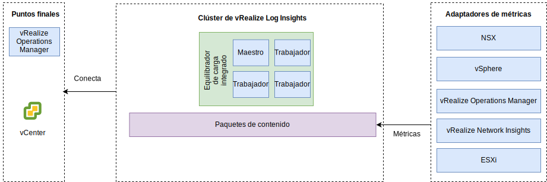

---

copyright:

  years:  2016, 2019

lastupdated: "2019-05-17"

---

# vRealize Log Insights
{: #opsmgmt-vrli}

El entorno vRealize Log Insight (vRLI) consiste en cuatro máquinas virtuales (VM) con un equilibrador de carga integrado.

Este patrón admite:
* 30.000 máquinas virtuales
* 75 GB de ingesta de registros al día
* 5.000 sucesos por segundo

vRealize Log Insight (vRLI) habilita el registro en tiempo real de componentes en el entorno de {{site.data.keyword.vmwaresolutions_full}}. El diseño despliega un clúster de vRLI que consta de cuatro nodos en cada instancia. Esta configuración ofrece disponibilidad continuada y mayores tasas de ingesta de registros.

En este diseño, cada ubicación tiene un clúster vRLI independiente desplegado en el clúster de gestión. El clúster vRLI se despliega en la subred de herramientas utilizando direcciones IP portátiles de {{site.data.keyword.cloud_notm}}. Esto facilita la comunicación a todos los componentes que se redirigen hacia fuera del espacio de direcciones RFC1918 de {{site.data.keyword.cloud_notm}}. Estos componentes incluyen: hosts de vSphere, vCenter, Platform Services Controller, NSX Manager, y Controladores NSX. Un clúster vRLI contiene un nodo maestro y, como mínimo, dos nodos de trabajo con un equilibrador de carga integrado.

* Nodo maestro: Nodo inicial obligatorio en el clúster. El Nodo maestro es responsable de las consultas y de la ingesta de registros. La interfaz de usuario web del nodo maestro es el único panel de interacción con el clúster de vRealize Log Insight. Todas las consultas sobre datos se dirigen al maestro que, a su vez distribuye la carga de trabajo a los Trabajadores.
* Nodo trabajador: se requieren al menos tres nodos mínimos para formar un clúster con la posibilidad de añadir más trabajadores para escalarlo. Un nodo trabajador ingiere registros y almacena registros localmente.
* Equilibrador de carga integrado: Proporciona alta disponibilidad utilizando configuración de equilibrio de carga de propia (no se requiere ningún equilibrador de carga externo).
* Reenviador de Log Insight: Se despliega para recibir registros de los componentes subyacentes de NSX. Además, puede aprovecharlo un cliente si desea enviar registros desde las máquinas virtuales de cálculo. El Reenviador de Log Insight es un único Nodo maestro de vRealize Log Insight que se utiliza como un agregador de syslog remoto para reenviar alertas al clúster vRLI. Mientras que los respaldados por VXLAN se dirigen fuera del espacio de direcciones BYOIP, se deben implementar reglas NAT en NSX ESG. Hay los tamaños siguientes disponibles y se selecciona el adecuado:

 * Pequeño – 2000 sucesos por segundo
 * Medio – 5000 sucesos por segundo
 * Grande – 15000 sucesos por segundo

vRLI recopila registros para proporcionar información de supervisión sobre el entorno desde una ubicación central.

vRLI recopila sucesos de registro de los siguientes componentes de infraestructura virtual y gestión de nube (clientes de registro):
* vCenter
* Hosts ESXi
* NSX Manager
* Controladores NSX
* Pasarelas de servicio Edge de NSX
* Instancias de direccionador lógico distribuido NSX
* Direccionadores lógicos distribuidos universales NSX
* Módulo de kernel ESXi de cortafuegos distribuido NSX
* Nodos de clúster de vRealize Operations Manager Analytics y recopiladores remotos
* Instancia de vRLI en las demás instancias como resultado del reenvío de sucesos

Los siguientes clientes de registro están soportados pero no integrados en este diseño:
* Dispositivo Realize Automation
* vRealize Orchestrator (integrado en el dispositivo vRealize Automation)
* Servidor web de vRealize IaaS
* Servidor de gestión de vRealize IaaS
* DEM de vRealize IaaS
* Agentes proxy de vRealize IaaS
* Servidor de vRealize Business
* Recopilador de datos de vRealize Business

## Requisitos del sistema
{: #opsmgmt-vrli-requirements}

Para alojar todos los datos de registro de los orígenes de registro en el entorno, los nodos vRLI se tienen que dimensionar correctamente. Este diseño se basa en el dispositivo de tamaño medio:

Tabla 1. Valores de sistema de los nodos Maestro y de Réplica de Log Insight

| Atributo                | Especificación                     |
| ------------------------ | --------------------------------- |
| vCPU                     | 8                                 |
| Memoria                   | 18 GB                             |
| Disco (aprovisionamiento grueso) | 530 GB (490 GB para almacenamiento de sucesos) |

Cada dispositivo virtual vRLI tiene tres discos virtuales predeterminados y puede utilizar más discos virtuales para el almacenamiento.
* Disco duro 1 - 20 GB para el sistema de archivos raíz
* Disco duro 2 - 510 GB para un despliegue de tamaño medio y contiene dos particiones:
  * /storage/var - para registros del sistema
  * /storage/core storage - para registros recopilados (aproximadamente 475 GB de espacio de disco disponible)

## Redes
{: #opsmgmt-vrli-network}

El despliegue del dispositivo vRLI requiere tres direcciones IP de la subred de herramientas privada portátil. vRLI requiere acceso a:
* Dispositivo vCenter
* Dispositivo vRealize Log Insight
* Dispositivos NSX-V/T
* Expansión de herramientas VXLAN
* Redes de clientes
* Servidor NTP (time.services.softlayer.com)
* Active Directory/DNS de {{site.data.keyword.vmwaresolutions_short}}
* Los recopiladores remotos requieren reglas NAT en NSX ESG para habilitar la conectividad con el nodo maestro, la réplica de nodo maestro y los nodos de datos

## Puertos
{: #opsmgmt-vrli-ports}

Tabla 2. Puertos de Log Insight

| Descripción                                                   | Puerto       | Protocolo |
| ------------------------------------------------------------- | ---------- | -------- |
| Tráfico de syslog de salida configurado como destino del Reenviador | 514        | TCP, UDP |
| Datos de Syslog por SSL                                          | 1514, 6514 | TCP      |
| API de ingesta de Log Insight                                     | 9000       | TCP      |
| API de ingesta de Log Insight por SSL                            | 9543       | TCP      |
| Acceso SSH al dispositivo                                       | 22         | TCP      |
| Interfaz de usuario                                                | 80, 443    | TCP      |
| NTP                                                           | 123        | UDP      |
| SMTP                                                          | 25         | TCP      |
| DNS                                                           | 53         | UDP      |
| LDAP/LDAPS                                                    | 389, 636   | TCP      |
| LDAP GC                                                       | 3268/3269  | TCP      |
| vCenter                                                       | 443        | TCP      |
| Dispositivo vRealize Operations Manager                         | 443        | TCP      |

## Autenticación
{: #opsmgmt-vrli-auth}

La gestión de usuarios de vRLI requiere VMware Identity Manager (vIDM), que se integra con Active Directory. Las cuentas de servicio se utilizan para la comunicación de aplicación a aplicación desde vRealize Operations Manager a los siguientes adaptadores con el conjunto mínimo de permisos que se necesitan para la recopilación de métricas y la correlación de topologías.
* NSX Manager
* vCenter
* vSAN

## Paquetes de contenido en vRealize Log Insight
{: #opsmgmt-vrli-content}

Los paquetes de contenido proporcionan una supervisión granular adicional en la infraestructura virtual y permiten recuperar, extraer y analizar los registros en un formato legible para el usuario. De esta forma, vRLI guarda consultas de registro y alertas, y puede utilizar paneles de control para una supervisión eficiente.

Los siguientes se instalan de forma predeterminada:
* General
* VMware vSphere
* VMware vSAN
* VMware vROps

Este diseño también instala:
* VMware NSX for vSphere
* vRealize Network Insight

Se pueden obtener otros paquetes de contenido de [Paquete de contenido de vRealize Log Insight](https://marketplace.vmware.com/vsx/?contentType=2&listingStyle=table){:new_window}.

## Enlaces relacionados
{: #opsmgmt-vrli-related}

* [Visión general de vCenter Server on {{site.data.keyword.cloud_notm}} con el paquete híbrido (Hybridity)](/docs/services/vmwaresolutions/archiref/vcs?topic=vmware-solutions-vcs-hybridity-intro)
* [Dimensionamiento del dispositivo virtual vRealize Log Insight](https://docs.vmware.com/en/vRealize-Log-Insight/4.6/com.vmware.log-insight.getting-started.doc/GUID-284FC5F4-B832-47A7-912E-D407A760CAE4.html){:new_window}
* [vRealize Log Insight](https://docs.vmware.com/en/vRealize-Log-Insight/index.html){:new_window}
