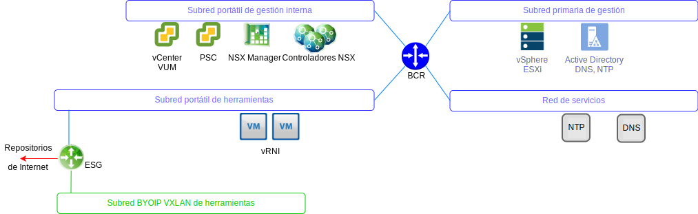
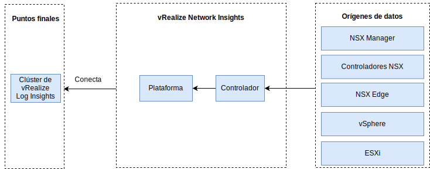

---

copyright:

  years:  2016, 2019

lastupdated: "2019-05-31"

---

# vRealize Network Insight
{: #opsmgmt-vrni}

El entorno vRealize Network Insight (vRNI) consiste en dos máquinas virtuales (VM), una plataforma (UI) y un nodo de controlador.

El dispositivo vRNI Platform proporciona las analíticas, la interfaz de usuario y la gestión de datos y se conecta al dispositivo controlador, que recopila de los diversos orígenes de datos, como NSX Edges, vCenter. Todos los componentes de vRNI utilizan direcciones IP portátiles de {{site.data.keyword.cloud}} privado. vRLI está configurado como el servidor syslog de vRNI.

## Requisitos del sistema
{: #opsmgmt-vrni-requirements}

Esta arquitectura da soporte a 3000 VM utilizando un tamaño de ladrillo medio.

Tabla 1. Requisitos de plataforma de Network Insight

| Atributo | Especificación |
|---|---|
| vCPU | 8 |
| Memoria | 32 GB |
| Disco (aprovisionamiento ligero) | 1 TB |

Tabla 2. Requisitos del sistema de Network Insight Collector

| Atributo | Especificación |
|---|---|
| vCPU | 4 |
| Memoria | 12 GB |
| Disco (aprovisionamiento ligero) | 200 GB |

## Redes
{: #opsmgmt-vrni-network}

El despliegue del dispositivo vRNI requiere dos direcciones IP de la subred de herramientas privada portátil. El vRNI de conectividad de red necesita acceso a:
* Dispositivo vCenter
* Dispositivo vRealize Log Insight
* Dispositivos NSX-V/T
* Expansión de herramientas VXLAN
* Redes de clientes
* Servidor NTP (`time.services.softlayer.com`)
* Active Directory/DNS de {{site.data.keyword.vmwaresolutions_short}}

## Puertos
{: #opsmgmt-vrni-ports}

Tabla 3. Puertos de Network Insight

| Descripción |Puerto | Protocolo |
|---|---|---|
| Comunicación entre las VM de vRealize Network Insight | 443 | HTTPS |
| Servicios que necesitan acceso a Internet svc.ni.vmware.com support2.ni.vmware.com reg.ni.vmware.com|443|HTTPS
| API de ingesta de Log Insight | 9000 | TCP |
| API de ingesta de Log Insight por SSL | 9543 | TCP |
| Interfaz de usuario | 80,443 | TCP |
| NTP |123 | UDP |
| SMTP | 25 | TCP |
| DNS| 53 | UDP |
| LDAP/LDAPS | 389, 636 | TCP |
| ESXi | 2055 | TCP |
| VMware vSphere / NSX | 443 | TCP |

## Autenticación
{: #opsmgmt-vrni-auth}

La autenticación de usuario de vRNI es directamente con un servidor de Active Directory.

## Enlaces relacionados
{: #opsmgmt-vrni-links}

* [Visión general de vCenter Server on {{site.data.keyword.cloud_notm}} con el paquete híbrido (Hybridity)](/docs/services/vmwaresolutions/archiref/vcs?topic=vmware-solutions-vcs-hybridity-intro)
* [vRealize Network Insights](https://docs.vmware.com/en/VMware-vRealize-Network-Insight/index.html){:new_window}
