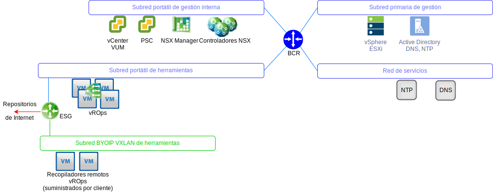
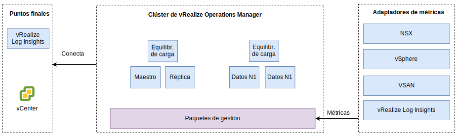

---

copyright:

  years:  2016, 2019

lastupdated: "2019-06-03"

---

# Diseño de vRealize Operations Manager
{: #opsmgmt-vrops}

El clúster de análisis de vROps contiene los nodos que analizan y almacenan los datos de los componentes supervisados y en este despliegue, se despliegan cuatro nodos y dos equilibradores de carga NSX. Este tamaño permite supervisar 30 000 máquinas virtuales y recopilar 9 000 000 de métricas.

El clúster de análisis de 4 nodos consta de los componentes siguientes:
* Nodo maestro – El nodo maestro es el nodo inicial de un clúster de vROps. En un entorno grande, este nodo gestiona todos los demás nodos.
* Réplica del nodo maestro – Este nodo habilita la alta disponibilidad del nodo maestro.
* Nodos de datos – El nodo de datos permite escalar vROps en entornos más grandes, en este diseñar se han desplegado dos.

Además, el diseño utiliza Nodos recopiladores remotos, que funcionan como un servidor proxy/relay para recopilar datos y reenviar los datos recopilados a los nodos maestro o de datos. Se pueden añadir nodos de datos y recopiladores remotos para escalar hacia arriba, según el tamaño del entorno. En el diagrama siguiente se muestra la ubicación de los componentes vROps en redes VLAN/VXLAN.

* El nodo maestro, la réplica del nodo maestro y los nodos de datos se despliegan en la subred de herramientas utilizando Direcciones IP portátiles de {{site.data.keyword.cloud_notm}} para facilitar la comunicación con todos los componentes a los que se dirige fuera del espacio de direcciones {{site.data.keyword.cloud_notm}} RFC1918 incluyendo: hosts de vSphere, vCenter, Platform Services Controller, NSX Manager y Controladores NSX. Se utiliza un equilibrador de carga NSX junto con un VIP para HA.
* Así como las cargas de trabajo de cliente utilizan el direccionamiento IP desde el espacio de direcciones BYOIP, este diseño utiliza los recopiladores remotos alojados en una VXLAN. Estos recopiladores remotos no están configurados como parte de la automatización de {{site.data.keyword.vmwaresolutions_full}} y deben ser implementados manualmente por el cliente.

Se accede al clúster de análisis de vROps utilizando una interfaz de usuario de gestión o utilizando una API, y se integra con los componentes siguientes:
* vCenter
* vRealize Log Insight

El cliente puede integrar manualmente en los productos siguientes, si se han desplegado:
* vRealize Automation
* vRealize Business

vROps recopila datos de los siguientes sitios:
* vSphere: vCenter, Platform Services Controller, hosts de vSphere
* NSX: NSX Manager, Controladores NSX y NSX Edges
* vRLI

El cliente puede configurar los vROps manualmente para que recopilen datos de vRealize Automation y vRealize Business for Cloud.

## Requisitos del sistema
{: #opsmgmt-vrops-requirements}

El clúster de análisis consta de un nodo maestro, un nodo de réplica maestro y dos nodos de datos para permitir el escalado y la alta disponibilidad. Se pueden añadir nodos de datos adicionales para escalar hacia arriba. El clúster de análisis puede escalarse hasta un máximo de ocho nodos de tamaño medio.

Tabla 1. Valores del sistema del nodo maestro y de réplica de Operations Manager

| Atributo | Especificación |
|---|---|
| vCPU | 8 |
| Memoria | 32 GB |
| Disco (aprovisionamiento grueso) | 254 GB |

Tabla 2. Valores del sistema de los nodos de datos de Operations Manager

| Atributo | Especificación |
|---|---|
| vCPU | 8 |
| Memoria | 32 GB |
| Disco (aprovisionamiento grueso) | 254 GB |

Si se requiere la supervisión de las máquinas virtuales de cálculo, el cliente debe instalar dos nodos de recopilador remotos en una VXLAN. El tamaño de un dispositivo virtual de recopilador remoto estándar es de 2 vCPU con 4 GB de RAM y el estándar predeterminado del dispositivo VMDK es suficiente. Los nodos de recopilador remoto se despliegan con discos de aprovisionamiento ligero, ya que los recopiladores remotos no realizan operaciones de análisis ni almacenan datos.

Tabla 3. Valores de los equilibradores de carga de Operations Manager

| Parámetro | Equilibrador de carga 1 | Equilibrador de carga 2|
|---|---|---|
| Nombre | vrops-ui | vrops-data |
| Intervalo | 30 | 5 |
| Tiempo de espera | 5 | 15 |
| Número máximo de reintentos | 3 | |
| Tipo | HTTPS | TCP |
| Método | Get | -- |
| URL | /suite-api/api/deployment/node/status | -- |
| Recepción | EN LÍNEA | -- |
| Algoritmo | ROUND-ROBIN | LEASTCONN |
| Agrupación | Cuatro nodos de vROPs | Cuatro nodos de vROPs |

Para obtener más información, consulte [Equilibrio de carga en vRealize Automation (PDF)](https://docs.vmware.com/en/vRealize-Automation/7.5/vrealize-automation-load-balancing.pdf){:new_window}.

## Redes
{: #opsmgmt-vrops-network}

El despliegue del dispositivo vROps requiere seis direcciones IP de la subred de herramientas privada portátil. Los vROps de conectividad de red requieren acceso a:
* Dispositivo vCenter
* Dispositivo vRealize Log Insight
* Dispositivos NSX-V/T
* Expansión de herramientas VXLAN
* Redes de clientes
* Servidor NTP (`time.services.softlayer.com`)
* Active Directory/DNS de {{site.data.keyword.vmwaresolutions_short}}
* Los recopiladores remotos requieren reglas NAT en NSX ESG para habilitar la conectividad con el nodo maestro, la réplica de nodo maestro y los nodos de datos.

## Puertos
{: #opsmgmt-vrops-ports}

Tabla 4. Puertos de Operations Manager

| Componente | Protocolo | Puerto |
|---|---|---|
| vCenter | TCP | 443 |
| DNS | TCP/UDP | 53 |
| LDAP/LDAPS | TCP | 389/636 |
| LDAP GC | TCP | 3268/3269 |
| NTP | UDP | 123 |
| SMTP | TCP | 25 |
| SNMP | UDP | 161 |

### Autenticación
{: #opsmgmt-vrops-auth}

La gestión de usuarios de vROps requiere VMware Identity Manager (vIDM), que se integra con Active Directory. Las cuentas de servicio se utilizan para la comunicación de aplicación a aplicación desde vRealize Operations Manager a los siguientes adaptadores con el conjunto mínimo de permisos que se necesitan para la recopilación de métricas y la correlación de topologías:

* NSX Manager
* vCenter
* vSAN

## Paquetes de gestión
{: #opsmgmt-vrops-management}

Los paquetes de gestión para vROps amplían las funciones de gestión operativa de la plataforma vROps para proporcionar alertas y paneles de control específicos del producto.

De forma predeterminada, se instalan los siguientes paquetes de gestión en vROps:
* Paquete de gestión para VMware vCenter Server
* Paquete de gestión para vRealize Log Insight
* Paquete de gestión para vSAN
* Paquete de gestión para vRealize Automation
* Paquete de gestión para vRealize Business for Cloud

{{site.data.keyword.vmwaresolutions_short}} instala los componentes siguientes:
* Paquete de gestión de estado de VMware SDDC
* Paquete de gestión para NSX for vSphere
* Paquete de gestión de vRealize Operations Federation
* Paquete de gestión para Hybrid Cloud Extension (HCX)

El cliente puede instalar otros paquetes de gestión. Para obtener más información, consulte [Paquetes de gestión en VMware Exchange](https://marketplace.vmware.com/vsx/?contentType=1&listingStyle=table){:new_window}.

### Paquete de gestión para VMware vCenter Server
{: #opsmgmt-vrops-management-vCenter}

Este paquete de gestión predeterminado amplía la funcionalidad de vROps para vCenter para habilitar la recopilación de objetos, métricas y alertas.

### Paquete de gestión para vRealize Log Insight
{: #opsmgmt-vrops-management-vrli}

Este paquete de gestión predeterminado amplía la funcionalidad de vROps para vRLI para habilitar la supervisión del entorno vRLI, así como la integración de sucesos y alertas de vRLI en vROps.

### Paquete de gestión para vSAN
{: #opsmgmt-vrops-management-vsan}

El paquete de gestión de vRealize Operations para vSAN permite a los paneles de control específicos de vSAN evaluar, gestionar y optimizar el rendimiento de los objetos vSAN y de los objetos habilitados con vSAN.

### Paquete de gestión de estado de VMware SDDC
{: #opsmgmt-vrops-management-sddc}

El Paquete de gestión de estado de VMware SDDC para vROps supervisa la pila de gestión de SDDC y proporciona métricas codificadas en color para la salud y la eficiencia de los distintos componentes presentes como parte de la pila de gestión de SDDC. Con los paneles de control del paquete de gestión de estado de VMware SDDC, puede supervisar los componentes siguientes de la instancia de vCenter Server y de las herramientas de gestión:
* vRealize Operations Manager
* NSX for vSphere/VMware NSX-T
* VMware vSAN
* vRealize Log Insight
* vCenter Server

Además, se pueden supervisar los siguientes componentes si el cliente los ha instalado:
* vRealize Automation
* vRealize Orchestrator
* vRealize Business for Cloud
* VMware Site Recovery Manager

El Paquete de gestión de estado de VMware SDDC proporciona los siguientes paneles de control:
* Panel de control de Visión general de estado de gestión de SDDC: Puede utilizar lo para ver y analizar los problemas específicos de la aplicación en los componentes SDDC.
* Panel de control de tendencia histórica de estado de SDDC: El Paquete de gestión de estado de VMware SDDC consiste en un panel de control de tendencia histórica de estado de SDDC, que muestra la tendencia de estado de cada componente de la pila de SDDC.
* Panel de control de tamaño de vRealize Operations Manager de SDDC: proporciona capacidad de clúster de vRealize Operations Manager para procesar objetos y métricas.

Los plug-ins del Paquete de gestión de estado de VMware SDDC recopilan métricas para los tipos de objeto que contienen los plug-ins. El paquete de gestión recopila métricas de estado de los siguientes componentes:
* vCenter Server
* Paquete de gestión para NSX for vSphere
* vRealize Automation
* vRealize Operations Manager
* vRealize Business
* vRealize Log Insight
* VMware Site Recovery Manager
* vCenter HA
* Estado de vMware vSAN
* Servicios en el dispositivo vCenter Server
* Tamaño de vRealize Operations Manager
* vRealize Orchestrator

### Paquete de gestión para NSX-T
{: #opsmgmt-vrops-management-nsxt}

El paquete de gestión de NSX-T amplía las capacidades nucleares de vROps de análisis, correlación, capacidad predictiva y visualización a las redes virtuales. El paquete incluye lo siguiente:
* Garantía de configuración
* Estado
* Rendimiento
* Capacidad
* Resolución de problemas para objetos NSX-T

### Paquete de gestión para NSX for vSphere
{: #opsmgmt-vrops-management-nsxv}

El paquete de gestión de NSX for vSphere ofrece cobertura de gestión de operaciones para despliegues de las tecnologías de red virtual NSX de VMware. Este paquete de gestión amplía las capacidades nucleares de vROps de análisis, correlación, capacidad predictiva y visualización a las redes virtuales. La cobertura incluye garantía de configuración, estado, rendimiento, capacidad y resolución de problemas para los conmutadores lógicos, direccionadores lógicos, servicios de extremo, cortafuego distribuido y equilibradores de carga de NSX.

El paquete de gestión de NSX for vSphere está estrechamente integrado con vROps y los datos de host de vSphere están correlacionados con los servicios NSX que se ejecutan sobre estos hosts. Con la integración de registros a través de vRLI, las condiciones de error y de interrupción, desencadenadas a través de mensajes de registro, se alertan dentro del objeto del paquete de gestión y ventanas de problemas.

### Paquete de gestión de vRealize Operations Federation
{: #opsmgmt-vrops-management-federation}

El paquete de gestión de vRealize Operations Federation habilita un despliegue de varios sitios de vROps en un único panel de interacción. Permite un despliegue de vROps con la capacidad de recibir métricas clave para los objetos especificados de despliegues de vROps.

### Paquete de gestión para Hybrid Cloud Extension (HCX)
{: #opsmgmt-vrops-management-hcx}

El paquete de vRealize Operations Management para HCX amplía las capacidades de Operations Management de vROps a capacidades híbridas presentadas por HCX. Con el paquete de gestión, se pueden recopilar métricas, sucesos de cambio e información de topología de recursos de HCX. Permite la supervisión, el aislamiento y la resolución de los cuellos de botella de rendimiento en las cargas de trabajo de Interconexiones, de Migraciones o Protegidas de HCX.

## Enlaces relacionados
{: #opsmgmt-vrops-management-links}

* [Visión general de vCenter Server on {{site.data.keyword.cloud_notm}} con el paquete híbrido (Hybridity)](/docs/services/vmwaresolutions/archiref/vcs?topic=vmware-solutions-vcs-hybridity-intro)
* [Directrices de dimensionamiento de vRealize Operations Manager 7.0](https://kb.vmware.com/s/article/57903){:new_window}
* [Documentación de vRealize Operations Manager](https://docs.vmware.com/en/vRealize-Operations-Manager/index.html){:new_window}
* [Paquete de gestión para vSAN](https://marketplace.vmware.com/resources/vsx/product_files/31742/original/Management-Pack-for-vSAN-Guide6d2a8895b022a5f626a86e8e84b031b5.pdf){:new_window}
* [Revise las Instrucciones para actualizar el clúster de vSAN en](/docs/services/vmwaresolutions/archiref/vum?topic=vmware-solutions-vum-updating-vsan)
* [Guía del paquete de gestión para vSAN](https://marketplace.vmware.com/resources/vsx/product_files/31742/original/Management-Pack-for-vSAN-Guide6d2a8895b022a5f626a86e8e84b031b5.pdf){:new_window}
* [Información de comprobación de estado de vSAN](https://kb.vmware.com/s/article/2114803){:new_window}
* [Operacionalización de VMware NSX](https://www.vmware.com/content/dam/digitalmarketing/vmware/en/pdf/products/nsx/vmware-operationalizing-nsx.pdf){:new_window}
* [Guía de operaciones de NSX](https://communities.vmware.com/servlet/JiveServlet/previewBody/30079-102-2-40474/NSX-Operations-Guide-v6.1.pdf){:new_window}
