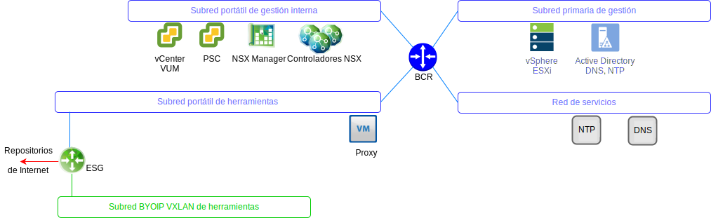

---

copyright:

  years:  2016, 2019

lastupdated: "2019-03-06"

---

# VMware Update Manager
{: #opsmgmt-vum}

VMware Update Manager (VUM) permite la gestión centralizada y automatizada de parches y versiones para VMware vSphere y le permite realizar las siguientes tareas en el entorno VMware vCenter Server on {{site.data.keyword.cloud}}:
* Actualizar y aplicar parches a los hosts de vSphere ESXi
* Instalar y actualizar software de terceros en los hosts
* Actualizar el hardware de máquina virtual (VM), las herramientas de VMware y los dispositivos virtuales

Para conocer el diseño detallado de VMware Update Manager, consulte [Introducción a VMware Update Manager](/docs/services/vmwaresolutions/archiref/vum?topic=vmware-solutions-vum-intro).

## Enlaces relacionados
{: #opsmgmt-vum-links}

* [Visión general de vCenter Server on {{site.data.keyword.cloud_notm}} con el paquete híbrido (Hybridity)](/docs/services/vmwaresolutions/archiref/vcs?topic=vmware-solutions-vcs-hybridity-intro)
* [VMware Update Manager](https://docs.vmware.com/en/VMware-vSphere/6.5/com.vmware.vsphere.update_manager.doc/GUID-F7191592-048B-40C7-A610-CFEE6A790AB0.html){:new_window}
