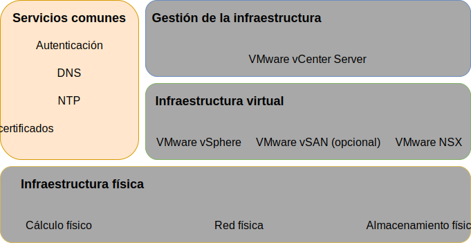
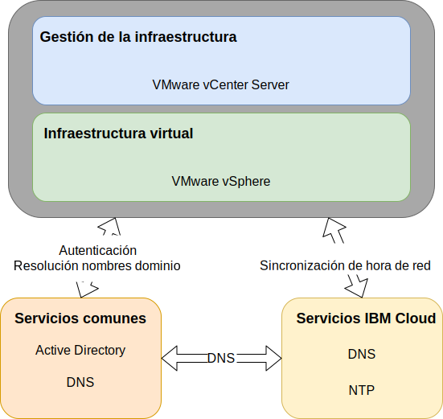

---

copyright:

  years:  2016, 2019

lastupdated: "2019-07-09"

subcollection: vmware-solutions

---

{:tip: .tip}
{:note: .note}
{:important: .important}

# Diseño de servicios comunes
{: #design_commonservice}

Los servicios comunes proporcionan los servicios que utilizan otros servicios en la plataforma de gestión de nube. Los servicios comunes de la solución incluyen servicios de identidad y acceso, servicios de nombres de dominio, servicios NTP, servicios SMTP y servicios de autoridad de certificados.

## Servicios de identidad y acceso
{: #design_commonservice-identity-access}

En este diseño, se utiliza Microsoft Active Directory (MSAD) para la gestión de identidades. El diseño despliega una o dos máquinas virtuales de Active Directory como parte de la automatización del despliegue de vCenter Server. vCenter está configurado para utilizar la autenticación de MSAD.

### Microsoft Active Directory
{: #design_commonservice-msad}

De forma predeterminada, un único VSI de Active Directory se despliega en la infraestructura de {{site.data.keyword.cloud}}.

El diseño también proporciona la opción de desplegar dos servidores de MSAD de alta disponibilidad como máquinas virtuales de Windows Server dedicadas en el clúster de gestión.

Si elige la opción con dos servidores MSAD de alta disponibilidad, tendrá la responsabilidad de proporcionar las licencias y activación de Microsoft.
{:note}

Active Directory sirve para autenticar los accesos para gestionar solo la instancia de VMware y no para alojar a los usuarios de las cargas de trabajo en las instancias desplegadas. El nombre de dominio raíz del bosque del servidor de Active Directory es igual al nombre de dominio DNS que especifique. Este nombre de dominio se especifica únicamente para la instancia de vCenter Server primaria si se enlazan varias instancias. En el caso de las instancias enlazadas, cada instancia contiene un servidor de Active Directory que se encuentra en el anillo de réplica raíz del grupo. Los archivos de la zona de DNS también se replican en los servidores de Active Directory.

### Dominio de inicio de sesión único (SSO) de vSphere
{: #design_commonservice-vsphere-sso}

El dominio de inicio de sesión único de vSphere (SSO) se utiliza como el mecanismo de autenticación inicial para una única instancia o varias instancias enlazadas. El dominio SSO también sirve para conectar una instancia de VMware o varias instancias enlazadas con el servidor de MSAD. Se aplica la siguiente configuración de SSO:  
* El dominio de SSO de `vsphere.local` siempre se utiliza
* Para las instancias de VMware que están enlazadas a una instancia existente, el PSC integrado se une al dominio SSO de la instancia existente
* El nombre de sitio SSO es igual al nombre de instancia

## Servicios de nombres de dominio
{: #design_commonservice-dns}

Los servicios de nombres de dominio (DNS) en este diseño son solo para los componentes de gestión de nube y de infraestructura.

### Instancia primaria de vCenter Server
{: #design_commonservice-primary-vcs}

El despliegue de vCenter Server utiliza los AD VSI como servidores DNS para la instancia. Todos los componentes desplegados
(vCenter con hosts PSC, NSX y ESXi incorporados) están configuradas para apuntar a AD como DNS predeterminado. Puede personalizar la configuración de zona de DNS si no interfiere con la configuración de los componentes desplegados.

Este diseño integra servicios DNS en las VSI de AD en la configuración siguiente:
* La estructura del dominio la especifica el usuario.
* El nombre de dominio puede ser cualquier número de niveles hasta el máximo que gestionen todos los componentes de vCenter Server, lo que garantiza que el nivel más bajo sea el subdominio de la instancia.
* Los servidores AD/DNS están configurados para que se autoricen tanto en el dominio de DNS como en el espacio de subdominio.
* Los servidores AD/DNS están configurados para que apunten a los servidores DNS de {{site.data.keyword.cloud_notm}} para todas las demás zonas.
* Las regiones de nube secundarias que estén integradas en la región de nube desplegada de destino o en la primera, deben utilizar la misma estructura de nombres DNS por encima del subdominio.
* Si lo prefiere, puede desplegar servidores DNS redundantes dentro del clúster de vCenter Server. Se configuran dos servidores AD/DNS sin licencia. Es responsabilidad del usuario proporcionar licencias para los sistemas operativos Windows de estos servidores.
* Si se suministra un sitio individual con un solo servidor AD/DNS, todos los componentes de vCenter Server configurados deben tener únicamente dicha dirección IP individual como entrada de DNS.

### Instancias secundarias de vCenter Server
{: #design_commonservice-secondary-vcs}

Para la redundancia de instancias cruzadas, cuando se añade la primera instancia secundaria de vCenter Server a una instancia primaria de vCenter Server existente o a una instancia autónoma de vCenter Server actual, se utiliza esa dirección IP del servidor AD DNS de la instancia primaria en la instancia secundaria de vCenter Server y en cualquier entrada "DNS secundaria" posterior de la instancia secundaria de vCenter Server para todos los componentes que requieran una entrada del servidor DNS. Por ejemplo, el gestor de ESXi, vCenter, y NSX, y también componentes añadidos, como por ejemplo HCX, Zerto y Veeam. A continuación, la entrada DNS secundaria del sitio primario se cambia a la primera dirección IP de AD/DNS de las instancias de vCenter Server secundarias.

## Servicios NTP
{: #design_commonservice-ntp}

Este diseño utiliza los servidores NTP de la infraestructura de {{site.data.keyword.cloud_notm}}. Todos los componentes desplegados se configuran para utilizar estos servidores NTP. Que todos los componentes dentro del diseño utilicen el mismo servidor NTP es crítico para que los certificados y la autenticación de Active Directory funcionen correctamente.

## Servicio de entidad emisora de certificados
{: #design_commonservice-cas}

De forma predeterminada, VMware vSphere utiliza certificados TLS que están firmados por una entidad emisora de certificados de VMware (VMCA), que se encuentra en el dispositivo VMware Platform Services Controller. Estos certificados no son de confianza para los dispositivos de usuario ni los navegadores. Es una práctica recomendada de seguridad sustituir los certificados de cara al usuario por los certificados firmados por una entidad emisora de certificados de terceros o de empresa (CA). Los certificados para la comunicación de máquina a máquina pueden seguir siendo certificados firmados por VMCA. No obstante, se recomienda seguir las mejores prácticas para su organización, que suelen implicar el uso de una CA de empresa identificada.

Puede utilizar los servidores AD de Windows dentro de este diseño para crear certificados que estén firmados por la instancia local. Sin embargo, también puede optar por configurar los servicios de CA si es necesario.

## Enlaces relacionados
{: #design_commonservice-related}

* [Diseño de infraestructura física](/docs/services/vmwaresolutions/archiref/solution?topic=vmware-solutions-design_physicalinfrastructure)
* [Diseño de infraestructura virtual](/docs/services/vmwaresolutions/archiref/solution?topic=vmware-solutions-design_virtualinfrastructure)
* [Diseño de gestión de infraestructura](/docs/services/vmwaresolutions/archiref/solution?topic=vmware-solutions-design_infrastructuremgmt)
