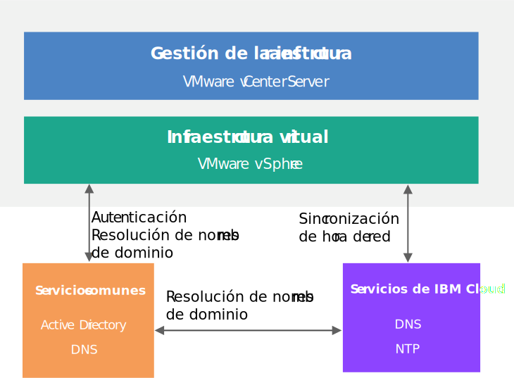

---

copyright:

  years:  2016, 2018

lastupdated: "2018-07-10"

---

# Diseño de servicios comunes

Los servicios comunes proporcionan los servicios que utilizan otros servicios en la plataforma de gestión de nube. Los servicios comunes de la solución incluyen servicios de identidad y acceso, servicios de nombre de dominio, servicios NTP, servicios SMTP y servicios de autoridad de certificados.

## Servicios de identidad y acceso

En este diseño, Microsoft Active Directory (AD) se utiliza para la gestión de identidades. El diseño despliega una o dos máquinas virtuales de Windows Active Directory como parte de la automatización de despliegue de Cloud Foundation y vCenter Server. vCenter se configurará para utilizar la autenticación de AD.

### Microsoft Active Directory

De forma predeterminada, un único VSI de Active Directory se despliega en la infraestructura de {{site.data.keyword.cloud}}. El diseño también proporciona la opción de desplegar dos servidores de Microsoft Active Directory de alta disponibilidad como VM de Windows Server dedicadas en el clúster de gestión.

**Nota**: Es responsable de proporcionar la licencia y activación de Microsoft si elige esta opción.

Active Directory sirve para autenticar los accesos para gestionar solo la instancia de VMware y no para alojar a los usuarios finales de las cargas de trabajo en las instancias desplegadas. El nombre de dominio raíz del bosque del servidor de Active Directory es igual al nombre de dominio DNS que especifique. Este nombre de dominio se especifica únicamente para la instancia de Cloud Foundation y vCenter Server primaria si se enlazan varias instancias. En el caso de las instancias enlazadas, cada instancia contiene un servidor de Active Directory que se encuentra en el anillo de réplica raíz del grupo. Los archivos de la zona de DNS también se replican en los servidores de Active Directory.

### Dominio SSO de vSphere

El dominio de inicio de sesión único de vSphere (SSO) se utiliza como el mecanismo de autenticación inicial para una única instancia o varias instancias enlazadas. El dominio SSO también sirve para conectar una instancia de VMware o varias instancias enlazadas con el servidor de Microsoft Active Directory. Se aplica la siguiente configuración de SSO:  
* El dominio de SSO de `vsphere.local` siempre se utiliza
* Para las instancias de VMware que están enlazadas a una instancia existente, el PSC se une al dominio SSO de la instancia existente
* El nombre de sitio SSO es igual al nombre de instancia

## Servicios de nombre de dominio (DNS)

DNS en este diseño es solo para los componentes de gestión de nube y de infraestructura.

### VMware vCenter Server

El despliegue de vCenter Server utiliza los servidores desplegados de Active Directory como servidores DNS para la instancia. Todos los componentes desplegados (vCenter, PSC, NSX, y hosts de ESXi) están configurados para apuntar al servidor de Active Directory como su servidor DNS predeterminado. Puede personalizar la configuración de zona de DNS si la configuración no interfiere con la configuración de los componentes desplegados.

Este diseño integra los servicios DNS en los servidores de Active Directory a través de la configuración siguiente:
* Puede especificar la estructura del dominio. El nombre de dominio puede ser cualquier número de niveles (hasta el máximo que manejarán los componentes de vCenter Server). El nivel más bajo es el subdominio para la instancia.
   * El nombre de dominio DNS que especifique se utilizará como el nombre de dominio del grupo raíz de Active Directory. Por ejemplo, si el nombre de dominio DNS es `cloud.ibm.com`, el nombre de dominio raíz del grupo de Active Directory será `cloud.ibm.com`. Este nombre de dominio de DNS y Active Directory es el mismo en todas las instancias enlazadas de vCenter Server.
   * Adicionalmente, puede especificar un nombre de subdominio para la instancia. El nombre de subdominio debe ser exclusivo en todas las instancias enlazadas de vCenter Server.
* Los servidores DNS de Active Directory están configurados para ser autorizados tanto para el dominio de DNS como para el espacio de subdominio.
* Los servidores DNS de Active Directory están configurados para que apunten a los servidores DNS de {{site.data.keyword.cloud_notm}} para todas las demás zonas.
* Cualquier instancia que se va a integrar en una instancia de destino existente debe utilizar el mismo nombre de dominio que la instancia primaria.

### VMware Cloud Foundation

El despliegue de Cloud Foundation utiliza la automatización de VMware Cloud Foundation, que utiliza su propio servidor DNS que reside dentro del componente VM de SDDC Manager. Los componentes de Cloud Foundation gestionados por SDDC Manager, incluidos vCenter, PSC, NSX, y hosts de ESXi, están configurados para utilizar la dirección IP de VM de SDDC Manager como su DNS predeterminado por diseño.

Puesto que el SDDC Manager genera y mantiene los nombres de host para los componentes que gestiona, no se recomienda que altere el archivo de zona DNS directamente para añadir ni eliminar hosts.

Este diseño integra los servicios DNS en los servidores de Active Directory con la VM de SDDC Manager en la configuración siguiente:
* Puede especificar la estructura del dominio. El nombre de dominio puede ser cualquier número de niveles (hasta el máximo que manejarán los componentes de Cloud Foundation).
* El nivel más bajo es el subdominio para el que está autorizado el SDDC Manager.
* El nombre de dominio DNS que especifique se utilizará como el nombre de dominio del grupo raíz de Active Directory. Por ejemplo, si el nombre de dominio DNS es `cloud.ibm.com`, la raíz del grupo del dominio de Active Directory será `cloud.ibm.com`. Este dominio DNS y el dominio Active Directory es el mismo en todas las instancias enlazadas de Cloud Foundation.
* Adicionalmente, puede especificar un nombre de subdominio para la instancia. El nombre de subdominio debe ser exclusivo en todas las instancias enlazadas de Cloud Foundation.  
* La configuración de DNS de SDDC Manager se modifica para que apunte a los servidores de Active Directory para todas las zonas, excepto para la zona de la que es responsable.
* Los servidores DNS de Active Directory están configurados para ser autorizados para el espacio de dominio de DNS por encima del subdominio de instancia de SDDC Manager y Cloud Foundation.
* Los servidores DNS de Active Directory están configurados para que apunten a la dirección IP de SDDC Manager para la delegación de subdominio de la zona para la que el SDDC Manager está autorizado.
* Los servidores DNS de Active Directory están configurados para que apunten a los servidores DNS de {{site.data.keyword.cloud_notm}} para todas las demás zonas.
* Cualquier instancia secundaria que se va a integrar en la primera instancia o en la instancia de destino debe utilizar la misma estructura de nombres DNS por encima del subdominio de SDDC Manager.

## Servicios NTP

Este diseño utiliza los servidores NTP de la infraestructura de {{site.data.keyword.cloud_notm}}. Todos los componentes desplegados se configuran para utilizar estos servidores NTP. El hecho de tener todos los componentes dentro del diseño utilizando el mismo servidor NTP es crítico para que los certificados y la autenticación de Active Directory funcionen correctamente.

Figura 1. Servicios NTP

## Servicio de entidad emisora de certificados

De forma predeterminada, VMware vSphere utiliza certificados TLS que están firmados por VMware Certificate Authority (VMCA), que reside en el dispositivo VMware Platform Services Controller. Estos certificados no son de confianza para los dispositivos de usuario final ni los navegadores. Es una práctica recomendada de seguridad sustituir los certificados de cara al usuario por los certificados firmados por una entidad emisora de certificados de terceros o de empresa (CA). Los certificados para la comunicación de máquina a máquina pueden permanecer como certificados firmados por VMCA; sin embargo, se recomienda seguir las prácticas recomendadas para su organización, que normalmente implican el uso de una CA de empresa identificada.

Puede utilizar los servidores AD de Windows dentro de este diseño para crear certificados que estén firmados por la instancia local. Sin embargo, también puede optar por configurar los servicios de CA si es necesario.

### Enlaces relacionados

* [Diseño de infraestructura física](design_physicalinfrastructure.html)
* [Diseño de infraestructura virtual](design_virtualinfrastructure.html)
* [Diseño de gestión de infraestructura](design_infrastructuremgmt.html)
