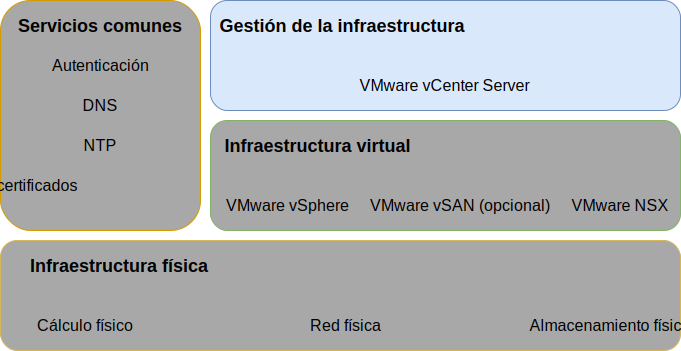

---

copyright:

  years:  2016, 2019

lastupdated: "2019-03-19"

subcollection: vmwaresolutions

---

{:tip: .tip}
{:note: .note}
{:important: .important}

# Diseño de gestión de infraestructura
{: #design_infrastructuremgmt}

La gestión de infraestructura hace referencia a los componentes que están gestionando la infraestructura de VMware.
* vCenter Server con PSC (Platform Services Controller) incorporado es la plataforma centralizada para la gestión de entornos de vSphere y es uno de los componentes fundamentales de esta solución.
* El PSC se utiliza en esta solución para proporcionar un conjunto de servicios de infraestructura que incluyen el inicio de sesión único de VMware vCenter, el servicio de licencia, el servicio de búsqueda y la Autoridad certificadora de VMware.

Este diseño utiliza una función PSC que se integra en una instancia de vCenter Server. El PSC y vCenter Server están alojados dentro de la misma máquina virtual (VM).

Figura 1. Gestión de la infraestructura 

El PSC ubicado en la instancia primaria tiene asignado el dominio de SSO predeterminado de `vsphere.local`.

## Diseño de vCenter Server
{: #design_infrastructuremgmt-vcenter}

vCenter Server con un PSC incorporado se instala en una subred portátil en la VLAN privada asociada con las máquinas virtuales de gestión. Su pasarela predeterminada se establece en la dirección IP asignada en el BCR para dicha subred determinada. El dispositivo virtual se configura con las especificaciones de la tabla siguiente.

Tabla 1. Especificaciones del dispositivo de vCenter Server

| Atributo                    | Especificación                       |
|------------------------------|-------------------------------------|
| vCenter Server               | Dispositivo virtual                   |
| Tamaño de instalación del dispositivo  | Grande (hasta 1000 hosts y 10 000 máquinas virtuales) |
| Platform Services Controller | Integrado                            |
| Número de vCPU              | 16                                   |
| Memoria                       | 32 GB                               |
| Disco                         | 990 GB en el almacén de datos local (despliegue de disco grande) |
| Tipo de disco                    | Ligero suministrado                    |

### Base de datos de vCenter Server
{: #design_infrastructuremgmt-vcenter-db}

La configuración del vCenter Server utiliza una base de datos local e incorporada de PostgreSQL incluida con el dispositivo. La base de datos incorporada se utiliza para eliminar las dependencias sobre bases de datos y licencias externas.

### Especificación de clúster de vCenter Server
{: #design_infrastructuremgmt-vcenter-cluster}

Con este diseño, puede agrupar los hosts ESXi de vSphere que se suministran a través de la solución. Sin embargo, para que se puedan crear clústeres, se crea un objeto de centro de datos que significa la ubicación de los hosts ESXi de vSphere, así como el pod dentro del centro de datos. Se crea un clúster una vez creado el objeto de centro de datos. El clúster se despliega con la alta disponibilidad (HA) de VMware vSphere y con el planificador de recursos distribuidos (DRS) de VMware vSphere habilitado.

### Planificador de recursos distribuidos de vSphere
{: #design_infrastructuremgmt-vsphere-drs}

Este diseño utiliza la planificación de recursos distribuidos (DRS) de vSphere en el clúster inicial para colocar las VM y utiliza DRS en clústeres adicionales para migrar dinámicamente las máquinas virtuales para lograr clústeres equilibrados. El nivel de automatización se establece en totalmente automatizado para que la ubicación inicial y las recomendaciones de migración sean ejecutadas automáticamente por vSphere. Además, el umbral de migración se establece en moderado, de modo que vCenter aplica las recomendaciones de prioridad 1, 2 y 3 para lograr al menos una mejora decente en el equilibrio de carga del clúster.

La gestión de alimentación a través de la característica **Distributed Power Management** no se utiliza en este diseño.
{:note}

### Alta disponibilidad de vSphere
{: #design_infrastructuremgmt-vsphere-ha}

Este diseño utiliza la alta disponibilidad (HA) de vSphere en el clúster inicial y los clústeres adicionales para detectar anomalías de cálculo y recuperar las VM que se ejecutan dentro de un clúster. La característica de HA de vSphere en este diseño se configura con las opciones **Supervisión de host** y **Control de admisión** habilitadas dentro del clúster. Además, el clúster inicial reserva los recursos de un nodo como capacidad de reserva para la política de control de admisión.

Usted es responsable de ajustar la política de control de admisión cuando el clúster se expanda o se contraiga más tarde.
{:note}

De forma predeterminada, la opción **Prioridad de reinicio de VM** se establece en medio y la opción **Respuesta de aislamiento de host** está inhabilitada. Además, la **supervisión de VM** está inhabilitada y la característica **Latido del almacén de datos** se configura para incluir cualquiera de los almacenes de datos del clúster. Este enfoque utiliza los almacenes de datos NAS si están presentes.

## Compatibilidad de vMotion mejorada
{: #design_infrastructuremgmt-evc}

Para simplificar la compatibilidad de vMotion en los nodos de clúster con prestaciones de CPU potencialmente distintas, se habilita la modalidad EVC (Enhanced vMotion Compatibility) a nivel de Skylake para garantizar la compatibilidad de vMotion en los nodos de clúster cuando lleguen procesadores más nuevos al inventario de
{{site.data.keyword.cloud_notm}} y permitir la expansión del clúster en el futuro si los servidores de procesador Skylake no se encuentran en el inventario.

### IBM CloudDriver
{: #design_infrastructuremgmt-cloud-driver}

La piedra angular de estas soluciones es la automatización. La automatización reduce la complejidad del despliegue, reduce drásticamente el tiempo de despliegue y garantiza que la instancia de VMware se despliegue de forma coherente.

IBM CloudBuilder es una instancia de servidor virtual (VSI) efímera de una máquina virtual de {{site.data.keyword.cloud_notm}} cuyo trabajo es crear una nueva instancia de VMware y realizar funciones de gestión del ciclo de vida. Se despliega cuando es necesaria una gestión de instancias de vCenter Server global y se destruye cuando finaliza el proceso.

IBM CloudDriver se puede configurar para que se vuelva a comunicar con la infraestructura de gestión de
{{site.data.keyword.vmwaresolutions_short}} en una red pública o, de manera opcional, en una red privada a través del almacén de objetos de
{{site.data.keyword.cloud_notm}} como cola de mensajes. IBM CloudDriver es un componente desarrollado por IBM, no es accesible para el usuario, y tiene los atributos y funciones siguientes:

- Despliegue y configuración de la instancia de vCenter Server dentro de la cuenta de usuario.
- Añadir y eliminar hosts de los clústeres de vCenter Server.
- Añadir y eliminar clústeres de las instancias de vCenter Server.
- Añadir y eliminar funciones o servicios de complemento en instancias de vCenter Server.

### Flujo de automatización
{: #design_infrastructuremgmt-auto-flow}

A continuación se describe el orden de sucesos al utilizar la consola de
{{site.data.keyword.vmwaresolutions_short}} para solicitar una instancia de VMware:
1. Pedido de VLAN y subredes para la red desde {{site.data.keyword.cloud_notm}}.
2. Pedido de {{site.data.keyword.cloud_notm}} {{site.data.keyword.baremetal_short}} con vSphere Hypervisor instalado.
3. Pedido de una VSI de Microsoft Windows para que sirva como controlador de dominio de Active Directory.
4. Despliegue de la VSI de Cloud Driver.
5. Validación de la red y el hardware desplegado.
6. Si procede, la configuración inicial de la vSAN de un solo nodo.
7. Despliegue y configuración de vCenter (con PSC incorporado) y NSX.
8. Agrupación en clúster de nodos ESXi restantes, expansión de vSAN, si procede, y configuración de los componentes NSX (VTEP).
9. Validación de la instalación y configuración del entorno.
10. Despliegue de servicios opcionales como, por ejemplo, el servidor de copia de seguridad y el almacenamiento.
11. Eliminación de la VSI de Cloud Driver.

## ID y contraseñas
{: #design_infrastructuremgmt-ids-pwd}

La infraestructura de gestión IC4V almacena todos los ID y contraseñas cifrados contenidos en vCenter Server dentro del plano de gestión de {{site.data.keyword.cloud_notm}}. Cualquier cambio realizado por el usuario sobre estas contraseñas puede interrumpir las funciones de automatización dentro de vCenter Server.

Puede proporcionar contraseñas modificadas en el portal de soluciones IC4V para que la automatización pueda procesar funciones ininterrumpidas. De manera opcional, el portal de soluciones permite la verificación de las contraseñas especificadas.

## Enlaces relacionados
{: #design_infrastructuremgmt-related}

* [Diseño de infraestructura física](/docs/services/vmwaresolutions/archiref/solution?topic=vmware-solutions-design_physicalinfrastructure)
* [Diseño de infraestructura virtual](/docs/services/vmwaresolutions/archiref/solution?topic=vmware-solutions-design_virtualinfrastructure)
* [Diseño de servicios comunes](/docs/services/vmwaresolutions/archiref/solution?topic=vmware-solutions-design_commonservice)
