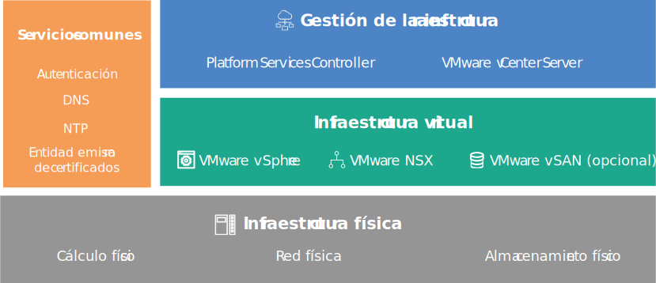

---

copyright:

  years:  2016, 2019

lastupdated: "2018-07-10"

---
# Visión general del diseño

{{site.data.keyword.vmwaresolutions_full}} proporciona la automatización para desplegar componentes de tecnología VMware en {{site.data.keyword.CloudDataCents_notm}} en todo el mundo.

## Ofertas de soluciones

Las ofertas de soluciones incluyen los siguientes productos de VMware vSphere dentro de un clúster desplegado y configurado automáticamente:
* VMware Cloud Foundation: vSphere ESXi, Platform Services Controller (PSC), VMware vCenter Server Appliance, SDDC Manager, VMware NSX y VMware vSAN.
* VMware vCenter Server: vSphere ESXi, Platform Services Controller (PSC), vCenter Server Appliance, NSX y opcionalmente vSAN.

En este diseño, se despliega una instancia en un solo pod de un {{site.data.keyword.CloudDataCent_notm}} en el orden inicial. Después del despliegue inicial, puede ampliar el entorno virtual a otros pods dentro del mismo centro de datos o en otros centros de datos.

El diseño también permite la expansión automatizada y la contracción de la capacidad virtual dentro de una instancia de Cloud Foundation o vCenter Server.

## Componentes de VMware on IBM Cloud

Figura 1. Componentes de VMware on {{site.data.keyword.cloud_notm}}

### Enlaces relacionados

* [Diseño de infraestructura física](design_physicalinfrastructure.html)
* [Diseño de infraestructura virtual](design_virtualinfrastructure.html)
* [Diseño de servicios comunes](design_commonservice.html)
* [Diseño de gestión de infraestructura](design_infrastructuremgmt.html)
