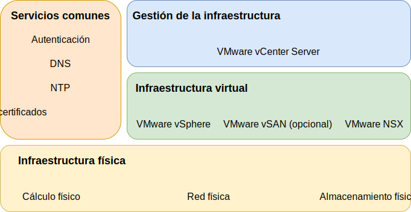

---

copyright:

  years:  2016, 2019

lastupdated: "2019-03-15"

subcollection: vmware-solutions

---
# Componentes de IBM Cloud for VMware Solutions
{: #design_overview}

{{site.data.keyword.vmwaresolutions_full}} proporciona la automatización para desplegar componentes de tecnología VMware en {{site.data.keyword.CloudDataCents_notm}} en todo el mundo.

Las ofertas de este portfolio de soluciones incluyen productos VMware vSphere dentro de un clúster desplegado y configurado de forma automática: VMware vSphere ESXi, VMware vCenter Server Appliance con Platform Services Controller (PSC) incorporado, VMware NSX-V o NSX-T, y, de manera opcional, VMware vSAN.

La arquitectura consta de una sola región de nube y permite la ampliación a más regiones de nube ubicadas en otra geografía y en otro pod de {{site.data.keyword.cloud_notm}} dentro del mismo centro de datos. Una región se define como una instancia única de vCenter Server. Este diseño también permite la expansión y contracción automatizadas de la capacidad virtual dentro de una instancia de vCenter Server.

Figura 1. Componentes de la solución de {{site.data.keyword.vmwaresolutions_short}}

## Enlaces relacionados
{: #design_overview-related}

* [Diseño de infraestructura física](/docs/services/vmwaresolutions/archiref/solution?topic=vmware-solutions-design_physicalinfrastructure)
* [Diseño de infraestructura virtual](/docs/services/vmwaresolutions/archiref/solution?topic=vmware-solutions-design_virtualinfrastructure)
* [Diseño de servicios comunes](/docs/services/vmwaresolutions/archiref/solution?topic=vmware-solutions-design_commonservice)
* [Diseño de gestión de infraestructura](/docs/services/vmwaresolutions/archiref/solution?topic=vmware-solutions-design_infrastructuremgmt)
