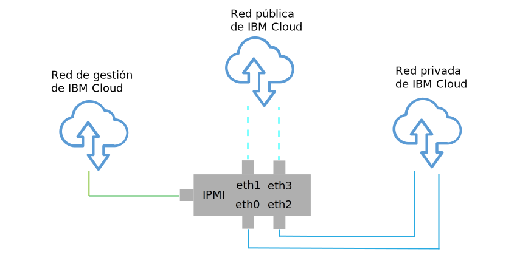
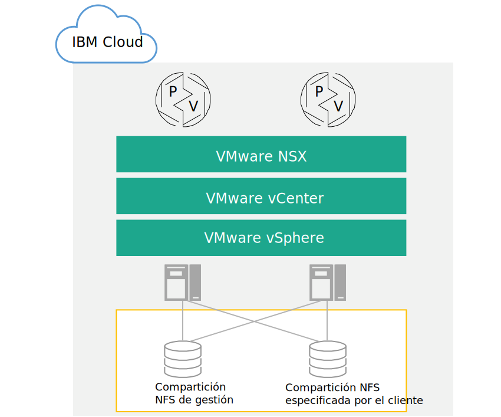

---

copyright:

  years:  2016, 2018

lastupdated: "2018-09-25"

---

# Diseño de infraestructura física

La infraestructura física comprende los componentes siguientes:

<dl class="dl">
  <dt class="dt dlterm">Cálculo físico</dt>
  <dd class="dd">El cálculo físico proporciona el proceso físico y la memoria que utiliza la infraestructura de virtualización. Para este diseño, los componentes de cálculo los proporciona {{site.data.keyword.baremetal_long}} y se listan en la [Guía de compatibilidad de hardware (HCG) de VMware](https://www.vmware.com/resources/compatibility/search.php).</dd>
  <dt class="dt dlterm">Almacenamiento físico</dt>
  <dd class="dd">El almacenamiento físico proporciona la capacidad de almacenamiento en bruto utilizada por la infraestructura de virtualización. Los componentes de almacenamiento los proporciona {{site.data.keyword.baremetal_short}} o la matriz de Almacenamiento adjunto en red (NAS) compartida utilizando NFS v3.</dd>
  <dt class="dt dlterm">Red física</dt>
  <dd class="dd">La red física proporciona la conectividad de red en el entorno que utilizará la virtualización de red. La red la proporciona la red de servicios de {{site.data.keyword.cloud_notm}} e incluye servicios adicionales como, por ejemplo, DNS y NTP.</dd>
</dl>

Para obtener más información sobre los componentes físicos, consulte la Lista de materiales de la [instancia de Cloud Foundation](../../sddc/sd_bom.html) o de la [instancia de vCenter Server](../../vcenter/vc_bom.html).

Para obtener más información sobre el almacenamiento, consulte [Arquitectura de almacenamiento compartido](https://www.ibm.com/cloud/garage/files/AttachedStorageSolutionArchitecture_v1.0.pdf).

## Diseño de host físico

El host físico hace referencia al {{site.data.keyword.baremetal_short}} en el entorno que sirve los recursos de cálculo. El {{site.data.keyword.baremetal_short}} aplicado en esta solución está certificado por VMware y aparece listado en el [HCG de VMware](http://www.vmware.com/resources/compatibility/search.php).

Las configuraciones de servidor disponibles en la solución cumplen o exceden los requisitos mínimos para instalar, configurar y gestionar vSphere ESXi. Existen varias configuraciones disponibles para satisfacer diferentes requisitos. Para obtener una lista detallada de las especificaciones exactas utilizadas para la solución VMware on {{site.data.keyword.cloud_notm}}, consulte la Lista de materiales de la [instancia de Cloud Foundation](../../sddc/sd_bom.html) o de la [instancia de vCenter Server](../../vcenter/vc_bom.html). Tenga en cuenta que el 	{{site.data.keyword.baremetal_short}} reside en la {{site.data.keyword.cloud_notm}}.

Cada instancia de Cloud Foundation empieza por un despliegue de 4 hosts, y cada instancia de vCenter Server empieza por un despliegue de 3 o 4 hosts en función de la opción de la solución de almacenamiento.

El host físico emplea dos discos conectados localmente para asignarse al hipervisor de vSphere ESXi. Puede asignar más discos utilizando vSAN tal como se describe en la sección _Diseño de almacenamiento físico_ de esta página o utilizando NetApp ONTAP, tal como se describe en [Arquitectura de selección de NetApp ONTAP](https://www.ibm.com/cloud/garage/files/IBM_Cloud_for_VMware_Solutions_NetApp_Architecture.pdf). Cada
host físico tiene conexiones de red de 10 Gbps redundantes para el acceso de red público y privado.

Las especificaciones técnicas del Servidor nativo son las siguientes:
* CPU: Dual Intel Xeon, configuración de núcleo y velocidad variable
* Memoria: configuración variable, 128 GB o más
* Red: 4 x 10 Gbps
* Número de unidades: 2 o más

## Diseño de red física

En esta sección se describe la red física que proporciona la {{site.data.keyword.cloud_notm}} y las conexiones de host físico (VLAN, MTU) que están asociadas con los hosts físicos.

La red física de {{site.data.keyword.cloud_notm}} está separada en tres redes distintas: pública, privada y de gestión. Para ver una ilustración de las tres redes y cómo funcionan, consulte [La red de {{site.data.keyword.cloud_notm}}](https://www.ibm.com/cloud-computing/bluemix/our-network).

### Red pública

{{site.data.keyword.CloudDataCents_notm}} y los puntos de presencia de red (PoPs) tienen múltiples conexiones de 1 Gbps o 10 Gbps al tránsito de nivel superior y a los proveedores de red de interconexión.

El tráfico de red externo de cualquier parte del mundo se conecta a la red más cercana de PoP, y viaja directamente a través de la red a su centro de datos, minimizando el número de saltos de red y de transferencias entre proveedores.

Dentro del centro de datos, {{site.data.keyword.cloud_notm}} proporciona 1 Gbps o 10 Gbps de ancho de banda de red a servidores individuales a través de un par de conmutadores de cliente frontales (FCS) agregados, separados por pares. Estos conmutadores agregados están conectados a un par de direccionadores de clientes frontales (FCR) independientes para redes L3.

Este diseño de varios niveles permite que la red se escale entre bastidores, filas y pods dentro de un {{site.data.keyword.CloudDataCent_notm}}.

### Red privada

Todos los {{site.data.keyword.CloudDataCents_notm}} y los PoPs están conectados mediante una red troncal de red privada. La red privada está separada de la red pública, y permite la conectividad a servicios en {{site.data.keyword.CloudDataCents_notm}} alrededor del mundo. El traslado de datos entre {{site.data.keyword.CloudDataCents_notm}} se realiza a través de múltiples conexiones de 10 Gbps o 40 Gbps a la red privada.

De forma similar a la red pública, la red privada tiene varios niveles en que los servidores y otros componentes de infraestructura están conectados a los conmutadores de cliente de fondo (BCS) agregados. Estos conmutadores agregados están conectados a un par de direccionadores de clientes de fondo (BCR) separados para redes L3. La red privada también da soporte a la capacidad de utilizar tramas Jumbo (MTU 9000) para las conexiones de host físicas.

### Red de gestión

Además de las redes públicas y privadas, cada servidor de {{site.data.keyword.cloud_notm}} se conecta a una red de gestión fuera de banda. Esta red de gestión, accesible a través de VPN, permite el acceso de IPMI (Intelligent Platform Management Interface) al servidor, independientemente de su CPU, firmware y sistema operativo, para fines de mantenimiento y de administración.

### Bloques de IP primarios y portátiles

{{site.data.keyword.cloud_notm}} asigna dos tipos de direcciones IP que se van a utilizar en la infraestructura de {{site.data.keyword.cloud_notm}}:
* Las direcciones IP primarias se asignan a los dispositivos, a los servidores nativos y virtuales suministrados por {{site.data.keyword.cloud_notm}}. No debe asignar ninguna dirección IP en estos bloques.
* Las direcciones IP portátiles se proporcionan para que asigne y gestione según sea necesario.

Las direcciones IP primarias o portátiles se pueden convertir en direccionables a cualquier VLAN dentro de la cuenta de cliente cuando **Distribución de VLAN** esté habilitado dentro del {{site.data.keyword.slportal}} o cuando la cuenta esté configurada como una cuenta de **Direccionamiento y reenvío virtual (VRF)**.

### Distribución de VLAN

**Distribución de VLAN** es un valor de cuenta de {{site.data.keyword.slportal}} que permite que el bloque de IP de subred primario y portátil de todas las VLAN de la cuenta se pueda direccionar entre sí. Cuando el valor de **Distribución de VLAN** está inhabilitado, los bloques de IP todavía pueden direccionar a los servicios de {{site.data.keyword.cloud_notm}}, pero no entre sí.

Para permitir una conexión transparente entre varias subredes en las que residen los componentes de la solución, debe habilitar **Distribución de VLAN** en la cuenta de {{site.data.keyword.slportal}} en la que se despliegan las instancias de Cloud Foundation y vCenter Server.

### Direccionamiento y reenvío virtual (VRF)

También puede configurar la cuenta de {{site.data.keyword.slportal}} como una cuenta de VRF para proporcionar funcionalidad similar a la distribución de VLAN, habilitando así el direccionamiento automático entre los bloques de IP de subred. Todas las cuentas con las conexiones de Direct-Link deben convertirse a, o crearse como, una cuenta de VRF.

La consola de {{site.data.keyword.vmwaresolutions_short}} no puede detectar si VRF está habilitado en el {{site.data.keyword.slportal}}. Recibirá un aviso que le recordará que se asegure de que ha habilitado la **Distribución de VLAN** o VRF en su cuenta de {{site.data.keyword.slportal}}.

### Conexiones de host físico

Cada host físico del diseño tiene dos pares redundantes de conexiones Ethernet de 10 Gbps en cada conmutador Top of Rack (ToR) de {{site.data.keyword.cloud_notm}} (público y privado). Los adaptadores se configuran como conexiones individuales (no enlazadas) para un total de conexiones de 4 x 10 Gbps. Esto permite que las conexiones de tarjeta de interfaz de red (NIC) funcionen de forma independiente entre sí.

Figura 1. Conexiones de NIC de host físico

### VLAN

Las ofertas de {{site.data.keyword.vmwaresolutions_short}} están diseñadas con 3 VLAN, una pública y dos privadas, asignadas al despliegue. Como se muestra en la Figura 2, la VLAN pública se asigna a eth1 y eth3, y las VLAN privadas se asignan a eth0 y eth2.

La VLAN pública y la primera VLAN privada creadas y asignadas en este diseño se descodifican de forma predeterminada en la {{site.data.keyword.cloud_notm}}. La VLAN privada adicional se trunca en los puertos de conmutador físico y se etiqueta dentro de los grupos de puertos de VMware que están utilizando estas subredes.

La red privada consta de dos VLAN dentro de este diseño. Se asignan tres subredes a la primera de estas VLAN (aquí designada como VLAN privada A):
* La primera subred es un rango de subred de IP privado primario que {{site.data.keyword.cloud_notm}} asigna a los hosts físicos.
* La segunda subred se utiliza para máquinas virtuales de gestión como, por ejemplo, vCenter Server Appliance y Platform Services Controller
* La tercera subred se utiliza para los VTEP (VXLAN Tunnel Endpoints) asignados a cada host a través de VMware NSX Manager.

Además de la VLAN privada A, existe una segunda VLAN privada (aquí designada como VLAN privada B) para dar soporte a características de VMware como vSAN y vMotion, y para la conectividad con el almacenamiento adjunto de red (NAS). Como tal, la VLAN se divide en dos o tres subredes portátiles.

* La primera subred se asigna a un grupo de puertos de kernel para el tráfico de vMotion.
* Las subredes restantes se utilizan para el tráfico de almacenamiento:
   * Cuando se utiliza vSAN, se asigna una subred a los grupos de puertos de kernel que se utilizan para el tráfico de vSAN.
   * Cuando se utiliza NAS, se asigna una subred a un grupo de puertos dedicado al tráfico de NFS.

Todas las subredes configuradas como parte de un despliegue automatizado de vCenter Server o Cloud Foundation utilizan rangos gestionados de {{site.data.keyword.cloud_notm}}. Esto es para asegurarse de que se pueda direccionar cualquier dirección IP a cualquier centro de datos dentro de la cuenta de {{site.data.keyword.cloud_notm}} cuando necesite la conexión ahora o en el futuro.

Todo esto se resume en la Tabla 1.

Tabla 1. Resumen de VLAN y subred

| VLAN | Tipo | Descripción |
|:---- |:---- |:----------- |
| Pública| Primario  | Asignada a hosts físicos para el acceso de red pública. No se utiliza en el despliegue inicial. |
| Privada A | Primario  | Subred única asignada a hosts físicos asignados por {{site.data.keyword.cloud_notm}}. La utiliza la interfaz de gestión para el tráfico de gestión de vSphere. |
| Privada A | Portátil | Subred única asignada a máquinas virtuales que funcionan como componentes de gestión |
| Privada A | Portátil | Subred única asignada a NSX VTEP |
| Privada B | Portátil | Subred única asignada para vSAN, si está en uso |
| Privada B | Portátil | Subred única asignada para NAS, si está en uso |
| Privada B | Portátil | Subred única asignada para vMotion |

En este diseño, todos los hosts y máquinas virtuales respaldados por VLAN se configuran para que apunten al direccionador cliente de “red privada” de programa de fondo de {{site.data.keyword.cloud_notm}} como la ruta predeterminada. Aunque las instancias de vCenter Server y Cloud Foundation habilitan el uso de Sistema de redes definido por software (SDN), las superposiciones de red creadas dentro de una instancia de VMware que incluyen el direccionamiento a subredes internas no son conocidas por los direccionadores gestionados por {{site.data.keyword.cloud_notm}}. Por lo tanto, es posible que tenga que crear rutas estáticas dentro de la instancia de VMware en algunos o en todos los componentes de gestión.

Las conexiones de red privada están configuradas para utilizar un tamaño de MTU de trama Jumbo de 9000 para mejorar el rendimiento de las grandes transferencias de datos, como el almacenamiento y vMotion. Esta es la MTU máxima permitida dentro de VMware y por {{site.data.keyword.cloud_notm}}. Las conexiones de red pública utilizan una MTU Ethernet estándar de 1500. Eso se debe mantener, ya que cualquier cambio puede provocar la fragmentación de paquetes a través de Internet.

## Diseño de almacenamiento físico

El diseño de almacenamiento físico consiste de la configuración de los discos físicos instalados en los hosts físicos y en la configuración del almacenamiento de nivel de archivo compartido. Esto incluye los discos del sistema operativo del hipervisor vSphere ESXi y los que se utilizan para el almacenamiento de las máquinas virtuales (VM). El almacenamiento para las VM puede constar de discos locales virtualizados por la vSAN de VMware, o por el almacenamiento compartido a nivel de archivos.

### Discos del sistema operativo

El hipervisor de vSphere ESXi se ha diseñado para instalarse en una ubicación persistente. Como resultado, los hosts físicos contienen dos discos SATA de 1 TB en la configuración RAID-1 para dar soporte a la redundancia para el hipervisor de vSphere ESXi.

### Almacenamiento de la máquina virtual

Este diseño permite la opción de utilizar el almacenamiento de nivel de archivos compartido o de VMware vSAN como almacén de datos primario para las máquinas virtuales.

### Discos vSAN

Cuando se utiliza, VMware vSAN se configura utilizando una configuración all-flash. Este diseño permite varias opciones de configuración, incluyendo el chasis 2U y 4U, varios números de discos y varios tamaños de disco. Todas las configuraciones utilizan dos grupos de discos vSAN, con un disco de estado sólido (SSD) para la memoria caché y uno o más SSD para la capacidad. Todas las unidades asignadas para el consumo de vSAN se configuran en un RAID-0 de un solo disco.

Para obtener más información sobre las configuraciones soportadas, consulte la Lista de materiales para la [instancia de Cloud Foundation](../../sddc/sd_bom.html) o la [instancia de vCenter Server](../../vcenter/vc_bom.html).

### Almacenamiento de nivel de archivo compartido entre hosts

Cuando se utiliza el almacenamiento a nivel de archivo compartido, se conecta una compartición NFS de 2 TB a los hosts que componen el clúster VMware inicial. Esta compartición, conocida como la compartición de gestión, se utiliza para los componentes de gestión como, por ejemplo, VMware vCenter Server, Platform Services Controller y VMware NSX. El almacenamiento se conecta mediante el protocolo NFSv3 y puede dar soporte a hasta 4000 IOPS.

Figura 2. Comparticiones NFS adjuntas al despliegue de VMware

Puede asignar y montar más comparticiones de archivos para las cargas de trabajo en el momento de la compra o más tarde dentro de la consola. Puede seleccionar entre las opciones de capacidad de almacenamiento de archivos de Endurance {{site.data.keyword.cloud_notm}} disponibles y niveles de rendimiento en el {{site.data.keyword.CloudDataCent_notm}} correspondiente. Todas las comparticiones se adjuntan utilizando el protocolo NFSv3. Además, es posible adjuntar comparticiones de archivos NFSv3 aplicando la oferta de NetApp ONTAP Select.

{{site.data.keyword.CloudDataCents_notm}} que ofrecen el nivel de rendimiento de 10 IOPS/GB también incluyen el cifrado gestionado por el proveedor de datos en reposo (cifrado AES-256) y están respaldadas por almacenamiento all-flash. El nivel de rendimiento de 10 IOPS/GB está limitado a una capacidad máxima de 4 TB. Para obtener más información sobre el NAS compartido que se utiliza en esta solución, consulte [Arquitectura de almacenamiento compartido](https://www.ibm.com/cloud/garage/files/AttachedStorageSolutionArchitecture_v1.0.pdf).

### Enlaces relacionados

* [Lista de materiales de Cloud Foundation](../../sddc/sd_bom.html)
* [Lista de materiales de vCenter Server](../../vcenter/vc_bom.html)
* [Arquitectura de almacenamiento compartido](https://www.ibm.com/cloud/garage/files/AttachedStorageSolutionArchitecture_v1.0.pdf)
* [Arquitectura de NetApp ONTAP Select](https://www.ibm.com/cloud/garage/files/IBM_Cloud_for_VMware_Solutions_NetApp_Architecture.pdf)
