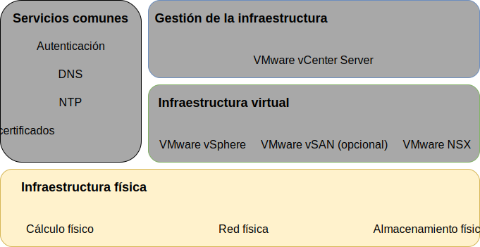
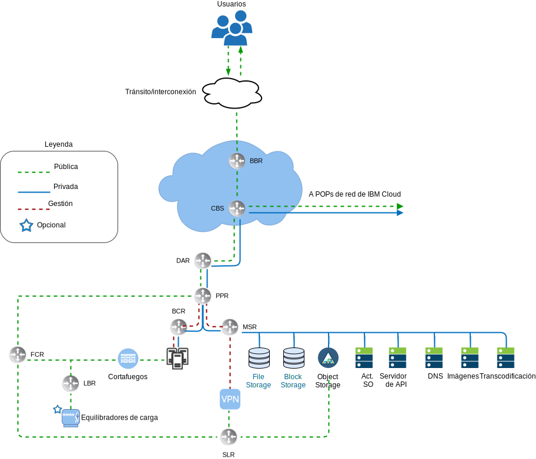
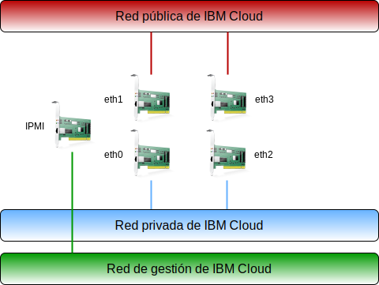
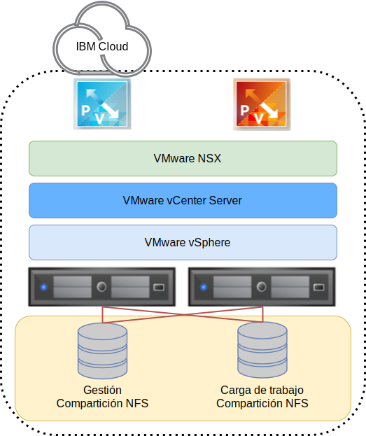
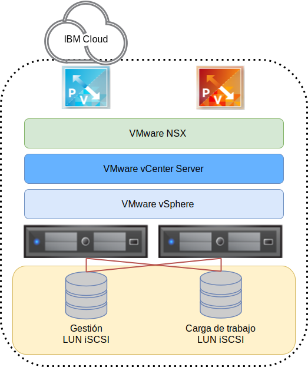

---

copyright:

  years:  2016, 2019

lastupdated: "2019-06-11"

subcollection: vmware-solutions

---

{:tip: .tip}
{:note: .note}
{:important: .important}

# Diseño de infraestructura física
{: #design_physicalinfrastructure}

La infraestructura física consta de los componentes siguientes:

<dl class="dl">
  <dt class="dt dlterm">Cálculo físico</dt>
  <dd class="dd">El cálculo físico proporciona el proceso físico y la memoria que utiliza la infraestructura de virtualización. Para este diseño, los componentes de cálculo los proporciona {{site.data.keyword.baremetal_long}} y se listan en la [Guía de compatibilidad de hardware (HCG) de VMware](https://www.vmware.com/resources/compatibility/search.php).</dd>
  <dt class="dt dlterm">Almacenamiento físico</dt>
  <dd class="dd">El almacenamiento físico proporciona la capacidad de almacenamiento en bruto utilizada por la infraestructura de virtualización. Los componentes de almacenamiento los proporciona {{site.data.keyword.baremetal_short}} o la matriz de Almacenamiento adjunto en red (NAS) compartida que utiliza NFS v3<!-- or iSCSI -->. </dd>
  <dt class="dt dlterm">Red física</dt>
  <dd class="dd">La red física proporciona la conectividad de red en el entorno que utilizará la virtualización de red. La red la proporciona la red de servicios de {{site.data.keyword.cloud_notm}} e incluye servicios adicionales como, por ejemplo, DNS y NTP.</dd>
</dl>

Para obtener más información sobre los componentes físicos, consulte [Lista de materiales de vCenter Server](/docs/services/vmwaresolutions/vcenter?topic=vmware-solutions-vc_bom).

Para obtener más información sobre el almacenamiento, consulte [Arquitectura de almacenamiento compartido](/docs/services/vmwaresolutions/archiref/attached-storage?topic=vmware-solutions-storage-benefits#storage-benefits).

## Diseño de cálculo físico
{: #design_physicalinfrastructure-host-design}

Las configuraciones de servidor disponibles en la solución cumplen o exceden los requisitos mínimos para instalar, configurar y gestionar vSphere ESXi. Existen varias configuraciones disponibles para satisfacer diferentes requisitos. Para obtener una lista detallada de las especificaciones exactas utilizadas para la solución VMware on {{site.data.keyword.cloud_notm}}, consulte la Lista de materiales de la [instancia de vCenter Server](/docs/services/vmwaresolutions/vcenter?topic=vmware-solutions-vc_bom).

Los {{site.data.keyword.baremetal_short}} residen en {{site.data.keyword.cloud_notm}}.
{:note}

Cada instancia de vCenter Server empieza con un despliegue de 3 o 4 hosts en función de la opción de la solución de almacenamiento.

El host físico emplea dos discos conectados localmente que se asignan al hipervisor de vSphere ESXi. Puede asignar más discos utilizando vSAN tal como se describe en la sección _Diseño de almacenamiento físico_ o utilizando NetApp ONTAP, tal como se describe en [Arquitectura de selección de NetApp ONTAP](https://www.ibm.com/cloud/garage/files/IBM_Cloud_for_VMware_Solutions_NetApp_Architecture.pdf). Cada
host físico tiene conexiones de red de 10 Gbps redundantes para el acceso de red público y privado.

El servidor nativo tiene las especificaciones siguientes:
* CPU: Intel Xeon dual o cuádruple, con configuración de núcleos y velocidad variable
* Memoria: configuración variable, 64 GB o más
* Red: 4 x 10 Gbps
* Número de unidades: 2 o más

## Diseño de red física
{: #design_physicalinfrastructure-net-design}

La red física la gestiona {{site.data.keyword.cloud_notm}}. Revise las descripciones siguientes de la red física proporcionada por IBM Cloud y por las conexiones de host físico (VLAN, MTU) asociadas con los hosts físicos.

### Visión general de la red de IBM Cloud
{: #design_physicalinfrastructure-ibm-cloud-network}

La red física de {{site.data.keyword.cloud_notm}} está separada en dos redes distintas: pública y privada. La red privada también contiene el tráfico de gestión de Intelligent Platform Management Interface (IPMI) con los servidores físicos.

#### Red pública
{: #design_physicalinfrastructure-public-net}

{{site.data.keyword.CloudDataCents_notm}} y los puntos de presencia de red (PoPs) tienen múltiples conexiones de 1 Gbps o 10 Gbps al tránsito de nivel superior y a los proveedores de red de interconexión. El tráfico de red de cualquier parte del mundo se conecta a la red más cercana de PoP, y viaja directamente a través de la red a su centro de datos, minimizando el número de saltos de red y de transferencias entre proveedores.

Dentro del centro de datos, {{site.data.keyword.cloud_notm}} proporciona 1 Gbps o 10 Gbps de ancho de banda de red a servidores individuales a través de un par de conmutadores de cliente frontales (FCS) agregados, separados por pares. Estos conmutadores agregados están conectados a un par de direccionadores independientes, FCR, para redes L3.

Este diseño de varios niveles permite que la red se escale entre bastidores, filas y pods dentro de un {{site.data.keyword.CloudDataCent_notm}}.

#### Red privada
{: #design_physicalinfrastructure-private-net}

Todos los {{site.data.keyword.CloudDataCents_notm}} y los PoP están conectados mediante la red troncal privada. Esta red privada está separada de la red pública, y permite la conectividad a servicios en {{site.data.keyword.CloudDataCents_notm}} alrededor del mundo. El traslado de datos entre {{site.data.keyword.CloudDataCents_notm}} se realiza a través de múltiples conexiones de 10 Gbps o 40 Gbps a la red privada.

De forma similar a la red pública, la red privada tiene varios niveles en que los servidores y otros componentes de infraestructura están conectados a los conmutadores de cliente de fondo (BCS) agregados. Estos conmutadores agregados están conectados a un par de direccionadores de clientes de fondo (BCR) separados para redes L3. La red privada también da soporte a la capacidad de utilizar tramas Jumbo (MTU 9000) para las conexiones de host físicas.

#### Red de gestión
{: #design_physicalinfrastructure-mgmt-net}

Además de las redes públicas y privadas, cada servidor de {{site.data.keyword.cloud_notm}} se conecta a una subred de la red primaria privada para la gestión. Esta conexión permite el acceso de IPMI (Intelligent Platform Management Interface) al servidor, independientemente de su CPU, firmware y sistema operativo, para fines de mantenimiento y de administración.

#### Bloques de IP primarios y portátiles
{: #design_physicalinfrastructure-ip-blocks}

{{site.data.keyword.cloud_notm}} asigna dos tipos de direcciones IP que se van a utilizar en la infraestructura de {{site.data.keyword.cloud_notm}}:
* Las direcciones IP primarias se asignan a los dispositivos, a los servidores nativos y virtuales suministrados por {{site.data.keyword.cloud_notm}}. No asigne ninguna dirección IP en estos bloques.
* Las direcciones IP portátiles se proporcionan para que asigne y gestione según sea necesario. vCenter Server proporciona varios rangos de IP portátiles para su uso. Utilice únicamente los rangos portátiles que se asignan a componentes NSX-T o NSX-V especificados para uso del cliente. Por ejemplo,
**Extremo de cliente**.

Las direcciones IP primarias o portátiles se pueden convertir en direccionables a cualquier VLAN dentro de su cuenta cuando la cuenta esté configurada como una cuenta de **Direccionamiento y reenvío virtual (VRF)**.

#### Direccionamiento virtual y reenvío
{: #design_physicalinfrastructure-vrf}

Es necesario configurar la cuenta de {{site.data.keyword.slportal}} como una cuenta de direccionamiento virtual y reenvío (VRF), que habilitará el direccionamiento global automático entre bloques de IP de subred. Todas las cuentas con las conexiones de Direct-Link deben convertirse a, o crearse como, una cuenta de VRF.

Debido a que diversas opciones de conectividad y opciones de direccionamiento de red requieren que la cuenta de
{{site.data.keyword.cloud_notm}} esté en modalidad VRF, se recomienda que la cuenta esté en modalidad VRF antes de realizar el suministro de vCenter Server.

#### Conexiones de host físico
{: #design_physicalinfrastructure-host-connect}

Cada host físico de este diseño tiene dos pares redundantes de conexiones Ethernet de 10 Gbps en cada conmutador Top of Rack (ToR) de {{site.data.keyword.cloud_notm}} (público y privado). Los adaptadores se configuran como conexiones individuales (no enlazadas) para un total de conexiones de 4 conexiones de 10 Gbps. Esto permite que las conexiones de tarjeta de interfaz de red (NIC) funcionen de forma independiente entre sí.

No se admite la eliminación de la conectividad de red física con la red pública o privada para los servidores nativos que se utilizan dentro de la oferta de vCenter Server. Los puertos físicos de la NIC interna del servidor nativo se pueden inhabilitar, pero no hay soporte para desenchufar los cables.

#### VLAN y direccionamiento entre red subyacente y de superposición
{: #design_physicalinfrastructure-vlans}

Las ofertas de {{site.data.keyword.vmwaresolutions_short}} están diseñadas con 3 VLAN, una pública y dos privadas, asignadas al despliegue. Como se muestra en la figura anterior, la VLAN pública se asigna a `eth1` y
`eth3`, y las VLAN privadas se asignan a
`eth0` y `eth2`.

La VLAN pública y la primera VLAN privada creadas y asignadas en este diseño se descodifican de forma predeterminada en la {{site.data.keyword.cloud_notm}}. A continuación, la VLAN privada adicional se trunca en los puertos de conmutador físico y se etiqueta dentro de los grupos de puertos de VMware que están utilizando estas subredes.

La red privada consta de dos VLAN dentro de este diseño. Se asignan tres subredes a la primera de estas VLAN (aquí designada como VLAN privada A):
* La primera subred es un rango de subred de IP privado primario que {{site.data.keyword.cloud_notm}} asigna a los hosts físicos.
* La segunda subred se utiliza para máquinas virtuales de gestión como, por ejemplo, vCenter Server Appliance y Platform Services Controller
* La tercera subred se utiliza para los VTEP (puntos finales de túnel encapsulados) de red asignados a cada host a través de NSX Manager.

Además de la VLAN privada A, existe una segunda VLAN privada (aquí designada como VLAN privada B) para dar soporte a características de VMware como vSAN, vMotion y NFS<!--, and iSCSI-->. Como tal, la VLAN se divide en dos, tres o cuatro subredes portátiles:
* La primera subred se asigna a un grupo de puertos de kernel para el tráfico de vMotion.
* La subred o subredes restantes se utilizan para el tráfico de almacenamiento:
   * Cuando se utiliza vSAN, se asigna una subred a los grupos de puertos de kernel que se utilizan para el tráfico de vSAN.
   * Cuando se utiliza NAS conectado con NFS, se asigna una subred a un grupo de puertos dedicado al tráfico de NFS.
<!--* For iSCSI attachment, two port groups are created to allow multipathing active-active across both private NIC ports as only one NIC port can be active at a time per the VMware iSCSI documentation.-->

Todas las subredes configuradas como parte de un despliegue automatizado de vCenter Server utilizan rangos gestionados de {{site.data.keyword.cloud_notm}}. Esto es para asegurarse de que se pueda direccionar cualquier dirección IP a cualquier centro de datos dentro de la cuenta de {{site.data.keyword.cloud_notm}} cuando necesite la conexión ahora o en el futuro.

Revise la tabla siguiente para obtener un resumen.

Tabla 1. Resumen de VLAN y subred

| VLAN | Tipo | Descripción |
|:---- |:---- |:----------- |
| Pública| Primario  | Asignada a hosts físicos para el acceso de red pública. Los hosts se asignan a una dirección IP pública pero dicha dirección IP no está configurada en hosts, por lo que no son directamente accesibles en la red pública. En su lugar, la VLAN pública está pensada para proporcionar acceso a
Internet público para otros componentes, como NSX Edge Services Gateways (ESG). |
| Privada A | Primario  | Subred única asignada a hosts físicos asignados por {{site.data.keyword.cloud_notm}}. La utiliza la interfaz de gestión para el tráfico de gestión de vSphere. |
| Privada A | Portátil | Subred única asignada a máquinas virtuales que funcionan como componentes de gestión |
| Privada A | Portátil | Subred única asignada a NSX-V o NSX-T VTEP |
| Privada B | Portátil | Subred única asignada para vSAN, si está en uso |
| Privada B | Portátil | Subred única asignada para NAS, si está en uso |
| Privada B | Portátil | Subred única asignada para vMotion |
<!--| Private B | Portable | Two subnets assigned for iSCSI NAS, if in use (one per physical NIC port) |-->

En este diseño, todos los hosts y máquinas virtuales respaldados por VLAN se configuran para que apunten al direccionador cliente de “red privada” de programa de fondo (BCR) de {{site.data.keyword.cloud_notm}} como la ruta predeterminada. Aunque las instancias de vCenter Server habilitan el uso de Sistema de redes definido por software (SDN), las superposiciones de red creadas dentro de una instancia de VMware que incluyen el direccionamiento a subredes internas no son conocidas por los direccionadores gestionados por {{site.data.keyword.cloud_notm}}.

Si desea establecer el direccionamiento entre la red de superposición y la subyacente, debe desplegar un dispositivo de cortafuegos de IBM para la VLAN privada predeterminada concreta cuando se despliegue la instancia de vCenter Server. Este dispositivo permite la inserción de rutas estáticas y la interconexión de protocolos de direccionamiento dinámicos con los dispositivos de red de superposición para permitir el direccionamiento entre la parte subyacente y de superposición.

Las conexiones de red privada están configuradas para utilizar un tamaño de MTU de trama Jumbo de 9000 para mejorar el rendimiento de las grandes transferencias de datos, como el almacenamiento y vMotion. Esta es la MTU máxima permitida dentro de VMware y por {{site.data.keyword.cloud_notm}}. Las conexiones de red pública utilizan una MTU Ethernet estándar de 1500. Eso se debe mantener, ya que cualquier cambio puede provocar la fragmentación de paquetes a través de Internet.

## Diseño de almacenamiento físico
{: #design_physicalinfrastructure-storage-design}

El diseño de almacenamiento físico consiste de la configuración de los discos físicos instalados en los hosts físicos y en la configuración del almacenamiento compartido conectado a la red. Esto incluye el sistema operativo (vSphere ESXi) y los discos utilizados para el almacenamiento de las máquinas virtuales (VM). El almacenamiento para las VM puede constar de discos locales virtualizados por la vSAN de VMware, el almacenamiento compartido a nivel de archivos o el almacenamiento compartido a nivel de bloque.

### Discos del sistema operativo
{: #design_physicalinfrastructure-os-disks}

El hipervisor de vSphere ESXi se instala en una ubicación persistente. Como resultado, los hosts físicos están compuestos por dos discos en una configuración RAID-1 para dar soporte a la redundancia para el hipervisor de vSphere ESXi.

### Discos vSAN
{: #design_physicalinfrastructure-vsan-disks}

Este diseño permite la opción de utilizar el almacenamiento compartido conectado a la red o de VMware vSAN como almacén de datos primario para las máquinas virtuales. En el caso de VMware vSAN, se configura utilizando una configuración enteramente flash. Este diseño permite varias opciones de configuración, incluyendo el chasis 2U y 4U, varios números de discos y varios tamaños de disco. Todas las configuraciones utilizan dos grupos de discos vSAN, con un disco de estado sólido (SSD) para la memoria caché y uno o más SSD para la capacidad. Todas las unidades asignadas para el consumo de vSAN se configuran en un RAID-0 de un solo disco.

Para obtener más información sobre las configuraciones admitidas, consulte la
[Lista de materiales de vCenter Server](/docs/services/vmwaresolutions/vcenter?topic=vmware-solutions-vc_bom).

### Almacenamiento de nivel de archivo compartido entre hosts
{: #design_physicalinfrastructure-shared-storage}

Cuando se utiliza el almacenamiento a nivel de archivo compartido, se conecta una compartición NFS de 2 TB a los hosts que componen el clúster VMware inicial. Esta compartición, conocida como la compartición de gestión, se utiliza para los componentes de gestión como, por ejemplo, VMware vCenter Server, Platform Services Controller y VMware NSX.

El almacenamiento se conecta mediante el protocolo NFS v3 a un nivel de 2 IOPS/GB desde IBM Cloud. 

Puede asignar y montar más comparticiones de archivos en todos los hosts para las cargas de trabajo en el momento de la compra o más tarde dentro de la consola. Puede seleccionar entre las opciones de capacidad de almacenamiento de archivos de Endurance {{site.data.keyword.cloud_notm}} disponibles y niveles de rendimiento en el {{site.data.keyword.CloudDataCent_notm}} correspondiente. Todas las comparticiones se adjuntan utilizando el protocolo NFS v3. Además, es posible adjuntar comparticiones de archivos NFS v3aplicando la oferta de NetApp ONTAP Select. 

La disponibilidad de los 10 IOPS/GB depende del centro de datos de IBM Cloud. {{site.data.keyword.CloudDataCents_notm}} que ofrecen el nivel de rendimiento de 10 IOPS/GB también incluyen el cifrado gestionado por el proveedor de datos en reposo (cifrado AES-256) y están respaldadas por almacenamiento all-flash. El nivel de rendimiento de 10 IOPS/GB está limitado a una capacidad máxima de 4 TB. Para obtener más información sobre el NAS compartido que se utiliza en esta solución, consulte [Arquitectura de almacenamiento compartido](/docs/services/vmwaresolutions/archiref/attached-storage?topic=vmware-solutions-storage-benefits#storage-benefits).

<!--
### Shared iSCSI storage
{: #design_physicalinfrastructure-shared-iscsi}

This architecture allows you to use iSCSI storage, however iSCSI storage is not automatically provisioned by IBM Cloud for VMware Solutions. You can provision it manually.

Similar to NFS, for shared iSCSI storage, one 2-TB iSCSI LUN will be attached to the hosts that comprise the initial VMware cluster. This iSCSI LUN is used for management components such as the VMware vCenter Server, Platform Services Controller, and VMware NSX. The storage is attached through the iSCSI protocol at a 2 IOPS/GB level from IBM Cloud.

{: caption="Figure 5. iSCSI LUNs attached to VMware deployment" caption-side="bottom"}

Additional iSCSI LUNs for workloads can also be allocated and mounted across all hosts. Select from the available IBM Cloud Endurance block storage capacity options and performance tiers in the corresponding IBM Cloud Data Center. All LUNs are attached by using the iSCSI protocol. Additionally, it is possible to attach iSCSI LUNs from the NetApp ONTAP Select offering.

The availability of the 10 IOPS/GB depends on the IBM Cloud Data Center. Data centers that offer the 10 IOPS/GB performance tier also include provider–managed encryption of data at rest (AES–256 encryption), and are backed by all–flash storage. The 10 IOPS/GB performance tier is limited to a maximum capacity of 4 TB.

-->

Para obtener más información sobre el NAS compartido que se utiliza en esta solución, consulte [Arquitectura de almacenamiento compartido](/docs/services/vmwaresolutions/archiref/attached-storage?topic=vmware-solutions-storage-benefits#storage-benefits).

## Enlaces relacionados
{: #design_physicalinfrastructure-related}

* [Lista de materiales de vCenter Server](/docs/services/vmwaresolutions/vcenter?topic=vmware-solutions-vc_bom)
* [Arquitectura de almacenamiento compartido](/docs/services/vmwaresolutions/archiref/attached-storage?topic=vmware-solutions-storage-benefits#storage-benefits)
* [Arquitectura de NetApp ONTAP Select](https://www.ibm.com/cloud/garage/files/IBM_Cloud_for_VMware_Solutions_NetApp_Architecture.pdf)
