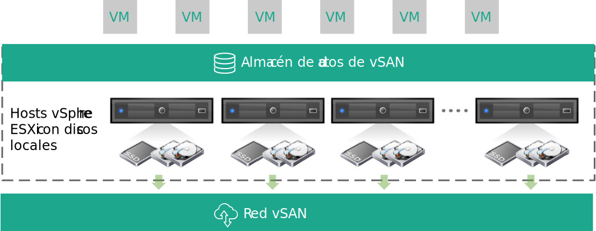
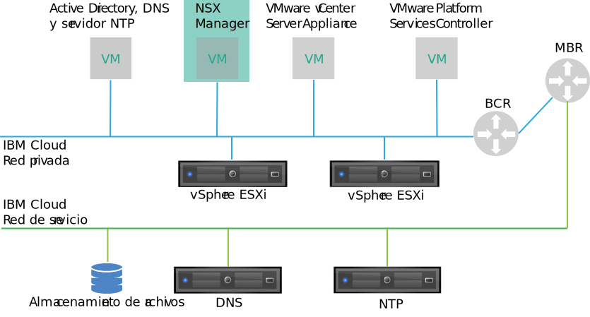
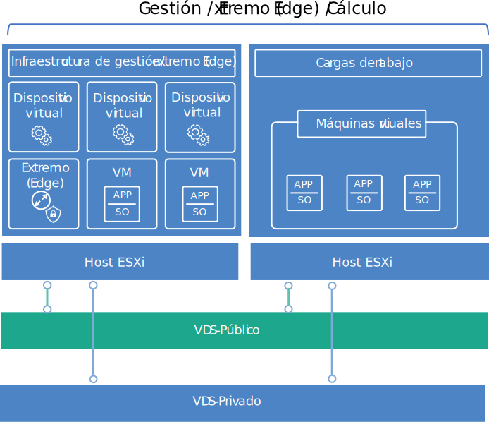

---

copyright:

  years:  2016, 2018

lastupdated: "2018-07-17"

---

# Diseño de infraestructura virtual

La capa de infraestructura virtual incluye los componentes de software de VMware que virtualizan los recursos de cálculo, almacenamiento y red proporcionados en la capa de infraestructura física: VMware vSphere ESXi, VMware NSX y, opcionalmente, VMware vSAN.

## Diseño de VMware vSphere

La configuración de vSphere ESXi consta de los aspectos siguientes:
* Configuración de arranque
* Sincronización de hora
* Acceso a host
* Acceso de usuario
* Configuración DNS

La Tabla 1 resalta las especificaciones para cada aspecto. Después de la configuración e instalación de ESXi, el host se añade a un VMware vCenter Server y se gestiona desde allí.

El diseño le permite acceder a los hosts virtuales a través de la interfaz de usuario de la consola directa (DCUI), ESXi Shell y Secure Shell (SSH).

De forma predeterminada, los únicos usuarios que pueden iniciar sesión directamente son los usuarios _root_ e _ibmvmadmin_ para la máquina física del host. El administrador puede añadir usuarios finales desde el dominio de Microsoft Active Directory (MSAD) para habilitar el acceso de usuario al host. Todos los hosts del diseño de la solución vCenter Server están configurados para sincronizarse con un servidor NTP central.

Tabla 1. Configuración de vSphere ESXi

| Atributo              | Parámetro de configuración |
|:---------------------- |:----------------------- |
| Ubicación de arranque de ESXi     | Utiliza discos locales configurados en RAID-1 |
| Sincronización de hora   | Utiliza {{site.data.keyword.cloud}} NTP Server |
| Acceso a host            | Admite DCUI, ESXi Shell, o SSH |
| Acceso de usuario            | Autenticación local y MSAD |
| Resolución de nombres de dominio | Utiliza DNS como se describe en [Diseño de servicios comunes](design_commonservice.html) |

El clúster de vSphere aloja las máquinas virtuales (VM) que gestionan la nube central, así como los recursos de cálculo para las cargas de trabajo de usuario.

Para instancias de Cloud Foundation:
* Una instancia contiene 4 hosts ESXi en el despliegue inicial.
* Después del despliegue, puede escalar la instancia hasta un máximo de 32 hosts ESXi.

Para instancias de vCenter Server:
* Cuando una instancia solo utiliza NFS, el número mínimo de hosts ESXi en el despliegue inicial es 2, pero se recomienda 3 para HA. Puede escalar hasta un máximo de 59 hosts ESXi durante o después del despliegue inicial.
* Cuando una instancia utiliza vSAN, el número mínimo de hosts ESXi en el despliegue inicial es 4. Puede escalar hasta un máximo de 59 hosts ESXi durante o después del despliegue inicial.

Para dar soporte a más cargas de trabajo de usuario, puede escalar el entorno mediante:  
* Despliegue de hosts de cálculo adicionales de clústeres existentes
* Despliegue de clústeres adicionales gestionados por el mismo vCenter Server Appliance
* Despliegue de nuevas instancias de vCenter Server o Cloud Foundation con su propio vCenter Server Appliance.

Para obtener más información sobre los clústeres, consulte [{{site.data.keyword.cloud_notm}} ejecutando el documento de arquitectura de soluciones de VMware Clusters](https://www.ibm.com/cloud/garage/files/IBM-Cloud-for-VMware-Solutions-Multicluster-Architecture.pdf).

## Diseño de VMware vSAN

En este diseño, el almacenamiento de VMware vSAN se emplea en instancias de Cloud Foundation y, opcionalmente, en instancias de vCenter Server para proporcionar almacenamiento compartido para los hosts de vSphere.

Tal como se muestra en la Figura 1, vSAN agrega el almacenamiento local entre varios hosts ESXi dentro de un clúster vSphere y gestiona el almacenamiento agregado como un almacén de datos de máquina virtual individual. Dentro de este diseño, los nodos de cálculo contienen unidades de disco locales para el sistema operativo ESXi y el almacén de datos de vSAN. Independientemente de a qué clúster pertenezca un nodo,
se incluyen dos unidades SATA de 1 TB en cada nodo para alojar la instalación de ESXi.

Figura 1. Concepto de vSAN

vSAN utiliza los componentes siguientes:
* Diseño de vSAN de grupo de dos discos, con cada grupo de discos que consta de dos o más discos. Un SSD del tamaño más pequeño del grupo sirve como nivel de memoria caché y los SSD restantes sirven como el nivel de capacidad.
* El controlador RAID incorporado se configura para cada unidad, excepto para las dos unidades de sistema operativo, en el nivel RAID-0.
* Se crea un único almacén de datos vSAN desde todo el almacenamiento.

Las características vSAN disponibles dependen de la edición de la licencia que seleccione al solicitar la instancia. Para obtener más información, consulte [Comparación de la edición de VMware vSAN](appendix.html#vmware-vsan-edition-comparison).

### Configuración de red virtual para vSAN

Para este diseño, el tráfico de vSAN atraviesa los hosts ESXi en una VLAN privada dedicada. Los dos adaptadores de red conectados al conmutador de red privada se configuran dentro de vSphere como un conmutador distribuido de vSphere (VDS) con dos adaptadores de red como uplinks. Un grupo de puertos de kernel vSAN dedicado configurado para la VLAN de vSAN reside dentro del VDS. Las tramas Jumbo (MTU 9000) están habilitadas para los VDS privados.

vSAN no carga el tráfico de equilibrio entre los uplinks. Como resultado, un adaptador está activo, mientras que el otro está en espera para dar soporte a la alta disponibilidad (HA). La política de migración tras error de red para vSAN se configura como **Migración tras error explícita** entre los puertos de red físicos.

Para obtener más información sobre las conexiones de NIC físicas, consulte la Figura 2. Conexiones de NIC de host físico en [Diseño de infraestructura física](design_physicalinfrastructure.html).

### Diseño de la política de almacenamiento

Cuando vSAN está habilitada y configurada, las políticas de almacenamiento se configuran para definir las características de almacenamiento de la máquina virtual. Las características de almacenamiento especifican diferentes niveles de servicio para las distintas máquinas virtuales.

La política de almacenamiento predeterminada en este diseño tolerará una anomalía individual. La política predeterminada se configura con la codificación de borrado de RAID 5, con el **Método de tolerancia de anomalía** establecido en **RAID-5/6 (Codificación de borrado) - Capacidad** y el **Nivel primario de anomalías** establecido en 1.

La configuración de RAID 5 requiere un mínimo de cuatro hosts. Como alternativa, puede elegir la configuración de RAID 6 con el **Método de tolerancia de anomalía** establecido en **RAID-5/6 (Codificación de borrado) - Capacidad** y el **Nivel primario de anomalías** establecido en 2.

La configuración de RAID 6 requiere un mínimo de 6 hosts. **Duplicación** y **Compresión** también están habilitados en la política de almacenamiento predeterminada.

Una instancia utiliza la política predeterminada a menos que se especifique lo contrario en la consola de vSphere. Cuando se configura una política personalizada, vSAN lo garantizará cuando sea posible. Sin embargo, si no se puede garantizar la política, no es posible suministrar una VM que utilice la política a menos que esté habilitada para forzar el suministro.

Las políticas de almacenamiento se deben volver a aplicar después de la adición de nuevos hosts ESXi o de parches de los hosts ESXi.

### Valores de vSAN

Los valores de vSAN se establecen en función de las mejores prácticas para desplegar soluciones de VMware en {{site.data.keyword.cloud_notm}}. Esto incluye valores de SIOC, grupo de puertos de valores de migración tras error explícitos y valores de memoria caché de disco.
* Valores de política de memoria caché de SSD: Sin **lectura anticipada**, **Escritura directa**, **Directo** (NRWTD)
* Valores de control de E/S de red
   * Gestión: 20 comparticiones
   * Máquina virtual: 30 comparticiones
   * vMotion: 50 comparticiones
   * vSAN: 100 comparticiones
* Puertos de kernel vSAN: **Migración tras error explícita**

## Diseño de VMware NSX

La virtualización de red proporciona una superposición de red que existe dentro de la capa virtual. Esto proporciona la arquitectura con características tales como el aprovisionamiento rápido, el despliegue, la reconfiguración y la destrucción de las redes virtuales bajo demanda. Este diseño utiliza vSphere Distributed Switch (vDS) y VMware NSX for vSphere para implementar la red virtual.

En este diseño, NSX Manager se despliega en el clúster inicial. Se asigna a NSX Manager una dirección IP respaldada por VLAN del bloque de direcciones portátiles privado, que se designa para los componentes de gestión y se configura con los servidores DNS y NTP que se describen en [Diseño de servicios comunes](design_commonservice.html). NSX Manager se instala con las especificaciones listadas en la Tabla 2.

Tabla 2. Atributos de NSX Manager

| Atributo       | Especificación |
|:--------------- |:------------- |
| NSX Manager     | Dispositivo virtual |
| Número de vCPU | 4 |
| Memoria          | 16 GB |
| Disco            | 60 GB en la compartición NFS de gestión |
| Tipo de disco       | Aprovisionamiento ligero |
| Red         | Portátil privado A designado para los componentes de gestión |

En la figura siguiente se muestra la ubicación del NSX Manager en relación con otros componentes de la arquitectura.

Figura 2. Visión general de la red de NSX Manager

Después del despliegue inicial, la automatización de {{site.data.keyword.cloud_notm}} despliega tres NSX Controllers dentro del clúster inicial. A cada uno de los controladores se le asigna una dirección IP respaldada por VLAN de la subred portátil privada A que se designa para los componentes de gestión. Además, el diseño crea reglas de antiafinidad VM-VM para separar los controladores entre los hosts del clúster. El clúster inicial debe contener un mínimo de tres nodos para asegurar la alta disponibilidad para los controladores.

Además de los controladores, la automatización de {{site.data.keyword.cloud_notm}} prepara los hosts de vSphere desplegados con NSX VIBS para habilitar el uso de una red virtualizada a través de los VTEP (VXLAN Tunnel Endpoints). A los VTEP se les asignan direcciones IP respaldadas por una VLAN desde el rango de direcciones IP portátil del privado A que se especifica para VTEP como se indica en [VLAN y resumen de subred](design_physicalinfrastructure.html#table_vlan_subnet_summary). El tráfico VXLAN reside en la VLAN no etiquetada y se asigna al conmutador distribuido de vSphere (VDS) privado.

Posteriormente, se asigna una agrupación de ID de segmento y se añaden los hosts del clúster a la zona de transporte. Únicamente se utiliza unicast en la zona de transporte porque IGMP (Internet Group Management Protocol) snooping no está configurado en {{site.data.keyword.cloud_notm}}.

Después de esto, se despliegan los pares de NSX Edge Services Gateway. En todos los casos, se utiliza un par de pasarela para el tráfico de salida de los componentes de automatización que residen en la red privada. Para vCenter Server, una segunda pasarela, conocida como el borde gestionado por el cliente, se despliega y se configura con un enlace ascendente a la red pública y una interfaz asignada a la red privada. Para obtener más información sobre las NSX Edge Services Gateways desplegadas como parte de la solución, consulte [NSX Edge on 	{{site.data.keyword.cloud_notm}} Solution Architecture](https://www.ibm.com/cloud/garage/files/IBM_Cloud_for_VMware_Solutions_NSX_Edge_Services_Gateway.pdf).

Los administradores de nube pueden configurar cualquier componente NSX necesario, como por ejemplo DLR (Distributed Logical Router), conmutadores lógicos y cortafuegos. Las características NSX disponibles son dependientes de la edición de la licencia de NSX que elija al solicitar la instancia. Para obtener más información, consulte [Comparación de la edición de VMware NSX](appendix.html#vmware-nsx-edition-comparison). Para las instancias de vCenter Server, la automatización de {{site.data.keyword.cloud_notm}} añade el vCenter Server Appliance y PSC (Platform Services Controller) a la lista de exclusión del cortafuegos distribuido por NSX Manager.

### Diseño de conmutadores distribuidos

El diseño utiliza un número mínimo de conmutadores distribuidos de vSphere (VDS). Los hosts del clúster están conectados a las redes públicas y privadas. Los hosts se configuran con dos conmutadores virtuales distribuidos. El uso de dos conmutadores sigue la práctica de la red de {{site.data.keyword.cloud_notm}} que separa las redes públicas y privadas. El diagrama siguiente muestra el diseño de VDS.

Figura 3. Diseño de conmutadores distribuidos

Como se muestra en la figura, se configura un VDS para la conectividad de red pública (SDDC-Dswitch-Public) y el otro VDS se configura para la conectividad de red privada (SDDC-Dswitch-Private).

Es necesario separar los distintos tipos de tráfico para reducir la contención y la latencia e incrementar la seguridad. Las VLAN se utilizan para segmentar funciones de red física.

Este diseño utiliza tres VLAN: dos para tráfico de red privada y una para tráfico de red pública. En la tabla siguiente se muestra la separación de tráfico.

Tabla 3. Correlación de VLAN con tipos de tráfico

| VLAN  | Designación | Tipo de tráfico |
|:----- |:----------- |:------------ |
| VLAN1 | Pública      | Disponible para acceso a Internet |
| VLAN2 | Privada A   | ESXi Management, Management, VXLAN (VTEP) |
| VLAN3 | Privada B   | vSAN, NFS, vMotion |

El tráfico de las cargas de trabajo viajará en conmutadores lógicos respaldados por VXLAN.

El clúster de vSphere utiliza dos conmutadores distribuidos de vSphere configurados como en las tablas siguientes.

Tabla 4. Conmutadores distribuidos de clúster convergente

| vSphere distribuido Nombre de conmutador | Función | Red Control de E/S | Equilibrio de carga Modo | NIC físico Puertos | MTU |
|:------------- |:------------- |:------------- |:------------- |:------------- |:------------- |
| SDDC-Dswitch-Private | Gestión de ESXi, Virtual SAN, vSphere vMotion, VXLAN Tunnel Endpoint, NFS (VTEP) | Habilitado | Ruta basada en el puerto virtual de origen (vSAN, vMotion) de migración tras error explícito (todo lo demás) | 2 | 9.000 (Tramas Jumbo) |
| SDDC-Dswitch-Public | Tráfico de gestión externa (Norte-Sur) | Habilitado | Ruta basada en el puerto virtual de origen | 2 | 1.500 (predeterminado) |

**Nota:** Los nombres, el número y el orden de los NIC de host pueden variar en función del {{site.data.keyword.CloudDataCent_notm}} y de la selección de hardware del host.

Tabla 5. Valores de configuración de grupo de puertos de conmutador distribuidos en el clúster convergente

| Parámetro          | Valor       |
|:------------------ |:------------- |
| Equilibrio de carga     | Ruta basada en el puerto virtual de origen \* |
| Detección de migración tras error | Solo estado de enlace |
| Conmutadores de notificación    | Habilitado |
| Restablecimiento           | No |
| Orden de migración tras error     | Enlaces ascendentes activos: Uplink1, Uplink2 \* |

\* **Nota**: El grupo de puertos de vSAN utiliza la migración tras error explícita con activo/en espera, ya que no soporta el equilibrio de carga del tráfico de almacenamiento vSAN.

Tabla 6. Grupos de puertos de conmutador virtual y VLAN de clústeres convergentes

| Conmutador distribuido de vSphere | Nombre de grupo de puertos | Equipo | Enlaces ascendentes | ID de VLAN |
|:------------- |:------------- |:------------- |:------------- |:---------- |
| SDDC-Dswitch-Private | SDDC-DPortGroup-Mgmt | Puerto virtual de origen | Activo: 0, 1 | VLAN1 |
| SDDC-Dswitch-Private | SDDC-DPortGroup-vMotion | Puerto virtual de origen | Activo: 0, 1 | VLAN2 |
| SDDC-Dswitch-Private | SDDC-DPortGroup-VSAN | Migración tras error explícita | Activo: 0 En espera: 1 | VLAN2 |
| SDDC-Dswitch-Private | SDDC-DPortGroup-NFS | Puerto virtual de origen | Activo: 0, 1 | VLAN2 |
| SDDC-Dswitch-Private | Generado automáticamente por NSX | Puerto virtual de origen | Activo: 0, 1 | VLAN1 |
| SDDC-Dswitch-Public | SDDC-DPortGroup-External | Puerto virtual de origen | Activo: 0, 1 | VLAN3 |

Tabla 7. Adaptadores de kernel de VM de clúster convergente

| Conmutador distribuido de vSphere | Finalidad | Grupo de puertos conectados | Servicios habilitados | MTU |
|:-------------------------- |:------- |:-------------------- |:---------------- |:--- |
| SDDC-Dswitch-Private | Gestión | SDDC-DPortGroup-Mgmt | Tráfico de gestión | 1.500 (predeterminado) |
| SDDC-Dswitch-Private | vMotion | SDDC-DPortGroup-vMotion | Tráfico de vMotion | 9.000 |
| SDDC-Dswitch-Private | VTEP | *Generado automáticamente por NSX* | \- | 9.000 |
| SDDC-Dswitch-Private | VSAN | SDDC-DPortGroup-VSAN | VSAN | 9.000 |
| SDDC-Dswitch-Private | NAS | SDDC-DPortGroup-NFS | \-  | 9.000 |

### Configuración de NSX

Este diseño especifica la configuración de los componentes de NSX, pero no aplica ninguna configuración de componente de superposición de red. Puede diseñar la superposición de red en función de sus necesidades. Están preconfigurados los siguientes aspectos:

* Los servidores de gestión y los controladores se instalan e integran en la interfaz de usuario web de vCenter
* Los agentes de ESXi están instalados y las direcciones IP de VTEP están configuradas por host ESXi
* Configuración de VTEP, configuración de controlador y configuración de VXLAN (zona de transporte)
* Dispositivos de NSX Edge Services Gateway para que los utilicen los componentes de gestión
* Solo para instancias de vCenter Server: dispositivos de NSX Edge Services Gateway para uso del cliente

Los aspectos siguientes no están configurados:
* Direccionadores distribuidos virtuales
* Microsegmentación
* VXLAN
* Gestión de NSX enlazada a otras instancias de VMware

### Enlaces relacionados

* [{{site.data.keyword.cloud_notm}} que ejecuta la arquitectura de solución de VMware Clusters](https://www.ibm.com/cloud/garage/files/IBM-Cloud-for-VMware-Solutions-Multicluster-Architecture.pdf)
* [Arquitectura de solución de NSX Edge on {{site.data.keyword.cloud_notm}}](https://www.ibm.com/cloud/garage/files/IBM_Cloud_for_VMware_Solutions_NSX_Edge_Services_Gateway.pdf)
