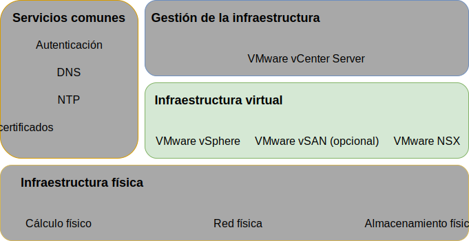
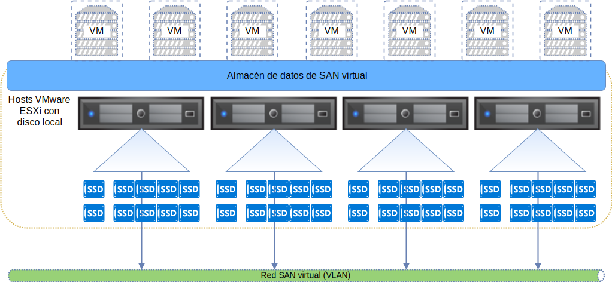

---

copyright:

  years:  2016, 2019

lastupdated: "2019-03-19"

subcollection: vmwaresolutions

---

{:tip: .tip}
{:note: .note}
{:important: .important}

# Diseño de infraestructura virtual
{: #design_virtualinfrastructure}

La capa de infraestructura virtual incluye los componentes de software de VMware que virtualizan los recursos de cálculo, almacenamiento y red proporcionados en la capa de infraestructura física: VMware vSphere ESXi, VMware NSX-V o NSX-T y, opcionalmente, VMware vSAN.

Figura 1. Infraestructura virtual 

## Diseño de VMware vSphere
{: #design_virtualinfrastructure-vsphere-design}

La configuración de vSphere ESXi consta de los aspectos siguientes:
* Configuración de arranque
* Sincronización de hora
* Acceso a host
* Acceso de usuario
* Configuración DNS

En la tabla siguiente se describen las especificaciones de cada aspecto. Después de la configuración e instalación de ESXi, el host se añade a un VMware vCenter Server y se gestiona desde allí.

Con este diseño, puede acceder a los hosts virtuales a través de la interfaz de usuario de la consola directa (DCUI), ESXi Shell y Secure Shell (SSH).

De forma predeterminada, los únicos usuarios que pueden iniciar sesión directamente son los usuarios _root_ e _ibmvmadmin_ para la máquina física del host. El administrador puede añadir usuarios desde el dominio de Microsoft Active Directory (MSAD) para habilitar el acceso de usuario al host. Todos los hosts del diseño de la solución vCenter Server están configurados para sincronizarse con un servidor NTP central.

Tabla 1. Configuración de vSphere ESXi

| Atributo              | Parámetro de configuración |
|:---------------------- |:----------------------- |
| Ubicación de arranque de ESXi     | Utiliza discos locales configurados en RAID-1 |
| Sincronización de hora   | Utiliza el servidor {{site.data.keyword.cloud}} NTP |
| Acceso a host            | Admite DCUI, ESXi Shell o SSH, si está habilitado |
| Acceso de usuario            | Autenticación local y MSAD |
| Resolución de nombres de dominio | Utiliza DNS como se describe en [Diseño de servicios comunes](/docs/services/vmwaresolutions/archiref/solution?topic=vmware-solutions-design_commonservice). |
| Modalidad EVC | Skylake (solo para despliegues de vSphere 6.7 "greenfield") |

El clúster de vSphere aloja las máquinas virtuales (VM) que gestionan la instancia de vCenter Server y los recursos de cálculo para las cargas de trabajo de usuario.

* Cuando una instancia de vCenter Server utiliza vSAN, el número mínimo de hosts ESXi en el despliegue inicial es 4.
* Cuando una instancia de vCenter Server utiliza almacenamiento compartido a nivel de archivos o de bloque, el número mínimo de hosts ESXi en el despliegue inicial es 3.

Puede escalar hasta un máximo de 59 hosts ESXi durante o después del despliegue inicial.

Para dar soporte a más cargas de trabajo de usuario, puede escalar el entorno mediante:  
* Despliegue de más hosts de cálculo de clústeres existentes
* Despliegue de más clústeres gestionados por el mismo vCenter Server Appliance
* Despliegue de nuevas instancias de vCenter Server con su propio vCenter Server Appliance

Para obtener más información sobre los clústeres, consulte
[{{site.data.keyword.cloud_notm}} que ejecuta la arquitectura de solución de clústeres de VMware](https://www.ibm.com/cloud/garage/files/IBM-Cloud-for-VMware-Solutions-Multicluster-Architecture.pdf).

## Diseño de VMware vSAN
{: #design_virtualinfrastructure-vsan-design}

En este diseño, el almacenamiento de VMware vSAN se emplea en instancias de vCenter Server para proporcionar almacenamiento compartido para los hosts de vSphere.

Tal como se muestra en la figura siguiente, vSAN agrega el almacenamiento local entre varios hosts ESXi dentro de un clúster vSphere y gestiona el almacenamiento agregado como un almacén de datos de máquina virtual individual. Dentro de este diseño, los nodos de cálculo contienen unidades de disco locales para el sistema operativo (SO) ESXi y el almacén de datos de vSAN. Independientemente de a qué clúster pertenezca un nodo,
se incluyen dos unidades de SO en cada nodo para alojar la instalación de ESXi.

Figura 2. Concepto de vSAN

vSAN utiliza los componentes siguientes:
* Diseño de vSAN de grupo de dos discos; cada grupo de discos consta de dos o más discos. Un SSD o unidad NVMe del tamaño más pequeño del grupo sirve como nivel de memoria caché y los SSD restantes sirven como el nivel de capacidad.
* El controlador RAID incorporado se configura para cada unidad, excepto para las dos unidades de sistema operativo, que están configuradas en una matriz RAID-0 por unidad.
* Se crea un único almacén de datos vSAN desde todo el almacenamiento.

Las características vSAN disponibles dependen de la edición de la licencia que seleccione al solicitar la instancia. Para obtener más información, consulte [Comparación de la edición de VMware vSAN](/docs/services/vmwaresolutions/archiref/solution?topic=vmware-solutions-solution-appendix#vmware-vsan-edition-comparison).

### Configuración de red virtual para vSAN
{: #design_virtualinfrastructure-net-setup}

Para este diseño, el tráfico de vSAN atraviesa los hosts ESXi en una VLAN privada dedicada. Los dos adaptadores de red conectados al conmutador de red privada se configuran dentro de vSphere como un conmutador distribuido de vSphere (vDS) con dos adaptadores de red como enlaces ascendentes. Un grupo de puertos de kernel vSAN dedicado que está configurado para la VLAN de vSAN reside dentro de los vDS. Las tramas Jumbo (MTU 9000) están habilitadas para los vDS privados.

vSAN no carga el tráfico de equilibrio entre los uplinks. Como resultado, un adaptador está activo, mientras que el otro está en espera para dar soporte a la alta disponibilidad (HA). La política de migración tras error de red para vSAN se configura como **Migración tras error explícita** entre los puertos de red físicos.

Para obtener más información sobre las conexiones de NIC físicas, consulte
[Conexiones de NIC de host físico](/docs/services/vmwaresolutions/services?topic=vmware-solutions-design_physicalinfrastructure#design_physicalinfrastructure-host-connect).

### Diseño de políticas de vSAN
{: #design_virtualinfrastructure-storage-policy}

Cuando vSAN está habilitada y configurada, las políticas de almacenamiento se configuran para definir las características de almacenamiento de la máquina virtual. Las características de almacenamiento especifican diferentes niveles de servicio para las distintas máquinas virtuales.

La política de almacenamiento predeterminada en este diseño tolerará una anomalía individual. La política predeterminada se configura con codificación de borrado, con el **Método de tolerancia de anomalía** establecido en **RAID-5/6 (Codificación de borrado) - Capacidad** y el **Nivel primario de anomalías** establecido en 1. La configuración de RAID 5 requiere un mínimo de cuatro hosts.

Como alternativa, puede elegir la configuración de RAID 6 con el **Método de tolerancia de anomalía** establecido en **RAID-5/6 (Codificación de borrado) - Capacidad** y el **Nivel primario de anomalías** establecido en 2. La configuración de RAID 6 requiere un mínimo de seis hosts. **Duplicación** y **compresión** también están habilitados en la política de almacenamiento predeterminada.

Una instancia utiliza la política predeterminada a menos que se especifique lo contrario en la consola de vSphere. Cuando se configura una política personalizada, vSAN lo garantizará cuando sea posible. Sin embargo, si no se puede garantizar la política, no es posible suministrar una VM que utilice la política a menos que esté habilitada para forzar el suministro.

Las políticas de almacenamiento se deben volver a aplicar después de la adición de nuevos hosts ESXi o de parches de los hosts ESXi.

### Valores de vSAN
{: #design_virtualinfrastructure-vsan-sett}

Los valores de vSAN se configuran en función de los métodos recomendados para desplegar soluciones de VMware en {{site.data.keyword.cloud_notm}}. Los valores de vSAN incluyen los valores de SIOC, el grupo de puertos de valores de migración tras error explícitos y los valores de memoria caché de disco.
* Valores de política de memoria caché de SSD: Sin **lectura anticipada**, **Escritura directa**, **Directo** (NRWTD)
* Valores de control de E/S de red
   * Gestión - 20 comparticiones
   * Máquina virtual - 30 comparticiones
   * vMotion - 50 comparticiones
   * vSAN - 100 comparticiones
* Puertos de kernel vSAN: **Migración tras error explícita**

## Almacenamiento conectado con iSCSI
{: #design_virtualinfrastructure-iscsi-storage}

A diferencia del almacenamiento conectado con NFS v3, el almacenamiento conectado con iSCSI admite vías de acceso activa-activa en todos los puertos de tarjeta NIC configurados y puertos de destino. Debido a esto, se puede obtener un mayor rendimiento y, por lo tanto, es una alternativa deseable al almacenamiento de conexión NFS. Esto se obtiene a costa de una mayor complejidad.

El almacenamiento de bloque de {{site.data.keyword.cloud_notm}} Endurance solo admite un máximo de ocho conexiones de host por LUN. Esto está pensado para documentar la capacidad que se añadirá a vCenter Server después de cambiar a la cuota de almacenamiento Q1 de
{{site.data.keyword.cloud_notm}} Endurance para permitir la conexión de hasta 64 hosts, o iniciadores iSCSI, ya que cada host ESXi tendrá un mínimo de dos iniciadores.

Se conecta un LUN iSCSI de 2 TB a vCenter Server para el uso de los componentes de gestión y un mínimo de un LUN iSCSI más se configura para uso de la carga de trabajo del cliente. Este almacenamiento se formatea como sistema de archivos VMFS 6.x por cada LUN.

### Configuración de red virtual para iSCSI
{: #design_virtualinfrastructure-setup-iscsi}

En este diseño, el tráfico iSCSI tiene permitido utilizar ambos puertos de la tarjeta NIC conectada privada en una configuración activa-activa. Debido a que vSphere permite que solo haya un puerto de la tarjeta NIC activo en un grupo de puertos concreto dentro de un vDS al mismo tiempo, deben crearse dos grupos de puertos (A y B) en la VLAN de almacenamiento.

Se crea un puerto de kernel ESXi con una dirección IP exclusiva en las subredes individuales para permitir la escalabilidad. Cada puerto de kernel se asigna a su propio grupo de puertos iSCSI. Ambos puertos de kernel se asignan a un adaptador bus de host (HBA) iSCSI virtual de ESXi. Para cada puerto de kernel, se emplea el conmutador de sustitución de pasarela predeterminado para utilizar la pasarela predeterminada para la subred local para dicho puerto de kernel. Consulte la tabla siguiente.

Tabla 2. Grupos de puertos iSCSi

Grupo de puertos vDS | Subred de puerto de kernel | VMHBA
--|:---|:--
**SDDC-Dprotgroup-iSCSI-A** |Subnet-A |  vmhba64
**SDDC-Dprotgroup-iSCSI-B** | Subnet-B | vmhba64

#### Control de E/S de almacenamiento - SIOC
{: #design_virtualinfrastructure-sioc}

Se suministran LUN de iSCSI y se formatean en un sistema de archivos VMFS de un único archivo por cada LUN. El valor de SIOC recomendado predeterminado es del 90% del rendimiento máximo.

## Diseño de VMware NSX-V
{: #design_virtualinfrastructure-nsx-design}

La virtualización de red proporciona una superposición de red que existe dentro de la capa virtual. La virtualización de red proporciona la arquitectura con características tales como el aprovisionamiento rápido, el despliegue, la reconfiguración y la destrucción de las redes virtuales bajo demanda. Este diseño utiliza el vDS y VMware NSX for vSphere para implementar la red virtual.

En este diseño, NSX Manager se despliega en el clúster inicial. Se asigna a NSX Manager una dirección IP respaldada por VLAN del bloque de direcciones portátiles privado, que se designa para los componentes de gestión y se configura con los servidores DNS y NTP que se describen en [Diseño de servicios comunes](/docs/services/vmwaresolutions/archiref/solution?topic=vmware-solutions-design_commonservice).

En la figura siguiente se muestra la ubicación del NSX Manager en relación con otros componentes de la arquitectura.

Figura 3. Visión general de la red de NSX Manager

Después del despliegue inicial, la automatización de {{site.data.keyword.cloud_notm}} despliega tres controladores NSX dentro del clúster inicial. A cada uno de los controladores se le asigna una dirección IP respaldada por VLAN de la subred portátil **Privada A** que está destinada a los componentes de gestión. Además, el diseño crea reglas de antiafinidad VM-VM para separar los controladores entre los hosts del clúster. El clúster inicial debe contener un mínimo de tres nodos para asegurar la alta disponibilidad para los controladores.

Además de los controladores, la automatización de {{site.data.keyword.cloud_notm}} prepara los hosts de vSphere desplegados con NSX VIBS para habilitar el uso de una red virtualizada a través de los VTEP (VXLAN Tunnel Endpoints). A los VTEP se les asigna una dirección IP respaldada por VLAN del rango de direcciones IP portátiles **Privado A** especificado para los VTEP tal como se indica en
[VLAN](/docs/services/vmwaresolutions/services?topic=vmware-solutions-design_physicalinfrastructure#design_physicalinfrastructure-vlans). El tráfico de VXLAN reside en la VLAN no etiquetada y se asigna a los vDS privados.

Posteriormente, se asigna una agrupación de ID de segmento y se añaden los hosts del clúster a la zona de transporte. Únicamente se utiliza unicast en la zona de transporte porque IGMP (Internet Group Management Protocol) snooping no está configurado en {{site.data.keyword.cloud_notm}}. Se configuran dos puertos de kernel de vTEP por cada host en la misma subred dedicada de VTEP por cada VMW como método recomendado.

Después de esto, se despliegan los pares de NSX Edge Services Gateway. En todos los casos, se utiliza un par de pasarela para el tráfico de salida de los componentes de automatización que residen en la red privada. Una segunda pasarela, conocida como el borde gestionado por el cliente, se despliega y se configura con un enlace ascendente a la red pública y una interfaz asignada a la red privada. Para obtener más información sobre las pasarelas NSX Edge Services Gateway que se despliegan como parte de la solución, consulte
[Arquitectura de la solución de NSX Edge Services Gateway](/docs/services/vmwaresolutions/services?topic=vmware-solutions-nsx_overview#nsx_overview).

Los administradores de nube pueden configurar cualquier componente NSX necesario, como por ejemplo DLR (Distributed Logical Router), conmutadores lógicos y cortafuegos. Las características NSX disponibles dependen de la edición de la licencia de NSX que elija al solicitar la instancia. Para obtener más información, consulte [Comparación de la edición de VMware NSX](/docs/services/vmwaresolutions/archiref/solution?topic=vmware-solutions-solution-appendix#vmware-nsx-edition-comparison).

NSX Manager se instala con las especificaciones mostradas en la tabla siguiente.

Tabla 3. Requisitos de NSX Manager

| Atributo       | Especificación |
|:--------------- |:------------- |
| NSX Manager     | Dispositivo virtual |
| Número de vCPU | 4 |
| Memoria          | 16 GB |
| Disco            | 60 GB en la compartición NFS de gestión |
| Tipo de disco       | Aprovisionamiento ligero |
| Red         | **Privada A** portátil diseñada para los componentes de gestión |

### Diseño de conmutadores distribuidos
{: #design_virtualinfrastructure-distr-switch}

El diseño utiliza un número mínimo de conmutadores de vDS. Los hosts del clúster están conectados a las redes públicas y privadas. Los hosts se configuran con dos conmutadores virtuales distribuidos. El uso de dos conmutadores sigue la práctica de la red de {{site.data.keyword.cloud_notm}} que separa las redes públicas y privadas. El diagrama siguiente muestra el diseño de vDS.

Figura 4. Diseño de conmutadores distribuidos

Tal como se muestra en la figura anterior, se configura un vDS para la conectividad de red pública (SDDC-Dswitch-Public) y el otro vDS está configurado para la conectividad de red privada (SDDC-Dswitch-Private). Es necesario separar los distintos tipos de tráfico para reducir la contención y la latencia e incrementar la seguridad.

Las VLAN se utilizan para segmentar funciones de red física. Este diseño utiliza tres VLAN: dos para tráfico de red privada y una para tráfico de red pública. En la tabla siguiente se muestra la separación de tráfico.

Tabla 4. Correlación de VLAN con tipos de tráfico

| VLAN  | Designación | Tipo de tráfico |
|:----- |:----------- |:------------ |
| VLAN1 | Pública      | Disponible para acceso a Internet |
| VLAN2 | Privada A   | Gestión de ESXi, gestión, VXLAN (VTEP) |
| VLAN3 | Privada B   | vSAN, NFS, vMotion, iSCSI |

El tráfico de las cargas de trabajo viajará en conmutadores lógicos respaldados por VXLAN.

El clúster de vSphere utiliza dos conmutadores distribuidos de vSphere configurados como en las tablas siguientes. 

Tabla 5. Conmutadores distribuidos de clúster convergente

| vSphere distribuido Nombre conmutador | Función | Red Control de E/S | Equilibrio de carga Modalidad | NIC físico Puertos | MTU |
|:------------- |:------------- |:------------- |:------------- |:------------- |:------------- |
| SDDC-Dswitch-Private | Gestión de ESXi, vSAN, vSphere vMotion, punto final de túnel de VXLAN, NFS (VTEP) | Habilitado | Ruta basada en la migración tras error explícita (vSAN, vMotion) del puerto virtual de origen (todo lo demás) | 2 | 9.000 (Tramas Jumbo) |
| SDDC-Dswitch-Public | Tráfico de gestión externa (norte-sur) | Habilitado | Ruta basada en el puerto virtual de origen | 2 | 1.500 (predeterminado) |

Los nombres, el número y el orden de los NIC de host pueden variar en función del {{site.data.keyword.CloudDataCent_notm}} y de la selección de hardware del host.
{:note}

Tabla 6. Valores de configuración de grupo de puertos de conmutador distribuidos en el clúster convergente

| Parámetro          | Valor       |
|:------------------ |:------------- |
| Equilibrio de carga     | Ruta basada en el puerto virtual de origen \* |
| Detección de migración tras error | Solo estado de enlace |
| Conmutadores de notificación    | Habilitado |
| Restablecimiento           | No |
| Orden de migración tras error     | Enlaces ascendentes activos: Uplink1, Uplink2 \* |

El grupo de puertos de vSAN utiliza la migración tras error explícita con activo o en espera, porque no da soporte al equilibrio de carga del tráfico de almacenamiento vSAN. Los grupos de puertos iSCSI solo tienen un enlace ascendente activo al mismo tiempo (iSCSI A - Uplink1, iSCSI B - Uplink 2).
{:note}

Tabla 7. Grupos de puertos de conmutador virtual y VLAN de clústeres convergentes, y conmutador distribuido
**SDDC-Dswitch-Private**

Grupo de puertos|Agrupación|Enlaces ascendentes|ID de VLAN
---|---|---|--
SDDC-DPortGroup-Mgmt|Puerto virtual de origen|Activo: 0, 1|VLAN 1
SDDC-DPortGroup-vMotion|Puerto virtual de origen|Activo: 0, 1|VLAN 2
SDDC-DPortGroup-VSAN|Migración tras error explícita|Activo: 0, En espera: 1|VLAN 2
SDDC-DPortGroup-NFS|Puerto virtual de origen|Activo: 0, 1|VLAN 2
Generados por NSX|Puerto virtual de origen|Activo: 0,1|VLAN 1
SDDC-DPortGroup-External|Puerto virtual de origen|Activo: 0, 1|VLAN 3
SDDC-DPortGroup-iSCSI-A|Puerto virtual de origen|Activo: 0|VLAN 2
SDDC-DPortGroup-iSCSI-B|Puerto virtual de origen|Activo: 0|VLAN 2

Tabla 8. Adaptadores VMkernel de clúster convergentes y conmutador distribuido **SDDC-Dswitch-Private**

Finalidad|Grupo de puertos conectados|Servicios habilitados|MTU
--|---|---|---|--
Gestión|SDDC-DPortGroup-Mgmt|Tráfico de gestión|1500 (predeterminado)
vMotion|SDDC-DPortGroup-vMotion|Tráfico de vMotion|9000
VTEP|Generados por NSX|-|9000
VSAN|SDDC-DPortGroup-VSAN|VSAN|9000
NAS|SDDC-DPortGroup-NFS|NAS|9000
iSCSI|SDDC-DPortGroup-iSCSI-A|iSCSI|9000
iSCSI|SDDC-DPortGroup-iSCSI-B|iSCSI|9000

### Configuración de NSX
{: #design_virtualinfrastructure-nsx-config}

Este diseño especifica la configuración de los componentes de NSX, pero no aplica ninguna configuración de componente de superposición de red. Puede diseñar la superposición de red en función de sus necesidades.

Están preconfigurados los siguientes aspectos:
* Los servidores de gestión y los controladores se instalan e integran en la interfaz de usuario web de vCenter
* Los agentes de ESXi están instalados y las direcciones IP de VTEP están configuradas por host ESXi
* Configuración de VTEP, configuración de controlador y configuración de VXLAN (zona de transporte)
* Dispositivos de NSX Edge Services Gateway para que los utilicen los componentes de gestión
* Dispositivos de NSX Edge Services Gateway para uso del cliente
* Cargas de trabajo de cliente NSX VXLAN conectadas a un direccionador local distribuido (DLR) con una VXLAN de tránsito entre el DLR y el ESG de cliente.
* Espacio de direcciones RFC 1918 para las VXLAN y espacio de IP portátiles privado y público de IBM Cloud para su uso como red de salida en el ESG del cliente.

Los aspectos siguientes no están configurados:
* Microsegmentación
* Gestión de NSX enlazada a otras instancias de VMware

Figura 5. Ejemplo de topología NSX de cliente desplegada

## Enlaces relacionados
{: #design_virtualinfrastructure-related}

* [{{site.data.keyword.cloud_notm}} que ejecuta la arquitectura de solución de clústeres de VMware](https://www.ibm.com/cloud/garage/files/IBM-Cloud-for-VMware-Solutions-Multicluster-Architecture.pdf)
* [Arquitectura de la solución NSX Edge Services Gateway](/docs/services/vmwaresolutions/services?topic=vmware-solutions-nsx_overview#nsx_overview)
