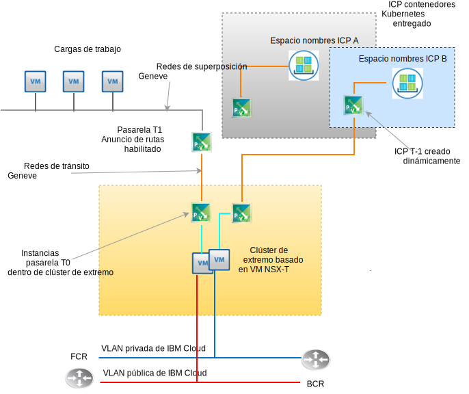

---

copyright:

  years:  2016, 2019

lastupdated: "2019-06-03"

subcollection: vmware-solutions

---

# Diseño de VMware NSX-T
{: #nsx-t-design}

A diferencia de NSX-V (NSX on vSphere), VMware NSX-T está diseñado para ofrecer entornos de aplicaciones y arquitecturas que tienen puntos finales y pilas de tecnologías heterogéneos. Además de vSphere, estos entornos pueden incluir otros hipervisores, KVM, contenedores y servidores nativos. NSX está diseñado para abarcar una red definida por software y una infraestructura de seguridad también en plataformas distintas a vSphere. Aunque es posible desplegar componentes de NSX-T sin que vSphere sea necesario, este diseño se centra en NSX-T y su integración principalmente dentro de un despliegue automatizado de vSphere de vCenter Server.

Hay muchas características avanzadas dentro de NSX-T, como políticas de cortafuegos, la inclusión de introspección de invitado dentro de las políticas de cortafuegos y el seguimiento de flujo de red avanzado. La descripción de estas características va más allá del ámbito de este documento. Consulte la documentación de VMware para NSX-T. En este diseño, la infraestructura de gestión de NSX-T se despliega durante el despliegue en clúster inicial de vCenter Server en lugar de NSX-V.

## NSX-T frente a NSX-V
{: #nsx-t-design-nsx-t-nsx-v}

Para NSX nativo de vSphere (NSX-V), revise los siguientes objetos NSX-T conocidos con funciones similares a sus equivalentes de NSX-V. También se describen las limitaciones y deferencias dentro de un entorno de vSphere. A continuación se muestra una tabla de funciones de uso general entre T y V que se corresponden.

Tabla 1. Terminología entre NSX-V y NSX-T

NSX-V o vSphere nativo | NSX-T
--|:---|:--
**Conmutador distribuido virtual** | Conmutador distribuido virtual de red (N-VDS)
**Zona de transporte NSX** | Zona de transporte (superposición o soporte VLAN)
**Grupo de puertos (vDS)** | Conmutador lógico
**VXLAN (encapsulación L2)** | GENEVE (encapsulación L2)
**Pasarela de extremo** | Pasarela T0 (se ha cambiado a partir de v2.4)
**Direccionador lógico distribuido** | Pasarela T1 (se ha cambiado a partir de v2.4)
**Servidor ESXi (vTEP)** | Nodo de transporte (ESXi, KVM, Pasarela T0 nativa)

Existen conceptos clave de NSX-T que no se corresponden a la función de NSX-V que se necesita entender para la implementación de NSX-T de este diseño.

De la forma siguiente:
- Un clúster de extremo lo forman una o más máquinas virtuales o máquinas físicas que participan en un entramado virtual de NSX-T. Son puntos finales para las zonas de transporte de la red superpuesta y zonas de transporte respaldadas por VLAN. Un clúster de extremo puede admitir varias instancias de pasarela T-0.
- Una pasarela T-0 es una instancia de direccionador virtual, pero no una máquina virtual. Se pueden ejecutar varias instancias de pasarela T-0 dentro de un clúster de extremo con su propia tabla de direccionamiento y funciones. Esto implica que un clúster de extremo debe existir para poder crear una instancia de direccionador T-0.
- Una zona de transporte puede abarcar puntos finales de distintas plataformas y varias instancias de vSphere vCenter. No es necesario ningún NSX con enlace cruzado a vCenter. Las zonas de transporte se pueden excluir de puntos finales específicos. Un N-VDS se correlaciona directamente con una zona de transporte y se crea al crear la zona de transporte.
- El orden de migración tras error de enlace ascendente se crea independientemente del conmutador lógico concreto, ya que se crean en perfiles como "Perfiles de enlace ascendente" y se aplican a un conmutador lógico concreto basado en VLAN. Debido a que es posible que exista la necesidad de tener un orden de migración tras error distinto o un equilibrio de carga de enlaces ascendentes físicos distinto para la misma VLAN, el perfil de enlace ascendente para una VLAN concreta puede contener varias entradas para la "Agrupación" con distinto orden de migración tras error y equilibrio de carga. Al asignar el perfil de enlace ascendente a un conmutador lógico, se elige entonces el perfil de agrupación específico.

- A partir de NSX-T 2.4, se combinan la máquina virtual del gestor y la función de máquina virtual del controlador. Esto provoca que se desplieguen tres máquinas virtuales de gestor de controladores. Si se encuentran en la misma subred, utilizarán un equilibrador de carga de red interno. Si están en distintas subredes, se necesitará un equilibrador de carga externo.

## Requisitos de recursos
{: #nsx-t-design-resource-req}

En este diseño, las máquinas virtuales del gestor de controladores NSX-T se despliegan en el clúster inicial. Además, se asigna una dirección IP respaldada por VLAN a cada gestor de controladores del bloque de direcciones portátiles privadas designado para los componentes de gestión y configurado con los servidores DNS y NTP que se describen en la sección 0. En la tabla siguiente se muestra un resumen de la instalación del gestor NSX.

Tabla 2. Gestor NSX-T - Especificaciones de controlador

Atributo | Especificación
--|--
**Gestor / controlador NSX** | 3 dispositivos virtuales
**Número de vCPU** | 4
**Memoria** |  16 GB
**Disco** | 60 GB
**Tipo de disco** | Ligero suministrado
**Red privada A** | Privada A

En la figura siguiente se muestra la ubicación de los controladores de gestor NSX en relación con otros componentes de esta arquitectura.

## Consideraciones sobre el despliegue
{: #nsx-t-design-deployment}

Con NSX-T en vSphere, se debe asignar a N-VDS los adaptadores físicos dentro de los hosts. Debido a que un N-VDS solo puede estar configurado dentro del gestor NSX-T, esto implica que, si se desea mantener la redundancia, no haya ningún adaptador físico disponible para el conmutador local nativo o la asignación de vDS en un clúster que contenga tanto los componentes de NSX-T como los componentes de la red de superposición asociada.

Por este motivo, durante la instalación de NSX-T y su configuración, un puerto de NIC físico en un adaptador debe permanecer asignado a un
vSwitch de vSphere o a un conmutador distribuido virtual (vDS). Tras el despliegue de NSX-T, es necesario migrar los puertos del kernel de ESX a un N-VDS y fuera de cualquier VDS o vSwitch local. Después de que se eliminen los puertos de kernel, los puertos de NIC físicos restantes se pueden asignar como un enlace ascendente de N-VDS, consiguiendo así redundancia en el N-VDS.

Después del despliegue inicial, la automatización de {{site.data.keyword.cloud_notm}} despliega tres dispositivos virtuales de controlador/gestor NSX-T dentro del clúster inicial. Se asigna a los controladores una dirección IP respaldada por VLAN desde la subred portátil privada A que está destinada a los componentes de gestión. Además, se crean reglas de antiafinidad de VM-VM de modo que los controladores quedan separados entre los hosts del clúster.

Debe desplegar el clúster inicial con un mínimo de tres nodos para garantizar la alta disponibilidad del gestor o los controladores. Además del gestor o los controladores, la automatización de {{site.data.keyword.cloud_notm}} prepara los hosts de vSphere desplegados como nodos de transporte NSX-T. Se asigna una dirección IP respaldada por VLAN a los nodos de transporte ESXi del rango de direcciones IP portátiles Privado A especificado por un rango de agrupaciones IP NSX derivado de la VLAN y el resumen de subred. El tráfico del nodo de transporte reside en la VLAN no etiquetada y se asigna al conmutador distribuido virtual NSX-T (N-VDS).

En función de la topología NSX-T elegida por el cliente para su despliegue, un clúster de extremo NSX-T se desplegará como un par de máquinas virtuales o como software desplegado en nodos de clúster nativos. Independientemente de si el par de clúster es virtual o físico, se configuran enlaces ascendentes a los conmutadores N-VDS para las redes pública y privada de
{{site.data.keyword.cloud_notm}}.

En la tabla siguiente se resumen los requisitos de un entorno de tamaño medio.

Tabla 3. Especificación de componentes de NSX-T

 Recursos | Controlador de gestor x3 | Clúster de extremo x2 | Extremo nativo
-----------|:---------|:-------|:---------
**Tamaño medio** | Dispositivo virtual | Dispositivo virtual | Servidor físico
**Número de vCPU** | 4 | 4 | 8
**Memoria** | 16 GB | 8 GB | 32 GB
**Disco** | 120 GB VSAN/NFS de gestión | 120 GB VSAN/NFS de gestión | 200 GB
**Tipo de disco** | Ligero suministrado | Ligero suministrado | Físico
**Red** | Privada A | Privada A | Privada A

## Zonas de transporte y N-VDS
{: #nsx-t-design-transport-zones}

Las zonas de transporte indican qué hosts y qué máquinas virtuales pueden participar en el uso de una red determinada. Una zona de transporte lo hace limitando los hosts que pueden "ver" un conmutador lógico y, por lo tanto, qué máquinas virtuales se pueden conectar al conmutador lógico. Una zona de transporte puede abarcar uno o más clústeres de hosts. Este diseño requiere que las zonas de transporte se creen tal como se indica a continuación:

Tabla 4. Zonas de transporte NSX-T y N-VDS

Nombre de zona de transporte | VLAN/VXLAN | Nombre de N-VDS | Política de agrupación de enlaces ascendentes
--|:-------|:------|:-----
**Private-Overlay** | VXLAN | SDDC-Overlay | Predeterminada
**Public-VLAN** | VLAN | SDDC-Public | Predeterminada
**Private-VLAN** | VLAN | SDDC-Private | NFS,vSAN,iSCSI-A&B Predeterminada

## Clúster de nodos
{: #nsx-t-design-transport-nodes}

Los nodos de transporte definen los objetos de servidor físico o las máquinas virtuales que participan en el entramado de red virtual. Revise la tabla siguiente para entender el diseño.

Tabla 5. Nodos de transporte NSX-T

Tipo de nodo de transporte | N-VDS | Perfil de uplink | Asignación de IP | NIC físicos
--|:--------|:--------|:---
**ESXi** | SDDC-Private | SDDC-Private-uplink | Agrupación de IP | vmnic0, vmnic2
**Clúster de extremo** | SDDC-Overlay | SDDC-Overlay-uplink | Agrupación de IP | N/D
**Extremo físico** | SDDC-Private | SDDC-Private-uplink | Agrupación de IP | eth0, eth2

## Perfiles de enlace ascendente
{: #nsx-t-design-uplink-profiles}

Un perfil de enlace ascendente define políticas para los enlaces de los hosts de hipervisor a los conmutadores lógicos NSX-T o de los nodos de extremo NSX a los conmutadores sobre bastidor.

Tabla 6. Perfiles de enlace ascendente NSX-T

Nombre de perfil de enlace ascendente | VLAN | Agrupaciones incluidas | MTU
--|:-----|:---|:---
**SDDC-Private-Uplink** | predeterminada | Predeterminada, Gestión | 9000
**SDDC-Public-Uplink** | predeterminada| Predeterminada | 1500
**SDDC-Storage-Uplink** | VLAN de almacenamiento | vSAN, iSCSI-A&B,NFS | 9000

## Agrupación
{: #nsx-t-design-teaming}

Tabla 7. Especificación de agrupación de puertos de NIC de NSX-T

Nombre de agrupación | Migración tras error o equilibrio de carga | NIC activo | NIC en espera
--|:----|:---|:---
**Predeterminada** | Origen de equilibrio de carga | Enlace ascendente 1, 2 | N/D
**Gestión** | Migración tras error| Enlace ascendente 1 | Enlace ascendente 2
**TEP** | Migración tras error| Enlace ascendente 1 | Enlace ascendente 1
**vSAN** | Migración tras error| Enlace ascendente 2 | Enlace ascendente 1
**iSCSI-A** | Migración tras error| Enlace ascendente 1 | N/D
**iSCSI-B** | Migración tras error| Enlace ascendente 2 | N/D
**NFS** | Origen de equilibrio de carga | Enlace ascendente 1, 2 | Enlace ascendente 1
**vMotion** | Migración tras error| Enlace ascendente 2 | Enlace ascendente 1

## Agrupaciones VNI
{: #nsx-t-design-vni-pools}

Los identificadores de red virtual (VNI) son similares a las VLAN para una red física. Se crean automáticamente cuando se crea un conmutador lógico a partir de una agrupación o rango de ID. Este diseño utiliza la agrupación VNI predeterminada que se despliega con NSX-T.

## Conmutadores lógicos
{: #nsx-t-design-logical-switches}

Un conmutador lógico NSX-T reproduce funciones de conmutación, difusión, difusión única desconocida, tráfico de multidifusión (BUM), en un entorno virtual completamente desacoplado del hardware subyacente.

Tabla 8. Conmutadores lógicos NSX-T

Nombre de conmutador lógico | VLAN |Zona de transporte | Política de agrupación de enlaces ascendentes
--|:---|:----|:---
**SDDC-LS-Mgmt** | predeterminada | Private-VLAN | Gestión
**SDDC-LS-NFS** | predeterminada | Private-VLAN | NFS
**SDDC-LS-vMotion** | predeterminada | Private-VLAN | vMotion
**SDDC-LS-VSAN** | VLAN de almacenamiento etiquetada | Private-VLAN | vSAN
**SDDC-LS-iSCSI-A** | VLAN de almacenamiento etiquetada | Private-VLAN| iSCSI-A
**SDDC-LS-iSCSi-B** | VLAN de almacenamiento etiquetada | Private-VLAN| iSCSi-B
**SDDC-LS-TEP** | predeterminada | Private-VLAN| TEP
**SDDC-LS-External** | Predeterminada | Public-VLAN | Predeterminada

### Clúster de extremo
{: #nsx-t-design-edge-cluster}

Dentro de este diseño, se suministra un único clúster de extremo virtual para su uso por parte de las cargas de trabajo de gestión y del cliente. El clúster de extremo virtual puede albergar varias instancias de pasarelas T0. Como se ha descrito anteriormente, se pueden crear varias instancias de pasarela T0 en un solo clúster de extremo, cada una con sus propias tablas de direccionamiento. Consulte la figura siguiente que esquematiza los componentes funcionales de un clúster de extremo NSX-T.

#### Pasarela lógica de nivel 0
{: #nsx-t-design-tier-0}

Un direccionador lógico de nivel 0 NSX-T proporciona un servicio de activación y desactivación de pasarela entre la red lógica y física. En este diseño, se despliegan varias pasarelas T-0 para las necesidades de gestión, la adición de productos y, opcionalmente, para las topologías elegidas por el cliente.

#### Pasarela lógica de nivel 1
{: #nsx-t-design-tier-1}

Una pasarela lógica de nivel 1 NSX-T tiene puertos de enlace descendente para conectar con los conmutadores lógicos del centro de datos NSX-T y puertos de enlace ascendente para conectar únicamente con direccionadores lógicos de nivel 0 del centro de datos NSX-T. Se ejecutan en el nivel de kernel del hipervisor para el que están configuradas y no como una máquina virtual o física. En este diseño, se crean uno o más pasarelas lógicas T-1 para las necesidades de las topologías elegidas por el cliente.

#### Anuncio de rutas de nivel 1 a nivel 0
{: #nsx-t-design-tier-1-tier-0}

Para proporcionar conectividad de capa tres entre las máquinas virtuales conectadas a los conmutadores lógicos agregados a distintas pasarelas lógicas de nivel 1, es necesario habilitar el anuncio de rutas de nivel 1 hacia el nivel 0. No es necesario configurar un protocolo de direccionamiento ni rutas estáticas entre los direccionadores lógicos de nivel 1 y de nivel 0. NSX-T crea rutas estáticas automáticamente cuando se habilita el anuncio de rutas. En este diseño, el anuncio de rutas siempre está habilitado para cualquier pasarela T-1 creada por la automatización IC4V.

### Topologías preconfiguradas
{: #nsx-t-design-preconfig-topo}

Carga de trabajo de la pasarela T1 a la pasarela T0 - clúster de extremo virtual

La topología 1 desplegada por IC4V es básicamente la misma topología que ha desplegado con las pasarelas de extremo y DLR de NSX-V. Con NSX-T, no hay ninguna configuración de protocolo de direccionamiento dinámico entre T1 y T0. El espacio de direcciones IP RFC-1891 se utiliza para la red de superposición de carga de trabajo y la red de superposición de tránsito. Se asigna un espacio de IP portátil público y privado de cliente para uso del cliente. Se asigna un espacio de IP portátil público y privado de {{site.data.keyword.cloud_notm}} designado por el cliente al nivel 0 para uso del cliente.

A partir de este diseño, tiene la opción de no suprimir estos rangos de IP si la instancia de vCenter Server queda fuera de servicio y se suprime.

Carga de trabajo de la pasarela T1 a la pasarela T0 - clúster de extremo físico:

La topología 2 desplegada es similar, con la excepción de que se sustituye el clúster de extremo basado en máquina virtual por un par de servidores nativos que ejecutan Red Hat Server. Se asigna un espacio de IP portátil público y privado de {{site.data.keyword.cloud_notm}} designado por el cliente al nivel 0 para uso del cliente. A partir de este diseño, tiene la opción de no suprimir estos rangos de IP si la instancia de vCenter Server queda fuera de servicio y se suprime.

Consulte un documento o enlace independiente a la lista de materiales en las especificaciones de hardware y de SO.

Carga de trabajo con ICP a la pasarela T0 - clúster de extremo virtual:

La topología 3 desplegada contiene la topología 1 con la adición de un despliegue ICP que ofrece la integración NSX-T en lugar de Calico, que es la pila de conexión de redes predeterminada dentro de un despliegue ICP. El cliente puede suministrar espacios de nombres de contenedor adicionales dentro de ICP, que automatiza la creación de conmutadores lógicos, subredes de IP e instancias de pasarela T1 para cada espacio de nombres.

Para obtener información completa sobre cómo funciona ICP en vCenter Server, consulte la documentación de ICP en la arquitectura vCenter Server. Se asigna un espacio de IP portátil público y privado de {{site.data.keyword.cloud_notm}} designado por el cliente a cada T0 para uso del cliente.

A partir de este diseño, tiene la opción de no suprimir estos rangos de IP si la instancia de vCenter Server queda fuera de servicio y se suprime.

## Enlaces relacionados
{: #nsx-t-design-related}

* [Visión general de vCenter Server on {{site.data.keyword.cloud_notm}} con el paquete híbrido (Hybridity)](/docs/services/vmwaresolutions/archiref/vcs?topic=vmware-solutions-vcs-hybridity-intro)
