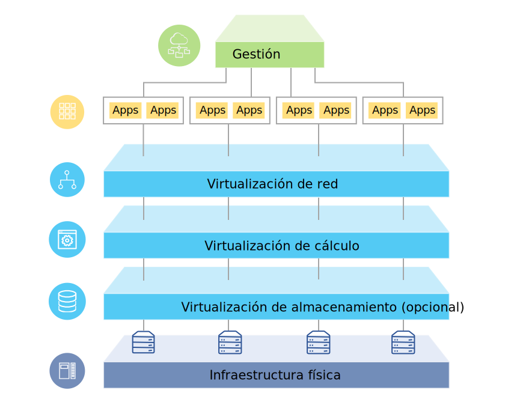

---

copyright:

  years:  2016, 2018

lastupdated: "2018-07-10"

---

# Visión general de la solución

Las ofertas de {{site.data.keyword.vmwaresolutions_full}} le permiten ampliar el centro de datos virtualizado de VMware existente en el {{site.data.keyword.cloud_notm}} o en las aplicaciones nativas de nube de alojamiento.

La solución da soporte a casos de uso como, por ejemplo, la expansión de capacidad en la nube (y la contracción cuando no es necesario), la migración a la nube, la recuperación tras desastre a la nube y la copia de seguridad en la nube. Con la solución, puede crear un entorno de nube dedicado para el desarrollo, las pruebas, la formación, el laboratorio o la producción.

Revise esta información para el diseño de las ofertas de {{site.data.keyword.vmwaresolutions_short}}, incluidas VMware Cloud Foundation y VMware vCenter Server, cuyas cargas de trabajo de destino requieren altos niveles de disponibilidad y escalabilidad.

Este diseño sirve como una arquitectura de línea base que proporciona la base para que otros componentes internos o específicos del proveedor se añadan para casos de uso específicos.

## Visión general de VMware on IBM Cloud

Figura 1. Visión general de VMware on {{site.data.keyword.cloud_notm}}

## Beneficios clave

VMware Cloud Foundation y vCenter Server on {{site.data.keyword.cloud_notm}} proporcionan los bloques de construcción fundamentales, que incluye VMware vSphere, vCenter Server, NSX y las opciones de almacenamiento compartidas, entre las que se incluyen vSAN, que son necesarios para diseñar de forma flexible una solución de centro de datos definida por software de VMware que se adapte mejor a sus cargas de trabajo. Mediante la aplicación de la automatización avanzada y de la infraestructura nativa de un solo arrendatario, puede desplegar rápidamente todo el entorno de VMware en el {{site.data.keyword.cloud_notm}} y acceder a su entorno virtual con las herramientas favoritas en cuestión de horas. En este punto, puede acceder y gestionar el entorno alojado por IBM mediante los clientes de VMware nativos, la interfaz de línea de mandatos (CLI), los scripts existentes u otras herramientas familiares compatibles con la API de vSphere.

Después del despliegue, puede añadir nodos de host ESXi y gestionar la copia de seguridad y la aplicación de parches para algunos componentes de gestión. {{site.data.keyword.cloud_notm}} Professional Services y Managed Services también están disponibles para ayudarle a acelerar la implantación en la nube con ofertas como los servicios de migración, implementación e incorporación.

Las ofertas de VMware on {{site.data.keyword.cloud_notm}} ofrecen las siguientes ventajas:

* **Acelerando la entrega** de proyectos de TI para desarrolladores y líneas de negocio reduciendo el tiempo necesario para la adquisición, la arquitectura, la implementación y el despliegue de recursos desde semanas o incluso meses, hasta horas.
* **Mejorando la seguridad** con servidores nativos dedicados en una nube privada alojada, incluido el cifrado de datos en reposo.
* **Habilitando la gestión y el gobierno coherentes** de la nube híbrida desplegada proporcionando acceso administrativo completo a la gestión de virtualización, conservando así las herramientas de VMware existentes, los scripts y las inversiones en formación.
* **Aproveche la experiencia de VMware a escala global** con IBM Professional y Servicios gestionados que abarcan 30+ {{site.data.keyword.CloudDataCents_notm}} en todo el mundo.

### Enlaces relacionados

* [Visión general del diseño](design_overview.html)
* [Capacidad de escalado](solution_scaling.html)
* [Copia de seguridad de los componentes](solution_backingup.html)
