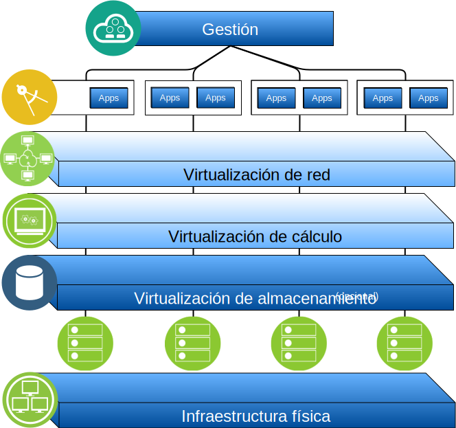

---

copyright:

  years:  2016, 2019

lastupdated: "2019-05-07"

subcollection: vmware-solutions

---

# Visión general de IBM Cloud for VMware Solutions
{: #solution_overview}

Las ofertas de {{site.data.keyword.vmwaresolutions_full}} le permiten ampliar el centro de datos virtualizado de VMware existente en el {{site.data.keyword.cloud_notm}} o en las aplicaciones nativas de nube de alojamiento.

La solución da soporte a casos de uso como, por ejemplo, la expansión de capacidad en la nube (y la contracción cuando no es necesario), la migración a la nube, la recuperación tras desastre a la nube y la copia de seguridad en la nube. Con la solución, puede crear un entorno de nube dedicado para el desarrollo, las pruebas, la formación, el laboratorio o la producción.

Revise esta información para el diseño de {{site.data.keyword.vmwaresolutions_short}} vCenter Server, cuyas cargas de trabajo de destino requieren altos niveles de disponibilidad y escalabilidad.

Este diseño sirve como una arquitectura de línea base que proporciona la base para que otros componentes internos o específicos del proveedor se añadan para casos de uso específicos.

## Principales ventajas de IBM Cloud for VMware Solutions
{: #solution_overview-benefits}

VMware vCenter Server on {{site.data.keyword.cloud_notm}} proporciona los bloques de construcción fundamentales, que incluyen VMware vSphere, vCenter Server, NSX y opciones de almacenamiento compartido, como vSAN. Estos componentes son necesarios para diseñar de forma flexible una solución de centro de datos definida por software de VMware que se adapte mejor a sus cargas de trabajo.

Mediante la aplicación de la automatización avanzada y de la infraestructura nativa de un solo arrendatario, puede desplegar rápidamente todo el entorno de VMware en el {{site.data.keyword.cloud_notm}} en horas. Entonces, puede acceder y gestionar el entorno alojado por IBM mediante los clientes de VMware nativos, la interfaz de línea de mandatos (CLI), los scripts existentes u otras herramientas familiares compatibles con la API de vSphere.

Tras el despliegue, puede añadir (y eliminar) servidores ESXi en una instancia, añadir y eliminar clústeres, unir instancias adicionales de vCenter Server con una instancia existente y añadir productos y servicios utilizando la consola de {{site.data.keyword.vmwaresolutions_short}}. Es responsabilidad del usuario supervisar y gestionar las instancias de vCenter Server.

Su responsabilidad incluye la realización de copias de seguridad, aplicación de parches, configuración y supervisión del software de VMware y el hardware de hipervisor subyacente. {{site.data.keyword.vmwaresolutions_short}} ofrece soluciones automatizadas para ayudarle con la gestión y la supervisión en curso de la instancia de vCenter Server.

Además, {{site.data.keyword.cloud_notm}} Professional Services y Servicios gestionados también están disponibles para ayudarle a acelerar su viaje a la nube con ofertas como la migración, la implementación y la incorporación de servicios.

A diferencia de una oferta de servicio gestionado, vCenter Server le ofrece un acceso total y completo a todos los componentes, lo cual permite una mayor flexibilidad que la que podría ofrecer un servicio gestionado. No obstante, existen ciertas restricciones que se aplican para permitir el funcionamiento de la automatización de IBM Cloud for VMware Solutions, posteriores al despliegue de vCenter Server.

Las ofertas de VMware on {{site.data.keyword.cloud_notm}} ofrecen las siguientes ventajas:

* **Aceleración de la entrega** de proyectos de TI para desarrolladores y líneas de negocio reduciendo el tiempo necesario para la adquisición, la arquitectura, la implementación y el despliegue de recursos desde semanas o incluso meses, hasta horas.
* **Seguridad mejorada** con servidores nativos dedicados en una nube privada alojada, incluyendo el cifrado de datos en reposo. Para el almacenamiento vSAN, el cifrado de datos en reposo es opcional, ya sea utilizando el cifrado de vSAN o de vSphere. Para el almacenamiento compartido a nivel de archivos o de bloque, hay un cifrado en reposo gestionado por el proveedor de servicios disponible de forma predeterminada en los centros de datos seleccionados o de manera opcional utilizando el cifrado de vSphere. Debe gestionar las claves de cifrado necesarias.
* **Habilitación de la gestión y el gobierno coherentes** de la nube híbrida desplegada proporcionando acceso administrativo completo a la gestión de la virtualización, conservando así sus herramientas de VMware existentes, así como los scripts y la inversión en formación.
* **Utilización de la experiencia de VMware a escala global** con IBM Professional and Servicios gestionados que abarcan más de 30 {{site.data.keyword.CloudDataCents_notm}} en todo el mundo.

## Enlaces relacionados
{: #solution_overview-related}

* [Visión general del diseño](/docs/services/vmwaresolutions/archiref/solution?topic=vmware-solutions-design_overview)
* [Capacidad de escalado](/docs/services/vmwaresolutions/archiref/solution?topic=vmware-solutions-solution_scaling)
* [Copia de seguridad de los componentes](/docs/services/vmwaresolutions/archiref/solution?topic=vmware-solutions-solution_backingup)
