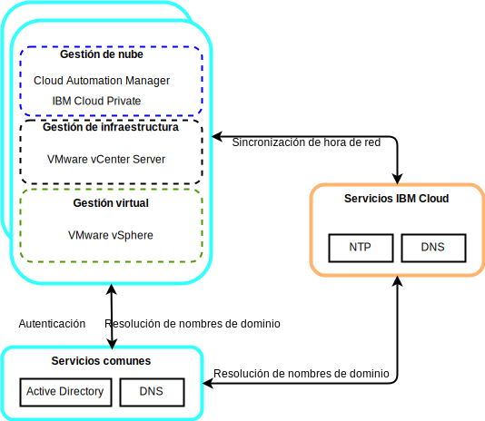

---

copyright:

  years:  2016, 2019

lastupdated: "2019-05-07"

subcollection: vmware-solutions

---

# Componentes de servicios comunes para VMware y Skate Advisor Concept Car
{: #vcscar-commonservices}

Los servicios comunes proporcionan los servicios que utilizan otros servicios en la plataforma de gestión de nube. Los servicios comunes incluyen servicios de identidad y acceso, servicios de nombres de dominio, servicios NTP.

## Servicios de identidad y acceso
{: #vcscar-commonservices-identity}

Como parte de VMware vCenter Server en la automatización de {{site.data.keyword.cloud_notm}}, se utiliza un Microsoft Active Directory (AD) para la gestión de identidades. Se despliega una sola instancia de servidor virtual (VSI) AD. El vCenter se configura de modo que utilice la autenticación de AD y puede configurar {{site.data.keyword.icpfull_notm}} para la autenticación de LDAP.

## Servicios de nombres de dominio
{: #vcscar-commonservices-dns}

El despliegue utiliza los AD VSI como servidores del sistema de nombres de dominio (DNS) para la instancia. Todos los componentes desplegados se configuran de modo que apunten a AD como su DNS predeterminado. Los componentes desplegados incluyen hosts vCenter, PSC, NSX y ESXi.

## Servicios de protocolo de tiempo de red
{: #vcscar-commonservices-ntp}

El despliegue de vCenter Server utiliza los servidores del protocolo de tiempo de red (NTP) de la infraestructura de {{site.data.keyword.cloud_notm}}. Todos los componentes desplegados se configuran para utilizar estos servidores NTP. El hecho de que todos los componentes utilicen los mismos servidores NTP resulta crítico para que los certificados y la autenticación de AD funcionen correctamente.

## Enlaces relacionados
{: #vcscar-commonservices-related}

* [Visión general de vCenter Server on {{site.data.keyword.cloud_notm}} con el paquete híbrido (Hybridity)](/docs/services/vmwaresolutions/archiref/vcs?topic=vmware-solutions-vcs-hybridity-intro)
