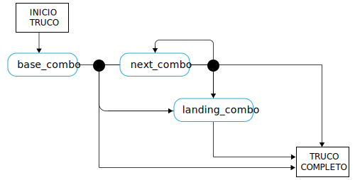

---

copyright:

  years:  2016, 2019

lastupdated: "2019-02-15"

subcollection: vmware-solutions


---

# Conceptos sobre el lenguaje de skateboarding
{: #vcscar-concepts}

## Lenguaje de skater
{: #vcscar-concepts-skater}

Un aspecto clave de Skate Advisor son las conversaciones posibles gracias al chatbot guiado por Watson. En la sección siguiente se detallan las reglas de conversación que definen una interacción humana con el chatbot de Skate Advisor.

El lenguaje de skater es el núcleo del sistema y se utiliza de la forma siguiente:
* Reconocimiento de trucos: utilizado por Watson Discovery para ingerir material de fuentes en línea a fin de reconocer los trucos existentes y correlacionarlos con el material de origen.
* Conversaciones sobre skate: utilizado por el chatbot para mantener conversaciones con sentido con el usuario del sistema.
* Clasificación de trucos: almacenar y clasificar un truco en función de la descripción textual del truco. Los trucos que se clasifican de esta forma pueden tener metadatos adjuntos, como referencias de ubicación y vídeos.

## Elementos del lenguaje
{: #vcscar-concepts-lang-elem}

### Elementos principales
{: #vcscar-concepts-core-elem}

Estos son los elementos principales de lenguaje para crear un truco.

Tabla 1. Elementos principales del lenguaje

Tipo de elemento | Texto del lenguaje
---|---|---
Direction | fakie<br>nollie<br>switch
Rotation | halfcab<br>cab<br>180<br>360<br>540
Base | kickflip<br>heelflip<br>hardflip<br>bigspin<br>shuvit<br>impossible
landing | manual (2 ruedas posteriores)<br>nosemanual (2 ruedas frontales)<br>5-0 (grind)<br>nosegrind<br>tailslide<br>noseslide<br>crooked grind<br>smithgrind<br>boardslide<br>lipslide<br>

### Modificadores de elementos
{: #vcscar-concepts-elem-modifiers}

Los modificadores de elementos son elementos especiales del lenguaje que dan el contexto a determinados aspectos del lenguaje.

Tabla 2. Modificadores del lenguaje

Tipo de elemento | Texto del lenguaje |Avisos
---|---|---
Turn Prefix | Frontside<br>backside | Turn Prefix se refiere al sentido de un giro
Varial | Inward<br>outward |

## Reglas del lenguaje
{: #vcscar-concepts-lang-rules}

El siguiente conjunto de reglas construye el lenguaje. Los trucos se dividen en una o varias combinaciones de elementos a los que se hace referencia como "Combo". Existe una diferencia entre el primer Combo y los siguientes Combos: se supone que el sentido (direction) es el mismo que en el Combo base, a menos que se especifique lo contrario.

Para las reglas siguientes, examine los Elementos principales y los Modificadores de elementos como referencia, ya que se utilizan para construir el lenguaje.

### Conjunto de reglas de trucos
{: #vcscar-concepts-trick-ruleset}

```
base_combo = 'direction \+ \[varial | turn_prefix\] \+ \[rotation\] \+ \[base_trick\]'
next_combo = ''\[varial | turn_prefix\] \+ \[rotation\] \+ \[base_trick\]'
landing_combo = ''\[varial | turn_prefix\] \+ landing'
trick = 'combo \+ \[“to” + combo\] \+ \[“to” \+ landing_combo\]'
```

### Motor de reglas de trucos
{: #vcscar-concepts-trick-rule-engine}

El diagrama siguiente es un resumen visual del motor de reglas.

Figura 1. Visión general del lenguaje de skate


## Lenguaje de truco de ejemplo
{: #vcscar-concepts-sample-trick}

A continuación se muestra un ejemplo de una lista de trucos de muestra:

```
fakie-kickflip
fakie-kickflip to fakie-5-0 to fronside-halfcab (out)
fakie-heeflip
fakie-heeflip to fakie-maual to fakie-hardflip
fakie-inward (varial) heeflip to fakie-backside tailslide to fakie
switch-heeflip to fakie-maual to fakie-hardflip
switch-hardflip to fakie-manual
fakie-hardflp to fakie-nosegrind
nollie-hardflip-to-tailslide
nollie-inward-heelflip to frontside noseslide
kickflip-frontside to crooked grind
halfcab-heelflip to crooked grind
frontside-shuvit to nosegrind to nollie-flip (out)
kickflip to nosegrind to nollie-impossilbe (out)
nollie-kickflip to noseslide to nollieflip
nollie-kickflip to frontside-lipslide
nollie-impossible to manual
nollie-impossible to 5-0
nollie-kickflip to crooked grind
nollie-kickflip to crooked grind to nollie-halfcab-kickflip (out)
frontside-nollie-halfcab-heelflip to fakie-nosegrind
backside-nollie-halfcab-kickflip to backside-tailslide to backside-180-out
frontside-nollie-cab-kicflip halfcab to backside-smithgrind
halfcab to backside-smithgrind to backside-180-bigspin (out)
kickflip-backside-tailslide to backside-180-kickflip
kickflip-backside-tailslide to backside-backside-bigspin
360-kicflip to nosemanual to nollie-360-kickflip
360-kicflip to frontside-lipslide
harflip to backside-lipslide
kicflip to frontside-boardslidev
nollie-heelflip to frontside-boardslide
```

## Relevancia
{: #vcscar-concepts-relevance}

El lenguaje de trucos es la construcción principal que se utiliza para enseñar a Watson a reconocer y a ingerir documentos e información en medios sobre skating y también constituye la base de las conversaciones con el usuario.

## Enlaces relacionados
{: #vcscar-concepts-related}

* [Visión general de vCenter Server on {{site.data.keyword.cloud}} con el paquete híbrido (Hybridity)](/docs/services/vmwaresolutions/archiref/vcs?topic=vmware-solutions-vcs-hybridity-intro)  
