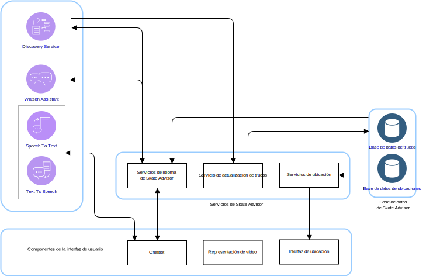
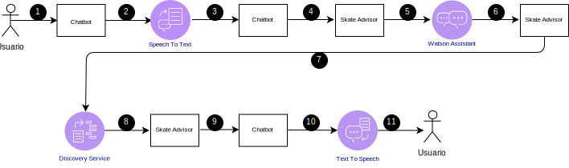
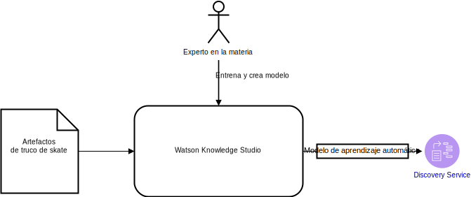

---

copyright:

  years:  2016, 2019

lastupdated: "2019-03-19"

subcollection: vmware-solutions

---

# Diseño lógico de Skate Advisor
{: #vcscar-logical}

En la información siguiente se detallan los elementos de la aplicación que forman el diseño lógico del sistema.

## Componentes del sistema
{: #vcscar-logical-sys-comp}

Figura 1. Componentes de Skate Advisor

Skate Advisor consiste principalmente de un chatbot que acepta texto o reconocimiento de voz para interactuar con el sistema de forma estructurada.

## Trucos
{: #vcscar-logical-tricks}

El elemento de datos principal de Skate Advisor es el truco. El lenguaje de truco define un truco de forma exclusiva. Este lenguaje se puede utilizar para llevar a cabo las tareas siguientes:
- Conversar con el chatbot sobre los trucos.
- Buscar trucos a través de Watson Discovery.
- Identificar y clasificar trucos al entrenar a Watson Discovery a partir de artículos de origen.
- Identificar un truco para ver la ubicación y mostrarlo en los medios.

### Definición de truco
{: #vcscar-logical-trick-def}

Un truco se define exclusivamente por las construcciones del lenguaje que lo describen. Consulte el motor de reglas de trucos para ver una definición completa.

### Lista de trucos
{: #vcscar-logical-list-tricks}

Una consulta del Truco base o de Aterrizaje definida en elementos del lenguaje devuelve una lista de trucos.

### Datos de los trucos
{: #vcscar-logical-trick-data}

Una vez devueltos, los trucos pueden contener la siguiente información:
- Descripción del truco
- Uno o varios artefactos de medios
- Información sobre ubicación

## Secuencias de la conversación
{: #vcscar-logical-conv-streams}

El chatbot tiene un número limitado y predefinido de posibles conversaciones. Las conversaciones se definen por la siguiente información:
- Búsqueda de trucos: buscar un conjunto de trucos válidos basados en un parámetro de consulta que representa el Truco base o el Aterrizaje.
- Búsqueda de ubicación: buscar una ubicación cercana para un truco.
- Visualización en medios: visualizar un elemento de medios, como un vídeo en línea en el que se ha encontrado y clasificado un truco.

Tabla 1. Conversación

Conversación | Estructura | Resultado
---|---|---
Búsqueda de trucos | Describir un truco |Una lista de trucos
Búsqueda de ubicación | ¿Dónde debería realizar este truco? | Lista de ubicaciones para un determinado truco
Visualización en medios | Mostrar un vídeo de un truco |Una lista de resultados en medios

## Componentes de la interfaz de usuario
{: #vcscar-logical-ui-comp}

### Chatbot
{: #vcscar-logical-chatbot}

El chatbot es un componente web que conversa con el usuario. El chatbot puede aceptar texto o voz. Los resultados, como por ejemplo listas, se representan en texto con un posible discurso de acompañamiento para representar los resultados.

Los chatbots interactúan con el sistema de la forma siguiente:

Figura 2. Típica consulta de chatbot
 

Tabla 2. Interacciones de chatbot

Paso | Descripción
---|---
1 | Iniciar una conversación válida, consulte la sección sobre Secuencias de conversación.
2 | El chatbot envía voz al servicio de Speech to Text.
3 | El servicio Speech to Text envía texto al chatbot.
4 | El chatbot envía una consulta de texto a Skate Advisor.
5 | Skate Advisor evalúa la solicitud y la envía a Watson Assistant.
6 | Watson Assistant clasifica la solicitud y responde a Skate Advisor con la acción que debe emprender.
7 | Skate Advisor solicita un conjunto de datos a Discovery Service.
8 | Discovery Service evalúa la consulta y envía la respuesta.
9 |Skate Advisor forma una respuesta y la envía al chatbot en forma de texto.
10 | El chatbot envía la respuesta de texto al servicio Text To Speech.
11 | Los resultados se envían al usuario a través del chatbot.

### Representación de vídeo
{: #vcscar-logical-video-render}

El componente de representación de vídeo reproduce un vídeo o muestra un documento. Estos artefactos representan el artefacto de origen a partir del que se ha descubierto el truco.

El componente de representación de vídeo es un widget incorporado en la interfaz web que muestra un vídeo. Los vídeos se muestran en el chatbot como resultado de una consulta del usuario del sistema. Una vez seleccionado, el enlace de vídeo resultante activa la representación del vídeo.

### Interfaz de ubicación
{: #vcscar-logical-location-interface}

Skate Advisor incluye una interfaz para que los usuarios del sistema graben la ubicación de un truco específico. El componente de interfaz web tiene dos elementos principales:
1. Aceptar una ubicación del usuario del sistema como el mejor lugar en el que realizar un truco específico.
2. Mostrar una o varias ubicaciones recomendadas para un truco específico.

## Componentes de Watson
{: #vcscar-logical-watson-comp}

En esta arquitectura se incluyen los siguientes componentes de Watson.
* Knowledge Studio: Watson Studio es una herramienta con la que podemos diseñar el lenguaje de skate para el sistema y utilizar este lenguaje para reconocer documentos de la web que implementan el lenguaje de skate. Knowledge Studio ofrece un modelo que Watson Discovery utiliza.
* Speech to Text: transcribe voz en texto. Este componente acepta audio de un dispositivo en el que se ejecuta el chatbot y lo convierte en texto para que Watson lo procese.
* Text to Speech: sintetiza texto en voz. Este componente acepta texto de la aplicación Skate Advisor y lo convierte en voz para que lo reproduzca el dispositivo en el que se ejecuta el chatbot.
* Discovery Service: el sistema utiliza Watson Discovery Service para recuperar el contenido relacionado con skate que coincide con los parámetros solicitados. Un ejemplo podría ser “Listar todos los registros del truco Casper”. Watson Discovery utiliza técnicas avanzadas de machine learning para descubrir la parte relevante del contenido ingerido.
* Watson Assistant: Watson Assistant es una herramienta para diseñar las interacciones entre los usuarios y la máquina (chatbot). Se debe entrenar con un lenguaje específico del dominio, por ejemplo específico de skateboarding, mediante series gramaticales a partir de las que Assistant reconoce y genera las respuestas adecuadas.

## Skate Advisor Service
{: #vcscar-logical-skate-advisor-services}

Skate Advisor Service es un componente de la aplicación que proporciona un conjunto de servicios de API para responder a las solicitudes. Los servicios que se exponen tienen una correlación directa con las secuencias de conversaciones que se han descrito anteriormente. La API expuesta tiene las siguientes categorías generales:
* get_tricks - Devolver una lista de trucos basados en una <query\> (consulta) en lenguaje natural, que se presenta a Discovery Service.
* show_tricks - Devolver una lista de medios para un truco específico.
* find_trick - Devolver un truco específico.
* accept_command - Aceptar un mandato de texto del chatbot y servir la solicitud.

## Entrenamiento de Discovery Service
{: #vcscar-logical-disc-service-training}

Watson Discovery se debe entrenar con un modelo de machine learning, que crea de forma iterativa un experto en el tema utilizando Watson Knowledge Studio.

Figura 3. Entrenamiento de Discovery Service
 

Para Skate Advisor, el modelo consiste en la relación entre tipos de entidades con una combinación de entrenamiento basado en reglas y entrenamiento basado en diccionario para crear un modelo. Este modelo permite que Discovery Service reconozca y clasifique los trucos que se han ingerido de artículos y descripciones de vídeo que se utilizan como conjunto de entrenamiento.

Después del entrenamiento, Discovery Service puede responder a consultas como:
- Enséñame todos los trucos cuyo truco básico sea heelflip.
- Enséñame todos los trucos.
- Enséñame todos los trucos con varios combos.

## Enlaces relacionados
{: #vcscar-logical-related}

* [Visión general de vCenter Server on {{site.data.keyword.cloud}} con el paquete híbrido (Hybridity)](/docs/services/vmwaresolutions/archiref/vcs?topic=vmware-solutions-vcs-hybridity-intro)
