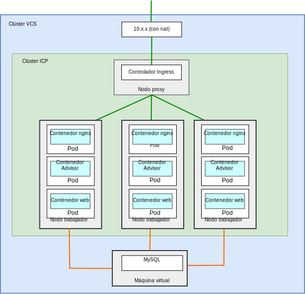
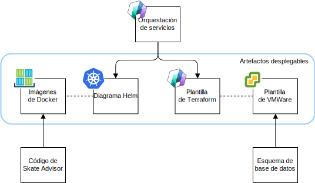
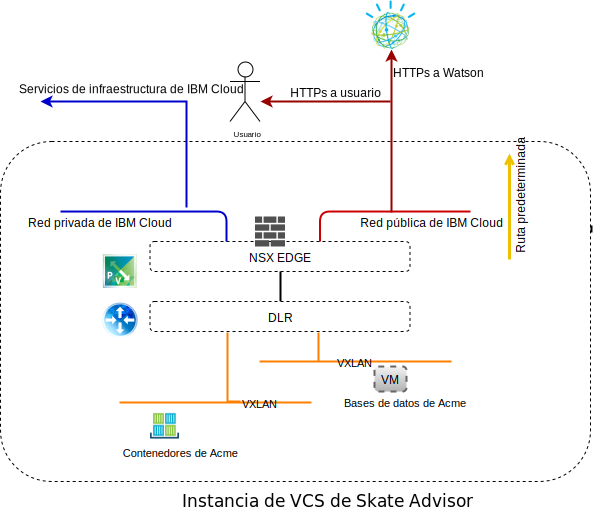
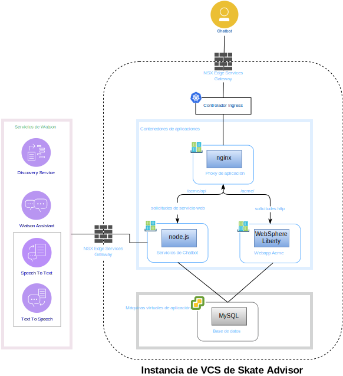
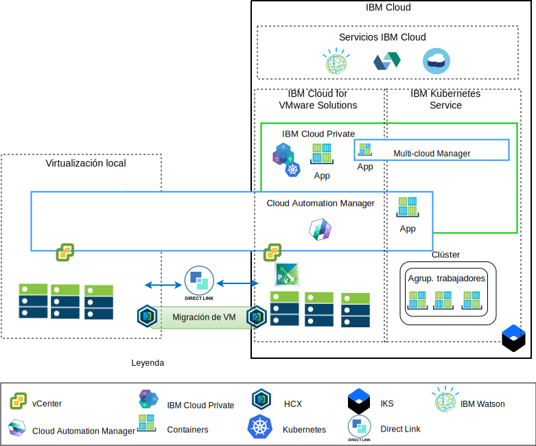

---

copyright:

  years:  2016, 2018

lastupdated: "2018-11-14"

---

# Componentes de Skate Advisor

{{site.data.keyword.vmwaresolutions_full}} proporciona la automatización para desplegar componentes de tecnología VMware en {{site.data.keyword.CloudDataCents_notm}} en todo el mundo. La arquitectura consta de una sola región de nube y permite la ampliación a más regiones de nube ubicadas en una de las siguientes opciones:

1. Otra geografía.
2. Otro pod {{site.data.keyword.cloud_notm}} del mismo centro de datos.
3. Otra geografía y otro pod {{site.data.keyword.cloud_notm}} del mismo centro de datos.

Los productos {{site.data.keyword.cloud_notm}} Private (ICP) y Cloud Automation Manager (CAM) se pueden desplegar manualmente en la plataforma de virtualización local, lo que permite gestionar la nube desde ubicaciones locales. Como alternativa, ICP y CAM se ofrecen como extensiones de servicio de un despliegue de vCenter Server on {{site.data.keyword.cloud_notm}} nuevo o existente, mediante automatización, lo que permite gestionar la nube desde {{site.data.keyword.cloud_notm}}.

ICP es una plataforma de aplicaciones para desarrollar y gestionar aplicaciones de contenedor locales. Es un entorno integrado para gestionar contenedores que incluye el coordinador de contenedores Kubernetes,
un repositorio de imágenes privadas, una consola de gestión e infraestructuras de supervisión.

IBM Multi-Cluster Manager proporciona visibilidad de usuario, gestión centrada en aplicaciones (política, despliegues, estado, operaciones) y conformidad basada en políticas entre nubes y clústeres. Con IBM Multi-Cluster Manager, tiene el control sobre los clústeres de Kubernetes. Se asegura de que sus clústeres sean seguros, que funcionen de forma eficiente y que proporcionen los niveles de servicio que esperan las aplicaciones.

{{site.data.keyword.cloud_notm}} Automation Manager es una plataforma de gestión de autoservicio multinube que se ejecuta en {{site.data.keyword.cloud_notm}} Private que permite a los desarrolladores y a los administradores satisfacer las necesidades de la empresa. Cloud Automation Manager Service Composer le permite exponer los servicios de nube híbrida en el catálogo de ICP.

## Componentes de Skate Advisor

En el diagrama siguiente se describe la implementación de referencia de la aplicación Acme Skate Advisor en una implementación de infraestructura de modernización de aplicaciones.

Figura 1. Componentes físicos de Skate Advisor

La aplicación Skate Advisor amplía la aplicación web de Acme existente con un componente basado en microservicios que interactúa con Watson y un contenedor nginx para enviar por proxy las solicitudes a la web y al contenedor de microservicios.

La aplicación Skate Advisor aprovecha la plataforma de modernización de aplicaciones que proporciona la infraestructura de alojamiento necesaria.

### Empaquetado y despliegue de aplicaciones

La aplicación se despliega como una coordinación de CAM que contiene los siguientes elementos:

Figura 2. Coordinación de CAM

Estos elementos se describen de la forma siguiente:
* Coordinación de servicios: una coordinación de servicios CAM es un recurso de flujo de trabajo que describe
las plantillas de Terraform y los diagramas de Helm que se van a desplegar como parte de un servicio. Un servicio se puede publicar y constituye el artefacto de control desde el que se coordina todo el despliegue.
* Diagrama de Helm: el diagrama de Helm reside en el repositorio de ICP local y despliega contenedores y otros recursos en ICP. Un diagrama de Helm es una descripción de los recursos
de Kubernetes, que incluye:
 - Despliegues de contenedor
 - Servicios
 - Ingress
 - Reglas
 - Puntos finales

* Imágenes de Docker: las imágenes de Docker contiene el sistema operativo (ubuntu),
el middleware (WebSphere Liberty, nginx) y el código de Skate Advisor y de
Skate Store. Las imágenes de Docker son objetos estáticos que se despliegan en contenedores en ejecución.
* Plantilla de Terraform: una plantilla de Terraform es un archivo que describe los recursos de nube que se van a desplegar. En el caso de Skate Advisor, se describe una plantilla de ubuntu, que viene preinstalada con mysql y el esquema de base de datos.
* Plantilla de VMWare: la plantilla de VMWare es una plantilla de Ubuntu con mysql
y el esquema de base de datos preinstalados.

### Equilibrio de carga y proceso sustitución (proxy)

El equilibrio de carga y el proceso de sustitución (proxy) se implementan mediante el componente ICP Ingress Controller. Este componente maneja el escalado del contenedor y la migración tras error de forma transparente.

El proceso de proxy de aplicaciones se suministra mediante el contenedor nginx, que equilibra la carga del siguiente modo.

Tabla 1. Reglas de proxy invertido de Skate Advisor

URL	|Punto final
---|---
/acme	|Servicio Acme Web Container
/acme/api	|Servicio Skate Advisor
/acme/api/explorer	|Servicio Skate Advisor

Los contenedores tienen direcciones IP impredecibles, cuyo número puede aumentar o disminuir según la exigencia del sistema. Para solucionar este problema, se utilizan servicios de ICP para realizar la resolución de direcciones IP en tiempo real dentro del sistema.

### Aplicación web de Acme Skate
La aplicación web de Acme Skate es una aplicación de Java Platform, Enterprise Edition (Java Platform, Enterprise Edition) basada en la infraestructura Spring. La aplicación se despliega en un contenedor WebSphere Liberty.

### Aplicación Acme Skate Advisor
La aplicación Acme Skate Advisor es una aplicación basada en microservicios que se despliega en un contenedor de WebSphere Liberty. Un servidor web nginx proporciona un extremo frontal a los microservicios.

### Base de datos de Acme Skate
La base de datos de Acme Skate es una base de datos MySQL que se despliega en una máquina virtual gestionada por vSphere.

### Visión general de las comunicaciones
Skate Advisor necesita las siguientes comunicaciones:
-	Entre el contenedor web y el usuario del sistema.
-	Entre Advisor y el contenedor web y los servicios Watson.
-	Entre el contenedor y los aspectos de la implementación de la máquina virtual.

La plataforma de modernización de aplicaciones se ha diseñado con los siguientes componentes para alcanzar este objetivo.

Figura 3. Acceso a la red pública

{{site.data.keyword.cloud_notm}} tiene dos redes. La red pública permite acceder a los servidores desde internet y la red privada permite que los servidores se comuniquen entre sí a través de una red troncal de alta velocidad en todos los {{site.data.keyword.CloudDataCents_notm}}.

Virtual Routing Appliance (VRA) permite a los clientes direccionar el tráfico de la red privada y pública mediante la asociación de VLAN con el dispositivo.
Tanto la infraestructura de vCenter Server NSX Edge como la de IKS están configuradas con una ruta predeterminada a la red pública y con una ruta
10.0.0.0/8 estándar a la red privada.

Se necesita una ruta estática en la infraestructura de IKS con el dispositivo VRA
para cualquier NSX VXLAN definida. Desde NSX Edge, configuramos un igual
BGP con el VRA sobre la red privada, lo que permite anunciar e inyectar rutas
de las NSX VXLAN. Este igual permite que la red de
NSX VXLAN se comunique con la red troncal de {{site.data.keyword.cloud_notm}} y viceversa.

### Correlación de componentes de software

La aplicación Skate Advisor utiliza los siguientes componentes de software.

Figura 4. Correlación de software de Skate Advisor

Se utilizan los siguientes componentes de software:

* nginx: proporciona servicios de proxy inverso a la aplicación.
Las solicitudes a los microservicios y a las aplicaciones se distribuyen a los puntos finales de contenedor correctos.
* WebSphere Liberty: aloja la aplicación Acme, que es una aplicación Java Platform, Enterprise Edition basada en Spring.
* Node.js: proporciona la infraestructura de microservicios al chatbot. Esta aplicación utiliza servicios de Watson.
* mysql: Oracle Mysql proporciona la base de datos de la aplicación.
* JavaScript: el chatbot es una aplicación basada en JavaScript alojada en el navegador del cliente. El chatbot se comunica con Watson a través de los microservicios basados en Node.js.

## Visión general de la gestión

Acme Skate Advisor reside en {{site.data.keyword.cloud_notm}} y, como tal, constituye un aspecto crítico de la arquitectura. {{site.data.keyword.cloud_notm}} tiene la arquitectura siguiente.

Figura 5. Gestión de la nube

Este diagrama representa ICP y CAM desplegados en una instancia de vCenter Server, con conexiones con el vCenter local y el servicio IKS. Con CAM, los administradores del sistema y los desarrolladores pueden desplegar máquinas virtuales locales en la instancia de vCenter Server y los contenedores en los clústeres de ICP e IKS.

En el diagrama, CAM crea de forma lógica conexiones en la nube con los entornos de vCenters, proveedores de nube, ICP e IKS. Los clústeres de ICP se despliegan en cada entorno de centro de datos/nube, y MCM proporciona el mecanismo para conectar los clústeres de ICP en una única vista de gestión.

### Enlaces relacionados

* [Visión general de vCenter Server on {{site.data.keyword.cloud_notm}} con el paquete híbrido (Hybridity)](../vcs/vcs-hybridity-intro.html)
