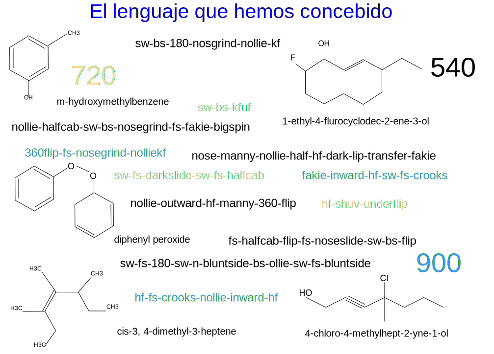

---

copyright:

  years:  2016, 2019

lastupdated: "2019-02-15"

subcollection: vmwaresolutions

---

# Prólogo
{: #vcscar-preface}

Figura 1. El lenguaje que hemos concebido

## Introducción al lenguaje de skateboarding
{: #vcscar-preface-intro}

La forma en que los skaters combinan movimientos y submovimientos en sus trucos impone una especie de gramática o sintaxis, que se basa en la física de lo que está pasando; la nomenclatura de la química ha evolucionado por razones similares. Hoy en día, un skater en un lado del planeta puede enviar por texto el nombre de un truco a otro patinador situado en el otro lado, y sus complejos movimientos se entienden.

La riqueza del lenguaje se alimenta de la propia complejidad del skateboarding. Los movimientos de la tabla son intricados, lo que da lugar a docenas de trucos básicos que se pueden ejecutar de varias formas y que se pueden integrar con varias variables, lo que da lugar a un gran número de combinaciones. Una estructura de tipo sufijo-raíz-sufijo de cada componente dicta el modo en que se combina cada elemento o movimiento, que corresponden a conjuntos reales de movimientos tanto de la tabla como del skater. La orientación física y la mecánica de las fuerzas determinan lo que encaja y lo que no, que es lo que impone dicha sintaxis.

Los trucos se pueden realizar desde la parte posterior o desde la parte delantera de la tabla, *Ollie* o
*Nollie*, que corresponden al pie delantero o posterior del skater. La tabla voltea, rueda y gira en combinaciones que se repiten sobre tres ejes, en cualquier dirección, en el sentido de las agujas del reloj o en el sentido contrario. El skater combina sus movimientos con los movimientos de la tabla, lo que añade varias dimensiones a las iteraciones, en función de la dirección, la rotación, la "postura" y de si el giro se realiza en el mismo sentido que el volteo de la tabla o en el contrario.

Estas dos últimas variables merecen un poco más de explicación. En primer lugar, *postura* se confunde fácilmente con direccionalidad lineal. Todos los skaters tienen una postura nativa, con el pie izquierdo o el derecho al frente; por lo tanto,
hacer un truco *switch* (switch-stance) significa que es la imagen en el espejo del mismo (al igual que sucede con un bateador en béisbol). El sentido hacia atrás es casual; la principal distinción es la lateralidad o dominio de una mano o de un pie.  Por lo tanto, cualquier truco *switch* merece más reconocimiento no porque sea hacia atrás, sino porque todas las funciones motoras se invierten al lado más débil o al pie "malo". Hacer un truco hacia atrás o “fakie” es simplemente poner un signo menos en el sentido e implica las mismas funciones motoras, que son marginalmente más difíciles.

El segundo aspecto importante para los skaters de alto nivel se aplica a un volteo hacia dentro (*inward*) o hacia fuera (*outward*), dependiendo de cómo voltee y rote (2 ejes) la tabla en relación con el propio cuerpo. En los trucos de volteo (flip)
se rueda con cualquiera de los pies desde cualquier extremo de la tabla; en los *kickflips* se puede rodar con la punta del pie, mientras que en los *heelflips* se hace lo contrario, volteando según el flujo natural del movimiento o en contra del mismo. Por lo tanto, los volteos hacia dentro son tan poco naturales que se merecen un término, que es *hard-flips*. Es decir, un *nollie-inward-kickflip* es idéntico a un *nollie-hardflip*, pero requiere más precisión puesto que se realiza a contrapelo.

Por lo tanto, cada componente de esta estructura prefijo-raíz-sufijo se puede desglosar en tres elementos binarios más, que son rotación, sentido y postura; en algunos trucos hay que especificar si el volteo es hacia dentro o hacia fuera. El skating sería un juego de niños si no fuera por la posibilidad de combinar trucos, lo que aumenta el número de iteraciones. Se pueden concatenar varios trucos básicos en agrupaciones formadas por dos, tres o incluso cinco o seis trucos, en el caso de los más experimentados.

Hasta ahora, el número de iteraciones prácticas nos lleva hasta cientos de ellas, lo que establece la base; la complejidad real se puede ver en la calle (*streetskating*), donde el número de combinaciones se convierte en miles.

Al principio de los 90, los skaters partían de trucos en suelo plano y los proyectaban en el entorno “orgánico” que les rodeaba: escaleras, bancos, barandillas, mesas de pícnic, maceteros; todo esto abrió la dimensionalidad que los definió. Las formas casi infinitas en que podían combinar trucos y superficies en pares de tipo yin-yang tuvo ocupados a los skaters durante décadas. Esto también se aplica a *vert-skating* (skating vertical), practicado por
Tony Hawk en rampas.

Aunque la mayoría de los trucos básicos se han ido definiendo a lo largo de los años, es la capacidad de combinarlos y adaptarlos lo que a menudo diferencia a los expertos. Esta es otra razón por la que el skating se puede considerar más un arte que un deporte. La expresión personal siempre prevalece sobre la propia ejecución. También es el motor que impulsó a los artistas que crearon la franquicia de vídeo juegos de Activision, *Tony Hawk Pro Skater*, que ha funcionado durante casi una década, y que también dio lugar a juegos rivales de *Electronic Arts*.

Mediante el entrenamiento de Watson Assistant para que copie el proceso de los expertos de alto nivel, ofrecemos una potente herramienta que fomenta la creatividad del skater, especialmente a niveles de élite. Aunque los otros deportes con tabla resultan menos complejos, dada la gran influencia del
skateboarding también pueden adoptar nuestros convenios. Por tanto, Watson Assistant puede no solo ayudar, sino también transformar, la expresión creativa de este deporte, recientemente olímpico, así como aportar ideas para otros movimientos artísticos.

## Codificación del lenguaje
{: #vcscar-preface-codification}

Como en cualquier otro lenguaje, el nuestro se ha ido desarrollando a lo largo del tiempo, adoptando nuevas palabras y usos, lo que ha ocasionado redundancias ocasionales y excepciones. Dicho esto, esta nomenclatura es notablemente coherente, duradera y específica. Es este rigor y coherencia lo que afronta el problema, aparentemente insuperable, de convertir grabaciones en texto mediante machine learning. Para los skaters, cada matiz de un movimiento completo tiene su propia nomenclatura. De hecho, este lenguaje es tan potente que también lo han adoptado no solo los esquiadores de snowboard, sino también los surferos.

Sin embargo, a pesar de toda esta complejidad y potencia, la codificación del lenguaje es sencilla y concisa. Cada *truco básico* tiene un componente de sentido (*directional*) y de rotación (*rotational*), junto con uno de aterrizaje (*landing*), que determina si se concatena o no con el siguiente truco básico y cómo lo hace para formar combinaciones; estos son los cuatro *elementos principales*. Se utilizan otros dos modificadores (*modifiers*): un prefijo de giro (*turn prefix*) para orientar el giro del skater (en el sentido de las agujas del reloj o en el sentido contrario), y un componente *varial* que especifica cómo gira la tabla, en relación con el cuerpo (hacia dentro o inward, o hacia fuera u outward). Con esta codificación, se puede aplicar de forma repetida un conjunto de reglas concisas que permiten combinaciones tan largas como se desee.

## Variables de entorno adicionales
{: #vcscar-preface-env-var}

Los expertos suelen emplear mucho tiempo en localizar lugares en los que practicar sus trucos. De hecho, un factor que diferencia a un skater es su capacidad creativa de adaptar los trucos de formas nuevas e imaginativas, lo que a menudo les lleva por todo el mundo. Aunque existen aplicaciones de skate que catalogan lugares y que se alimentan de información de la comunidad, nunca ha existido la idea o la tecnología para crear una aplicación que tenga capacidad para ayudar a cualquier skater, especialmente a los expertos, en este proceso creativo.

En esta arquitectura de referencia, Watson y la nube aprovechan la gran presencia en línea de los skaters en YouTube, imágenes de Google,
revistas en línea (Thrasher, Transworld), foros de skaters y de vídeo juegos y, lo que es más importante, la continua presencia en redes sociales de nuevos trucos de todo el mundo,
especialmente en
Instagram. Aparte de esto, no hay más problemas de traducción; se trata de un lenguaje internacional, como el lenguaje informático o las matemáticas, y se utilizan los mismos nombres y convenios en todo el mundo.

Watson Knowledge Studio actualiza su Discovery Service con descripciones de trucos, artefactos de redes sociales, información sobre lugares y más, en función de las consultas de cada skater. El chatbot tiene un número determinado de conversaciones que derivan de cualquier truco, en función de las líneas creativas y pragmáticas del razonamiento de los skaters expertos. Por lo tanto,
el asistente puede responder con el lugar más cercano o con el mejor a un truco específico o responder con un área de terreno más amplia para realizar no solo este truco, sino también otros que parten de la misma raíz (es decir, variaciones).

Por ejemplo, un skater puede pedir a Watson Assistant una lista de todas las variaciones posibles de un truco *hardflip-to-backside-5-0*. Esta solicitud de convierte de voz a texto en Discovery Service, el cual responde no solo con variaciones de *hardflip-to-grind*, sino también con una lista de distintos lugares que capturan las variaciones, lo que conduce a más lugares que pueden incluir un listado de barandillas que se pueden agrupar por código postal, por tamaño o incluso por disponibilidad, si están por ejemplo en el patio de un colegio o en una empresa. Los datos de la aplicación ofrecen sistemas que clasifican el riesgo a ser pillado por invasión de propiedad privada. Esta ayuda tiene un gran impacto sobre las múltiples consecuencias de variables como estas, lo que supone una gran ayuda para la creatividad de todos los skaters expertos.

## La plataforma de nube
{: #vcscar-preface-cloud-platform}

La capa creativa de los sistemas de TI para generar nuevas combinaciones constituye la parte más apreciada para los skaters. Tiene la capacidad de conectar con su creatividad para inspirar formas de innovar, en cualquier punto del globo.
Nada de esto se habría conseguido sin {{site.data.keyword.cloud}}.

## Enlaces relacionados
{: #vcscar-preface-related}

* [Visión general de vCenter Server on {{site.data.keyword.cloud_notm}} con el paquete híbrido (Hybridity)](/docs/services/vmwaresolutions/archiref/vcs?topic=vmware-solutions-vcs-hybridity-intro)
