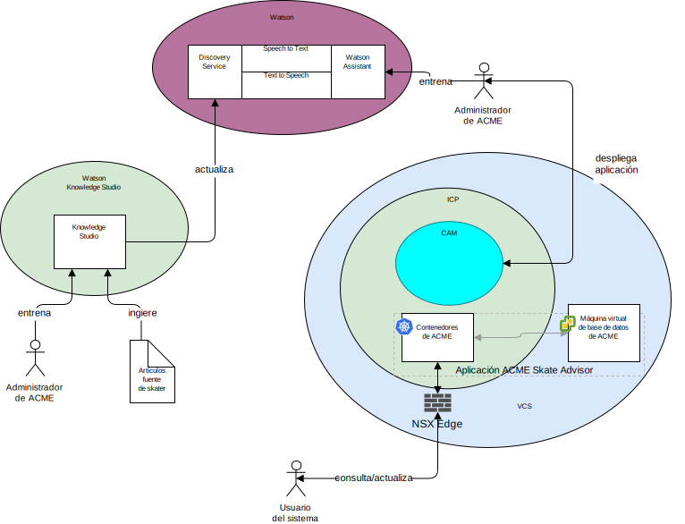

---

copyright:

  years:  2016, 2018

lastupdated: "2018-11-14"

---

## Contexto del sistema
En el diagrama siguiente se muestra el contexto del sistema correspondiente a esta arquitectura de referencia. Un diagrama de contexto de sistema es un diagrama que define los elementos principales de un sistema, el límite del sistema, las entidades que interactúan con el mismo y la interacción. Se trata de un diagrama general que proporciona al lector una vista inicial del sistema.

Figura 1. Contexto del sistema

Estos son componentes principales del contexto del sistema:
-	vCenter Server: VMware vCenter Server on {{site.data.keyword.cloud_notm}} es una instancia de {{site.data.keyword.cloud_notm}} for VMware Services destinada a las máquinas virtuales (VM) migradas desde el entorno local. Junto con el entorno virtualizado local, forma un entorno híbrido que permite que las VM se muevan de un entorno a otro.
-	{{site.data.keyword.cloud_notm}} Private: ICP es una plataforma de aplicaciones para desarrollar y gestionar aplicaciones contenerizadas. El entorno ICP es un entorno integrado que incluye el coordinador de contenedores Kubernetes, un repositorio de imágenes privadas, una consola de gestión, infraestructuras de supervisión y una interfaz gráfica de usuario, que proporciona una ubicación centralizada desde la que puede desplegar, gestionar, supervisar y escalar aplicaciones.
-	{{site.data.keyword.cloud_notm}} Automation Manager: CAM es una plataforma de infraestructura como código preparada para la empresa que proporciona un único panel para crear cargas de trabajo basadas en VM junto con cargas de trabajo basadas en Kubernetes, la automatización del suministro de las cargas de trabajo, ya sean VM o contenedores, y los requisitos previos de la infraestructura. 
-	Watson – Watson es la plataforma de soluciones cognitivas y de inteligencia artificial de IBM. 
-	Watson Knowledge Studio - Watson Knowledge Studio ofrece un modelo que Watson Discovery utiliza.

### Actores
El diagrama del contexto del sistema identifica los siguientes actores:

* Administrador de Acme: el administrador es el responsable del despliegue y del mantenimiento de la aplicación, lo que incluye las siguientes tareas continuas:
 - Entrenar el chatbot.
 - Entrenar el servicio de descubrimiento.
* Usuario del sistema: el usuario del sistema es el usuario que utiliza el sistema. El usuario se comunica con el sistema a través un navegador de un dispositivo con capacidad de navegador.

### Sistemas
El diagrama del contexto del sistema identifica los siguientes sistemas:
* Knowledge Studio: Watson Studio es una herramienta que se utiliza para diseñar el lenguaje de skate para el sistema y utilizar este lenguaje para reconocer documentos de la web que implementan el lenguaje de skate.
* Speech to Text: transcribe voz en texto. Este componente acepta audio de un dispositivo en el que se ejecuta el chatbot y lo convierte en texto para que Watson lo procese.
* Text to Speech: sintetiza texto en voz. Este componente acepta texto de la aplicación Skate Advisor y lo convierte en voz para que lo reproduzca el dispositivo en el que se ejecuta el chatbot.
* Discovery Service: el sistema utiliza Watson Discovery Service para recuperar registros de skate que coinciden con los parámetros solicitados. Un ejemplo sería
“Listar todos los registros del truco Casper”.\ Watson
Assistant: el sistema utiliza Watson Discovery Service para recuperar contenido relacionado con skate que coincide con los parámetros solicitados. Un ejemplo podría ser “Listar todos los registros del truco Casper”. Watson Discovery utiliza técnicas avanzadas de machine learning para descubrir la parte relevante del contenido ingerido.  
* Base de datos: la base de datos de Acme Skate Advisor se aloja en una máquina virtual gestionada por vCenter Server.
* Contenedores de aplicaciones: las aplicaciones que han pasado por el proceso de modernización de aplicaciones y que ahora se ejecutan como contenedores. En el caso de esta arquitectura de referencia y en este ejemplo de Acme Skateboards, una de las apps contenerizadas es un servidor web que forma parte de la carga de trabajo con presencia en línea. Los contenedores de ACME alojan la aplicación web Acme y la aplicación Acme Skate Advisor.
* NSX Edge - los extremos NSX son dispositivos virtuales que gestionan el tráfico de norte a sur de entrada y de salida de la instancia de vCenter Server.

## Enlaces relacionados

* [Visión general de vCenter Server on {{site.data.keyword.cloud_notm}} con el paquete híbrido (Hybridity)](../vcs/vcs-hybridity-intro.html)
