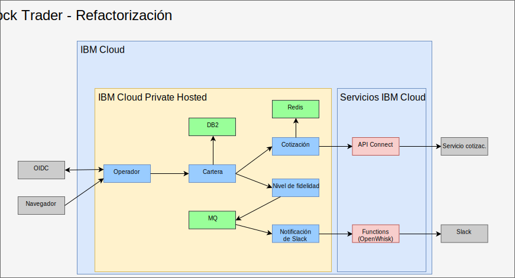
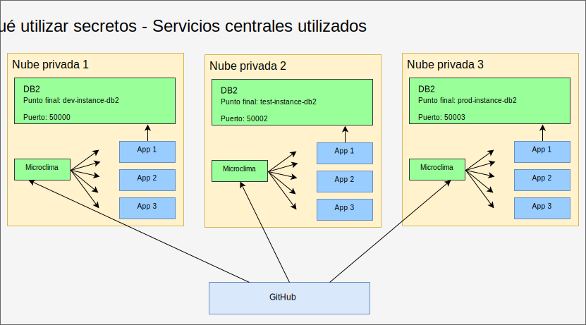
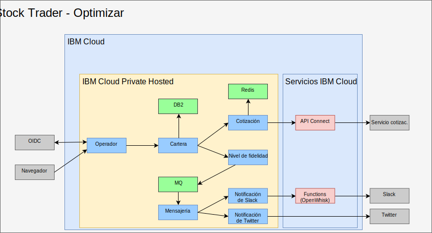

---

copyright:

  years:  2016, 2019

lastupdated: "2019-03-25"

subcollection: vmware-solutions

---

# Refactorizar y añadir middleware a IBM Cloud Private
{: #vcscontent-addmidware}

Ahora que Stock Trader se ejecutan en un contenedor y que Jane está satisfecha con los microservicios actuales, ella y Todd trabajan en cómo mejorar la aplicación con prestaciones adicionales. Mediante la refactorización de los microservicios de Stock Trader para manejar la actividad y la escalabilidad en aumento, ambos ven la necesidad de añadir middleware a {{site.data.keyword.cloud}} Private. Parte del middleware ya existía en su centro de datos, por lo que se trata de un ejercicio de replanteamiento de la plataforma con la adición de cierto middleware.

Figura 1. Refactorización de Stock Trader

Esta refactorización de la solución genera una plataforma común en la que ejecutar la aplicación y los servicios necesarios, combinados en un plano de gestión más sencillo.

## Opciones de contenido
{: #vcscontent-addmidware-content-choices}

{{site.data.keyword.cloud_notm}} ofrece una amplia selección de contenidos, y tanto Todd como Jane deben decidir cuál se adapta mejor a sus necesidades. Según observa Todd en el catálogo de {{site.data.keyword.cloud_notm}}, la mayor parte del contenido se puede probar, aunque cierto contenido se tiene que adquirir y descargar desde Passport Advantage.

* Cadena de herramientas y tiempos de ejecución
  - UrbanCode Deploy
  - Microclimate
  - Jenkins (código abierto)
  - IBM WebSphere Liberty (MicroProfile, Web Profile, Java Platform, Enterprise Edition Profile)
  - Open Liberty (código abierto)
  - Tiempo de ejecución Node.js (código abierto)
  - Tiempo de ejecución Swift (código abierto)
  - nginx (código abierto)
  - IBM WebSphere Application Server for {{site.data.keyword.cloud_notm}} Private VM Quickstarter Community Edition

* Integración
  -	IBM Integration Bus
  -	IBM Integration Bus for Developers
  -	IBM DataPower Gateway Virtual Edition
  -	IBM DataPower Gateway for Developers
  -	IBM API Connect Professional
  -	IBM API Connect Enterprise
  -	IBM App Connect Enterprise Developer Edition
  -	IBM App Connect Enterprise 11.0.0

* Data Science y analítica empresarial
  -	IBM Data Science Experience Local
  -	IBM Data Science Experience Developer Edition
  -	IBM Watson Explorer Deep Analytics Edition
  -	IBM PowerAI (con licencia de ILAN, oferta de soporte disponibles)
  - IBM PowerAI Vision

* Integración y gobierno de los datos
  -	IBM InfoSphere Information Server for evaluation
  Mobile
  -	IBM Mobile Foundation

* Conectividad
  -	IBM Voice Gateway Developer Trial

* Herramientas de modernización de aplicaciones
  -	IBM Transformation Advisor

* Mensajería
  -	IBM MQ Advanced
  -	IBM MQ Advanced for Developers
  -	Rabbit MQ (código abierto)
  -	IBM Event Streams Tech Preview (basado en Apache Kafka)

* Digital Business Automation
  -	IBM Operational Decision Manager
  -	IBM Operational Decision Manager for Developers
  -	IBM FileNet Content Manager 5.5
  -	IBM Content Foundation 5.5

* Servicios de datos
  -	IBM DB2 Direct Advanced Edition / AESE con Data Server Manager
  -	IBM Db2 Dev-C
  -	IBM Data Server Manager (para Db2 Dev-C)
  -	IBM Db2 Warehouse Enterprise
  - IBM Db2 Warehouse Dev-C
  -	IBM Cloudant Developer Edition
  -	MongoDB (código abierto)
  -	PostgreSQL (código abierto)
  -	MariaDB (código abierto)
  -	Galera Clustering con MariaDB (código abierto)
  -	Redis (código abierto)

* HPC / HPDA
  -	IBM Spectrum LSF Community Edition
  -	IBM Spectrum Symphony Community Edition
  -	IBM Spectrum Conductor Technical Preview

* Gestión multinube
  -	{{site.data.keyword.cloud_notm}} Automation Manager

* Watson
  -	IBM Watson Compare & Comply: Element Classification
  -	Compliance Assist

* Gestión
  -	IBM Netcool - integración (prueba para {{site.data.keyword.icpfull_notm}} Services – registro de sucesos y supervisión de alertas)
  - {{site.data.keyword.cloud_notm}} App Management 2018.2.0
  -	IBM Netcool - integración (prueba para gestionar sucesos de {{site.data.keyword.icpfull_notm}}. Se vende con el producto IBM
Netcool Insights)
  - {{site.data.keyword.cloud_notm}} Event Management for IBM
Cloud Private (licencia de ILAN para descubrimiento y prueba desde el catálogo)
  - IBM Operations Analytics Predictive Insights Mediation Pack (gestionar métricas de supervisión de {{site.data.keyword.icpfull_notm}}. Con licencia de ILAN para descubrimiento y prueba desde el catálogo)  -	IBM Operations Analytics Predictive Insights Mediation Pack
(se vende con el producto Predictive Insights)

* Redes
  -	F5 BIGIP Controller (código abierto)
  -	Calico BGP-Peer (código abierto)
  -	strongSwan IPSec VPN (código abierto)

* Almacenamiento
  -	IBM PowerVC FlexVolume Driver (código abierto y con el soporte del producto
PowerVC)
  - Clúster de almacenamiento GlusterFS con gestión de ciclo de vida Heketi (código abierto)
  -	NFS de ejemplo de Container Storage Interface (CSI)
  -	Controlador (código abierto)
  -	Rook Ceph Cluster (código abierto)

* Herramientas
  -	Web Terminal (código abierto)
  -	Skydive – analizador de red (código abierto)

Para Stock Trader, que se basa en la arquitectura de la solución de Jane, Todd empezará con [Db2](https://cloud.ibm.com/catalog/services/db2-hosted), [MQ](https://cloud.ibm.com/catalog/services/mq) y [Redis](https://cloud.ibm.com/catalog/services/databases-for-redis).

## Adición de middleware
{: #vcscontent-addmidware-add-middleware}

Para añadir el middleware a {{site.data.keyword.cloud_notm}} Private, busque el [diagrama de helm](https://github.com/IBM/charts/blob/master/stable/ibm-microclimate/README.md) en el catálogo, lea el archivo léame y luego continúe con la instalación.

Para Stock Trader, Todd ha decidido añadir todo el middleware. En la siguiente información se resume todo lo que ha tenido que llevar a cabo Todd para cada middleware que quería que Jane utilizara.

### Db2
{: #vcscontent-addmidware-db2}

Todd empieza con Db2 porque ya están utilizando Db2 y pueden dedicar un Db2 basado en contenedor a cada solución.

Puesto que Todd ha preparado {{site.data.keyword.icpfull_notm}}, ya tiene definida su política de seguridad de pod. Todd se puede centrar en la creación de un secreto de extracción de imágenes de docker:

`kubectl create secret docker-registry db2dockerregistry
--docker-username=dockeruser
--docker-password=XXXXXXXX-XXXX-XXXX-XXXX-XXXXXXXXX
--docker-email=dockeruser@email.com --namespace=default`

Por último, puesto que Todd ha decidido utilizar NFS, ha creado volúmenes NFS basados en los requisitos del archivo readme:

Va al panel de control de {{site.data.keyword.icpfull_notm}} y crea un volumen persistente. ¿De qué tamaño? Examina el archivo readme para saberlo:

`capacity=20Gi
RWO
type=NFS
server = nfs.server.ip.address
path = /shared/db2trader1`

En la interfaz de usuario del catálogo, busca “Db2” y pulsa ibm-db2oldp-dev
Revisa el archivo readme y pulsa Configurar.

En la sección Configurar, hay una sección Inicio rápido y una sección Todos los parámetros. Abre la sección Todos los parámetros porque Todd tiene que especificar más configuración:

*	Release name = db2trader1
*	namespace = default
*	agree to license
*	database name = trader
*	secret name = db2dockerregistry
*	service name = db2trader1-ibm-db2oltp-dev
*	service type = NodePort
*	Port = 50000
*	db2 instance name = db2inst1
*	pw for db2 instance name = xxxxxx
*	Yes (check) Enable persistence for this deployment

Cuando Db2 se está ejecutando, Todd o Jane tiene que crear las tablas que utiliza la solución
Stock Trader.

### MQ
{: #vcscontent-addmidware-mq}

Todd y Jane necesitan software de mensajería, y, como ya utilizan MQ, esta constituye una excelente opción. Además, ocupa poco y la versión de desarrollo se puede poner a disponibilidad de cada desarrollador, lo que ahorra un tráfico de producción valioso. La instalación de MQ es muy sencilla. Todd crea el almacenamiento igual que ha hecho con
Db2 y luego instala el diagrama de helm:

Panel de control de {{site.data.keyword.icpfull_notm}} > Catálogo > empezar a escribir en MQ > seleccionar
ibm-mqadvanced-server-dev Revisar el archivo readme y luego pulsar Configurar
Proporcionar o verificar los siguientes valores de entrada:

`release name = mqtrader1
target namespace = stock-trader
accept license
enable persistence
data PVC size = 2Gi
Service type = NodePort
Queue manager name = stocktrader
Admin pw = mq1pw
App password = LEAVE BLANK`

Inicialmente, Todd selecciona NodePort para acceder al middleware desde la interfaz de usuario. Finalmente Todd utiliza ClusterIP, por lo que solo los pods que están dentro del clúster pueden acceder al middleware.

Para configurar MQ de modo que utilice Stock Trader, Todd abre la interfaz de usuario de MQ Management, que es la misma que la versión de VM.

### Redis
{: #vcscontent-addmidware-redis}

Aunque Stock Trader se está ejecutando en {{site.data.keyword.cloud_notm}} Private Hosted, todavía les preocupa la latencia del servicio de cotización bursátil, cuando todo lo que realmente les importa es el cierre de bolsa de día anterior para la mayor parte de su trabajo. Para ayudar a mejorar el rendimiento, añaden una memoria caché Redis.

Este despliegue utiliza el diagrama ibm-redis-ha-dev de ibm-charts.

De forma predeterminada, este diagrama instala seis pods: uno maestro, dos esclavos y tres centinelas. Este es un gran ejemplo de resiliencia en Kubernetes, donde más de un pod trabaja conjuntamente en muchos nodos trabajadores, incluso cuando los nodos trabajadores están en más de una subred.

La configuración es sencilla, por lo que Todd especifica el espacio de nombres en el que lo quiere instalar e inicia la instalación.

## Refactorización de Stock Trader
{: #vcscontent-addmidware-refactor-stock-trader}

La refactorización de Stock Trader es un paso importante para Jane. Mientras Todd se ocupaba de añadir el middleware a {{site.data.keyword.cloud_notm}} Private, Jane refactorizó su solución para optimizarla para los comportamientos de Kubernetes y de la nube.

Por ejemplo, cuando Jane transformó Stock Trader, tomó los archivos .war y añadió cada uno de ellos a un contenedor de Liberty, pero utilizó la configuración de WebSphere Application Server Network Deployment para apuntar al origen de datos. Fue un buen comienzo y la aplicación de Jane aprovecha de inmediato la planificación y la coordinación de Kubernetes.

Se consiguen muchas otras ventajas de la optimización de los microservicios de Jane (recodificación y compilación) para el entorno de Kubernetes.

Para optimizarlos, Jane ha seguido los pasos siguientes:
-	Ha actualizado su código en su repositorio de código (Jane ha utilizado GitHub Enterprise)
-	Ha añadido un conducto (Jane ha utilizado Jenkins)
-	Ha compilado con Maven

A continuación se muestra un ejemplo del [repositorio de
código](https://github.com/IBMStockTrader/) de Jane, junto con el archivo
Jenkins, server.xml y más. Con todo esto, Jane puede codificar libremente funciones adicionales mediante secretos
para acceder a servicios como ODM y
Watson, junto con más microservicios como repositorios individuales en GitHub.

### Adición de secretos
{: #vcscontent-addmidware-add-secrets}

Ahora que Jane ha refactorizado los microservicios de Stock Trader, necesita una forma de obtener los nombres de servicio, los ID de usuario y las contraseñas, para que su aplicación pueda obtener detalles exclusivos sobre el servicio cuando se despliega sin codificar nombres específicos y volver a crear la aplicación.

Mediante secretos de Kubernetes, Jane configura un nombre de secreto y parámetros bien definidos en cada secreto para garantizar que cuando se despliegue el microservicio, escoja el nombre de host exclusivo, el ID de usuario, la contraseña o cualquier otra credencial confidencial, para que su aplicación sea portátil.

Jane desea una base de código unificada, aunque Stock Trader se puede ejecutar en más de una nube. El secreto de DB2 de la figura siguiente tiene distintos detalles de direccionamiento, pero en el mismo formato. Cuando se despliega el microservicio del portafolio de Jane, busca el parámetro de punto final de secreto de DB2 para conectarse a la instancia de Db2 adecuada. A la aplicación Stock Trader no debe preocuparse por si se ejecuta en una máquina virtual de VMware, en un servicio contenerizado o como un servicio gestionado por la nube.

Figura 2. Stock Trader - servicios centrales

## Resultado
{: #vcscontent-addmidware-result}

Puesto que Jane se ha comprometido en refactorizar la solución de Stock Trader y Todd ha instalado middleware en {{site.data.keyword.cloud_notm}} Private Hosted, toda la solución básica de Stock Trader se ejecuta en una nube privada. Jane añade más microservicios como un servicio de notificación de Twitter. Las reglas de direccionamiento de Istio permiten la mensajería de nivel de fidelidad dinámica a través de un canal de Slack interno o de un canal de Twitter público.

Figura 3. Optimización de Stock Trader

## Enlaces relacionados
{: #vcscontent-addmidware-related}

* [Visión general de vCenter Server on {{site.data.keyword.cloud_notm}} con el paquete híbrido (Hybridity)](/docs/services/vmwaresolutions/archiref/vcs?topic=vmware-solutions-vcs-hybridity-intro)
