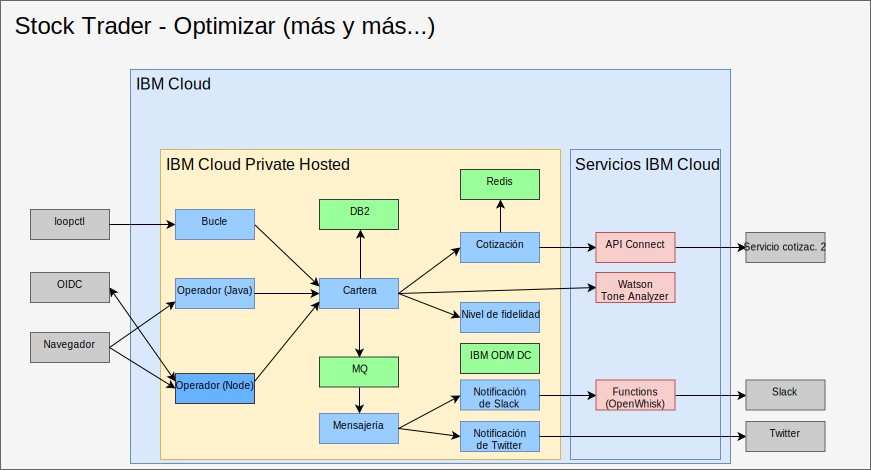

---

copyright:

  years:  2016, 2019

lastupdated: "2019-02-15"

subcollection: vmwaresolutions

---

# Perfeccionamiento con IA, analítica y otros servicios de la nube pública
{: #vcscontent-aianalytics}

Perfeccionar Stock Trader no es un proceso de un solo paso. Para Todd y Jane, se trata de un proceso iterativo. En la siguiente figura verá que Jane añade el servicio Watson Tone Analyzer y una regla de nivel de fidelidad utilizando el centro de decisiones de ODM. Los elementos siguientes destacan cómo se ha perfeccionado Stock Trader.

Figura 1. Perfeccionamiento de Stock Trader

## AI Watson Tone Analyzer
{: #vcscontent-aianalytics-ai-watson}

El ejemplo siguiente es una forma sencilla de perfeccionar una aplicación, pero resulta falsamente potente. Jane examina el [catálogo de {{site.data.keyword.cloud}}](https://console.cloud.ibm.com/catalog/) en busca de servicios de [IA](https://console.cloud.ibm.com/catalog/?category=ai) y de [analítica](https://console.cloud.ibm.com/catalog/?category=analytics) y encuentra mucho contenido en el catálogo.

Jane selecciona [Tone Analyzer](https://console.cloud.ibm.com/catalog/services/tone-analyzer), opta por el plan Estándar y se le proporcionan las credenciales necesarias.
Jane refactoriza Stock Trader y simplemente crea un secreto de Kubernetes para Tone Analyzer. De este modo, aunque Jane cambie de plan o de región, no es necesario reconstruir el código.

Gracias a la refactorización, Jane experimenta con varias infraestructuras de interfaz de usuario sin interrumpir la experiencia del usuario. Como resultado, la nueva interfaz de usuario está disponible para su uso y para ayudarle a comprender el tono de los comentarios de los usuarios.

En el futuro, Jane puede proporcionar recomendaciones de stock predictivas basadas en los diversos servicios de análisis disponibles para que se ejecuten en la instancia de nube privada, {{site.data.keyword.cloud_notm}} Private.

## Regla empresarial de nivel de fidelidad
{: #vcscontent-aianalytics-loyalty-rule}

Originalmente, el código de Jane contenía lógica para determinar el importe monetario que probablemente supondría un obstáculo en lo que respecta a fidelidad. Sin embargo, después de repetidas solicitudes para cambiar el rango procedentes del
director de marketing de Stock Trader, Jane decidió dejar la decisión en manos de una regla empresarial que el director
de marketing pudiera modificar sin la intervención de Jane.

Jane se lo comentó a Todd, quien añadió el [servicio](https://console.cloud.ibm.com/catalog/services/decision-optimization) y luego creó la decisión.

Ahora Margaret, directora de marketing, puede iniciar una sesión y cambiar los rangos de nivel de fidelidad cuando se lleva a cabo una campaña sin tener que modificar el código.

## Nuevo servicio de stock
{: #vcscontent-aianalytics-new-stock-service}

Puede que observe que el servicio de stock se ha modificado.
Esto puede ocurrir cuando un servicio público cambia de propietario o de estructura de API. Afortunadamente, Jane utilizó [API
Connect](https://console.cloud.ibm.com/catalog/services/api-connect).
Originalmente utilizaba API Connect para simplificar la respuesta del servicio de stock original, ya que resultaba engorroso recibir y dar formato a los datos que deseaba de la API sin formato que se le proporcionaba.

Ahora Jane está encantada porque, cuando cambia el servicio de stock, solo tiene que cambiar la forma en que se correlaciona con la API simplificada que ha creado, y el código ni siquiera se tiene que reiniciar. La solución Stock Trader simplemente continúa solicitando los datos de la misma API como si no hubiera cambiado. Todos los cambios en la API resultan transparentes.

Además, con las funciones de supervisión y calibración de API Connect, Jane puede realizar un seguimiento de quién está utilizando su API simplificada.

## Enlaces relacionados
{: #vcscontent-aianalytics-related}

* [Visión general de vCenter Server on {{site.data.keyword.cloud_notm}} con el paquete híbrido (Hybridity)](/docs/services/vmwaresolutions/archiref/vcs?topic=vmware-solutions-vcs-hybridity-intro)
